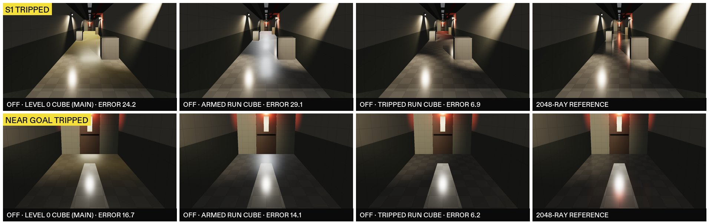

# 11 — Secondary reflections: G14 P1b design (glossy receivers, recursion, the Surface hook)

2026-10-03 · visual chat (游戏视觉) · workflow glass-rt-track, secondary-reflection investigation, design stage · revision 1: 2026-10-04 · **revision 2: 2026-10-07** (answers check 2, §7) · **status: DESIGN** (no game code changed)

**The question.** Red showed a Control RTX on/off pair: a glass cabinet reflects the room, and a glossy parquet floor reflects the cabinet ("二次反射", secondary reflection). He says our window glass has none. He wants the cause found and fixed at the highest desktop spec.

**Red's decision (2026-10-03 14:1x).** The Run! corridor floor is **glossy vinyl tile** (waxed 12" VCT, smoothness ~0.75–0.85). That look is decided; the open question is only how each tier delivers it (§2.3). It is the main secondary-reflection receiver. Acceptance frames must show:
- the Run floor reflecting the red EXIT signs and the emergency heads;
- a glass door or window in that floor, together with that glass's own reflection (two bounces).

The Surface-shader hook must cover that floor, including the RoomStream materials.

**Inputs, read in full:**
- `01_code_review.md`, `02_runtime_probe.md`, `03_research.md`, `10_rt_glass_design.md`, `11a_glossy_surfaces.md`, `11b_multibounce_research_bench.md`; `../../room_visuals/10_run_directions.md`.
- **Main, read only, at `279c144`** (HEAD, 2026-10-04 21:30). The RT code is unchanged since `75cfdff`: `git diff --stat 75cfdff 279c144` touches no file under `Assets/Scripts/Rendering`, `NativePlugin` or `Assets/Editor/RT`. Since then only `FrontRoomsGlass.shader` changed on the RT side (the G14 prepass hook, `9eddc35`, `bf2e883`, `70644f0`), plus the map-chat files `FrontRooms3DGame.cs` (+379/−86 lines) and `FrontRoomsMapWorld.cs` (+48), `FrontRoomsKitImporter.cs` and `ProjectSettings.asset` (iOS builds). Every "main" line number below is at `279c144`.
- **Pre-Codex state, pinned to `7320ed1`**: every citation of the ChatGPT prototype and of MapWorld/3DGame/Look as they were then (§2.0, last paragraph).
- `research/codex_audit/00_main_state.md` §3.2, `10_review_glass-look.md` (F3, F5), `Documentation/VERIFICATION_LOG.md` VL086–VL087. **`codex_audit/20_findings.md`, `rt/20_implementation.md` and `rt/30_final.md` do not exist** (checked 2026-10-07); `proj_rt` was lost in the 2026-10-05 wipe and is no longer cited.
- URP 17.3 source (`Library/PackageCache` of `$W/proj_audit`, the same package version as main).
- Check 2 (the workflow's issue list of 2026-10-07) and its bench `$W/rt_bench2/chk_r1/` (`$W` = `/Users/redwang/FrontRoomsVisualWork`).

**What was written:**
- this report (revision 2; revision 1 is kept as `11_bench/r2/11_secondary_reflections_r1.md.txt`);
- `11_bench/r2/`: bench 5c and bench 6f sources, patches, run scripts and logs (`.txt` copies);
- `images/11r2_run_cube_per_state.jpg`, `images/11r2_ray_ramp_sheet.png`, `images/11r2_facing_rule.png`;
- three rows in `Documentation/VERIFICATION_LOG.md` (VL110–VL112, §5.4).

Nothing under `Assets/` was touched. No Unity was started. The benches ran standalone in `$W/rt_bench2/r2/` (`b5/`, `b6/`).

**Tags.**
- **MEASURED** = timed or computed on Red's M3 Max (40 GPU cores) for this report (benches 4, 5, 5b, 5c, 6, 6f), or quoted with its run.
- **ESTIMATE** = arithmetic or judgement.
- **UNVERIFIED** = not confirmed.

**Machine load.** Every log line carries the 1/5/15-minute load. The revision-2 timings ran at load **34–43** (bench 5c `timing2`, bench 6f). Image metrics (errors, differences, identities) do not depend on load; some image runs ran at up to 560.

---

## 0. For Red

**Why our glass shows no secondary reflection today** (main `279c144`):
1. **G14 is one bounce, and only glass receives.** Window glass can trace now: the shader hook merged on 2026-10-04, and the kit hangs a `Glass_Window` slab in every dressed map window. But a pane seen in a pane shows the zone cube, and a floor, CRT or chrome hit is lit once and stops. Nothing reflects twice.
2. **No floor receives.** Level 0 and the Office are carpet, and carpet does not reflect (correct). The only hard floor is the Run corridor, and Run rooms are not in play yet.
3. **Raster.** Run rooms borrow the Level 0 cube. There is no Run cube.

**What P1b adds:**
- **Glossy surfaces trace**, not just windows: the waxed Run floor at your 0.75–0.85 (mean 0.80), CRT screens, chrome, glazed ceramics, door steel and brass. On Ultra also cherry and ebony.
- **Reflections inside reflections**: 2 bounces on High, 3 on Ultra.
- **Blur that matches the surface.** Waxed tile gives soft streaks toward you; glass and chrome stay sharp. No TAA, no smearing; a still camera never shimmers.

**What each Mac shows on the Run floor** (tier from the GPU's measured time; the class column is an ESTIMATE until B13 runs on each machine):

| Mac | Tier | Run floor |
|---|---|---|
| M3 Max, M4 Max (30–40 GPU cores) | **Ultra** (High where a view is too heavy) | Waxed (0.80), traced: lamps, EXIT signs, door glass and props as long soft streaks; the glass shows its own reflection. Fine grain near you, smooth far away |
| M3 Pro, M4 Pro (14–20 cores) | **High** | The same content as one smooth blur |
| M3, M4 (8–10 cores) | **Glass only** at 1440p; High only at 1080p or below, if it fits | Today's floor. Window glass still traces |
| RT Off; M1/M2 Macs; Windows; WebGL; iOS | none | **Today's floor, unchanged.** After R-2a/R-2b: a waxed floor with the Run cube of the current corridor state; glow in about the right places, nothing moves, no props or glass in it |

Tier changes never pop. A tier rises only while no glossy floor is on screen. A drop fades over 16 frames. A room keeps its floor until that room is rebuilt behind you.

**What it costs** (M3 Max, 1440p, MEASURED in a standalone bench; in-engine numbers come later):
- Run corridor: **High 1.7–2.4 ms, Ultra 3.4–4.8 ms**, including about 0.35–0.85 ms shared with the glass trace.
- Wide title-stream Run room: High 2.8–3.1 ms. Two Ultra rays there cost 6.5–7.2 ms and cut the error from 3.4 to 1.4/255; the game uses them only if the whole frame still fits.
- Memory: 194 MB more at 1440p (209 MB at the peak of a frame). Macs with 8 GB stay glass-only.

**What you will see** (bench, Run corridor, error vs a 2048-ray reference, 0–255 display scale):
- Today's cube on a waxed floor is far off: mean error 24/255. High brings it to 2.8, Ultra to 2.3.
- The glass lite showing the floor's lamp streak: up to 73/255. The lite's own reflection inside the floor: up to 16/255 on a few hundred pixels.
- A third bounce: invisible (≤ 7/255), cut off automatically.

**The Run cube for the raster tiers needs one cube per corridor state.** In the tripped corridor, a tripped-state cube brings the floor error from 24 to 6.9/255 (near the goal 16.7 → 6.2). An armed-state cube there is worse than today's cube: 29/255. So the cube must switch on the same frame as the lights. In the armed corridor an armed cube gives 3.7 (today 3.9). The wide stream room stays wrong with any single cube (18/255).

**Where you will NOT see it** (physically correct): carpet, wallpaper, drywall, ceiling tile, matte wood and plastic, door veneer, painted steel.

**What I need from you:**
- **R-1** Default tier: automatic, from measured GPU time (the table above). Your manual choice always wins.
- **R-2a** Run cubes (one armed, one tripped, switched at the trip) on every tier. This changes every Run surface's raster reflection, WebGL included. Recommended: yes.
- **R-2b** The waxed floor on the raster tiers, after R-2a. Recommended: yes on desktop; WebGL can keep today's floor.
- **R-3** Direction B for the acceptance frames.
- **R-4** One frame pair, still and moving: Ultra's near grain vs High's smooth blur.

---

## 1. What the benches show

Bench 4 built the Run corridor itself (1 × 9 cells, 2.84 m clear, 27 m; Direction B, tripped and armed; the RN-X goal door with its 0.25 × 0.75 m wired lite and a lit Level 0 stub; the title stream's Run room, 11.5 × 12 m; 3,000 far office instances so the acceleration structure is as large as the real map's). Bench 5/5b added main's real `Refl_Level0` cube, scene-captured cubes, a 2048-ray reference, the soft gate, footprint-aware jitter, a far fade and a dolly test. **Bench 5c** (revision 2) adds the design's own ray tree (`TREE=1`, §2.5), cube swaps between corridor states, and ray-count ramps. Bench 6 times the stack on top of **main's own G14 kernel**; **bench 6f** adds the facing rule. §5 has the method. Unless a row says otherwise, numbers are bench 5c `TREE=1`, soft gate on, far fade 6–12 mm.

| Finding | Number (1080p display error /255 unless stated) | Consequence |
|---|---|---|
| **Today's cube is badly wrong on a waxed floor** | RT-off frame with main's `Refl_Level0` × 0.5 (what main puts on Run rooms) vs the 2048-ray reference: S1 tripped **24.2**, near goal 16.7, stream room 17.2, S1 armed 3.9 | "Vs Off" mostly measures how wrong the Off cube is. Acceptance uses error vs the reference (§2.12) |
| **A Run cube must match the corridor state** | Tripped corridor, Off error: Level 0 cube 24.2 / 16.7 (S1 / near goal); **armed capture 29.2 / 14.1**; **tripped capture 6.9 / 6.2**. Armed corridor: armed capture 3.7 / 2.3 (S1 / 2.5 m), tripped capture 4.6 / 2.5, Level 0 cube 3.9 / 2.6. Stream room: its own capture 18.1 | One Run cube per state, switched on the trip frame (§2.3). R-2a is restated per state |
| **Receivers beyond glass are the visible change** | Floor px ≥ 8/255 changed, Off → High (S1 / near goal / stream room / S1 armed): flat cube 32.9 / 37.0 / 57.8 / 8.6 %; **main's Level 0 cube 57.5 / 49.9 / 53.0 / 13.0 %** (stream room 52.98 %); the scene's own capture × 0.5 18.3 / 19.4 / 60.4 / 11.3 % | The Run floor is a receiver on every RT tier |
| **RT vs reference** | High: S1 2.80, near goal 1.97, stream room 3.36, S1 armed 1.18. Ultra (design): 2.33 / 1.19 / (High path) / 0.74. Stream room with 2 GGX rays: **1.40**. Red EXIT streak recall: High 78 %, Ultra 78–100 % | Both tiers cut the error 3–14× vs today's cube |
| **The reference converges** | S1 tripped, 128 / 256 / 512 / 1024 rays vs 2048: px mean 2.30 / 1.99 / 1.70 / 1.40, p99 40 / 37 / 28 / 22; **8×8-block means** 0.71 / 0.49 / 0.34 / 0.26 (p99 13.8 / 7.9 / 4.7 / 3.3). Other views by 256–512 rays (512: px mean ≤ 1.06, p99 ≤ 13) | S1 is firefly-limited per pixel, so B6 gates 8×8 block means against a 2048-ray reference |
| **Two bounces, with the soft gate** | 2.5 m from the goal, armed, depth 2 vs 1: the lite shows the floor's lamp streak, max **73/255** (main's cube; flat 71; corridor cube × 0.5 **63**; 85 without the gate). The lite's own lamp image in the floor: max **16/255, 359 px ≥ 8** (flat 15 / 331; corridor cube × 0.5 **15 / 345**; 20 / 509 without the gate) | Real but small. R2 thresholds hold on every cube (§2.12) |
| **Third bounce** | With the 0.004 cut-off: ≤ 7/255, 0 px ≥ 8 (every cube) | Ultra's depth 3 is free; it stays for facing windows |
| **The design tree vs bench 5's first tree** | Revision 1's acceptance tree pushed the see-through and used 11's (1 − F)·0.9 transmission. On the design tree: floor errors change by ≤ 0.03/255, streak recalls by ≤ 0.5 points, R2's floor count 373 → 359 px; lite max unchanged (73) | Every acceptance number here is re-derived on the design tree |
| **Stack and facing rule, on main's kernel** | Facing rule = main **bit for bit** at depth 1 (0 of 443,629 / 559,308 / 745,106 traced px) and = G14's `lastGlass` rule at depths 2–3, also with a mirrored lite. Cost vs main (median ratio): depth 1 0.96–0.98×, depth 2 1.03–1.09×, depth 3 1.03–1.10× | See-through in registers, reflection-only stack, facing from the unflipped normal × sign(det) (§2.5) |
| **Grain under motion** | Forward dolly, far floor 6–12 m, frame-to-frame change of the error: re-seeded jitter 11.3/255; 1 cm world cells 7.9; footprint-aware cells 5.4; **footprint-aware + far fade 2.7**; High 2.4 | Ultra uses footprint-sized cells and fades to High's path on the far floor (§2.4) |
| **Ray-count switches** | Instant switch, share of floor px changing ≥ 8/255 on one frame: 1→2 rays 0.07–11.3 %, 2→3 0.00–0.52 %, 3→4 0.00–0.28 % (no far fade: 2→3 up to 2.04 %, 1→2 up to 12.4 %). **Ramped over 16 frames with a per-tile phase: worst frame ≤ 0.011 %** (no far fade ≤ 0.29 %) | Rays per tile ramp in and out on the GPU (§2.4); B12 passes in the bench |
| **Rough-floor filter** | Mirror ray + hardware-anisotropic mip blur (k 2): best deterministic filter (bench 4). Oriented à-trous stripes; checkerboard saves nothing (1.62 vs 1.30 ms) | Unchanged from bench 4 |
| **Floor share** | S1 at eye level 11.6 %, near goal 15.1 %, pitched 10° 17.6 %, 2.5 m from goal 19.4 %, stream room 37.2 % | Narrow corridors are cheap; the wide room is the floor-heavy case |

---

## 2. G14 P1b design (on top of main's G14 and `10_rt_glass_design.md`)

### 2.0 Main at `279c144`: where the reflection stops today

**What runs.** G14 starts from `FrontRoomsPostStack.ConfigureCamera` (`FrontRoomsPostStack.cs:74`, `FrontRoomsGlassRT.OptIn`). Its default comes from the Unity quality level: Ultra at level 5, High at 3–4, Off below (`FrontRoomsGlassRTSystem.cs:82-83`). Mac players default to level 5 (`QualitySettings.asset:338`), so a player defaults to Ultra; iPhone defaults to level 2 (`:342`) and WebGL to 3 (`:339`), where the façade is a no-op anyway (`FrontRoomsGlassRT.cs:65-71`). The plugin needs Apple9 (M3/M4) and fails closed elsewhere (`FrontRoomsMetalGlassRT.mm:235-240`).

**Which glass traces.** `Glass_Window` (`_RTReceive` 1) gets rendering-layer bit 30 (`FrontRoomsGlassRTSystem.cs:707`), and bit 30 is drawn with the `FRGlassRTPrepass` pass (`FrontRoomsMetalGlassRTRendererFeature.cs:156-171`). Main's `FrontRoomsGlass.shader` has that pass since `9eddc35` (`:526-536`), and `70644f0` gates the roll by traced coverage (`:343-360`). So:
- **kit windows trace**: `FrontRoomsInteractableKit.DressWindow` hangs a 6 mm `Glass_Window` slab (a closed Unity cube) inside each dressed map window and hides the map's pane renderer (`FrontRoomsInteractableKit.Window.cs:66-69`, `:166-187`, material at `:201`; called from `FrontRoomsMapWorld.cs:1338-1342`);
- **the map's own pane cube** (`FrontRoomsMapWorld.cs:1313-1319`, 30 mm, `ModuleUnits.GlassThickness`) is still `Map test / glass` on URP/Lit (`:3210`) until contract C8. It is traced as glass but receives nothing; it only shows when the kit's dress fails or the pane is broken (stage 3).

Codex audit F5 (no prepass pass) is therefore resolved in main. Whether the window glass now shows a traced reflection on screen has not been re-measured since VL086 (before the merge): UNVERIFIED here.

**Why there is no second bounce.** G14's `FRTraceReflection` (`FrontRoomsGlassRT.metal:421-489`) is a loop over glass layers along **one** ray:
- a pane hit adds `Fr × the zone cube` in the mirror direction and continues straight through with `T *= 1 − (0.11 + 0.89·F⁵)` (`:467-472`); the pane's own reflection is never traced;
- the pane's back face is skipped by instance id (`lastGlass`, `:439`, `:454`, `:473`);
- the first opaque hit is shaded (`FRShade`: SH + zone cube + direct lamps, `:336-409`) and **returned** (`:479-485`); a glossy floor or chrome hit never reflects again;
- receivers come only from the glass prepass (`FR_FLAG_RECEIVER`, `FRGlassRTShared.h:43`, set for FrontRooms/Glass with `_RTReceive` 1, `FrontRoomsGlassRTSystem.cs:470`, `:683`), so no opaque surface ever traces.

**Raster.** `FrontRoomsLook.SetZoneReflection` is live (`FrontRoomsLook.cs:38-41`): G6's cubes `Refl_Level0/Office/Tall/DeadLamp` at linear 0.5/0.5/0.45/0.5 (`FrontRoomsZoneReflection.cs:43`, `:48`), crossfaded over 0.5 s. There is no Run zone (`FrontRoomsLook.cs:29`) and no title-stream cube: RoomStream forces the Level 0 cube for the whole title (`FrontRoomsRoomStream.cs:351-352`), and the game picks the zone of the player's cell (`FrontRooms3DGame.cs:1101-1121`). The RT trace samples the same cube: `EnvCube` reads `RenderSettings.customReflectionTexture` (`FrontRoomsGlassRTSystem.cs:1411-1427`).

**Content.** `Prop_Glass` and `Prop_BottleBlue` are on FrontRooms/Glass with `_RTReceive` 0 (`8ef5b64`); so is `Glass_ShardClear`. Main has 84 FrontRooms/Surface materials (83 at `7320ed1`). Run rooms exist only in RoomStream (`BeginPlayableSequence`, `FrontRoomsRoomStream.cs:612`, still has no caller), and the map has no Run theme (`ZoneTheme` {Level0, Office}).

**Before Codex** (`7320ed1`, for the record): the prototype controller was created only for a standalone map (`FrontRoomsMapWorld.cs:487-489`; the game builds it embedded, `:506`, from `FrontRooms3DGame.cs:578`); its pass waited for a texture only the pass created (`FrontRoomsMetalGlassRT.cs:53`); the kernel returned early for non-glass first hits (`FrontRoomsMetalGlassRT.mm:279`), traced one ray (`:285-296`), shaded hits flat with a fake sun (`:230-243`) and sent misses to a blue sky (`:223-228`); `SetZoneReflection` was a stub (`FrontRoomsLook.cs:28-36`).

### 2.1 Scope and principles

- **One trace, two kinds of receivers** (Control's split, [G7] in 11b):
  - **glass**, the front layer only, written to `_FR_GlassRTReflection` (G14's contract, unchanged);
  - **opaque glossy surfaces**, the front-most opaque only, written to a new `_FR_SurfaceRTReflection`.

  An opaque receiver seen through glass also traces. Glass keeps G14's front-layer rule.
- **macOS only.** The hook and passes exist only in StandaloneOSX players and the macOS editor; every other build target strips them (an allowlist, §2.6.6). Windows waits for P3.
- **No silent raster change.** With RT Off, and on every non-RT platform, P1b leaves the image bit for bit as today (B1). P1b edits no `.mat` file. Every raster look change is listed in §2.3 and waits for Red (R-2a, R-2b).
- **Physically gated.** A surface reflects only if its real smoothness says so (11a classes). Carpet never does.
- **Deterministic first.** No TAA, no history, no per-frame noise. A still camera gives a still image.

### 2.2 Receivers per tier

**Effective smoothness** = the material's `mask.r × _Smoothness`, MEASURED per material in 11a (p10/p50/p90 over the mask's pixels). It is baked into a table, not read at runtime (§2.8).
- A **renderer is a receiver** if its material's **p90** effective smoothness reaches the tier threshold.
- **Every pixel** of a receiver with perceptual roughness r ≤ 0.55 then traces, with the blur set by its own roughness (§2.4). Above r 0.55 it shows the cube.
- The hook fades RT to the cube between r 0.40 and 0.55, so the waxed VCT (p10–p90 r 0.11–0.30) never blotches.

| Tier | Threshold (p90 s) | Opaque receivers (s p50 [p90]; m = metal) | Glass receivers (FrontRooms/Glass `_RTReceive = 1`) |
|---|---|---|---|
| **High** | s ≥ 0.75, or metal with s ≥ 0.60 | **Run floor 0.80 [0.89]** (the waxed twin on RT tiers, §2.3); `Prop_ScreenCRT` 0.86 face; `Prop_GlassCRT` 0.84 (phone display); `Prop_Chrome` 0.85 m (chair bases, stools, ply cabinet); `Prop_CeramicGlaze` 0.85; `Prop_Ceramic` 0.80; `Prop_VendingFront` 0.76 [0.82]; `Office_BlackedGlass` 0.95 (except renderers flagged MatteHit, §2.3); **`Run / chrome` 0.78 m** and **`Door / brushed steel` 0.62 m** (their Surface twins on RT tiers, §2.3); `Prop_Brass` 0.60 m | `Glass_Window` (kit window slabs: trace today); `Glass_Wired` (RN-X goal lite, Direction C lites; new); `Prop_Glass` with `_RTReceive` 1 (cabinet, hutch, vending and clock glass; after Red's F3 call) |
| **Ultra** | s ≥ 0.60, or metal with s ≥ 0.50 | everything in High, plus `Prop_WoodCherry` 0.71 [0.74]; `Prop_WoodEbony` 0.66 [0.69]; `Prop_WoodDark` 0.59 [0.61]; `Prop_Aluminium` 0.56 m [0.59] | same |
| **Never** (all tiers) | — | `Run_Wall` 0.58 [0.59]; every carpet (0.075–0.08); wallpapers 0.21; `Office_Wall` 0.31; ceilings 0.10–0.11; `Cove_Base` 0.38; `Door_Veneer` 0.47; painted steel 0.43; plastics ≤ 0.52; `Painted_Metal` 0.52; oak, teak, walnut ≤ 0.56; fabrics, board, paper. **Emissive lenses and signs** (`Troffer_Lens`, `Run_ExitSign`): excluded by the EmissiveLens flag and never recurse at hits (§2.3) | `Map test / glass` (URP/Lit, the map's pane cube until C8); `Prop_BottleBlue`, `Glass_ShardClear` (FrontRooms/Glass, `_RTReceive` 0); `Glass_Edge`, `Glass_Shard` (hit-only) |

### 2.3 How each tier delivers the waxed floor (Red's decision), with no silent changes

**Rule.** RT tiers get the look through **runtime twins applied when a room is dressed** and **RT-side material overrides**. The `.mat` files, the RT-off image and every non-RT platform stay as today. The raster tiers change only through R-2a (Run cubes) and R-2b (waxed `Run_Floor.mat`), each with Red's OK.

**Where the twin enters.** `FrontRoomsSurfaces.Room()` alone cannot carry it: `FrontRooms3DGame.BuildMaterials` calls it once and caches the result (`FrontRooms3DGame.cs:397-412`); RoomStream receives the cached arrays (`:238-240`, `:432-436` → `FrontRoomsRoomStream.cs:299`, `:372`) and reuses them in `BuildRoom` (`:1070`) and `RefreshRoomMaterials` (`:1506`) through `ProfileMaterial` (`:1343-1347`). MapWorld also caches its theme palettes once (`FrontRoomsMapWorld.cs:3173-3186`). So:
- **RoomStream (visual-chat code).** `ProfileMaterial` returns `FrontRoomsSurfaces.RtDress(m)`: the waxed twin when `m` is `Run_Floor` and `FrontRoomsGlassRT.SurfaceFloorTwin` is true, else `m`. `RefreshRoomMaterials` also swaps `Run / chrome` and `Door / brushed steel` for their Surface twins on that room's renderers under the same switch. They run only in `BuildRoom` (`:1128`), in `BeginPlayableSequence` (`:625`; it re-dresses only rooms still sealed behind the handoff door, by its own rule, `:605-610`) and on a recycle (`:919`; the oldest room, behind the player), so the dressing never changes in view.
- **The map's Run module** (map chat, CR-7 in §3.2). The Run theme must look its floor up at each chunk build instead of caching it with the palette, so chunks built after a tier change get the matching floor and built chunks keep theirs.
- `FrontRoomsGlassRT.SurfaceFloorTwin` is false on every non-macOS platform (the façade's `#if`, as `FrontRoomsGlassRT.cs:65-71`), so WebGL and iOS never see the twin.

| Item | RT tiers (Mac M3/M4, High/Ultra) | RT Off on the same Mac; M1/M2 Macs; Windows; WebGL; iOS |
|---|---|---|
| Run floor | The **waxed twin** (a runtime copy of `Run_Floor`, `_Smoothness` 1.52: mean 0.80, p10–p90 0.70–0.89), dressed per room while `SurfaceFloorTwin` | `Run_Floor` as today (`_Smoothness` 1, mean 0.525). After R-2b: `Run_Floor.mat` → 1.52 |
| Reflection source | Traced (§2.4–2.5); the zone cube only at cut-offs, misses and the (1 − g) share | The zone cube: Level 0 today (`FrontRoomsRoomStream.cs:351-352`). After R-2a: the Run cube of the current state |
| Run chrome, door steel | Runtime **Surface twins** (`FrontRoomsSurfaces.Metal`), same values, so they take the hook (B2) | URP/Lit materials as today |
| Lenses, EXIT sign faces (11a M2) | RT-side only: the material record gets `FR_MAT_NO_RECURSE` (new material flag bit 8, stored with the class in `emission.w`, §2.8; main uses 0–6, bit 7 is reserved for the print layer); they stay non-receivers (EmissiveLens). Hit smoothness = raster smoothness | Unchanged. A 0.85 acrylic look is optional content for later, on all platforms, with Red's OK |
| Gurney wheels, sign housings on `Office_BlackedGlass` (11a M1) | RT-side only: RoomStream registers them with the new instance flag `MatteHit` (bit 13): never a receiver, hit smoothness clamped to 0.45, no recursion | Unchanged |

**Tier changes in play** (no pop; the controller is in §2.9):
- **The twin stays once a room wears it.** If surface RT turns off (a drop to glass-only, or RT Off chosen in the menu), dressed rooms keep the twin until they recycle; the hook's weight goes to 0, so for those few seconds the floor is the waxed twin lit by the raster cube. Rooms dressed after the change wear `Run_Floor`.
- **Drops fade in view.** Ultra → High ramps every tile to High's path over 16 frames; High → glass-only fades `_FR_SurfaceRTWeight` 1 → 0 over 16 frames while still tracing.
- **Rises happen out of view only**: while no surface-receiver pixel has been on screen for 10 frames (behind a shut door, in carpet rooms), or at load before the first Run room.

**What each raster tier shows after R-2a and R-2b** (MEASURED in bench 5c, Off frame vs the 2048-ray reference, Run cube = the scene's own capture × 0.5, G6's cap):

| Corridor state | Cube | S1 | Near goal / 2.5 m |
|---|---|---|---|
| Tripped (Direction B after the trip) | Level 0 (main today) | 24.2 | 16.7 |
| Tripped | **Armed capture (wrong state)** | **29.2** | 14.1 |
| Tripped | **Tripped capture** | **6.9** | **6.2** |
| Armed | Level 0 (main today) | 3.9 | 2.6 |
| Armed | **Armed capture** | **3.7** | **2.3** |
| Armed | Tripped capture (wrong state) | 4.6 | 2.5 |
| Stream room (no states) | its own capture / Level 0 | 18.1 / 17.2 | — |

- **One cube per state.** G6 captures `RunArmed` and `RunTripped` (corridor) plus one stream-room cube. The cube **snaps on the trip frame** (`SetZoneReflection(…, 0)`), so it changes with the raster lamps; it crossfades over the usual 0.5 s only when a Run room becomes or stops being current. During a 0.5 s crossfade after the trip the error would sit between 29.2 and 6.9, which is why the trip snaps.
- **The Run-cube switch itself is R-2a.** Until Red says yes, RoomStream and the map keep the Level 0 cube on every tier. The RT tiers do not need it: their traced result is the same with either cube (S1 High 2.80 with Level 0, 2.80 with the Run cube; near goal 1.97 / 1.97).
- **The stream room** stays wrong with any single cube (18/255): the hanging signs land in the wrong place. Box projection would help, but the Surface shader has none (`room_visuals/10` §7.6) and URP's is off (`FrontRooms_URP.asset:55`); adding it touches every Surface draw, so it is a separate lookdev item (UNVERIFIED).

**WebGL.** P1b changes nothing on WebGL. R-2a changes WebGL's Run reflections (new cubes, WebGL size by G6's import override) and R-2b its Run floor; both must be listed in the WebGL track's change list. Red may keep 0.525 on WebGL with a WebGL-only material variant.

### 2.4 Rays per receiver pixel, and filtering (no TAA)

Perceptual roughness r = 1 − s comes from the receiver prepass, per pixel (normal map and damp flattening included). **Trace range = fade range:** a pixel traces if r ≤ 0.55, and the hook blends RT → cube over r 0.40–0.55. No pixel ever gets RT weight without a trace.

| Receiver class, pixel roughness | High | Ultra |
|---|---|---|
| **Floor-planar** (SurfacePlanar and normal.y > 0.9), every r ≤ 0.55 | 1 mirror ray + **anisotropic mip blur**, k = 2. The blur radius is ∝ α = r², so it shrinks smoothly to 0 for the glossiest texels: no sharp/blur switch inside the floor | **GGX VNDF rays** (Heitz 2018) near, with **footprint-aware jitter**; **far fade** to High's path; anisotropic mip blur, k blending from 1 (near) to 2 (far). Rays per 16×16 tile from the GPU budget (below) |
| **Other receivers, r ≤ 0.16** (CRT face 0.86 → r 0.14, glaze 0.85 → 0.15, `Prop_GlassCRT` 0.84 → 0.16, black glass 0.95 → 0.05, chrome 0.85 → 0.15) | 1 mirror ray, no blur. Glass keeps G14's smudge blur and back-surface image (`10` §1.6) | same |
| **Other receivers, 0.16 < r ≤ 0.55** (brass, steel, vending front, ceramic, wood) | 1 mirror ray + plane-aware 2-pass à-trous (bench 3: 5×5 B3, plane and normal weights; radius from the lobe footprint, continuous to 0) | 2 GGX rays, footprint-aware jitter, the same à-trous |
| r > 0.55 inside a receiver | not traced; the cube, as the raster | same |

**Anisotropic mip blur** (MEASURED best deterministic filter, bench 4):
- **Prep.** The resolve writes the floor-class radiance premultiplied by a floor mask, (rgb·m, m), into a mipmapped RGBA16F texture; a blit generates box mips.
- **Shape.** Footprint `r_in = k · α · hit / ((view + hit) · pixelAngle)` px (α = r²); plane-of-incidence direction `e = normalize(proj(P + 0.05·N) − proj(P))`; `r_out = r_in · cos θi` (in-plane tilt 2δ, out-of-plane 2δ·cos θi: lamps streak toward the viewer).
- **Gather.** Three trilinear probes, `max_anisotropy(16)`, explicit gradients (`gx = e·r_in`, `gy = e⊥·2·r_out`), at 0 and ±r_in/2 along `e`, weights ½ / ¼ / ¼, divided by the mask.
- **Cost.** 0.58–0.69 ms at 1440p over the full screen (r1 timing). A dispatch rectangle cuts this.
- **Calibration.** vs the 2048-ray reference (S1 tripped, r 0.20): k 1 / 2 / 3 → mean error 3.33 / 2.80 / 3.38, 8×8-block p99 38 / 37 / 66. k = 2 for High.

**Footprint-aware jitter** (Ultra; Wyman & McGuire, "Hashed Alpha Testing", 2017):
- The (u1, u2) of sample i hash the receiver point quantised to a cell the size of the pixel's floor footprint (along the view: `pixelAngle · d / cos θ`), at two power-of-two levels blended by the fractional level, with W&M's CDF correction. Never from the frame index. Sample i hashes (cell, i) only, so **n + 1 rays reuse the n rays' samples** (nested; the ramps below rely on it).
- Why not 1 cm cells: at 1440p and 76° FOV one pixel covers 2.4 mm of floor at 1 m, 7.8 mm at 3 m, 26 mm at 6 m and ~100 mm at 12 m. Far pixels span many 1 cm cells, so any motion picks a new cell and the noise crawls; near the camera 4–5 pixels share one cell and look blocky.
- **Far fade.** Between pixel footprints (across the view, `pixelAngle · d`) of **6 and 12 mm** — 5.5–11 m at 1440p, 4.1–8.3 m at 1080p — Ultra blends to High's mirror ray, and k blends from 1 to 2. Beyond 12 mm it is High's path.
- **MEASURED** (bench 5c, design tree, forward dolly at 1 m/s, S1 tripped, frame-to-frame change of the error vs a per-frame 2048-ray reference, display/255, ground distance 0–3 / 3–6 / 6–12 / 12+ m):

| Jitter | Forward dolly | Strafe, 6–12 m | Still-frame error, 6–12 m |
|---|---|---|---|
| Re-seeded each frame (bench 4) | 1.03 / 2.51 / **11.32** / 9.05 | 12.52 | 7.04 |
| World 1 cm cells (11 as written) | 0.45 / 1.42 / **7.94** / 6.92 | 7.49 | 6.52 |
| Footprint-aware cells | 0.48 / 1.51 / **5.39** / 3.60 | 6.28 | 7.11 |
| **Footprint-aware + far fade (design)** | 0.48 / 1.38 / **2.69** / 1.04 | 4.70 | 9.80 |
| High (deterministic) | 0.34 / 0.81 / **2.35** / 1.04 | 4.75 | 10.76 |

  The far fade costs some still-frame accuracy far away (S1 mean error 1.88 → 2.33; High 2.80) and buys motion stability equal to High's. Bench 4's 0.3–2.9 % seed-to-seed shimmer is **not** an upper bound: re-seeded per frame, the far band moves by 11/255.

**Rays per tile, on the GPU, ramped** (Ultra floor; replaces revision 1's one-frame switch):
- **Budget.** The tier controller (§2.9) sets a ray budget R (rays per frame for the floor class) from measured frame time; there is no fixed 0.40 share. After the prepass, `fr_tile_count` counts floor-class pixels per 16×16 tile and in total (one atomic per tile); `fr_spp_plan` (one threadgroup) computes c = R / floor px, costing far-faded tiles at 1 ray first. Each tile's target is n* = clamp(c, 1, 4); n = 1 is High's path.
- **Hysteresis per tile:** rise to n + 1 only when c ≥ 1.2·(n + 1) has held for 60 frames (1 s); drop to n − 1 when c < 0.8·n has held for 60 frames, at once (still ramped) when c < 0.6·n.
- **Ramp, not switch.** A new ray's weight goes 0 → 1 over **16 frames**; a dropped ray's 1 → 0 and is traced until its weight is 0. Each tile starts its ramp after a hashed phase of 0–7 frames, so the switch never lands on one frame. The ramp blends the two nested estimators linearly before the mip blur (which is linear). n = 1 ↔ 2 blends High's mirror path and 2 GGX rays.
- **State:** 2 bytes per tile (n + hold counter; ramp weight in 1/16 steps), 28.8 KB at 1440p. The trace reads n and the weight per tile; dispatch is indirect. No CPU readback.
- **Why.** The band now spans 2.4 ≤ c < 3.6 for the 2 ↔ 3 pair. At the S1 eye pose with R = 0.40 × screen that is floor share 11.1–16.7 %, i.e. pitch −1° to +8.5° (`v5_share.txt`), so a ±5° nod or head bob crosses at most one edge, once. Revision 1's band (c < 3 to c ≥ 3.15) was 1.1° wide.
- **MEASURED** (bench 5c `ramp`, design tree, main's cube, share of floor px changing ≥ 8/255 between consecutive frames, worst frame of the ramp; each cell: with the far fade / without):

| View | 1 → 2 rays: instant | ramped | 2 → 3: instant | ramped | 3 → 4: instant | ramped |
|---|---|---|---|---|---|---|
| S1 tripped | 3.47 % / 7.37 % | **0.004 % / 0.293 %** | 0.43 % / 2.04 % | 0.000 % / 0.069 % | 0.03 % / 1.45 % | 0.000 % / 0.030 % |
| Near goal | 7.73 % / 7.74 % | 0.011 % / 0.010 % | 0.52 % / 0.52 % | 0.000 % / 0.000 % | 0.28 % / 0.27 % | 0.000 % / 0.000 % |
| Pitched 10° | 1.88 % / 4.88 % | 0.001 % / 0.187 % | 0.25 % / 1.14 % | 0.001 % / 0.036 % | 0.04 % / 0.90 % | 0.000 % / 0.017 % |
| Stream room | 11.30 % / 12.39 % | 0.000 % / 0.001 % | 0.09 % / 0.25 % | 0.000 % / 0.000 % | 0.02 % / 0.08 % | 0.000 % / 0.000 % |
| S1 armed | 0.07 % / 2.27 % | 0.000 % / 0.009 % | 0.00 % / 0.20 % | 0.000 % / 0.004 % | 0.00 % / 0.06 % | 0.000 % / 0.000 % |
| 2.5 m from goal, armed | 0.38 % / 0.38 % | 0.000 % / 0.000 % | 0.01 % / 0.01 % | 0.000 % / 0.000 % | 0.00 % / 0.00 % | 0.000 % / 0.000 % |

  "Ramped" = 16 frames with the per-tile phase. Full tables (N = 8 / 12 / 16, phase 0 / 8): `11_bench/r2/b5/r2_t1_ramp_l0exr.txt`, `r2_t1_ramp_l0exr_nofarfade.txt`. A few firefly pixels still jump on one ramp frame (up to 107/255 near the goal, ≤ 0.011 % of floor px). 12 frames already pass (worst 0.40 % without the far fade); 16 leaves margin.

### 2.5 Recursion: stack, Fresnel throughput, facing, cut-off, misses

**Layout** (MEASURED on main's kernel, bench 6/6f):
- The **see-through continuation stays in registers**, exactly as G14's layer loop does (`tMin`, `T`, `layers`).
- Only **reflection branches** are pushed, on a stack of **maxDepth − 1** entries: 1 on High, 2 on Ultra.
- Entry: 28 bytes: origin (12), octahedral direction (4), half3 weight (6), half cone (2), meta (4: depth 2 bits, layers 2 bits, 28 bits reserved). **No `lastGlass`**, in the entry or in registers: the facing rule replaces it (below), and a pushed branch always starts outside any pane (on the incident side of a pane, or on an opaque surface).
- At depth 1 the revised loop with the facing rule is main bit for bit (0 of 443,629 / 559,308 / 745,106 traced px in views A / B / G) at 0.96–0.98× main's time.
- **Revision 1's "first layout costs another 4–9 %" is withdrawn.** That layout (8 unpacked entries, see-through pushed) draws a different image: in view B it carries 26 % more second-bounce energy (360 vs 285), in view G 4 % more; an 8-entry stack with the revised rules is bit-identical to the 1-entry one, so the difference is how the layouts track branches, not the cap (check 2, `chk_r1/b6/chk_cmpn_*.txt`). Bench 5 r1's acceptance tree used those first-layout rules (and 11's (1 − F)·0.9 transmission); bench 5c's `TREE=1` is the design tree, and every acceptance number in this report comes from it (§1: floor errors ±0.03/255).

**Facing rule** (which glass face the ray is leaving):
- G14's `FRFetchHit` flips `nGeo` toward the ray (`FrontRoomsGlassRT.metal:160`), so "exiting = dot(dir, nGeo) > 0" is never true. Revision 1's rule could not work.
- **Design:** `FRFetchHit` computes `h.entering = dot(cross(w1 − w0, w2 − w0), rayDir) · sign(det(o2w)) < 0` **before** the flip, from the world positions it already reads. Unity's meshes have cross(e1, e2) pointing out of front faces; a negative-scale instance reverses the world winding, which sign(det) restores. `sign(det)` comes from a new instance flag `Mirrored` (bit 14), set by the C# side from `localToWorldMatrix.determinant < 0` at registration and on each transform refresh.
- Glass hit, **exiting**: pass through with no Fresnel and no layer. **Entering**: the pane rules below.
- **MEASURED** (bench 6f; views B and G; 10,189 / 18,251 glass hits, half of them exiting; and with the lite instance mirrored, x scale −0.25): the unflipped cross × sign(det) is wrong on **0** hits; the cross without the determinant is wrong on **100 %** of the mirrored lite's hits; the intersector's `triangle_front_facing` with Metal's default winding is also right on 0 (object space), with counter-clockwise winding wrong on 100 %. Images: identical to G14's `lastGlass` rule at depths 1–3. Cost vs `lastGlass` at the same depth: +0.6 to +2.6 % (median ratios, load 36–43). `triangle_front_facing` is the equivalent fallback (+1.0 to +2.9 %).
- **Closed glass only.** The rule needs watertight glass with outward normals: a single-sided glass quad seen from behind would read as exiting and vanish from reflections. Map panes are closed (Unity cubes, 30 mm; the kit's interim slab 6 mm). Kit cabinet glass must be closed too (kit-owner check, §3.1); B8 lists every FrontRooms/Glass mesh with boundary edges. A multi-panel instance counts each panel it enters (revision 1's instance-id rule could not).

**Path weight** w = receiver Fresnel × the product of each hit's Fresnel or transmission:
- receiver Fresnel = the hook's `EnvironmentBRDFSpecular` (dielectric F0 0.04, metals F0 = albedo, glass `_PaneF0` 0.08);
- pane terms are **G14's own**: reflectance `Fr = 0.08 + 0.92·F⁵` and transmission `1 − (0.11 + 0.89·F⁵)` (`FrontRoomsGlassRT.metal:467-468`, the `Glass_Window` alpha). Bench 5c `TREE=1` uses the same terms. (`FrontRoomsGlassRT.cs:19` still documents "x(1-F)0.9"; a comment fix for the glass-rt-track);
- a ray is spawned only if `importance · w > 0.004` (11b: removes 99.7 % of third-bounce rays at no image cost).

| Tier | Max reflection depth | Glass layers seen through | Cut-off | Stack entries |
|---|---|---|---|---|
| High | **2** | 1 | 0.004 | 1 |
| Ultra | **3** | 2 | 0.004 | 2 |

Depth counts reflections: 1 = the receiver's own ray (G14 today).

| What the ray hits | Shading + continuation |
|---|---|
| **Glass, exiting face** (facing rule) | Pass through: no Fresnel, no layer |
| **Glass, entering face** | **Layer limit reached:** the pane shows the zone cube along the ray × T and the branch ends (G14 today, `:456-462`). **Otherwise, see-through** in registers: × `1 − (0.11 + 0.89·F⁵)`, a layer, not a bounce. **Reflect:** if depth < max, a stack entry is free and the cut-off allows, push a mirror ray × Fr from 2 mm outside the pane (glass ignores roughness, as in Control, Capcom and SEED); otherwise Fr × the zone cube (G14 today) |
| **Mirror-like metal** (metallic ≥ 0.5, s ≥ 0.75) | `FRShade` (direct light + SH + its cube specular) + push a reflection × F(albedo), gated as below |
| **Glossy dielectric** (s ≥ 0.75: CRT, black glass, glaze, vending front, the Run floor seen in glass) | `FRShade` + push a reflection weighted `T × g × envSpec` with the **soft gate** g = 1 − smoothstep(0.10, 0.25, r_hit) (s 0.90 → 1, 0.80 → 0.26, 0.75 → 0). **When the branch is pushed, `g × envSpec × occlusion × cube(R, r_hit)` is subtracted from `FRShade`'s result**, so the cube keeps only the (1 − g) share and nothing is counted twice (bench 6 `b6_stack.metal.txt:195-200`; bench 5c `tracePathD`). `FRShade` gains one out-parameter, its `envSpec × occlusion` weight; its colour is unchanged. One mirror ray at a hit |
| **Rough** hit (s < 0.75), `FR_MAT_NO_RECURSE` (lenses, signs), `MatteHit`, shards | `FRShade` only, with the cube at the hit's roughness mip (G14 today) |
| **Miss** | Zone cube in the ray direction × the zone's linear intensity |
| **Depth limit or cut-off** | Zone cube at the hit's roughness mip × the remaining weight |

**The soft gate, MEASURED** (bench 5c, design tree; 2.5 m from the goal, armed, depth 2 vs 1; main's cube / flat / the armed corridor capture **× 0.5**): the lite showing the floor's lamp streak drops from 85 / 83 / 74 to **73 / 71 / 63** /255; the lite's own lamp image in the floor from 20 / 19 / 19 on 509 / 479 / 489 px to **16 / 15 / 15** on 359 / 331 / 345 px. Near the goal (armed, r 0.20) the floor effect falls from 9 to 7/255. Revision 1's corridor-cube figures (64 → 54, 474 → 329 px) used that cube at × 1; they are replaced. The gate stays: a single mirror ray at an r 0.20 hit would draw a lamp sharper than the floor really shows it.

### 2.6 The Surface-shader hook (FrontRooms/Surface; lookdev owner = visual chat, shared with the wallpaper track)

#### 2.6.1 Contract (mirrors the glass hook, `[RT-HOOK-BEGIN]`/`[RT-HOOK-END]` markers)

| Item | Value |
|---|---|
| `_FR_SurfaceRTReflection` | Global Texture2D, per RT camera, RGBA16F, 1× the scaled target. RGB = reflected linear HDR radiance, filtered, **no Fresnel or strength**, fog remainder applied. **A = 0** (not traced) or **1 + linear eye depth (m)** of the receiver (a depth tag) |
| `_FR_SurfaceRTWeight` | Global float: the surface tier's weight (1 while traced; fades 1 → 0 over 16 frames on a drop to glass-only, §2.3); **0 when nothing was traced**; reset after transparents |
| `_FR_SurfaceRTFade` | Global float2 (0.40, 0.55). The trace range is r ≤ `_FR_SurfaceRTFade.y` |
| `_FR_SURFACE_RT` | Global keyword, `multi_compile_fragment` in ForwardLit only. **On while `FrontRoomsGlassRT.Active`** (new façade member = `FrontRoomsGlassRTSystem.Active`, `FrontRoomsGlassRTSystem.cs:175`: Supported and quality not Off) **and the surface tier is not capped off** (8 GB cap, §2.9). Not tied to the requested quality: on an M1/M2 the request can be Ultra while `Active` is false. Prewarmed under the same condition (§2.6.4) |
| Instance flags | **`SurfaceReceiver` = `FR_FLAG_SURFACE_RECEIVER` (1u << 12)**, set only by the system from the receiver table. **`MatteHit` (1u << 13)**, callers may pass it. **`Mirrored` (1u << 14)**, set by the system (§2.5). G14's `Receiver` (bit 11) keeps its meaning: "drawn into the glass prepass" |
| Rendering-layer bit | **28** (`SurfacePrepassBit`), new, kept in its **own field** `Inst.surfacePrepassBit` (below) |
| Material properties | **None added.** All 84 Surface materials in main stay byte-identical (receivers come from the table, §2.8) |

**Bit 28 is free in main `279c144`.** `TagManager.asset:45-46` defines only `Default` (bit 0). The only code that writes `renderingLayerMask` is `FrontRoomsGlassRTSystem` (bits 30 `PrepassBit`, 29 `OverrideBit`, `:29-31`, `:721-733`): a search of `Assets/**/*.cs` finds no other writer, and all 46 renderers serialized in `*.prefab`, `*.unity` and `*.asset` under `Assets/` carry the default mask 1. Light layers are off (`FrontRooms_URP.asset:76`); the renderer has only SSAO and the RT feature (`FrontRooms_URP_Renderer.asset:27`, `:68`, `:94`), no decals. B11 re-checks it in the build.

**Why a new flag, bit and field.**
- In main a renderer carrying G14's `Receiver` flag gets bit 29 unless its material is FrontRooms/Glass with `_RTReceive` 1 (`FrontRoomsGlassRTSystem.cs:707`), and bit 29 is drawn into the **glass** prepass with an override shader (`FrontRoomsMetalGlassRTRendererFeature.cs:173-182`). The Run floor would be traced as glass. `Rematerial` also clears `Receiver` on every material swap (`:1262-1273`), which RoomStream does on each recycle. So P1b never touches bit 11, 29 or 30.
- `Inst` has one `prepassBit` field, and `SetPrepassBit` clears the previous bit first (`:721-727`). Sharing it would drop the glass bit or the surface bit. P1b adds `surfacePrepassBit` with its own `SetSurfacePrepassBit`/`ClearSurfacePrepassBit`.
- **Bit 28 is cleared on every removal path**: `RemoveInst` (`:754-767`), `SetEnabled(false)` (`:783-792`), `DropChunk` (through `RemoveInst`, `:985-993`), `ResetStatics` (`:1519-1530`), RoomStream's `RoomReleasing`, `Rematerial` when the new material is not a receiver, and on every instance when the surface tier goes off (sliced, §2.10). Belt and braces: the feature draws `FRReflPrepass` only while the surface tier is on, so a stale bit can never trace.

#### 2.6.2 ForwardLit change (exact)

After `half4 color = UniversalFragmentPBR(inputData, s);` and before `MixFog`:

```hlsl
// [RT-HOOK-BEGIN] G14 P1b: traced specular for glossy receivers. Keyword off = the code without the hook.
#if defined(_FR_SURFACE_RT)
    [branch] if (_FR_SurfaceRTWeight > 0.0)
    {
        float myDepth = -TransformWorldToView(input.positionWS).z;
        float2 dz = float2(ddx(myDepth), ddy(myDepth));   // here: the branch above is uniform, the one below is not
        float tol = 0.02 + 0.01 * myDepth;
        int2 px = int2(input.positionCS.xy);
        half4 rt = (half4)LOAD_TEXTURE2D(_FR_SurfaceRTReflection, px);
        if (!(rt.a > 1.0h && abs((float)rt.a - 1.0 - myDepth) <= tol))
        {
            // MSAA edge: this pixel's centre traced another surface (4x MSAA colour, 1x prepass).
            // Take a 4-neighbour whose tag matches this fragment's depth at that neighbour.
            int2 o[4] = { int2(1,0), int2(-1,0), int2(0,1), int2(0,-1) };
            [unroll] for (int k = 0; k < 4; k++)
            {
                half4 q = (half4)LOAD_TEXTURE2D(_FR_SurfaceRTReflection, px + o[k]);
                float zk = myDepth + dot(dz, (float2)o[k]);
                if (q.a > 1.0h && abs((float)q.a - 1.0 - zk) <= tol + abs(dot(dz, (float2)o[k]))) { rt = q; break; }
            }
        }
        if (rt.a > 1.0h)
        {
            BRDFData b; half aRT = 1.0h;
            InitializeBRDFData(s.albedo, s.metallic, s.specular, s.smoothness, aRT, b);
            half3 rv = reflect(-inputData.viewDirectionWS, inputData.normalWS);
            half  ft = Pow4(1.0h - saturate(dot(inputData.normalWS, inputData.viewDirectionWS)));
            half3 env = GlossyEnvironmentReflection(rv, inputData.positionWS, b.perceptualRoughness, 1.0h, inputData.normalizedScreenSpaceUV);
            AmbientOcclusionFactor ao = CreateAmbientOcclusionFactor(inputData.normalizedScreenSpaceUV, s.occlusion);
            half w = (half)_FR_SurfaceRTWeight * (1.0h - smoothstep((half)_FR_SurfaceRTFade.x, (half)_FR_SurfaceRTFade.y, b.perceptualRoughness));
            // URP's GI added spec * ao.indirect * env; swap that share for the traced radiance. Traced rays resolve
            // occlusion themselves, so RT keeps only the material cavity, not SSAO.
            color.rgb += EnvironmentBRDFSpecular(b, ft) * w * (s.occlusion * rt.rgb - ao.indirectAmbientOcclusion * env);
        }
    }
#endif
// [RT-HOOK-END]
```

Declarations, inside the same `#if`: `TEXTURE2D(_FR_SurfaceRTReflection); float _FR_SurfaceRTWeight; float2 _FR_SurfaceRTFade;`.
- **The math matches URP 17.3 exactly.** `GlobalIllumination` adds `EnvironmentBRDF(…, indirectSpecular, fresnelTerm) × occlusion`, with occlusion = `aoFactor.indirectAmbientOcclusion` = min(SSAO, surface occlusion) (`GlobalIllumination.hlsl:508-519`, `Lighting.hlsl:315-316`, `AmbientOcclusion.hlsl:59`, `BRDF.hlsl:157-161`).
- **It works whatever the raster's environment is** (Level 0 cube, a Run cube, a future probe): it subtracts what `GlossyEnvironmentReflection` returns at this pixel.
- **MSAA.** Main renders with 4× MSAA (`FrontRooms_URP.asset:28`) and G14's prepass is 1× (`FrontRoomsMetalGlassRTRendererFeature.cs:160`). Without the neighbour check, floor samples in an edge pixel whose centre lies on a prop get the cube: a 1-px fringe where props meet the floor. The check costs 4 loads only on mismatching receiver pixels. B14 measures both the fringe and the check (UNVERIFIED until then).

#### 2.6.3 New pass `FRReflPrepass`

```
Pass { Name "FRReflPrepass"  Tags { "LightMode" = "FRReflPrepass" }  ZWrite On  ZTest LEqual  Cull [_Cull] }
```

- **Inputs.** The same `Vert` and the same evaluation as `Frag` up to `inputData.normalWS` and `smoothness`: planar or mesh-UV frame, normal map, damp flattening, `mask.r × _Smoothness`.
- **Depth test.** It clips if the pixel is behind `_CameraDepthTexture` (tolerance 0.02 + 0.01·d), so a receiver hidden by a non-receiver never traces.
- **Outputs:** SV_Target0 = linear eye depth (R32F); SV_Target1 = (world normal, perceptual roughness) (RGBA16F); SV_Target2 = (F0 luminance, metallic, receiver class [1 floor-planar, 2 other], 0) (RGBA8).
- **Shared code.** The evaluation is first **duplicated** into `FrontRoomsSurfaceRTPrepass.hlsl`; B3 checks it against ForwardLit. Merging into one function happens only if B1 still passes.
- **Drawn only** by the RT feature's RendererList: ShaderTagId `FRReflPrepass`, `renderingLayerMask = 1u << 28`, and only while the surface tier is on. URP never draws it otherwise.

#### 2.6.4 Keyword policy and prewarm

- **Keyword on while `Active` and the surface tier is not capped off** (§2.6.1). Switching it on only when a receiver appears would make Metal compile the keyword variant of every visible Surface draw on that frame: a hitch the first time a Run room comes into view. A tier change between glass-only, High and Ultra never toggles it.
- **Prewarm.** At load, under the same condition, warm the ForwardLit `_FR_SURFACE_RT` variants with a Unity 6 `GraphicsStateCollection` recorded by the harness (Run corridor, stream Run room, Level 0, Office; 4× MSAA HDR target), with `ShaderVariantCollection.WarmUp` as a fallback.
- **What this costs in identity.** A uniform branch alone is not bit-exact (VL037: 49 of 90 checks differed; behind the keyword 175/175 matched). So, with RT on and no receiver in view, the image may differ from today's by ≤ 1/255 (gate B1b). With RT Off, and on every machine where `Active` is false, the keyword is off and the image is bit for bit today's (B1).
- **Same issue in G14.** G14 toggles `_FR_GLASS_RT` per frame with the weight (`FrontRoomsMetalGlassRTRendererFeature.cs:222`); the glass-rt-track may want the same policy (§3.1).

#### 2.6.5 Runtime Surface twins for URP/Lit metals

`Run / chrome` and `Door / brushed steel` are created by `FrontRoomsSurfaces.Lit` (`FrontRoomsRoomStream.cs:1400`, `:1405`); URP/Lit cannot take the hook.
- P1b adds `FrontRoomsSurfaces.Metal(name, colour, smoothness, metallic)`: a FrontRooms/Surface material with white maps and `_MacroTone`/`_MacroDirt`/stains/grime at 0.
- RoomStream puts the Metal twins on a room only when it dresses that room with `SurfaceFloorTwin` true (§2.3); the URP/Lit materials stay for RT Off and every other platform.
- **Gate B2:** with RT on and the trace weight forced to 0, the twin matches the URP/Lit version within mean ≤ 0.5/255, max ≤ 2/255 on those renderers. If not, they stay URP/Lit and hit-only, and High loses them as receivers.

#### 2.6.6 Platform isolation (an allowlist)

- **One stripper, RT-owned** (`Editor/RT/FrontRoomsSurfaceRTStripper.cs`): it removes every `_FR_SURFACE_RT` variant and the `FRReflPrepass` pass on **every build target except StandaloneOSX**. The macOS editor compiles on demand and is not a build. iOS (TestFlight builds `a50abb4`, `756a031`, `279c144`), Android, WebGL, Windows and any future target keep today's variant count and output.
- **G14's two strippers check only WebGL** (`Editor/RT/FrontRoomsGlassRTWebGLStripper.cs:23`, `Editor/Rendering/FrontRoomsGlassRTStripper.cs:21`), so iOS builds ship `FRGlassRTPrepass` and the `_FR_GLASS_RT` variants today. That is G14's; the same allowlist is offered to the glass-rt-track (§3.1).
- **macOS.** ForwardLit's fragment variants double (`multi_compile_fragment`): a compile-time and prewarm cost.
- **B11** counts variants per target (StandaloneOSX, iOS, Android, WebGL, Windows) against a baseline build.

### 2.7 Prepass, trace and dispatch (frame order)

**The move.** G14 traces at `BeforeRenderingTransparents` (`FrontRoomsMetalGlassRTRendererFeature.cs:43`). P1b moves **both prepasses and the one native trace event to `AfterRenderingPrePasses`**, before opaques, because the Surface shader reads `_FR_SurfaceRTReflection` while it draws.

| # | Step | Event | What happens |
|---|---|---|---|
| 0 | FRRT Timer begin | `BeforeRendering` | Plugin event 2 (frame GPU time, §2.9) |
| 1 | URP DepthNormals prepass | prepass | Already runs every frame: SSAO uses DepthNormals (`FrontRooms_URP_Renderer.asset:68-76`), one URP asset for every level. If SSAO is ever disabled, the feature declares `ScriptableRenderPassInput.Normal` (`UniversalRendererRenderGraph.cs:1609-1611`) |
| 2 | **FRRT Prepass** (raster) | `AfterRenderingPrePasses` | (a) Glass receivers: G14's prepass, unchanged (bits 30/29); (b) opaque receivers: `FRReflPrepass` (bit 28). Each has its own transient D32 and a manual test against `_CameraDepthTexture` |
| 3 | `fr_tile_count`, `fr_spp_plan` | same | Per-tile floor counts, Ultra rays and ramp weights per tile (§2.4) |
| 4 | **FRRT Trace** (`IssuePluginEventAndData`) | same | One native event: AS update; trace for glass and opaque-receiver pixels (indirect over tiles); resolve; filters. Sets both textures, both weights, both keywords |
| 5 | Opaques | — | FrontRooms/Surface reads `_FR_SurfaceRTReflection` |
| 6 | Transparents | — | FrontRooms/Glass reads `_FR_GlassRTReflection` (unchanged) |
| 7 | FRRT End | `AfterRenderingTransparents` | Weights 0; `_FR_GLASS_RT` per G14's policy; `_FR_SURFACE_RT` stays on while `Active` |
| 8 | FRRT Timer end | `AfterRendering` | Plugin event 3 |

- **Side benefit.** Nothing sits between opaques and transparents any more, so `10` O1 (the MSAA store/reload split) and F1 go away. Running at `AfterRenderingPrePasses` is valid in forward: the prepass is full, depth priming is off (`FrontRooms_URP_Renderer.asset:52`) and `_CameraDepthTexture` is set before that event (check 1 confirmed this against URP 17.3).
- **Dispatch.** CPU-projected bounds of visible receivers give a coarse rectangle; tiles inside it are dispatched indirectly. With no visible receiver nothing is traced and both weights stay 0.

### 2.8 Scene registration: RoomStream, the Run module, the receiver table

- **Receiver table** (`Resources/Rendering/RT/FrontRoomsRTReceivers.asset`, RT-owned ScriptableObject).
  - An editor bake (`FrontRoomsRTReceiverBake`, 11a's `matscan.py` method in C#) writes the effective smoothness p50/p90 and metallic of every `Resources/Surfaces/*.mat`.
  - Runtime `FrontRoomsSurfaces.Lit/Metal` materials and the waxed twin are read directly (`_Smoothness`, `_Metallic`).
  - Registration looks a material up (one dictionary hit by material instance id) and sets **`SurfaceReceiver` (bit 12) and rendering-layer bit 28**; `Rematerial` re-evaluates both on every material swap, in a branch separate from G14's `Receiver` logic. Receivers join G14's `watch` list so a swap is seen on the same frame.
  - A tier change re-evaluates flags **sliced over frames** (128 instances per frame, §2.10), never in one frame.
- **Material record** (`FRMaterial`, 160 B, `FRGlassRTShared.h:123-137`). The kernel reads only `tile.xy` and `emission.xyz` of those two vectors (`FrontRoomsGlassRT.metal:210`, `:223`); `Describe` fills the rest with 0 (Surface: `tile.zw`), 1 (every other kind: `tile = Vector4.one`) or the emission colour's alpha (`emission.w`), and nothing reads them. P1b writes `tile.z` = p50, `tile.w` = p90 and `emission.w` = receiver class and the material flag `NO_RECURSE` as `as_type<float>` bits (`MatteHit` and `Mirrored` are instance flags in `FRInstance.flags`). **`p2.w` is the alpha cutoff** (`:132`) and is not used. The layout self-test (`fr_layout`, `FrontRoomsGlassRT.metal:929-959`, today reading `tile.y` and `p2.w`) gains the three fields; the C# mirror changes with it.
- **RoomStream** (visual-chat code; not a map contract). Add:
  - `public static event Action<FrontRoomsRoomStream> Created, Destroyed;`
  - `public event Action<int, Transform> RoomChanged;` raised at the end of `BuildRoom` (`:1058`), of the recycle step (after `RefreshRoomMaterials` `:1502` / `ApplyDoorPose` `:1770`), of `BeginPlayableSequence` (`:612`) and of `EndStreamAt` (`:505`);
  - `public event Action<int> RoomReleasing;` (`DisposeOneRoom` `:548`, destroy);
  - `public event Action<float> Rebased;` from `RebaseIfNeeded` (`:939`);
  - the twin dressing in `ProfileMaterial`/`RefreshRoomMaterials` (§2.3).

  Door leaves register as Dynamic; lens renderers as EmissiveLens (MPB `_EmissionColor` read per frame, as `ApplyFixtureVisual`, `:1727`); gurney wheels and sign housings as `MatteHit`. The RT system registers a room's renderers sliced (§2.10), and clears their bits on `RoomReleasing`.
- **R-2a only:** RoomStream sets `ReflectionZone.RunArmed`/`RunTripped` when a Run room is current and snaps it on the trip (FrontRoomsHunter's alarm, `FrontRoomsHunter.cs:123`). Until Red says yes, it keeps the Level 0 cube (`:351-352`).
- **The map's Run module** (`room_visuals/10` CR-1 to CR-6). The twin cannot arrive through `FrontRoomsSurfaces.Room()` alone, because MapWorld caches its palette (`FrontRoomsMapWorld.cs:3173-3186`). Two contract requests go into its CR list: the per-chunk floor lookup (CR-7) and, with R-2a, the zone-picker line (CR-8) (§3.2).
- **Where Run rooms exist today.** The title stream is lobby-only (`BeginPlayableSequence` has no caller) and the map has no Run module. Acceptance uses a harness-built Run corridor and a harness-driven RoomStream Run room (§2.12).
- **Camera.** Unchanged: the title stream and the game share `FrontRoomsPostStack.ConfigureCamera` → `OptIn`.

### 2.9 Default tier from measured GPU time, with automatic drop

**Frame-time source.** G14 reads its own stage times: acceleration, trace and resolve from stage-boundary counters when the device has them (`CapCounters`), else the command buffer (`FrontRoomsMetalGlassRT.mm:637-677`). The **whole-frame** GPU time (`StTimerFrameGpuMs`) is written only by plugin events 2/3 (`:685-706`), and today only the editor harness issues them (`Editor/RT/FrontRoomsGlassRTVerify.cs:311-315`); `FrameTimingManager` is off (`ProjectSettings.asset:156`, `enableFrameTimingStats: 0`). So **P1b's RT feature issues events 2 and 3 around the RT camera in players** (§2.7, steps 0 and 8; macOS only, inside the feature that already exists there). The plugin adds a completion handler to the command buffer current at each event; the frame time is the span from the first buffer's GPU start to the last one's GPU end (an upper bound if URP splits the frame). P1b does **not** change `enableFrameTimingStats`. The controller reads `TimerFrameGpuMs` (frame) and `GpuMsTotal` or `GpuMsCommandBuffer` (RT stages) through `TryGetStats` (`FrontRoomsGlassRTSystem.cs:1460-1483`).

**The controller** (C#, RT-owned; one policy for the surface tier; offered to the glass-rt-track for glass too):
- **Budget.** The frame's GPU time ≤ 90 % of the target frame time: 15.0 ms at the 60 fps target. The target is the game's frame-rate setting, not the display's refresh. There is no fixed RT share: RT may use whatever the frame leaves ("highest spec"). Within that, the controller sets the Ultra ray budget R (§2.4) and the tier.
- **Start tier, before the first Run room** (never in view):
  1. the persisted result for this GPU name and render resolution (PlayerPrefs `FrontRooms.GlassRT.Auto`);
  2. else a prediction from the GPU core count (the plugin reads IOKit's `gpu-core-count`; `MTLDevice.name` as a fallback) and the bench table below;
  3. else High.
- **Drop** (in view, faded, §2.3): Ultra → High, then High → glass-only, when the frame's 30-frame average stays over budget for 0.5 s. A drop to glass-only also clears `SurfaceFloorTwin` for rooms dressed afterwards.
- **Rise** (out of view only): when no surface-receiver pixel has been on screen for 10 frames and the frame has run under 70 % of the budget for 10 s; at most once per room; never again after two drops in a session.
- **Persist** the result. A user choice (`FrontRooms.GlassRT`, `-frGlassRT`) always wins.
- **Memory.** On Macs with ≤ 8 GB unified memory the surface tier is capped **off (glass-only)** until P2's packing lands. Capping at High would save nothing: the 194 MB of targets is the same on both tiers.

**Where each GPU class lands** (ESTIMATE: M3 Max 40-core bench times × 40 / cores; the raster frame scales too; B13 measures each class):

| Class | GPU cores | Scale | Run corridor, High / Ultra (ms, 1440p) | Start tier |
|---|---|---|---|---|
| M3 Max, M4 Max | 40 | × 1 | 1.7–2.4 / 3.4–4.8 (MEASURED on the M3 Max) | **Ultra**; stream room 2 rays only if the frame fits |
| M3 Max, M4 Max | 30–32 | × 1.25–1.33 | 2.1–3.2 / 4.3–6.4 | **Ultra**, High in heavy views |
| M3 Pro, M4 Pro | 14–20 | × 2–2.9 | 3.4–7.0 / 6.8–14 | **High** |
| M3, M4 | 8–10 | × 4–5 | 6.8–12 / 14–24 | **Glass only** at 1440p (the raster frame alone is about 4× the M3 Max's). At ≤ 1080p (× 0.56) High may fit; the controller decides from measured time |

### 2.10 Budgets per tier

**Time, GPU, 1440p** (trace + filter; MEASURED, bench 5c `timing2`, design tree, footprint jitter, far fade, interleaved, 3 processes, load 34–40; median [min]; revision 1's run at load 8–9 in brackets, 8–19 % higher: GPU clocks vary between runs, ratios hold):

| View (floor share) | High | Ultra by the old 0.40 share | Ultra alternatives |
|---|---|---|---|
| Run S1 (12.0 %) | **1.32** [1.28] (r1 1.43) | 3 rays: **3.14** [3.03] (r1 3.73) | 2 rays 2.36; 4 rays 4.00 |
| Run near goal (15.1 %) | **1.42** [1.37] (r1 1.60) | 2 rays: **2.75** [2.62] (r1 3.11) | 3 rays 3.77 |
| Run pitched 10° (17.6 %) | **1.61** [1.53] (r1 1.79) | 2 rays: **3.12** [2.87] (r1 3.65) | 3 rays 4.30 |
| Run 2.5 m from goal, armed (19.4 %) | **1.69** [1.64] (r1 1.87) | 2 rays: **3.35** [3.20] (r1 3.90) | — |
| S1 armed (12.0 %) | **1.32** [1.28] | 3 rays: **3.73** [3.47] | — |
| Title-stream Run room (37.2 %) | **2.31** [2.24] (r1 2.59) | 1 ray → High's path: **2.31** | **2 rays: 6.34** [5.45] (r1 5.88); error 3.36 → 1.40 |
| + TLAS (2,048 / 4,096), prepasses, tile plan, ramps, barriers | 0.35–0.55 | 0.65–0.85 | ESTIMATE (`10` §3.1) |
| **Run corridor total** | **1.7–2.4 ms** | **3.4–4.8 ms** | |
| Level 0 / Office, one window 25 % + glossy props ~9 % (11b §5.1) | 1.5 glass + 0.3 sharp props + 0.85 + 0.15–0.4 + 0.5 = **3.3–3.6 ms** | + GGX props (~1.2) + AA (0.15–0.6): **4.4–5.1 ms** | ESTIMATE |
| Two windows facing, window 25 % | +2.8 ms over 1 bounce | +2.8 | MEASURED 11b |

- The design tree costs the same as revision 1's tree in bench 5c (median ratio 0.85–1.06 per view, same processes, `r2_timing2_summary.txt`). On main's real kernel the stack and facing rule add 3–10 % (bench 6f, §1).
- The far fade saves no time in the corridor: the fade band (5.5–11 m) traces both paths.
- The authoritative numbers are B10 in a player build on an idle machine.

**Main thread** (new). G14 already misses its own bar: VL087 measured RT main-thread time on a 900-frame streaming walk at p50 1.56 ms, p99 5.66 ms (registration p99 4.11 ms), against ≤ 0.3 ms p99 (design `10` §3.3) and ≤ 1.5 ms on streaming frames (P0-A7). P1b adds work:

| P1b main-thread work | How it is bounded |
|---|---|
| RoomStream source: registering a recycled room (~160 renderers; ~800 in the 5-room stream, VL093) | Sliced at 0.25 ms per frame inside G14's existing 1 ms registration budget (`RegisterBudgetMs`, `FrontRoomsGlassRTSystem.cs:42`) |
| Receiver-table lookup | One dictionary hit per registered or re-materialed renderer |
| `Rematerial` branch for `SurfaceReceiver` | Only on watched instances whose material changed (RoomStream recycles: ~10 receivers per room) |
| Tier change: flag and bit re-evaluation | Sliced, 128 instances per frame |
| Rebase (map and RoomStream `Rebased`) | G14's existing O(instances) loop (`:942-956`); RoomStream instances join it |
| Tier controller | A few float averages per frame |

- **Budget:** P1b's own share ≤ 0.10 ms p50 and ≤ 0.30 ms p99, measured as the delta over G14 with the system's own stopwatch (`Breakdown`/`Mark`, `:1244-1257`, plus one P1b mark).
- **Gate B15** (below) runs the walk plus a RoomStream recycle, a rebase and a tier flip.
- **Dependency:** the total bar (≤ 1.5 ms p99 on streaming frames) cannot pass until G14's registration cost is fixed (VL087, FAIL). P1b lands after that fix or keeps its RoomStream source off.

**Memory** (persistent per RT camera, on top of G14's 103 MB at 1440p (`10` §3.2); ESTIMATE, P1b logs the real figures):

| Target | Format | 1440p |
|---|---|---|
| OpDepth | R32F | 14.7 MB |
| OpNormal (normal + roughness) | RGBA16F | 29.5 MB |
| OpMaterial (F0, metallic, class) | RGBA8 | 14.7 MB |
| Raw radiance + hit distance | RGBA16F + R16F | 36.9 MB |
| Floor mip chain (×4/3) | RGBA16F | 39.3 MB |
| À-trous ping-pong | RGBA16F | 29.5 MB |
| `_FR_SurfaceRTReflection` | RGBA16F | 29.5 MB |
| Tile counts + spp/ramp state (14,400 tiles) | R32U + 2 × R8 | 0.09 MB |
| **Persistent total** | | **194 MB** (1080p ≈ 109 MB, 4K ≈ 437 MB) |
| + transient D32 during the prepass | D32 | +14.7 MB → **209 MB peak** |

- Arithmetic: 2560 × 1440 = 3.69 Mpx; 4 B/px = 14.7 MB (decimal). Sum 194.2 MB; with the D32 208.9 MB.
- **TLAS.** RoomStream adds ≤ ~1,000 instances (5 rooms) during the title; the map and the stream coexist only during the handoff, within the 2,048 / 4,096 caps by priority. **BLAS:** Unity's cube and cylinder, negligible.
- **P2 packing** (octahedral normals in RG16, half-resolution mips, reusing G14's raw texture) targets ≤ 120 MB.

### 2.11 Parity tests (P1b-B)

| # | Test | Pass |
|---|---|---|
| B1 | **RT Off is bit-identical.** Surface shader with the hook vs the original, keyword off; the glass track's 175-frame set + 25 Run frames | 0 differing bits |
| B1b | **Keyword on, weight 0** (`Active`, nothing traced) vs keyword off, same 200 frames | max ≤ 1/255 (a uniform branch is not bit-exact, VL037) |
| B2 | Runtime Surface twins vs URP/Lit, RT on with weight forced 0 | mean ≤ 0.5/255, max ≤ 2/255 on those renderers; else they stay URP/Lit (§2.6.5) |
| B3 | `FRReflPrepass` vs ForwardLit's normal and smoothness (debug output) | ≤ 1e-3 per component on ≥ 99.9 % of receiver px |
| B4 | **Weighting identity:** the trace writes the `GlossyEnvironmentReflection`-equivalent radiance instead of tracing | RT-on frame = RT-off frame within 1/255 on receivers |
| B5 | Mirror reference: s 1.0 test floor vs G11's planar mirror camera | luminance ratio 0.9–1.1 in ≥ 95 % of 64-px blocks |
| B6 | **Glossy reference**: Run floor at mean 0.80, still camera, vs a **2048-ray** accumulation from a new debug mode `FR_DEBUG_GGXREF` (§2.13; G14's own accumulation is sub-pixel jitter AA capped at 32 frames, `FrontRoomsGlassRTSystem.cs:44-45`, `:1186-1189`, `:1221`, and cannot serve); errors on **8×8-pixel block means** | High: block mean ≤ 3.1/255 tripped, ≤ 1.25 armed; block p99 ≤ 46 / 12. Ultra (design): ≤ 2.4 / 0.7, p99 ≤ 43 / 11 (bench 5c, main's cube: High 2.50 / 0.99, p99 36.7 / 9.4; Ultra 1.92 / 0.56, p99 34.2 / 8.5). Still camera, no ramp running: **0 px** change frame to frame |
| B7 | Recursion ladder on staged facing windows (Level 0) | depth 2 vs 1: ≥ 50 % of glass px ≥ 2/255 (11b 73.5 %); depth 3 vs 2: ≤ 1/255 on ≥ 99 % |
| B8 | Thin pane and facing: the Run lite seen in the floor, the lite also as a **mirrored** instance; an editor scan of every FrontRooms/Glass mesh | hit-ID debug: see-through continuations reach the stub room; cube on ≤ 0.5 % of see-through rays; mirrored = normal image; the scan lists every glass mesh with boundary edges (must be empty, or those meshes are fixed) |
| B9 | Lamp sync: Direction B trip, EXIT signs | RT floor reflection changes on the same frame as the raster lamps (correlation ≥ 0.99 over 120 frames); with R-2a, the raster cube snaps on that frame too |
| B10 | Cost, macOS player, idle, 1080p and 1440p | Run R1 High ≤ 2.5 ms, Ultra ≤ 4.8; R5 High ≤ 3.2; Level 0 window High ≤ 4.0, Ultra ≤ 5.5; frame GPU ≤ 15 ms in every acceptance frame on the tier the controller picks |
| B11 | Isolation | Variant counts per target (StandaloneOSX, iOS, Android, WebGL, Windows) vs a baseline build: 0 `_FR_SURFACE_RT` variants and 0 `FRReflPrepass` passes except on StandaloneOSX. No renderer outside RT receivers carries bit 28, and none does after RoomStream recycles, `SetEnabled(false)`, chunk drops, a tier flip to off and a Play-mode restart |
| B12 | **Ray-count stability** (Ultra): a 2 s pitch sweep ±5° around the S1 eye pose and a scripted R change, camera otherwise still | still frames with no ramp running: 0 px change; at most 1 switch per tile per second; **no frame with > 0.5 % of floor px ≥ 8/255** (bench 5c: worst ramp frame 0.011 % with the far fade, 0.29 % without) |
| B13 | **Tier controller** on a base M3 or M4, an M3/M4 Pro and the M3 Max | start tier inside the budget before the first Run room; drops within 0.5 s of a budget break and fades them; rises only with no surface receiver on screen; never oscillates more than twice per session |
| B14 | **MSAA fringe**: props standing on the Run floor, 4× MSAA | receiver px along prop/floor edges: ≤ 1 % fall back to the cube; measure and report the fringe without the neighbour check |
| B15 | **Main thread** (`FrontRoomsGlassRTSystem` stopwatch, player): 900-frame streaming walk + a RoomStream recycle + a rebase + a tier flip | P1b's delta ≤ 0.10 ms p50, ≤ 0.30 ms p99; total RT main thread ≤ 1.5 ms p99 on streaming frames (after G14's registration fix) |
| B16 | **Tier transitions in view**: a forced drop Ultra → High → glass-only while looking down the S1 floor; a room recycle after the drop | no frame with > 0.5 % of floor px ≥ 8/255 from the drop; the dressed floor material never changes on screen |

### 2.12 Acceptance frames (JPG q85, ≤ 1600 px wide, `rt/images/P1b_*.jpg`; each Off / High / Ultra unless stated)

Run frames use the Direction B corridor of `room_visuals/10` §1.2/§3, the waxed twin (mean 0.80) and the RN-X lite on `Glass_Wired`, built by the harness, plus a harness-driven RoomStream Run room.

**Which cube.** The Off frame and every RT fallback use **main's `Refl_Level0` × 0.5** until R-2a, then the Run cube of the frame's corridor state. Each frame records which one.

**How it passes.** (1) Error vs a 2048-ray reference (per pixel here; 8×8-pixel block means in B6). (2) Streak checks on the mask S = floor px where |reference − Off| ≥ 24/255: **captured energy** (sum of signed change toward the reference ÷ the reference's change) and **recall** (share of S that moves at least half as far as the reference). S depends on the Off cube, so recall thresholds are given per cube. (3) The "vs Off" change is reported for the record, not gated.

Bench values in brackets (bench 5c, design tree): [main's Level 0 cube | the Run cube of the frame's state × 0.5], High / Ultra.

| # | Frame | Pass |
|---|---|---|
| **R1** | Run S1, tripped t = +3 s: eye (0, 1.62, 1.5) → (0, 1.30, 27) | Error vs reference: High px mean ≤ 3.5, Ultra ≤ 3.0 [2.80 / 2.33 \| 2.80 / 2.33]. All streaks: captured energy 0.85–1.20 [1.00 / 0.98 \| 0.97 / 0.99]; recall ≥ 90 % with the Level 0 cube [98.5 / 98.6], ≥ 75 % with the tripped Run cube [81.6 / 87.2]. **Red EXIT streak** recall ≥ 70 % [78.0 / 78.0] or ≥ 50 % [57.7 / 64.5]. R1-U: a 2 s dolly at 1 m/s on Ultra: far-floor (6–12 m) frame-to-frame error change ≤ 1.3 × High's [2.69 vs 2.35] |
| **R2** | Run 2.5 m from the goal, **armed**: eye (0, 1.62, 24.5) → (0, 0.60, 27); floor s 0.85 patch. Depth 1 / 2 / 3, soft gate on | The lite and the wall EXIT sign in the floor. **Depth 2 vs 1 on floor px: max ≥ 12/255 and ≥ 200 px ≥ 8/255** [16, 359 \| armed Run cube 15, 345; flat 15, 331]. **Depth 2 vs 1 on the lite: max ≥ 40/255** [73 \| 63; flat 71]. Depth 3 vs 2: ≤ 7/255 [7, 0 px ≥ 8] |
| **R3** | Run near goal, tripped: eye (0, 1.62, 22) → (0, 0.90, 27) | Error vs reference: High ≤ 2.5, Ultra ≤ 1.6 [1.97 / 1.19 \| 1.97 / 1.19]. Red streak (lite + wall EXIT sign) recall: High ≥ 70 % [78.2] or ≥ 55 % [66.3]; Ultra ≥ 90 % [99.7 \| 98.8] |
| **R4** | Run S1 pitched 10° down (the floor-heavy cost frame) | B10 cost; B12 sweep |
| **R5** | Title-stream Run room (RoomStream `RoomRule.Run`, 11.5 m): eye (0, 1.62, 1.0) → (0, 1.30, 12) | Both hanging EXIT signs and the chrome gurney in the floor. Error vs reference ≤ 4.2 on High's path [3.36 \| 3.33], ≤ 1.8 when the controller grants 2 rays [1.40]; all-streak recall ≥ 85 % [91.5 \| 93.0]. Wheels show no mirror (`MatteHit`) |
| **M1** | Level 0 hall, carpet control, `10` P0's window pose (seed 4242) | **0 px ≥ 2/255 on carpet** Off vs High |
| **M2** | Two panes facing across a Level 0 hall (staged). Depth 1 / 2 / 3 | Lamp "mirror tunnel": max ≥ 40/255 [61–74, 11b], ≥ 50 % of glass px ≥ 2/255 |
| **M3** | `Kit_DisplayCabinet` glass (`Prop_Glass`, `_RTReceive` 1) seen in a `Glass_Window`, with a CRT and a chrome chair base in the reflection | Depth 2 shows the cabinet glass's own reflection and the CRT's and chrome's inside the window; depth 2 vs 1 ≥ 8/255 on those regions |
| **M4** | Office desk station in direct view: CRT face, chrome base (High), cherry hutch (Ultra) | Room reflected in the CRT, dark and sharp (r 0.14 → sharp row); hutch reflection soft, Ultra only |
| **M5** | Raster tiers after R-2a/R-2b: S1 and near goal tripped, S1 and 2.5 m armed, R5, with RT Off and the Run cube **of each state** | Recorded for Red with their error vs the reference (bench: tripped 6.9 / 6.2 with the tripped cube, 29.2 / 14.1 with the armed cube; armed 3.7 / 2.3 with the armed cube; stream room 18.1) |

### 2.13 Exact delta to main's G14 and to `10_rt_glass_design.md`

P1b merges **on top of main's G14** (`279c144`; Codex's copy is the base).

| Area | Main today | P1b change |
|---|---|---|
| `10` §0 | glass only, one mirror ray | + glossy opaque receivers, 2/3-bounce recursion, roughness filtering |
| Frame order (`10` §1.2; feature `:43-44`) | prepass + trace at `BeforeRenderingTransparents` | both prepasses + one trace at **`AfterRenderingPrePasses`**; timer events 2/3 at `BeforeRendering`/`AfterRendering`; O1 and F1 retired |
| Which pixels trace (`10` §1.3) | `_RTReceive` glass, front layer (bit 30, override bit 29) | + opaque receivers by the table, **bit 28** in its own `surfacePrepassBit` field, `SurfaceReceiver` (bit 12), `FRReflPrepass` |
| Scene (`10` §1.4; System.cs) | map chunk scan, `Receiver` from `_RTReceive` | + RoomStream source and events; `SurfaceReceiver` in registration and in `Rematerial`, separate from `Receiver`; bit 28 cleared on every removal path; `MatteHit` (bit 13), `Mirrored` (bit 14); material record fields (§2.8); sliced re-evaluation |
| Trace (`FRTraceReflection`, `.metal:421-489`; `FRFetchHit` `:136-180`) | layer loop, one ray, `lastGlass` by instance | the same loop for see-through + a reflection-only stack of maxDepth − 1 packed entries; **facing from the unflipped normal × sign(det)**, `lastGlass` removed; hit rows of §2.5; `FRShade` returns its `envSpec × occlusion` weight |
| Filters | none for opaque | + `fr_tile_count`, `fr_spp_plan` (rays, ramps, hysteresis), `fr_premul`, `fr_aniso_gather`, `fr_atrous` |
| `FRFrame` (`FRGlassRTShared.h:155-174`, 496 B) | no spare float4 | grows to 528 B: + `float4 bounce` (max depth, cut-off, layer limit, ray budget R) + `float4 gloss` (mode, k near/far, far fade lo/hi). Into the layout self-test and the C# mirror |
| `FRMaterial` (160 B) | `tile.zw`, `emission.w` unread | p50, p90, class + `NO_RECURSE` there; self-test extended |
| Debug modes (`FRGlassRTShared.h:75-77`) | none, parity, hit id | + `FR_DEBUG_GGXREF` (3): 32 independent GGX rays per floor px per frame, seed = frame index, float32 sum + count, no cap, still camera; the harness reads the mean after 64 frames (2,048 rays) for B6 |
| Output contract (`10` §1.7) | `_FR_GlassRTReflection`, `_FR_GlassRTWeight`, `_FR_GLASS_RT` | + `_FR_SurfaceRTReflection`, `_FR_SurfaceRTWeight`, `_FR_SurfaceRTFade`, `_FR_SURFACE_RT` |
| API (`10` §2.2) | `Register(renderer, flags)` | + flags `SurfaceReceiver`, `Mirrored` (system only), `MatteHit` (callers); `FrontRoomsGlassRT.Active`, `SurfaceFloorTwin`, `ReceiverTable`, tier-controller events |
| Isolation (`10` §2.5) | WebGL-only strippers | + an allowlist stripper: `_FR_SURFACE_RT` and `FRReflPrepass` kept only on StandaloneOSX |
| Settings (`10` §2.6) | trace, layers, edge AA | + receiver threshold (0.75 / 0.60), max depth (2 / 3), cut-off 0.004, ray budget from the controller, ramp 16 frames + phase 0–7, hysteresis ±20 % / 1 s, far fade (— / 6–12 mm), soft gate (0.10, 0.25), fade (0.40, 0.55) |
| Default tier | Unity quality level (`System.cs:82-83`) | measured frame time + core-count start + faded drops + out-of-view rises (§2.9), offered for glass too |
| Map contract (`10` §2.4) | C1–C8 | no change to C1–C8; CR-7 (per-chunk Run floor) and CR-8 (zone picker, with R-2a) in the Run module's list |
| Phases (`10` §4) | P0 → P1 → P2 → P3 → P4 | **P1b between P1 and P2**, after G14's registration-cost fix. Files: `FrontRoomsSurface.shader` (hook + pass), `FrontRoomsSurfaceRTPrepass.hlsl`, `FrontRoomsGlassRT.metal`, `FRGlassRTShared.h` + C# mirror, `FrontRoomsMetalGlassRT.mm` (core count, GGXREF), `…System.cs` (table, flags, bits, RoomStream source, controller), `FrontRoomsGlassRT.cs` (façade), the renderer feature (timer passes), `FrontRoomsRTReceivers.asset` + bake, `FrontRoomsSurfaces.cs` (`Metal`, `RtDress`), `FrontRoomsRoomStream.cs` (events, dressing, `MatteHit`, R-2a cube), `FrontRoomsLook.cs`/`FrontRoomsZoneReflection.cs` (Run zones, R-2a), stripper, prewarm collection. Acceptance §2.11–2.12. **11–14 working days** (ESTIMATE) |

**Merge notes for the running G14 work** (asks, no scope change): keep the see-through state in `FRTraceReflection` in registers as it is; reserve instance flag bits 12–14 and material flag bit 8; keep the prepass and trace event placement one constant.

---

## 3. What P1b needs from others

### 3.1 Glass-rt-track

1. **Registration cost (VL087, FAIL)** fixed before P1b adds the RoomStream source (§2.10).
2. **`Glass_Wired`**: FrontRooms/Glass, `_RTReceive = 1`, for the RN-X goal lite and Direction C's lites. The wire grid stays opaque geometry.
3. **`Prop_Glass` → `_RTReceive` 1** (cabinet, hutch, vending and clock glass), once Red settles audit F3 (keep or revert the prop-glass move). Kit cabinet glass must be closed boxes with outward normals (§2.5, B8).
4. **`Kit_InteriorWindow`** pane on `Glass_Window` (11a M3), with the kit owner.
5. **G6: `RunArmed`, `RunTripped` and the stream-room cube** (intensity 0.5, WebGL import override). Only with R-2a.
6. **Observations on G14 itself** (no P1b dependency): the two strippers let iOS ship G14's prepass and `_FR_GLASS_RT` variants (§2.6.6; the same allowlist is offered); `FrontRoomsGlassRT.cs:19` still says "x(1-F)0.9"; the window glass's traced reflection has not been re-measured since the 2026-10-04 hook merge.
7. Optional: the same keyword prewarm and measured default tier for `_FR_GLASS_RT` (§2.6.4, §2.9).
8. **Confirmations** (no work): G14's prepass may run before opaques; `_FR_GLASS_RT` set during opaques is harmless (glass draws only in transparents).

### 3.2 Map chat (contract requests, exact)

- **CR-7, Run floor per chunk** (lands with the Run module). Today `level0`/`office` palettes are built once (`FrontRoomsMapWorld.cs:3173-3186`). The Run theme must not cache its floor: at each chunk build it calls `FrontRoomsSurfaces.Room(RoomRule.Run, FrontRoomsSurfaces.Slot.Floor)` through `FrontRoomsSurfaces.RtDress(…)` (or takes a `Func<Material>`), so a chunk built after a tier change gets the matching floor and built chunks keep theirs until they unload.
- **CR-8, zone picker** (only with R-2a). In `UpdateReflectionZone` (`FrontRooms3DGame.cs:1101-1121`), after the dead-lamp test: Run cells → `ReflectionZone.RunArmed` or `RunTripped` by the corridor state, snapped (blend 0) on the trip.
- **C8** (the map pane on `Glass_Window`) stays as planned.
- The wallpaper track must be told where `[RT-HOOK]` sits in `FrontRoomsSurface.shader`, so their merge keeps it.

### 3.3 Red

| # | Decision | Recommended default |
|---|---|---|
| R-1 | Default RT tier on M3/M4 | **Automatic** (§2.9): Ultra where the measured frame allows, else High, else glass-only. Your manual choice always wins |
| R-2a | Run cubes on every tier: `RunArmed` and `RunTripped` in the corridor (snapped at the trip) and one stream-room cube | **Yes.** Measured raster floor error in the tripped corridor 24 → 6.9/255 (near goal 16.7 → 6.2); armed 3.9 → 3.7; the wrong-state cube would make it worse (29). Changes every Run surface's reflection on RT Off, M1/M2, Windows, WebGL and iOS |
| R-2b | Waxed floor on the raster tiers (`Run_Floor.mat` `_Smoothness` 1 → 1.52), after R-2a | **Yes on desktop.** **WebGL**: listed as a change, or keep 0.525 with a WebGL-only variant |
| R-3 | Run direction for the acceptance frames | **B · Emergency Power** |
| R-4 | Ultra's floor look | One frame pair, still and a 2 s dolly: Ultra (near grain, far fade) vs High (smooth). Default **Ultra as specified** |

---

## 4. Risks and open items

1. **In-engine numbers.** Everything is a standalone bench. The receiver prepass, the move before opaques, the tile plan and the ramps are UNVERIFIED in URP; B10, B12, B13 and B16 settle them.
2. **G14's main-thread cost** (VL087) blocks P1b's RoomStream source until it is fixed.
3. **GPU classes.** Only scaled by core count; B13 must run on a base M3/M4 and a Pro.
4. **The far floor on Ultra.** The far fade trades still-frame accuracy (S1 error 1.88 → 2.33) for motion stability equal to High's. R-4 shows Red both.
5. **Box mips** in the anisotropic blur round the streak ends (S1 8×8-block p99: High 36.7; Ultra 34.2 with the far fade).
6. **Floor-in-glass recursion uses one mirror ray at the hit**, sharper than physical; its weight is ≤ F_glass × F_floor and the soft gate limits it.
7. **Keyword always on while `Active`** costs bit-identity with RT on and nothing in view (≤ 1/255, B1b); RT Off stays bit-identical.
8. **Raster tiers in the wide Run room** need box projection to place the signs; that is a separate lookdev change (§2.3).
9. **Direction pick pending** (N2: WAIT-RED). Only R1's light source changes.
10. **Run rooms are not in play yet**; acceptance is staged in the harness.
11. **Memory 194 MB (209 MB peak)** at 1440p until P2 packing; 8 GB Macs stay glass-only.
12. **Open glass meshes** would vanish from reflections from behind under the facing rule (B8 scans for them).
13. **Fireflies** still jump on one ramp frame on a few pixels (≤ 0.011 % of the floor). A luminance clamp on GGX samples is the fix if B12 shows them.

---

## 5. Benches: method and reproduce

### 5.1 Bench 4 (report 11, 2026-10-03)

`rt_bench4.mm` (source `11_bench/rt_bench4.mm.txt`), a copy of 11b's `rt_bench3.mm`, extended with the Run corridor (Direction B, tripped and armed), the title-stream Run room, bench 3's office (cross-check and 3,000 far instances), per-light colour/cone/range, per-instance tint and emissive faces, metal hits, four floor filters and a blur scale k. Apple M3 Max, Apple9, macOS 26.6.2. Composite = base + Fresnel × reflection, × exposure (3.0 tripped, 1.0 armed, 2.5 stream room), ACES fit, sRGB. Not the game's meshes, textures or URP; simple spot/point lamps, constant ambient, no SSAO. Logs: `11_bench/runA–D_timing.txt`, `timing_summary.txt`, `runQ_quality.txt`, `runX_diff.txt`, `runI_images.txt`.

### 5.2 Revision-1 benches (2026-10-03 22:4x – 2026-10-04 07:2x)

- **Bench 5** (`11_bench/r1/b5/rt_bench5.mm.txt` + `patch5.py.txt`): main's `Refl_Level0.exr` (md5 `d6acc839…`, identical to main's file at `279c144`) as a cube × 0.5, GGX-prefiltered mips, URP's roughness→mip mapping; scene-captured cubes (`CUBE=own`, `OWNSCALE`); references from independent 64-ray blocks up to 2048 rays (cached); the soft gate (`SOFTGATE=1`); footprint-aware jitter (`JITTER=2`); a dolly test; interleaved timing (`timing2`); floor share vs pitch; acceptance metrics (`accept`); dumps for `ana5.py`.
- **Bench 5b** (`rt_bench5b.mm.txt` = bench 5 + `patch5b.py.txt`): the far fade (`FARFADE=lo,hi` mm), High and hybrid dolly modes, `DOLLYREF`, `OWNSCALE`. A bench bug (the far fade reaching fresh references) voided two runs; they are in `11_bench/r1/b5/void/`.
- **Bench 6** (`11_bench/r1/b6/rt_bench6.mm.txt` + `b6_stack.metal.txt`): **main's own** `FRGlassRTShared.h` + `FrontRoomsGlassRT.metal` (md5-identical at `75cfdff` and `279c144`: `98bebe86…`, `4a616f5a…`), compiled as the plugin does (Metal 3.0, fast math, 8×8 groups), every corridor instance an `FR_KIND_SURFACE` material. Kernels `main`, `s1/s2/s3`, `f2/f3`.

### 5.3 Revision-2 benches (2026-10-07 16:2x – 17:1x)

- **Bench 5c** (`11_bench/r2/b5/rt_bench5c.mm.txt` = bench 5b + `patch5c.py.txt`; `TREE=0` reproduces bench 5b to the last digit, `r2_sanity_t0_accept_l0exr.txt`):
  - `TREE=1`: the design tree (§2.5): see-through in registers, reflection-only stack of maxBounces − 1, G14's pane terms and layer limit, facing rule, the (1 − g) cube share. Reference caches get a `_t1` key.
  - `ARMEDCUBE=1` / `TRIPCUBE=1`: the tripped corridor uses the armed capture, or the reverse (check 2's patch, generalised).
  - mode `ramp` (+ `RAMPIMG=1` heatmaps): ray-count switches 1→2 (High's path → 2 GGX), 2→3, 3→4, instant vs linear ramps of N = 8/12/16 frames, per-16×16-tile hashed phase P = 0/8.
- **Bench 6f** (`11_bench/r2/b6/rt_bench6f.mm.txt` + `b6_stack_f.metal.txt`, from `patch6f.py.txt`): per glass hit, the facing truth (object-space normal through `FRNormalToWorld`) against `lastGlass`, `triangle_front_facing` (both windings), the unflipped cross × sign(det) and the cross alone; variants `x1–x3` (cross × det), `y1–y3` (front_facing), `c2/c3` (counting); `MIRROR=1` mirrors the lite; `NOTIME=1` skips timing.
- **Loads.** Timing: bench 5c `timing2` 34–36 (6 processes, TREE 0/1 alternating), bench 6f 36–43. Image runs 27–560 (load does not change images).
- **Analysis.** `ana5.py` (convergence, 8×8 blocks, streaks), `t2r2_summary.py`, `r2_b6_summary.py`; sheets by `img/mk_sheets_r2.py.txt` and `img/mk_facing_chart.py.txt`.

**Reproduce** (the scratchpad of revisions 0–1 was wiped; rebuild from the archived `.txt` copies):

```
W=/Users/redwang/FrontRoomsVisualWork; R="…/Documentation/research/glass/rt/11_bench"; P="…/Frontrooms3D"
mkdir -p $W/rt_bench2/r2/b5 $W/rt_bench2/r2/b6
for f in rt_bench5b.mm ana5.py ana5_pop.py patch5b.py; do cp "$R/r1/b5/$f.txt" $W/rt_bench2/r2/b5/$f; done
cp "$R/r2/b5/patch5c.py.txt" $W/rt_bench2/r2/b5/patch5c.py
cp "$P/Assets/Resources/Rendering/Reflections/Refl_Level0.exr" $W/rt_bench2/r2/b5/Refl_Level0_main75cfdff.exr
cp "$R/r1/b6/rt_bench6.mm.txt" $W/rt_bench2/r2/b6/rt_bench6.mm; cp "$R/r1/b6/b6_stack.metal.txt" $W/rt_bench2/r2/b6/b6_stack.metal
cp "$R/r2/b6/patch6f.py.txt" $W/rt_bench2/r2/b6/patch6f.py
cp "$P/NativePlugin/FRGlassRTShared.h" $W/rt_bench2/r2/b6/main_FRGlassRTShared.h
cp "$P/NativePlugin/FrontRoomsGlassRT.metal" $W/rt_bench2/r2/b6/main_FrontRoomsGlassRT.metal
cd $W/rt_bench2/r2/b5 && $W/venv/bin/python patch5c.py
xcrun clang++ -std=c++17 -fobjc-arc -O2 -framework Metal -framework Foundation -framework CoreGraphics \
  -framework ImageIO -framework CoreText -framework CoreFoundation rt_bench5c.mm -o rt_bench5c
TREE=1 CUBE=l0exr SOFTGATE=1 FARFADE=6,12 ./rt_bench5c r2d accept            # design vs 2048-ray reference, main's cube
TREE=1 CUBE=own OWNSCALE=0.5 SOFTGATE=1 FARFADE=6,12 ./rt_bench5c r2own accept   # one cube per state (+ ARMEDCUBE=1 / TRIPCUBE=1)
TREE=1 CUBE=own OWNSCALE=0.5 SOFTGATE=1 ./rt_bench5c r2t1 diff2              # soft gate, corridor cube x 0.5 (also CUBE=l0exr, no CUBE)
TREE=1 CUBE=l0exr SOFTGATE=1 FARFADE=6,12 ./rt_bench5c r2r ramp              # B12 (drop FARFADE for the worst case)
TREE=1 CUBE=l0exr SOFTGATE=1 ./rt_bench5c r2c conv                           # reference convergence
TREE=1 CUBE=l0exr SOFTGATE=1 FARFADE=6,12 ./rt_bench5c r2dd dump && $W/venv/bin/python ana5.py r2dd 4 1
TREE=1 CUBE=l0exr SOFTGATE=1 DOLLYREF=32 DOLLYIMG=1 ./rt_bench5c r2m dolly
TREE=1 CUBE=l0exr SOFTGATE=1 JITTER=2 FARFADE=6,12 ./rt_bench5c r2t1_1 timing2 A_H A_U2 A_U3 … G_U2
cd ../b6 && $W/venv/bin/python patch6f.py && xcrun clang++ -std=c++17 -fobjc-arc -O2 -framework Metal -framework Foundation rt_bench6f.mm -o rt_bench6f
NOTIME=1 ./rt_bench6f r2fG G armed ; MIRROR=1 NOTIME=1 ./rt_bench6f r2fmG G armed ; ./rt_bench6f r2g1 G armed   # identity, facing, timing
```

`r2_run1.sh.txt` and `r2_run2.sh.txt` hold the exact sequences that produced the logs.

### 5.4 Figures and verification log

- `images/11_run_floor_sheet.jpg`, `images/11_run_floor_detail.jpg` (bench 4); `images/11r1_compare_sheet.jpg`, `images/11r1_dolly_sheet.jpg` (revision 1). Their numbers hold on the design tree (§1).
- `images/11r2_run_cube_per_state.jpg`: the tripped corridor (S1, near goal), Off with main's Level 0 cube | the armed capture | the tripped capture | the 2048-ray reference, error /255 on each tile.
- `images/11r2_ray_ramp_sheet.png`: per-frame change × 8 on the floor, instant switch vs the worst frame of a 16-frame ramp with phase (S1 1→2 without the far fade; near goal and stream room 1→2 with it).
- `images/11r2_facing_rule.png`: wrong "exiting" calls per method, normal and mirrored lite.



Logged in `Documentation/VERIFICATION_LOG.md` §3 and placed in the Figma section FRONTROOMS · VISUAL VERIFICATION LOG (`2595:6093`, grown to 29 rows for VL110–VL112; cover VL000 updated):
- VL082 · G14b · Run floor bench 4 · DONE — slide `2626:6093`.
- VL083 · G14b · The Off cube on a waxed floor · FINDING — slide `2626:6109`.
- VL084 · G14b · Ultra grain under motion · FINDING — slide `2626:6118`.
- **VL110** · G14b · One Run cube per state · WAIT-RED — slide `2765:6093` — `11r2_run_cube_per_state.jpg`.
- **VL111** · G14b · Ray-count ramps · PASS — slide `2765:6108` — `11r2_ray_ramp_sheet.png`.
- **VL112** · G14b · Facing rule on main's kernel · PASS — slide `2765:6117` — `11r2_facing_rule.png`.

---

## 6. Sources

**Project documents:**
- `01_code_review.md` (R1, R2, R4, R18); `02_runtime_probe.md` (§3, run 2); `03_research.md` (§3, §5, §6).
- `10_rt_glass_design.md` (§1.2–1.8, §2.1–2.6, §3.1–3.3, §4, §5).
- `11a_glossy_surfaces.md` (§2–§6, M1–M5); `11b_multibounce_research_bench.md` (§2: Control [G7], BFV [G1][G3], Lumen [G10], HDRP [G12]; §4 bench; §5 proposal).
- `../../room_visuals/10_run_directions.md` (§1.2, §1.4, §3, §7.6, §9).
- `../../codex_audit/00_main_state.md` §3.2; `../../codex_audit/10_review_glass-look.md` F3, F5.
- `Documentation/VISUAL_CHAT_TASKS.md` (N2, G6, G14, G14b); `Documentation/VERIFICATION_LOG.md` (VL037, VL086, VL087, VL093).
- Check 2: the workflow's issue list of 2026-10-07 and `$W/rt_bench2/chk_r1/` (`b5/chk_accept_own05_armedcube.txt`, `b6/chk_cmpn_*.txt`); check 1: `$W/wf/g14b_check1.txt`.

**Main, `279c144`, read only:**
- `NativePlugin/FrontRoomsGlassRT.metal:70-74, 136-180 (160), 210, 223, 336-409, 421-489, 929-959`; `NativePlugin/FRGlassRTShared.h:31-43, 61-67, 75-77, 122-137, 155-174`; `NativePlugin/FrontRoomsMetalGlassRT.mm:235-240, 531-532, 637-677, 685-706`.
- `Assets/Scripts/Rendering/GlassRT/FrontRoomsGlassRT.cs:6, 16-41, 65-71`; `FrontRoomsGlassRTSystem.cs:29-31, 42-45, 82-83, 175, 470-546, 548-566, 654-707, 721-733, 754-767, 783-792, 942-956, 985-993, 1186-1221, 1244-1273, 1411-1427, 1460-1483, 1519-1530`; `Assets/Scripts/Rendering/FrontRoomsMetalGlassRTRendererFeature.cs:43-44, 156-197, 219-245`; `FrontRoomsMetalGlassRT.cs` (23 lines).
- `Assets/Editor/RT/FrontRoomsGlassRTWebGLStripper.cs:23, 32-33`; `Assets/Editor/Rendering/FrontRoomsGlassRTStripper.cs:21`; `Assets/Editor/RT/FrontRoomsGlassRTVerify.cs:311-315`.
- `Assets/Resources/Rendering/FrontRoomsGlass.shader:105, 343-360, 485-497, 526-536`; `Assets/Resources/Surfaces/Glass_Window.mat`, `Prop_Glass.mat`, `Prop_BottleBlue.mat`, `Glass_ShardClear.mat` (`_RTReceive`), `Run_Floor.mat` (`_Smoothness` 1).
- `Assets/Scripts/Rendering/FrontRoomsPostStack.cs:74`; `FrontRoomsLook.cs:29, 38-41`; `FrontRoomsZoneReflection.cs:43-48, 137-200`; `FrontRoomsSurfaces.cs:20-25, 86`; `Assets/Resources/Rendering/Reflections/Refl_Level0.exr`.
- `Assets/Scripts/FrontRoomsRoomStream.cs:286-299, 351-352, 360-372, 505, 548, 612, 919, 939, 1058-1128, 1343-1347, 1395-1406, 1502-1536, 1727, 1770`; `Assets/Scripts/FrontRooms3DGame.cs:231-241, 397-412, 428-436, 1101-1121`; `Assets/Scripts/FrontRoomsMap/FrontRoomsMapWorld.cs:1313-1319, 1338-1342, 3165-3210`; `FrontRoomsModuleUnits.cs:61`; `Assets/Scripts/Office/FrontRoomsInteractableKit.Window.cs:20-25, 53-70, 162-201`; `Assets/Scripts/FrontRoomsHunter.cs:123`.
- `Assets/Settings/FrontRooms_URP.asset:28, 55, 76`; `FrontRooms_URP_Renderer.asset:27, 52, 68-76, 94`; `ProjectSettings/QualitySettings.asset:328-343`; `ProjectSettings/TagManager.asset:45-46`; `ProjectSettings/ProjectSettings.asset:156`.

**Pre-Codex, `7320ed1`, read only:**
- `NativePlugin/FrontRoomsMetalGlassRT.mm:223-228, 230-243, 279, 285-296`; `Assets/Scripts/Rendering/FrontRoomsMetalGlassRT.cs:53`.
- `Assets/Scripts/FrontRoomsMap/FrontRoomsMapWorld.cs:487-489, 500-510`; `Assets/Scripts/FrontRooms3DGame.cs:263-275, 578`.
- `Assets/Scripts/Rendering/FrontRoomsLook.cs:28-36`; `FrontRoomsSurfaces.cs:20-52, 85-101`; `FrontRoomsPostStack.cs:64-74`.
- `Assets/Resources/Rendering/FrontRoomsSurface.shader:164-262` (ForwardLit `Frag`); `Assets/Editor/Rendering/FrontRoomsRenderSetup.cs:305-306`.

**URP 17.3**: `ShaderLibrary/GlobalIllumination.hlsl:508-519`; `Lighting.hlsl:315-316`; `AmbientOcclusion.hlsl:59`; `BRDF.hlsl:157-161`; `Runtime/UniversalRendererRenderGraph.cs:1013-1014, 1609-1611`.

**External:** E. Heitz, "Sampling the GGX Distribution of Visible Normals", JCGT 7(4), 2018; C. Wyman and M. McGuire, "Hashed Alpha Testing", I3D 2017 (footprint-scaled hash cells, two-level blend, CDF correction); Apple MSL `intersection_result::triangle_front_facing` and `intersector::set_triangle_front_facing_winding`, `MTLSamplerDescriptor.maxAnisotropy`, MSL `gradient2d`; Unity 6 `GraphicsStateCollection` and `ShaderVariantCollection.WarmUp`. All other external sources are 11b's [G1]–[G22], [A7].

---

## 7. Check response

### 7.1 Check 2 (2026-10-07)

| # | Issue | Change, or rejection with evidence |
|---|---|---|
| 1 | R-2's case used the tripped-scene cube while G6 was told to capture the armed state | **Fixed.** One Run cube per state (`RunArmed`, `RunTripped`), snapped on the trip frame (§2.3, §2.8, §3.1 item 5, CR-8). Measured on the design tree (bench 5c `accept`, own cube × 0.5): tripped corridor with the tripped cube 6.87 / 6.16, with the armed cube **29.15 / 14.13** (reproduces check 2's 29.15 / 14.13), Level 0 24.17 / 16.70; armed corridor with the armed cube 3.68 / 2.31, tripped cube 4.60 / 2.48. R-2a restated per state in §0, §2.3, §3.3, M5; 6.9/255 is shown only as the tripped cube's figure |
| 2 | B12 could not pass with one global switch; the band was ~1.1° | **Fixed.** Nested hashed samples (sample i hashes (cell, i) only) ramped 0 → 1 / 1 → 0 over 16 frames with a per-tile hashed phase of 0–7 frames; hysteresis ±20 % with a 60-frame hold (band 2.4 ≤ c < 3.6, pitch −1° to +8.5° at S1). Re-measured (bench 5c `ramp`): worst ramp frame ≤ 0.011 % of floor px ≥ 8/255 with the far fade, ≤ 0.29 % without (instant: up to 11.3 % / 12.4 %; 2→3 without the far fade 2.04 %, as check 2). §2.4, B12, VL111 |
| 3 | The twin cannot arrive through `Room()`: 3DGame, RoomStream and MapWorld cache materials | **Fixed.** RoomStream substitutes in `ProfileMaterial`/`RefreshRoomMaterials` at dress time (`FrontRoomsRoomStream.cs:1343`, `:1070`, `:1506`; caches at `FrontRooms3DGame.cs:397-412`, `:240`, `:436` → `:299`, `:372`). The map Run module gets CR-7 (per-chunk floor lookup instead of the cached palette, `FrontRoomsMapWorld.cs:3173-3186`). "No new map API" withdrawn (§2.3, §2.8, §3.2) |
| 4 | §0, §2.0, §2.2, §3.1, §4 described main before 2026-10-04 | **Fixed.** Rebased on `279c144` (RT code unchanged since `75cfdff`; the shader hook in `9eddc35`, `bf2e883`, `70644f0`: pass at `FrontRoomsGlass.shader:526-536`, roll gate `:343-360`). §0 item 1 rewritten (kit windows trace; the map pane cube stays URP/Lit until C8, hidden when dressed). Revision 1's §3.1 item 1 and §4 risk 2 dropped. Map-owned lines re-pinned: zone picker `FrontRooms3DGame.cs:1101-1121`, map pane `FrontRoomsMapWorld.cs:1313-1319`, `Map test / glass` `:3210`. Also corrected: map panes are 30 mm boxes (`ModuleUnits.GlassThickness`), not 6 mm; the kit's interim slab is 6 mm |
| 5 | The tier per Apple9 class was unstated, and drops and the first step-up changed the floor in view | **Fixed.** Class table in §0 and §2.9 (Max 40-core Ultra; Max 30–32-core Ultra/High; Pro High; base glass-only at 1440p). The twin stays on a room until it recycles; drops fade over 16 frames (ray ramps to High's path, then the surface weight); rises only with no surface receiver on screen for 10 frames or at load; the start tier comes from the persisted result or the core count, before the first Run room (§2.3, §2.9, B13, B16) |
| 6 | No frame-GPU-time source in players | **Fixed.** The RT feature issues plugin events 2/3 around the RT camera in players (§2.7 steps 0 and 8, §2.9). Today only `Editor/RT/FrontRoomsGlassRTVerify.cs:311-315` issues them (`FrontRoomsMetalGlassRT.mm:685-706`); `enableFrameTimingStats` (`ProjectSettings.asset:156`) is left at 0 |
| 7 | No CPU / main-thread budget | **Fixed.** §2.10 "Main thread": P1b's share ≤ 0.10 ms p50, ≤ 0.30 ms p99; slicing for the RoomStream source (0.25 ms/frame), re-evaluation (128 instances/frame); gate B15 (walk + recycle + rebase + tier flip); dependency on G14's registration fix (VL087: p50 1.56, p99 5.66 ms) in §2.10, §3.1 item 1, §4 risk 2 |
| 8 | Isolation missed iOS and Android | **Fixed.** Allowlist stripper: `_FR_SURFACE_RT` and `FRReflPrepass` kept only on StandaloneOSX (§2.6.6); B11 counts variants on StandaloneOSX, iOS, Android, WebGL, Windows. G14's own WebGL-only strippers noted for the glass-rt-track (§3.1 item 6) |
| 9 | The facing rule cannot use G14's flipped normal | **Fixed and measured.** Facing from the unflipped cross × sign(det) in `FRFetchHit` before the flip (`Mirrored` flag bit 14), `lastGlass` removed. Bench 6f on main's kernel: 0 wrong of 10,189 / 18,251 glass hits, also on a mirrored lite (the cross alone: 100 % wrong there); `triangle_front_facing` with the default winding also 0 (ccw: 100 %); depth 1 = main bit for bit, depths 2–3 = the `lastGlass` rule bit for bit (§2.5, VL112) |
| 10 | Bit 28 not cleared on every removal path | **Fixed.** Own field `Inst.surfacePrepassBit`; cleared in `RemoveInst` (`:754-767`), `SetEnabled(false)` (`:783-792`), `DropChunk` (`:985-993`), `ResetStatics` (`:1519-1530`), `RoomReleasing`, `Rematerial`, and at tier off; the prepass is drawn only while the tier is on (§2.6.1, B11) |
| 11 | The Run-cube switch was not clearly behind R-2 | **Fixed.** The switch is R-2a, its own listed change on every tier including WebGL (§0, §2.3, §2.8, §3.2 CR-8, §3.3). Until then RoomStream keeps Level 0 (`:351-352`). The RT tiers do not need it (traced error 2.80 with either cube) |
| 12a | Soft-gate corridor-cube figures used the cube × 1 | **Fixed.** Re-run with `OWNSCALE=0.5` (`r2_t1_diff2_own05*.txt`): lite 74 → 63, floor 19 → 15 on 489 → 345 px (§1, §2.5, R2) |
| 12b | An 8 GB cap at High saves nothing | **Fixed.** ≤ 8 GB → glass-only (surface tier capped off) until P2 (§2.9, §0) |
| 12c | B6 needs an in-engine GGX reference mode | **Fixed.** `FR_DEBUG_GGXREF` added to §2.13 and B6; G14's accumulation (jitter AA, cap 32, `FrontRoomsGlassRTSystem.cs:44-45`, `:1186-1189`, `:1221`) noted as unusable for it |
| 12d | The fixed 0.40 share forces High's path in the stream room | **Fixed.** No fixed share: the controller grants rays while the frame fits 15 ms (§2.4, §2.9). Stream room 2 rays: 6.34 ms (load 34–36), error 3.36 → 1.40 (`r2_t1_ana_design_l0exr.txt`); R5 gains a ≤ 1.8 bar for that case |
| 12e | The "4–9 %" first-layout comparison compared different images | **Fixed.** Withdrawn and explained (§2.5): view B +26 % second-bounce energy in the first layout, 8-entry stack = 1-entry stack bit for bit (check 2's own run). Bench 5 r1's acceptance tree used first-layout rules; every number here is re-derived on the design tree (bench 5c `TREE=1`) |
| 12f | The hit table said "FRShade unchanged" | **Fixed.** The g share of `FRShade`'s cube specular is subtracted when a branch is pushed; `FRShade` returns that weight as an out-parameter (§2.5 hit table) |
| 12g | Keyword and prewarm keyed on the requested quality | **Fixed.** Both keyed on `Active` (`FrontRoomsGlassRTSystem.cs:175`, exposed on the façade) and the 8 GB cap (§2.6.1, §2.6.4) |
| 12h | §5.2's reproduce block pointed at the wiped scratchpad | **Fixed.** §5.3 rebuilds from `11_bench/r1/*.txt` and `11_bench/r2/*.txt` into `$W/rt_bench2/r2`, plus copies of main's `FRGlassRTShared.h` and `FrontRoomsGlassRT.metal` |
| 12i | Rounding: stream room Off → High is 52.98 % | **Fixed.** §1 now gives 53.0 % (52.98 % on the design tree with the soft gate; 53.05 % without the gate was revision 1's source) |
| s | Re-verify the rest (FRMaterial slots, MSAA fringe, G14's transmission term, `lastGlass` per entry, the verification log, measured vs interpolated, 194/209 MB) | FRMaterial: revision 1 said `Describe` writes 0 to `tile.zw`/`emission.w`; it writes 0, 1 or the emission alpha, and the kernel never reads them (§2.8). MSAA: the fringe claim is now UNVERIFIED until B14. Transmission: G14's term in the design and in bench 5c's tree. `lastGlass`: removed by the facing rule. Verification log: VL110–VL112. Timing rows: every Ultra and High row MEASURED on this run, revision 1's in brackets; class rows ESTIMATE. Memory: 194.2 / 208.9 MB re-added (§2.10) |

### 7.2 Check 1 (2026-10-03)

Revision 1 answered check 1; its table is in `11_bench/r2/11_secondary_reflections_r1.md.txt` §7. Superseded parts: issue 1's single prepass field (now a separate `surfacePrepassBit`, check 2 issue 10); issue 2's §2.0 (rebased on `279c144`); issue 4's "one call" twin delivery (check 2 issue 3); issue 7's corridor-cube numbers (check 2 issue 12a); issue 8's first-layout figure (check 2 issue 12e); issue 10's one-frame switch and narrow band (check 2 issue 2); issue 11's start rule (check 2 issues 5, 6); issue 12's keyword condition (check 2 issue 12g); s4's `lastGlass` per entry and facing rule (check 2 issue 9).
