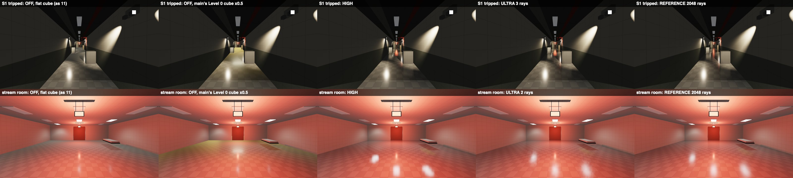

# 11 — Secondary reflections: G14 P1b design (glossy receivers, recursion, the Surface hook)

2026-10-03 · visual chat (游戏视觉) · workflow glass-rt-track, secondary-reflection investigation, design stage · **revision 1: 2026-10-04** (answers check 1, §7) · **status: DESIGN** (no game code changed)

**The question.** Red showed a Control RTX on/off pair: a glass cabinet reflects the room, and a glossy parquet floor reflects the cabinet ("二次反射", secondary reflection). He says our window glass has none. He wants the cause found and fixed at the highest desktop spec.

**Red's decision (2026-10-03 14:1x).** The Run! corridor floor is **glossy vinyl tile** (waxed 12" VCT, smoothness ~0.75–0.85). That look is decided; the open question is only how each tier delivers it (§2.3). It is the main secondary-reflection receiver. Acceptance frames must show:
- the Run floor reflecting the red EXIT signs and the emergency heads;
- a glass door or window in that floor, together with that glass's own reflection (two bounces).

The Surface-shader hook must cover that floor, including the RoomStream materials.

**Inputs, read in full:**
- `01_code_review.md`, `02_runtime_probe.md`, `03_research.md`, `10_rt_glass_design.md`, `11a_glossy_surfaces.md`, `11b_multibounce_research_bench.md`; `../../room_visuals/10_run_directions.md`.
- **Main, read only, at `d610d3a`** (2026-10-03 23:17). The RT code is unchanged since `75cfdff` (19:41): `git diff 75cfdff d610d3a` touches no file under `Assets/Scripts/Rendering`, `NativePlugin` or `Assets/Resources/Rendering`; the working tree is clean there. Read: `NativePlugin/FRGlassRTShared.h`, `FrontRoomsGlassRT.metal`, `FrontRoomsMetalGlassRT.mm` (timing and caps); `Assets/Scripts/Rendering/GlassRT/*`, `FrontRoomsMetalGlassRTRendererFeature.cs`, `FrontRoomsMetalGlassRT.cs` (now a 23-line shim), `FrontRoomsPostStack.cs`, `FrontRoomsLook.cs`, `FrontRoomsZoneReflection.cs`, `FrontRoomsSurfaces.cs`, `FrontRoomsRoomStream.cs`, `FrontRoomsMapWorld.cs` (panes), `FrontRooms3DGame.cs` (zone cube), the URP asset and renderer, `QualitySettings.asset`, `TagManager.asset`, every `Resources/Surfaces/*.mat` shader GUID.
- **Pre-Codex state, pinned to `7320ed1`**: every citation of the ChatGPT prototype (`FrontRoomsMetalGlassRT.mm`/`.cs`) and of MapWorld/3DGame/Look as they were then.
- `proj_rt` (glass-rt-track's G14 clone, still finishing): `FRGlassRTShared.h` and `FrontRoomsGlassRTSystem.cs` (22:38 snapshot).
- `research/codex_audit/00_main_state.md` §3.2 and `10_review_glass-look.md` F5. **`codex_audit/20_findings.md` does not exist yet**, and neither do `rt/20_implementation.md` or `30_final.md`; nothing from them is reconciled here.
- URP 17.3 source in `proj_rt/Library/PackageCache`.
- Check 1 (`scratchpad/wf/g14b_check1.txt`) and its bench `scratchpad/rt_bench2/b4v/`.

**What was written:**
- this report (revision 1);
- `11_bench/r1/`: bench 5/5b sources and logs (`b5/`), bench 6 sources and logs (`b6/`), the run scripts;
- `images/11r1_compare_sheet.jpg`, `images/11r1_dolly_sheet.jpg`;
- three rows in `Documentation/VERIFICATION_LOG.md` (VL082–VL084, §5.4).

Nothing under `Assets/` was touched. No Unity was started. The benches ran standalone in `scratchpad/rt_bench2/` (`b5/`, `b6/`).

**Tags.**
- **MEASURED** = timed or computed on Red's M3 Max for this report (benches 4, 5b, 6), or quoted from 11b with its run.
- **ESTIMATE** = arithmetic or judgement.
- **UNVERIFIED** = not confirmed.

**Machine load.** Bench 4 ran at a 1-minute load of 407–510. The revision-1 timings ran at **8–39** (§5.2); every log line carries its load. Image metrics (errors, differences) do not depend on load.

---

## 0. For Red

**Why our glass shows no secondary reflection today** (main, `75cfdff` and later):
1. **G14 is in main now, but it traces no window yet.** It starts on every M3/M4 Mac camera. Main's glass shader lacks G14's prepass pass, so no pane enters the trace and the glass keeps showing the zone cube (codex audit F5; read from the code, not yet seen on screen).
2. **G14 is one bounce, and only glass receives.** A pane seen inside a pane shows the zone cube. A floor, CRT or chrome hit is lit once and stops. A floor never gets its own reflection.
3. **Content.** Level 0 and the Office are carpet; carpet does not reflect. The only hard floor is the Run corridor, and Run rooms are not in play yet.
4. **Raster.** The zone cubes are live, but static. Run rooms borrow the Level 0 cube; there is no Run cube.

**What P1b adds** (after G14 P0/P1):
- **Glossy surfaces become mirrors that trace**, not just windows: the waxed Run floor at your 0.75–0.85 (mean 0.80), CRT screens, chrome, glazed ceramics, door steel and brass. On Ultra also cherry and ebony.
- **Reflections inside reflections**: 2 bounces on High, 3 on Ultra.
- **Blur that matches the surface.** Waxed tile gives soft streaks toward you; glass and chrome stay sharp. No TAA, no smearing; a still camera never shimmers.

**What each tier shows on the Run floor:**

| Tier | What you see |
|---|---|
| Mac M3/M4, RT **Ultra** | Waxed floor (mean 0.80). Lamps, EXIT signs, door glass and props as long soft streaks; the glass shows its own reflection. Fine grain that stays on the floor near you; smooth far away |
| Mac M3/M4, RT **High** | The same content, one smooth blur; streak ends slightly rounder |
| RT Off, M1/M2 Macs, Windows, WebGL | **Unchanged today** (the floor as it is now). After your R-2 OK and the Run cube: a glossy floor with a fixed Run cube; glow in about the right places, nothing moves, no props or glass in it |

**What it costs** (M3 Max, 1440p, MEASURED in a standalone bench; in-engine numbers come later):
- Run corridor, floor reflections: **High 1.4–1.9 ms, Ultra 3.1–3.9 ms**, plus about 0.35–0.85 ms shared with the glass trace.
- Wide title-stream Run room: 2.6 ms (Ultra uses High's path there).
- A base M3 or M4 (10 GPU cores) is about 4× slower (ESTIMATE). **The game measures its own GPU time and picks the tier itself** (§2.9).
- Memory: 194 MB more at 1440p (209 MB at the peak of a frame).

**What you will see** (bench, Run corridor, error vs a 2048-ray reference, 0–255 display scale):
- Today's cube on a waxed floor is far off: mean error 24/255. High brings it to 2.8, Ultra to 2.3.
- The glass lite showing the floor's lamp streak: up to 73/255. The lite's own reflection inside the floor: up to 16/255 on a few hundred pixels.
- A third bounce: invisible (≤ 7/255), cut off automatically.

**Where you will NOT see it** (physically correct): carpet, wallpaper, drywall, ceiling tile, matte wood and plastic, door veneer, painted steel.

**What I need from you:**
- **R-1** Default: Ultra where the measured GPU time allows, else High (automatic).
- **R-2** Raster tiers (RT Off, Windows, WebGL): give them the waxed floor too, once the Run cube exists? Yes is my recommendation; WebGL can keep today's floor instead.
- **R-3** Direction B for the acceptance frames.
- **R-4** One frame pair, still and moving: Ultra's near grain vs High's smooth blur.

---

## 1. What the benches show

Bench 4 built the Run corridor itself (1 × 9 cells, 2.84 m clear, 27 m; Direction B, tripped and armed; the RN-X goal door with its 0.25 × 0.75 m wired lite and a lit Level 0 stub; the title stream's Run room, 11.5 × 12 m; 3,000 far office instances so the acceleration structure is as large as the real map's). Bench 5/5b adds main's real `Refl_Level0` cube, scene-captured cubes, a 2048-ray reference, the designed soft gate, footprint-aware jitter, a far fade and a dolly test. Bench 6 times the stack on top of **main's own G14 kernel**. §5 has the method.

| Finding | Number (1080p display error unless stated) | Consequence |
|---|---|---|
| **Today's cube is badly wrong on a waxed floor** | Off frame with main's `Refl_Level0` × 0.5 (what main puts on Run rooms) vs the 2048-ray reference: S1 tripped mean **24.2/255**, near goal 16.7, stream room 17.2, armed 3.9 | The change "vs Off" mostly measures how wrong the Off cube is. Acceptance now uses error vs the reference (§2.12) |
| **Receivers beyond glass are the visible change** | Floor px ≥ 8/255 changed, Off → High: flat cube (as 11) 32.9 / 36.9 / 57.7 / 8.6 %; **main's Level 0 cube 57.5 / 49.9 / 53.1 / 13.0 %**; a cube captured in the Run corridor × 0.5: 18.3 / 19.3 / 60.4 / 11.2 % (S1 / near goal / stream room / armed) | The Run floor is a receiver on every RT tier. Which cube the Off frame uses is now stated everywhere |
| **RT vs reference** | High: S1 2.80, near goal 1.94, stream room 3.36, armed 1.18. Ultra (design): 2.33 / 1.17 / (High path) / 0.74. Red EXIT streak recall: High 78 %, Ultra 78–100 % | Both tiers cut the error 3–14× vs today's cube (9–10× in S1) |
| **The reference needed more rays** | S1 tripped, 128 rays vs 2048: mean 2.3/255, p99 40, 6.5 % ≥ 8; 512: 1.7, p99 28; the 2048 reference's own two halves still differ by p99 25 per pixel, but only p99 3.6 on 8×8-pixel block means. Other views converge by 512 rays | Bench 4's 128-ray errors were inflated by reference noise. Acceptance compares 8×8 block means against a 2048-ray reference |
| **Two bounces, with the designed soft gate** | 2.5 m from the goal, armed, depth 2 vs 1: the lite shows the floor's lamp streak, max **73/255** (main's cube; 71 flat; 54 corridor cube; 85 without the gate). The lite's own lamp image in the floor: max **16/255**, 373 px ≥ 8 (20 / 516 px without the gate) | Real but small; R2 is staged for it, thresholds re-derived (§2.12) |
| **Third bounce** | With the 0.004 cut-off: ≤ 7/255, 0 px ≥ 8 (every cube) | Ultra's depth 3 is free; it stays for facing windows |
| **Stack cost, on main's kernel** | Revised layout at depth 1 = main bit for bit, 0.96–1.05× main. Depth 2/3: 1.03–1.15× main (min), including the real second-bounce rays. 11's first layout (8 unpacked entries, see-through pushed) costs another **4–9 %** (median) at the same depth | See-through stays in registers; only reflections are pushed; ≤ 2 packed entries (§2.5) |
| **Grain under motion** | Forward dolly, far floor 6–12 m, frame-to-frame change of the error: re-seeded jitter 11.3/255; 1 cm world cells (11 as written) 8.0; footprint-aware cells 5.4; **footprint-aware + far fade 2.7**; High 2.4 | Ultra uses footprint-sized cells and fades to High's path on the far floor (§2.4) |
| **Ray-count pops** | Switching Ultra from 2 to 3 rays changes 2.0 % of S1's floor px by ≥ 8/255 (max 181); the floor share crosses that switch at +3° pitch | Rays per tile are chosen on the GPU, with hysteresis (§2.4) |
| **Rough-floor filter** | Mirror ray + hardware-anisotropic mip blur (k 2): best deterministic filter (bench 4). Oriented à-trous stripes; checkerboard saves nothing (1.62 vs 1.30 ms) | Unchanged from bench 4 |
| **Floor share** | S1 at eye level 11.6 %, near goal 15.1 %, pitched 10° 17.6 %, 2.5 m from goal 19.4 %, stream room 37.2 % | Narrow corridors are cheap; the wide room is the floor-heavy case |

---

## 2. G14 P1b design (on top of main's G14 and `10_rt_glass_design.md`)

### 2.0 Main at `75cfdff` (and later): where the reflection stops today

**What runs.** G14 starts from `FrontRoomsPostStack.ConfigureCamera` (`FrontRoomsPostStack.cs:74`, `FrontRoomsGlassRT.OptIn`). Its default is Ultra at quality level 5, High at 3–4 (`FrontRoomsGlassRT.cs:6`, `FrontRoomsGlassRTSystem.cs:83`). Mac players default to level 5 (`QualitySettings.asset:338`), so a player defaults to Ultra; the editor sits at level 3 (High). The plugin requires Apple9 (M3/M4) and fails closed elsewhere (`FrontRoomsMetalGlassRT.mm:240`). Codex removed MapWorld's `Ensure()` call in `75cfdff`; `FrontRoomsMetalGlassRT.cs` is now a 23-line shim, and `FrontRoomsMetalGlassRT.mm` is the G14 plugin.

**Why the pane gets no trace in main.** `Glass_Window` (`_RTReceive` 1) gets rendering-layer bit 30 (`FrontRoomsGlassRTSystem.cs:707`), and bit 30 is drawn only with the `FRGlassRTPrepass` pass (`FrontRoomsMetalGlassRTRendererFeature.cs:156-171`). Main's `FrontRoomsGlass.shader` has no such pass (0 lines), so the prepass is empty and the glass falls back to its cube (codex audit F5; reasoned from code, not captured). The glass-rt-track owns that merge.

**Why there is no second bounce even after that merge.** G14's `FRTraceReflection` (`FrontRoomsGlassRT.metal:421-489`) is a loop over glass layers along **one** ray:
- a pane hit adds `Fr × the zone cube` in the mirror direction (`:467`, `:469`) and continues straight through with `T *= 1 − (0.11 + 0.89·F⁵)` (`:468`, `:470`); the pane's own reflection is never traced;
- the pane's back face is skipped by instance id (`lastGlass`, `:439`, `:454`);
- the first opaque hit is shaded (`FRShade`: SH + zone cube + direct lamps, `:336-409`) and **returned** (`:479-485`); a glossy floor or chrome hit never reflects again;
- receivers come only from the glass prepass (`FR_FLAG_RECEIVER`, `FRGlassRTShared.h:43`, set for FrontRooms/Glass `_RTReceive` 1, `FrontRoomsGlassRTSystem.cs:470`, `:683`), so no opaque surface ever traces.

**Raster.** `FrontRoomsLook.SetZoneReflection` is live (`FrontRoomsLook.cs:38-41`): G6's cubes `Refl_Level0/Office/Tall/DeadLamp` with linear intensity 0.5/0.5/0.45/0.5 (`FrontRoomsZoneReflection.cs:43`, `:48`). There is no Run zone (`FrontRoomsLook.cs:29`) and no title-stream cube: RoomStream forces the Level 0 cube for the whole title (`FrontRoomsRoomStream.cs:351-352`), and the game picks the zone of the player's cell (`FrontRooms3DGame.cs:1096`).

**Content.** `Prop_Glass` and `Prop_BottleBlue` are already on FrontRooms/Glass with `_RTReceive` 0 (`8ef5b64`); only the receiver flag is still to do (§3.1). Main has 84 FrontRooms/Surface materials (83 at `7320ed1`).

**Before Codex** (`7320ed1`, for the record): the prototype controller was created only for a standalone map (`FrontRoomsMapWorld.cs:487-489`; the game builds it embedded, `:506`, from `FrontRooms3DGame.cs:578`); its pass waited for a texture only the pass created (`FrontRoomsMetalGlassRT.cs:53`); the kernel returned early for non-glass first hits (`FrontRoomsMetalGlassRT.mm:279`), traced one ray (`:285-296`), shaded hits flat with a fake sun (`:230-243`) and sent misses to a blue sky (`:223-228`); `SetZoneReflection` was a stub (`FrontRoomsLook.cs:28-36`).

**Line shifts.** RoomStream lines cited from `7320ed1` move by +2 after `:350` in main (Codex inserted `:351-352`).

### 2.1 Scope and principles

- **One trace, two kinds of receivers** (Control's split, [G7] in 11b):
  - **glass**, the front layer only, written to `_FR_GlassRTReflection` (G14's contract, unchanged);
  - **opaque glossy surfaces**, the front-most opaque only, written to a new `_FR_SurfaceRTReflection`.

  An opaque receiver seen through glass also traces. Glass keeps G14's front-layer rule.
- **Desktop Mac M3/M4 only (Apple9).** The hook and passes are stripped from WebGL and from Windows until P3.
- **No silent raster change.** With RT quality Off, P1b's code paths leave the desktop image bit for bit as today (B1). P1b edits no `.mat` file. Every look change on the raster tiers is listed in §2.3 and waits for Red (R-2).
- **Physically gated.** A surface reflects only if its real smoothness says so (11a classes). Carpet never does.
- **Deterministic first.** No TAA, no history, no per-frame noise. A still camera gives a still image.

### 2.2 Receivers per tier

**Effective smoothness** = the material's `mask.r × _Smoothness`, MEASURED per material in 11a (p10/p50/p90 over the mask's pixels). It is baked into a table, not read at runtime (§2.8).
- A **renderer is a receiver** if its material's **p90** effective smoothness reaches the tier threshold.
- **Every pixel** of a receiver with perceptual roughness r ≤ 0.55 then traces, with the blur set by its own roughness (§2.4). Above r 0.55 it shows the cube.
- The hook fades RT to the cube between r 0.40 and 0.55, so the waxed VCT (p10–p90 r 0.11–0.30) never blotches.

| Tier | Threshold (p90 s) | Opaque receivers (s p50 [p90]; m = metal) | Glass receivers (FrontRooms/Glass `_RTReceive = 1`) |
|---|---|---|---|
| **High** | s ≥ 0.75, or metal with s ≥ 0.60 | **Run floor 0.80 [0.89]** (the waxed twin on RT tiers, §2.3); `Prop_ScreenCRT` 0.86 face; `Prop_GlassCRT` 0.84 (phone display); `Prop_Chrome` 0.85 m (chair bases, stools, ply cabinet); `Prop_CeramicGlaze` 0.85; `Prop_Ceramic` 0.80; `Prop_VendingFront` 0.76 [0.82]; `Office_BlackedGlass` 0.95 (except renderers flagged MatteHit, §2.3); **`Run / chrome` 0.78 m** and **`Door / brushed steel` 0.62 m** (their Surface twins on RT tiers, §2.3); `Prop_Brass` 0.60 m | `Glass_Window` (after the F5 merge and C8); `Glass_Wired` (RN-X goal lite, Direction C lites; new); `Prop_Glass` with `_RTReceive` 1 (cabinet, hutch, vending and clock glass; already on FrontRooms/Glass) |
| **Ultra** | s ≥ 0.60, or metal with s ≥ 0.50 | everything in High, plus `Prop_WoodCherry` 0.71 [0.74]; `Prop_WoodEbony` 0.66 [0.69]; `Prop_WoodDark` 0.59 [0.61]; `Prop_Aluminium` 0.56 m [0.59] | same |
| **Never** (all tiers) | — | `Run_Wall` 0.58 [0.59]; every carpet (0.075–0.08); wallpapers 0.21; `Office_Wall` 0.31; ceilings 0.10–0.11; `Cove_Base` 0.38; `Door_Veneer` 0.47; painted steel 0.43; plastics ≤ 0.52; `Painted_Metal` 0.52; oak, teak, walnut ≤ 0.56; fabrics, board, paper. **Emissive lenses and signs** (`Troffer_Lens`, `Run_ExitSign`): excluded by the EmissiveLens flag and never recurse at hits (§2.3) | `Map test / glass` (URP/Lit; the map pane until C8); `Prop_BottleBlue` (FrontRooms/Glass, `_RTReceive` 0, tiny); `Glass_Edge`, `Glass_Shard` (hit-only) |

### 2.3 How each tier delivers the waxed floor (Red's decision), with no silent changes

**Rule.** RT tiers get the look through **runtime twins and RT-side material overrides**. The `.mat` files and the RT-off image stay as today. The raster tiers get the look only through R-2, after the Run cube exists.

| Item | RT tiers (Mac M3/M4, High/Ultra) | RT Off on the same Mac; M1/M2 Macs; Windows; WebGL |
|---|---|---|
| Run floor | `FrontRoomsSurfaces.Room(Run, Floor)` returns a **runtime twin** of `Run_Floor` with `_Smoothness` 1.52 (mean 0.80, p10–p90 0.70–0.89) while `FrontRoomsGlassRT.SurfaceReceiversActive` is true; RoomStream and the map's Run module get it through that one call | `Run_Floor` as today (`_Smoothness` 1, mean 0.525). After R-2: `Run_Floor.mat` → 1.52 **plus** the Run cube |
| Reflection source | Traced (§2.4–2.5); zone cube only at cut-offs and misses | The zone cube. Today: Level 0 (RoomStream `:351-352`). After R-2: `ReflectionZone.Run` |
| Run chrome, door steel | Runtime **Surface twins** (`FrontRoomsSurfaces.Metal`), same values, so they can take the hook | URP/Lit materials as today |
| Lenses, EXIT sign faces (11a M2) | RT-side only: the hit record gets `FR_MAT_NO_RECURSE` (new material flag bit 8; main uses 0–6, `proj_rt` adds 7); they stay non-receivers (EmissiveLens). Hit smoothness = raster smoothness, for parity | Unchanged. The 0.85 acrylic look is optional content for later, on all platforms, with Red's OK |
| Gurney wheels, sign housings on `Office_BlackedGlass` (11a M1) | RT-side only: RoomStream registers those renderers with a new instance flag `MatteHit` (bit 13): never a receiver, hit smoothness clamped to 0.45, no recursion | Unchanged (the Run kit replaces them) |
| Quality change | `SurfaceReceiversActive` flips → RoomStream re-dresses live rooms in one frame; the system re-evaluates flags | — |

**What each raster tier shows after R-2** (MEASURED in bench 5b, Run corridor, error of the Off frame vs the 2048-ray reference): a corridor-captured Run cube at intensity 0.5 cuts the floor error from **24/255 to 6.9/255** in S1 (6.1 near goal, 3.7 armed). RT High is 2.8, Ultra 2.3 against the same cube. In the 11.5 m stream room a single cube stays wrong (**18/255**): the hanging signs land in the wrong place. Box projection would help, but the Surface shader has none (`room_visuals/10` §7.6) and URP's is off (`FrontRooms_URP.asset:55`); adding it touches every Surface draw, so it is a separate lookdev item (UNVERIFIED).

**The Run cube** (`ReflectionZone.Run`) is now a **prerequisite** for R-2, not a fallback. G6 captures it per Run room type (corridor, stream room) with the armed state, linear intensity 0.5 (G6's cap), WebGL size by G6's import override. RoomStream switches to it when a Run room becomes current; the map's Run module needs one line in its contract list (`room_visuals/10` CR set): the zone picker at `FrontRooms3DGame.cs:1096` maps Run cells to `ReflectionZone.Run`.

**WebGL.** P1b itself changes nothing on WebGL. R-2 would change WebGL's Run floor and cube on purpose; it must be listed in the WebGL track's change list. Red may keep 0.525 on WebGL with a WebGL-only material variant.

### 2.4 Rays per receiver pixel, and filtering (no TAA)

Perceptual roughness r = 1 − s comes from the receiver prepass, per pixel (normal map and damp flattening included). **Trace range = fade range:** a pixel traces if r ≤ 0.55, and the hook blends RT → cube over r 0.40–0.55. No pixel ever gets RT weight without a trace.

| Receiver class, pixel roughness | High | Ultra |
|---|---|---|
| **Floor-planar** (SurfacePlanar and normal.y > 0.9), every r ≤ 0.55 | 1 mirror ray + **anisotropic mip blur**, k = 2. The blur radius is ∝ α = r², so it shrinks smoothly to 0 for the glossiest texels: no sharp/blur switch inside the floor | **GGX VNDF rays** (Heitz 2018) near, with **footprint-aware jitter**; **far fade** to High's path; anisotropic mip blur, k blending from 1 (near) to 2 (far). Rays per 16×16 tile from the GPU budget (below) |
| **Other receivers, r ≤ 0.16** (CRT face 0.86 → r 0.14, glaze 0.85 → 0.15, `Prop_GlassCRT` 0.84 → 0.16, black glass 0.95 → 0.05, chrome 0.85 → 0.15) | 1 mirror ray, no blur. Glass keeps G14's smudge blur and back-surface image (`10` §1.6) | same |
| **Other receivers, 0.16 < r ≤ 0.55** (brass, steel, vending front, ceramic, wood) | 1 mirror ray + plane-aware 2-pass à-trous (bench 3: 5×5 B3, plane and normal weights; radius from the lobe footprint, continuous to 0) | 2 GGX rays, footprint-aware jitter, the same à-trous |
| r > 0.55 inside a receiver | not traced; the cube, as the raster | same |

**Anisotropic mip blur** (MEASURED best deterministic filter, bench 4):
- **Prep.** The resolve writes the floor-class radiance premultiplied by a floor mask, (rgb·m, m), into a mipmapped RGBA16F texture; a blit generates box mips.
- **Shape.** Footprint `r_in = k · α · hit / ((view + hit) · pixelAngle)` px (α = r²); plane-of-incidence direction `e = normalize(proj(P + 0.05·N) − proj(P))`; `r_out = r_in · cos θi` (in-plane tilt 2δ, out-of-plane 2δ·cos θi: lamps streak toward the viewer).
- **Gather.** Three trilinear probes, `max_anisotropy(16)`, explicit gradients (`gx = e·r_in`, `gy = e⊥·2·r_out`), at 0 and ±r_in/2 along `e`, weights ½ / ¼ / ¼, divided by the mask.
- **Cost.** 0.58–0.69 ms at 1440p over the full screen (r1 timing). A dispatch rectangle cuts this.
- **Calibration.** vs the 2048-ray reference (S1 tripped, r 0.20): k 1 / 2 / 3 → mean error 3.33 / 2.80 / 3.38, 8×8-block p99 38 / 37 / 66. k = 2 for High.

**Footprint-aware jitter** (Ultra; Wyman & McGuire, "Hashed Alpha Testing", 2017):
- The (u1, u2) of sample i hash the receiver point quantised to a cell the size of the pixel's floor footprint (along the view: `pixelAngle · d / cos θ`), at two power-of-two levels blended by the fractional level, with W&M's CDF correction. Never from the frame index.
- Why not 1 cm cells: at 1440p and 76° FOV one pixel covers 2.4 mm of floor at 1 m, 7.8 mm at 3 m, 26 mm at 6 m and ~100 mm at 12 m. Far pixels span many 1 cm cells, so any motion picks a new cell and the noise crawls; near the camera 4–5 pixels share one cell and look blocky.
- **Far fade.** Between pixel footprints (across the view, `pixelAngle · d`) of **6 and 12 mm** — 5.5–11 m at 1440p, 4.1–8.3 m at 1080p — Ultra blends to High's mirror ray, and k blends from 1 to 2. Beyond 12 mm it is High's path.
- **MEASURED** (forward dolly at 1 m/s, S1 tripped, frame-to-frame change of the error vs a per-frame 2048-ray reference, display/255, ground distance 0–3 / 3–6 / 6–12 / 12+ m):

| Jitter | Forward dolly | Strafe, 6–12 m | Still-frame error, 6–12 m |
|---|---|---|---|
| Re-seeded each frame (bench 4) | 1.03 / 2.51 / **11.31** / 9.08 | 12.52 | 7.04 |
| World 1 cm cells (11 as written) | 0.45 / 1.42 / **7.95** / 6.95 | 7.50 | 6.53 |
| Footprint-aware cells | 0.48 / 1.51 / **5.39** / 3.62 | 6.28 | 7.12 |
| **Footprint-aware + far fade (design)** | 0.48 / 1.38 / **2.69** / 1.05 | 4.70 | 9.80 |
| High (deterministic) | 0.34 / 0.81 / **2.35** / 1.05 | 4.75 | 10.76 |

  The far fade costs some still-frame accuracy far away (S1 mean error 1.88 → 2.33; High 2.80) and buys motion stability equal to High's. Bench 4's 0.3–2.9 % seed-to-seed shimmer is **not** an upper bound: re-seeded per frame, the far band moves by 11/255.

**Rays per tile, on the GPU, with hysteresis** (Ultra floor):
- After the prepass, `fr_tile_count` counts floor-class pixels per 16×16 tile and in total (one atomic per tile). `fr_spp_plan` (one threadgroup) computes the continuous budget c = 0.40 × screen px / floor px (BFV Ultra's 40 % [G3]).
- Each tile's target is n = clamp(⌊c⌋, 1, 4), with the far-faded tiles costed at 1 ray first.
- **Hysteresis:** a tile drops when c < n_prev, rises only when c ≥ n_prev + 1.15, and changes at most one step per 8 frames. State: 1 byte per tile (14,400 tiles at 1440p).
- The trace reads n per tile; dispatch is indirect. No CPU readback.
- Why: switching 2 → 3 rays changes 2.0 % of S1's floor px by ≥ 8/255 (max 181), and at eye level the floor share is 11.6 %, while the 3/2 switch sits at 13.3 % (+3° pitch). A mouse nod would pop the whole floor. With hysteresis a pop needs a sustained change.

### 2.5 Recursion: stack, Fresnel throughput, cut-off, misses

**Layout** (MEASURED on main's kernel, bench 6):
- The **see-through continuation stays in registers**, exactly as G14's layer loop does (`tMin`, `T`, `layers`, `lastGlass`).
- Only **reflection branches** are pushed, on a stack of **maxDepth − 1** entries: 1 on High, 2 on Ultra.
- Entry: 28 bytes: origin (12), octahedral direction (4), half3 weight (6), half cone (2), meta (4: depth 2 bits, layers 2 bits, **lastGlass + 1** in 28 bits). `lastGlass` lives in each entry, because a popped branch starts in a different place.
- At depth 1 this is main's loop bit for bit (0 of 443,629 traced px differ) at 0.96–1.05× its time. 11's first layout cost another 4–9 % (median) at the same depth.

**Path weight** w = receiver Fresnel × the product of each hit's Fresnel or transmission:
- receiver Fresnel = the hook's `EnvironmentBRDFSpecular` (dielectric F0 0.04, metals F0 = albedo, glass `_PaneF0` 0.08);
- pane terms are **G14's own**: reflectance `Fr = 0.08 + 0.92·F⁵` and transmission `1 − (0.11 + 0.89·F⁵)` (`FrontRoomsGlassRT.metal:467-468`, the `Glass_Window` alpha), not 11's earlier (1 − F)·0.9;
- a ray is spawned only if `importance · w > 0.004` (11b: removes 99.7 % of third-bounce rays at no image cost).

| Tier | Max reflection depth | Glass layers seen through | Cut-off | Stack entries |
|---|---|---|---|---|
| High | **2** | 1 | 0.004 | 1 |
| Ultra | **3** | 2 | 0.004 | 2 |

Depth counts reflections: 1 = the receiver's own ray (G14 today).

| What the ray hits | Shading (G14's `FRShade`, unchanged) + continuation |
|---|---|
| **Glass, entering face** | **See-through** in registers: × `1 − (0.11 + 0.89·F⁵)`, a layer, not a bounce; after the layer limit, × the zone cube. **Reflect**: if depth < max and the cut-off allows, push a mirror ray × Fr (glass ignores roughness, as in Control, Capcom and SEED); otherwise Fr × the zone cube (G14 today) |
| **Glass, exiting face** | Pass through, no Fresnel, no layer. Rule: **facing first** (an exiting face is `dot(dir, nGeo) > 0` on a closed box with outward normals), **`lastGlass` second** (guards the same-face re-hit). Map panes are closed 6 mm boxes (`FrontRoomsMapWorld.cs:1271`); kit cabinet glass must be closed boxes too (kit owner check, §3.1). A multi-panel instance then counts each panel it enters |
| **Mirror-like metal** (metallic ≥ 0.5, s ≥ 0.75) | Direct light + push a reflection × F(albedo), gated below |
| **Glossy dielectric** (s ≥ 0.75: CRT, black glass, glaze, vending front, the Run floor seen in glass) | Lit + push a reflection × F, **soft gate** g = 1 − smoothstep(0.10, 0.25, r_hit) (s 0.90 → 1, 0.80 → 0.26, 0.75 → 0); the rest uses the cube at the hit's roughness mip, so there is no hard edge. One mirror ray at a hit |
| **Rough** hit (s < 0.75), `FR_MAT_NO_RECURSE` (lenses, signs), `MatteHit`, shards | Hit shader only + the cube at the hit's roughness mip (G14 today) |
| **Miss** | Zone cube in the ray direction × the zone's linear intensity |
| **Depth limit or cut-off** | Zone cube at the hit's roughness mip × the remaining weight |

**The soft gate, MEASURED** (2.5 m from the goal, armed, depth 2 vs 1; main's cube / flat / corridor cube): the lite showing the floor's lamp streak drops from 85 / 83 / 64 to **73 / 71 / 54** /255; the lite's own lamp image in the floor from 20 / 19 / 19 on 516 / 484 / 474 px to **16 / 15 / 15** on 373 / 333 / 329 px. Near the goal (armed, r 0.20) the lite effect falls from 6 to 2/255. The gate stays: a single mirror ray at an r 0.20 hit would draw a lamp sharper than the floor really shows it. R2's thresholds are set from the gated numbers (§2.12).

### 2.6 The Surface-shader hook (FrontRooms/Surface; lookdev owner = visual chat, shared with the wallpaper track)

#### 2.6.1 Contract (mirrors the glass hook, `[RT-HOOK-BEGIN]`/`[RT-HOOK-END]` markers)

| Item | Value |
|---|---|
| `_FR_SurfaceRTReflection` | Global Texture2D, per RT camera, RGBA16F, 1× the scaled target. RGB = reflected linear HDR radiance, filtered, **no Fresnel or strength**, fog remainder applied. **A = 0** (not traced) or **1 + linear eye depth (m)** of the receiver (a depth tag) |
| `_FR_SurfaceRTWeight` | Global float: 1 while this camera traced this frame; **0 when quality is not Off but nothing was traced**; reset after transparents |
| `_FR_SurfaceRTFade` | Global float2 (0.40, 0.55). The trace range is r ≤ `_FR_SurfaceRTFade.y` |
| `_FR_SURFACE_RT` | Global keyword, `multi_compile_fragment` in ForwardLit only. **On whenever surface-RT quality is not Off** for the RT camera (weight 0 when nothing traced); off only at quality Off. Prewarmed at load (§2.6.4) |
| Instance flag | **`FrontRoomsGlassRTFlags.SurfaceReceiver` = `FR_FLAG_SURFACE_RECEIVER` (1u << 12)**, new. G14's `Receiver` (bit 11) keeps its meaning: "drawn into the glass prepass" |
| Rendering-layer bit | **28** (`SurfacePrepassBit`), new. Free in main: `TagManager.asset:45-46` defines only `Default` (bit 0); the only code that sets bits is G14 (30 `PrepassBit`, 29 `OverrideBit`, `FrontRoomsGlassRTSystem.cs:29-31`); light layers are off (`FrontRooms_URP.asset:76`); the renderer has no decal feature. B11 re-checks it in the build |
| Material properties | **None added.** All 84 Surface materials in main stay byte-identical (receivers come from the table, §2.8) |

**Why a new flag and bit.** In main a renderer carrying G14's `Receiver` flag gets bit 29 unless its material is FrontRooms/Glass with `_RTReceive` 1 (`FrontRoomsGlassRTSystem.cs:707`), and bit 29 is drawn into the **glass** prepass with an override shader (`FrontRoomsMetalGlassRTRendererFeature.cs:173-182`). The Run floor would be traced as glass and written to `_FR_GlassRTReflection`. `Rematerial` also clears `Receiver` on every material swap (`:1269-1272`), which RoomStream does on each recycle. So P1b never touches bit 11, bit 29 or bit 30. `SurfaceReceiver` is set and cleared in its own branch, in registration and in `Rematerial`, from the receiver table.

#### 2.6.2 ForwardLit change (exact)

After `half4 color = UniversalFragmentPBR(inputData, s);` and before `MixFog`:

```hlsl
// [RT-HOOK-BEGIN] G14 P1b: traced specular for glossy receivers. Keyword off = the code without the hook.
#if defined(_FR_SURFACE_RT)
    [branch] if (_FR_SurfaceRTWeight > 0.0)
    {
        float myDepth = -TransformWorldToView(input.positionWS).z;
        float2 dz = float2(ddx(myDepth), ddy(myDepth));   // here: the branch above is uniform, the one below is not
        float tol = 0.02 + 0.01 * myDepth;
        int2 px = int2(input.positionCS.xy);
        half4 rt = (half4)LOAD_TEXTURE2D(_FR_SurfaceRTReflection, px);
        if (!(rt.a > 1.0h && abs((float)rt.a - 1.0 - myDepth) <= tol))
        {
            // MSAA edge: this pixel's centre traced another surface (4x MSAA colour, 1x prepass).
            // Take a 4-neighbour whose tag matches this fragment's depth at that neighbour.
            int2 o[4] = { int2(1,0), int2(-1,0), int2(0,1), int2(0,-1) };
            [unroll] for (int k = 0; k < 4; k++)
            {
                half4 q = (half4)LOAD_TEXTURE2D(_FR_SurfaceRTReflection, px + o[k]);
                float zk = myDepth + dot(dz, (float2)o[k]);
                if (q.a > 1.0h && abs((float)q.a - 1.0 - zk) <= tol + abs(dot(dz, (float2)o[k]))) { rt = q; break; }
            }
        }
        if (rt.a > 1.0h)
        {
            BRDFData b; half aRT = 1.0h;
            InitializeBRDFData(s.albedo, s.metallic, s.specular, s.smoothness, aRT, b);
            half3 rv = reflect(-inputData.viewDirectionWS, inputData.normalWS);
            half  ft = Pow4(1.0h - saturate(dot(inputData.normalWS, inputData.viewDirectionWS)));
            half3 env = GlossyEnvironmentReflection(rv, inputData.positionWS, b.perceptualRoughness, 1.0h, inputData.normalizedScreenSpaceUV);
            AmbientOcclusionFactor ao = CreateAmbientOcclusionFactor(inputData.normalizedScreenSpaceUV, s.occlusion);
            half w = (half)_FR_SurfaceRTWeight * (1.0h - smoothstep((half)_FR_SurfaceRTFade.x, (half)_FR_SurfaceRTFade.y, b.perceptualRoughness));
            // URP's GI added spec * ao.indirect * env; swap that share for the traced radiance. Traced rays resolve
            // occlusion themselves, so RT keeps only the material cavity, not SSAO.
            color.rgb += EnvironmentBRDFSpecular(b, ft) * w * (s.occlusion * rt.rgb - ao.indirectAmbientOcclusion * env);
        }
    }
#endif
// [RT-HOOK-END]
```

Declarations, inside the same `#if`: `TEXTURE2D(_FR_SurfaceRTReflection); float _FR_SurfaceRTWeight; float2 _FR_SurfaceRTFade;`.
- **The math matches URP 17.3 exactly.** `GlobalIllumination` adds `EnvironmentBRDF(…, indirectSpecular, fresnelTerm) × occlusion`, with occlusion = `aoFactor.indirectAmbientOcclusion` = min(SSAO, surface occlusion) (`GlobalIllumination.hlsl:508-519`, `Lighting.hlsl:315-316`, `AmbientOcclusion.hlsl:59`, `BRDF.hlsl:157-161`).
- **It works whatever the raster's environment is** (Level 0 cube, the Run cube, a future probe): it subtracts what `GlossyEnvironmentReflection` returns at this pixel.
- **MSAA.** Main renders with 4× MSAA (`FrontRooms_URP.asset:28`) and G14's prepass is 1× (`FrontRoomsMetalGlassRTRendererFeature.cs:160`). Without the neighbour check, floor samples in an edge pixel whose centre lies on a prop get the cube: a 1-px fringe where props meet the floor. The check costs 4 loads only on mismatching receiver pixels (B14).

#### 2.6.3 New pass `FRReflPrepass`

```
Pass { Name "FRReflPrepass"  Tags { "LightMode" = "FRReflPrepass" }  ZWrite On  ZTest LEqual  Cull [_Cull] }
```

- **Inputs.** The same `Vert` and the same evaluation as `Frag` up to `inputData.normalWS` and `smoothness`: planar or mesh-UV frame, normal map, damp flattening, `mask.r × _Smoothness`.
- **Depth test.** It clips if the pixel is behind `_CameraDepthTexture` (tolerance 0.02 + 0.01·d), so a receiver hidden by a non-receiver never traces.
- **Outputs:** SV_Target0 = linear eye depth (R32F); SV_Target1 = (world normal, perceptual roughness) (RGBA16F); SV_Target2 = (F0 luminance, metallic, receiver class [1 floor-planar, 2 other], 0) (RGBA8).
- **Shared code.** The evaluation is first **duplicated** into `FrontRoomsSurfaceRTPrepass.hlsl`; B3 checks it against ForwardLit. Merging into one function happens only if B1 still passes.
- **Drawn only** by the RT feature's RendererList: ShaderTagId `FRReflPrepass`, `renderingLayerMask = 1u << 28`. URP never draws it otherwise.

#### 2.6.4 Keyword policy and prewarm

- **Keyword on whenever surface-RT quality is not Off.** Switching it on only when a receiver appears would make Metal compile the keyword variant of every visible Surface draw on that frame: a hitch the first time a Run room comes into view.
- **Prewarm.** At load, when RT quality is not Off, warm the ForwardLit `_FR_SURFACE_RT` variants with a Unity 6 `GraphicsStateCollection` recorded by the harness (Run corridor, stream Run room, Level 0, Office; 4× MSAA HDR target), with `ShaderVariantCollection.WarmUp` as a fallback.
- **What this costs in identity.** The glass track found that a uniform branch alone is not bit-exact (VL037: 49 of 90 checks differed; behind the keyword 175/175 matched). So, with RT on and no receiver in view, the image may differ from today's by ≤ 1/255 (gate B1b). With quality Off the keyword is off and the image is bit for bit today's (B1).
- **Same issue in G14.** G14 toggles `_FR_GLASS_RT` per frame with the weight (`FrontRoomsMetalGlassRTRendererFeature.cs:222`); the glass-rt-track may want the same policy (§3.1).

#### 2.6.5 Runtime Surface twins for URP/Lit metals

`Run / chrome` and `Door / brushed steel` are created by `FrontRoomsSurfaces.Lit` (`RoomStream.cs:1400`, `:1405` in main); URP/Lit cannot take the hook.
- P1b adds `FrontRoomsSurfaces.Metal(name, colour, smoothness, metallic)`: a FrontRooms/Surface material with white maps and `_MacroTone`/`_MacroDirt`/stains/grime at 0.
- RoomStream uses the Metal twin **only while `SurfaceReceiversActive`**; the URP/Lit material stays for RT Off and every other platform.
- **Gate B2:** with RT on and the trace weight forced to 0, the twin matches the URP/Lit version within mean ≤ 0.5/255, max ≤ 2/255 on those renderers. If not, they stay URP/Lit and hit-only, and High loses them as receivers.

#### 2.6.6 Platform isolation

- **WebGL.** `FrontRoomsGlassRTWebGLStripper` (RT-owned) also strips every `_FR_SURFACE_RT` variant and the `FRReflPrepass` pass. WebGL's variant count and output stay unchanged.
- **Windows.** Windows player builds strip them too until P3.
- **macOS.** ForwardLit's fragment variants double (`multi_compile_fragment`): a compile-time and prewarm cost.

### 2.7 Prepass, trace and dispatch (frame order)

**The move.** G14 traces at `BeforeRenderingTransparents` (`FrontRoomsMetalGlassRTRendererFeature.cs:43`). P1b moves **both prepasses and the one native trace event to `AfterRenderingPrePasses`**, before opaques, because the Surface shader reads `_FR_SurfaceRTReflection` while it draws.

| # | Step | Event | What happens |
|---|---|---|---|
| 1 | URP DepthNormals prepass | prepass | Already runs every frame: SSAO uses DepthNormals (`FrontRooms_URP_Renderer.asset:69-76`), one URP asset for every level. If SSAO is ever disabled, the feature declares `ScriptableRenderPassInput.Normal` (`UniversalRendererRenderGraph.cs:1609-1611`) |
| 2 | **FRRT Prepass** (raster) | `AfterRenderingPrePasses` | (a) Glass receivers: G14's prepass, unchanged (bits 30/29); (b) opaque receivers: `FRReflPrepass` (bit 28). Each has its own transient D32 and a manual test against `_CameraDepthTexture` |
| 3 | `fr_tile_count`, `fr_spp_plan` | same | Per-tile floor counts and Ultra rays per tile (§2.4) |
| 4 | **FRRT Trace** (`IssuePluginEventAndData`) | same | One native event: AS update; trace for glass and opaque-receiver pixels (indirect over tiles); resolve; filters. Sets both textures, both weights, both keywords |
| 5 | Opaques | — | FrontRooms/Surface reads `_FR_SurfaceRTReflection` |
| 6 | Transparents | — | FrontRooms/Glass reads `_FR_GlassRTReflection` (unchanged) |
| 7 | FRRT End | `AfterRenderingTransparents` | Weights 0; `_FR_GLASS_RT` per G14's policy; `_FR_SURFACE_RT` stays on while quality is not Off |

- **Side benefit.** Nothing sits between opaques and transparents any more, so `10` O1 (the MSAA store/reload split) and F1 go away. Running at `AfterRenderingPrePasses` is valid in forward: the prepass is full, depth priming is off (`FrontRooms_URP_Renderer.asset:52`) and `_CameraDepthTexture` is set before that event (check 1 confirmed this against URP 17.3).
- **Dispatch.** CPU-projected bounds of visible receivers give a coarse rectangle; tiles inside it are dispatched indirectly. With no visible receiver nothing is traced and both weights stay 0.

### 2.8 Scene registration: RoomStream, the Run module, the receiver table

- **Receiver table** (`Resources/Rendering/RT/FrontRoomsRTReceivers.asset`, RT-owned ScriptableObject).
  - An editor bake (`FrontRoomsRTReceiverBake`, 11a's `matscan.py` method in C#) writes the effective smoothness p50/p90 and metallic of every `Resources/Surfaces/*.mat`.
  - Runtime `FrontRoomsSurfaces.Lit/Metal` materials and the waxed twin are read directly (`_Smoothness`, `_Metallic`).
  - Registration looks a material up and sets **`SurfaceReceiver` (bit 12) and rendering-layer bit 28**; `Rematerial` re-evaluates both on every material swap, in a branch separate from G14's `Receiver` logic.
  - Changing the quality tier re-evaluates flags in one frame.
- **Material record.** The receiver class and p50/p90 go into `FRMaterial` slots that are free in main: `tile.z` = p50, `tile.w` = p90 (`FRGlassRTShared.h:126`; main writes 0 there, `FrontRoomsGlassRTSystem.cs` `Describe`), `emission.w` = class as `as_type<float>` bits (`:128`). **`p2.w` is the alpha cutoff** (`:132`) and is not used. `proj_rt`'s layout (256 B, `pad0–pad2`) gives the same fields a cleaner home; P1b follows whichever layout lands in main. Every change goes into the layout self-test.
- **RoomStream** (visual-chat code; not a map contract). Add:
  - `public static event Action<FrontRoomsRoomStream> Created, Destroyed;`
  - `public event Action<int, Transform> RoomChanged;` raised at the end of `BuildRoom` (main `:1058`), of the recycle step (after `RefreshRoomMaterials` `:1502` / `ApplyDoorPose` `:1770`), of `BeginPlayableSequence` (`:612`) and of `EndStreamAt` (`:505`);
  - `public event Action<int> RoomReleasing;` (`DisposeOneRoom`, destroy);
  - `public event Action<float> Rebased;` from `RebaseIfNeeded` (`:939`).

  Door leaves register as Dynamic; lens renderers as EmissiveLens (MPB `_EmissionColor` read per frame, as `ApplyFixtureVisual`, `:1727`); gurney wheels and sign housings as `MatteHit`. RoomStream switches the zone cube to `ReflectionZone.Run` when a Run room is current (after G6 adds it).
- **The map's Run module** (`room_visuals/10` CR-1 to CR-6). Its shell uses `FrontRoomsSurfaces.Room(RoomRule.Run, …)`, so the waxed twin arrives through the same call. **No new map API**; one zone-picker line goes into the Run module's CR list (§2.3).
- **Where Run rooms exist today.** The title stream is lobby-only (`BeginPlayableSequence` has no caller) and the map has no Run module. Acceptance uses a harness-built Run corridor and a harness-driven RoomStream Run room in `proj_rt` (§2.12).
- **Camera.** Unchanged: the title stream and the game share `FrontRoomsPostStack.ConfigureCamera` → `OptIn`.

### 2.9 Default tier from measured GPU time, with automatic drop

All costs above are from an M3 Max (40 GPU cores, 128 GB). Apple9 also covers the base M3 and M4 (10 GPU cores, 8–24 GB). Scaled by core count (ESTIMATE), the Run corridor would take about **7–10 ms on High and 15–19 ms on Ultra** there, plus 194 MB on top of G14's 103 MB. G14 today picks its default from the Unity quality level (`FrontRoomsGlassRTSystem.cs:83`), not from the GPU.

**P1b's tier controller** (C#, RT-owned; one policy for the surface tier; offered to the glass-rt-track for glass too):
- **Measure.** G14 already reads GPU time per frame (`GpuMsTrace`, `GpuMsResolve`, `GpuMsCommandBuffer`, `TimerFrameGpuMs`; `FrontRoomsMetalGlassRT.mm:637-694`). The controller keeps a 30-frame moving average of the RT time (glass + surfaces) and of the frame's GPU time.
- **Budget.** RT ≤ 30 % of the target frame time and the frame's GPU time ≤ 90 % of it: 5.0 ms and 15 ms at the 60 fps target. The target is the game's frame-rate setting, not the display's refresh, so a 120 Hz MacBook screen does not halve the budget unless Red raises the target.
- **Start.** First receiver view: start at **High**, measure 60 frames, then step up to Ultra if Ultra's predicted cost (High × the bench ratio for that floor share: 1.9–2.6×) fits the budget.
- **Drop.** Ultra → High, then High → glass-only (surface receivers off), when either average breaks its budget for 0.5 s.
- **Rise.** Only after 10 s under 60 % of the budget, at most once per room, never again after two drops in a session.
- **Persist** the result per GPU name and render resolution (PlayerPrefs `FrontRooms.GlassRT.Auto`). A user choice (`FrontRooms.GlassRT`, `-frGlassRT`) always wins.
- **Memory.** On machines with ≤ 8 GB the controller caps the surface tier at High until P2's packing lands (≤ 120 MB).
- **Acceptance** B13 runs on a base M3 or M4.

### 2.10 Budgets per tier

**Time, GPU, 1440p** (trace + filter). MEASURED rows: bench 5b `timing2`, interleaved, 3 processes, load 8–9, median [min]. Ultra uses the design (footprint jitter, rays from the 0.40 budget; far fade rows in brackets).

| View (floor share) | High | Ultra: rays by budget | Source |
|---|---|---|---|
| Run S1 (12.0 %) | **1.43** [1.34] | 3 rays: **3.73** [3.17] (far fade 3.64) | MEASURED |
| Run near goal (15.1 %) | **1.60** [1.47] | 2 rays: **3.11** [2.85] (3.09) | MEASURED |
| Run pitched 10° (17.6 %) | **1.79** [1.66] | 2 rays: **3.65** [3.27] (3.57) | MEASURED |
| Run 2.5 m from goal, armed (19.4 %) | **1.87** [1.72] | 2 rays: **3.90** [3.58] (3.86) | MEASURED |
| Title-stream Run room (37.2 %) | **2.59** [2.36] | budget gives 1 ray → High's path: **2.59** | MEASURED |
| + TLAS (2,048 / 4,096), prepasses, tile plan, barriers | 0.35–0.55 | 0.65–0.85 | `10` §3.1 + ESTIMATE |
| **Run corridor total** | **1.8–2.4 ms** | **3.8–4.8 ms** | |
| Level 0 / Office, one window 25 % + glossy props ~9 % (11b §5.1) | 1.5 glass + 0.3 sharp props + 0.85 + 0.15–0.4 + 0.5 = **3.3–3.6 ms** | + GGX props (~1.2) + AA (0.15–0.6): **4.4–5.1 ms** | ESTIMATE |
| Two windows facing, window 25 % | +2.8 ms over 1 bounce | +2.8 | MEASURED 11b |
| Base M3 / M4 (10 cores), Run corridor | 7–10 ms | 15–19 ms | ESTIMATE (× 4, §2.9) |

- The interleaved mode reads 0.1–0.2 ms higher than bench 4's per-config mode (re-timed at load 10: bench 4's mode gives High S1 1.25 ms). Ratios hold.
- The far fade saves no time in the corridor: the fade band (5.5–11 m) traces both paths.
- The authoritative numbers are B10 in a player build on an idle machine.

**Memory** (persistent per RT camera, on top of G14's 103 MB at 1440p; ESTIMATE, P1b logs the real figures):

| Target | Format | 1440p |
|---|---|---|
| OpDepth | R32F | 14.7 MB |
| OpNormal (normal + roughness) | RGBA16F | 29.5 MB |
| OpMaterial (F0, metallic, class) | RGBA8 | 14.7 MB |
| Raw radiance + hit distance | RGBA16F + R16F | 36.9 MB |
| Floor mip chain (×4/3) | RGBA16F | 39.3 MB |
| À-trous ping-pong | RGBA16F | 29.5 MB |
| `_FR_SurfaceRTReflection` | RGBA16F | 29.5 MB |
| Tile counts + spp state (14,400 tiles) | R32U + R8 | 0.07 MB |
| **Persistent total** | | **194 MB** (1080p ≈ 109 MB, 4K ≈ 437 MB) |
| + transient D32 during the prepass | D32 | +14.7 MB → **209 MB peak** |

- **TLAS.** RoomStream adds ≤ ~1,000 instances (5 rooms) during the title; the map and the stream coexist only during the handoff, within the 2,048 / 4,096 caps by priority. **BLAS:** Unity's cube and cylinder, negligible.
- **P2 packing** (octahedral normals in RG16, half-resolution mips, reusing G14's raw texture) targets ≤ 120 MB.

### 2.11 Parity tests (P1b-B)

| # | Test | Pass |
|---|---|---|
| B1 | **Quality Off is bit-identical.** Surface shader with the hook vs the original, keyword off; the glass track's 175-frame set + 25 Run frames | 0 differing bits |
| B1b | **Keyword on, weight 0** (quality not Off, nothing traced) vs keyword off, same 200 frames | max ≤ 1/255 (a uniform branch is not bit-exact, VL037) |
| B2 | Runtime Surface twins vs URP/Lit, RT on with weight forced 0 | mean ≤ 0.5/255, max ≤ 2/255 on those renderers; else they stay URP/Lit (§2.6.5) |
| B3 | `FRReflPrepass` vs ForwardLit's normal and smoothness (debug output) | ≤ 1e-3 per component on ≥ 99.9 % of receiver px |
| B4 | **Weighting identity:** the trace writes the `GlossyEnvironmentReflection`-equivalent radiance instead of tracing | RT-on frame = RT-off frame within 1/255 on receivers |
| B5 | Mirror reference: s 1.0 test floor vs G11's planar mirror camera | luminance ratio 0.9–1.1 in ≥ 95 % of 64-px blocks |
| B6 | **Glossy reference**: Run floor at mean 0.80, still camera, vs a **2048-ray** accumulation (FRFrame `jitter`/accumulation already exists in G14); errors on **8×8-pixel block means** | High: block mean ≤ 3.1/255 tripped, ≤ 1.25 armed; block p99 ≤ 46 / 12. Ultra (design): ≤ 2.4 / 0.7, p99 ≤ 43 / 11 (bench, main's cube: High 2.50 / 0.99, p99 37 / 9.4; Ultra 1.92 / 0.56, p99 34 / 8.5; Ultra without the far fade 1.40 / 0.34). Still camera: **0 px** change frame to frame |
| B7 | Recursion ladder on staged facing windows (Level 0) | depth 2 vs 1: ≥ 50 % of glass px ≥ 2/255 (11b 73.5 %); depth 3 vs 2: ≤ 1/255 on ≥ 99 % |
| B8 | Thin pane: the Run lite seen in the floor | hit-ID debug: see-through continuations reach the stub room; cube on ≤ 0.5 % of see-through rays |
| B9 | Lamp sync: Direction B trip, EXIT signs | floor reflection changes on the same frame as the raster lamps (correlation ≥ 0.99 over 120 frames) |
| B10 | Cost, macOS player, idle, 1080p and 1440p | Run R1 High ≤ 2.5 ms, Ultra ≤ 4.8; R5 High ≤ 3.2; Level 0 window High ≤ 4.0, Ultra ≤ 5.5 |
| B11 | Isolation | WebGL: 0 `_FR_SURFACE_RT` variants, 0 `FRReflPrepass` passes, variant count = baseline. Windows: weight never set. No renderer outside RT receivers carries bit 28 |
| B12 | **Ray-count stability** (Ultra): a 2 s pitch sweep ±5° through the 13.3 % switch, camera otherwise still | frames with no switch: 0 px change; switches ≤ 1 per tile per 8 frames; no frame with > 0.5 % of floor px ≥ 8/255 from a switch |
| B13 | **Tier controller** on a base M3 or M4 and on the M3 Max | picks a tier inside the budget within 2 s; drops within 0.5 s of a budget break; never oscillates more than twice per session |
| B14 | **MSAA fringe**: props standing on the Run floor, 4× MSAA | receiver px along prop/floor edges: ≤ 1 % fall back to the cube (without the neighbour check: measure and report) |

### 2.12 Acceptance frames (JPG q85, ≤ 1600 px wide, `rt/images/P1b_*.jpg`; each Off / High / Ultra unless stated)

Run frames use the Direction B corridor of `room_visuals/10` §1.2/§3, the waxed twin (mean 0.80) and the RN-X lite on `Glass_Wired`, built by the harness in `proj_rt`, plus a harness-driven RoomStream Run room.

**Which cube.** The Off frame and every RT fallback use **main's `Refl_Level0` × 0.5** until G6's Run cube exists, then the Run cube. Each frame records which one.

**How it passes.** (1) Error vs a 2048-ray reference (per pixel here; 8×8-pixel block means in B6). (2) Streak checks on the mask S = floor px where |reference − Off| ≥ 24/255: **captured energy** (sum of signed change toward the reference ÷ the reference's change) and **recall** (share of S that moves at least half as far as the reference). S depends on the Off cube, so recall thresholds are given per cube. (3) The "vs Off" change is reported for the record, not gated.

Bench values in brackets: [main's Level 0 cube | a corridor-captured Run cube × 0.5], High / Ultra.

| # | Frame | Pass |
|---|---|---|
| **R1** | Run S1, tripped t = +3 s: eye (0, 1.62, 1.5) → (0, 1.30, 27) | Error vs reference: High px mean ≤ 3.5, Ultra ≤ 3.0 [2.80 / 2.33 \| 2.80 / 2.33]. All streaks: captured energy 0.85–1.20 [1.00 / 0.98 \| 0.97 / 0.99]; recall ≥ 90 % with the Level 0 cube [98.5 / 98.6], ≥ 75 % with the Run cube [81.6 / 87.2]. **Red EXIT streak** recall ≥ 70 % [78.5 / 78.3] or ≥ 50 % [57.8 / 64.6]. R1-U: a 2 s dolly at 1 m/s on Ultra: far-floor (6–12 m) frame-to-frame error change ≤ 1.3 × High's [2.69 vs 2.35] |
| **R2** | Run 2.5 m from the goal, **armed**: eye (0, 1.62, 24.5) → (0, 0.60, 27); floor s 0.85 patch. Depth 1 / 2 / 3, soft gate on | The lite and the wall EXIT sign in the floor. **Depth 2 vs 1 on floor px: max ≥ 12/255 and ≥ 200 px ≥ 8/255** [16, 373; flat 15, 333; corridor cube 15, 329]. **Depth 2 vs 1 on the lite: max ≥ 40/255** [73; flat 71; corridor cube 54]. Depth 3 vs 2: ≤ 7/255 [7] |
| **R3** | Run near goal, tripped: eye (0, 1.62, 22) → (0, 0.90, 27) | Error vs reference: High ≤ 2.5, Ultra ≤ 1.6 [1.94 / 1.17 \| 1.94 / 1.17]. Red streak (lite + wall EXIT sign) recall: High ≥ 70 % [78.5] or ≥ 55 % [66.8]; Ultra ≥ 90 % [99.7 \| 98.8] |
| **R4** | Run S1 pitched 10° down (the floor-heavy cost frame) | B10 cost; B12 sweep |
| **R5** | Title-stream Run room (RoomStream `RoomRule.Run`, 11.5 m): eye (0, 1.62, 1.0) → (0, 1.30, 12) | Both hanging EXIT signs and the chrome gurney in the floor. Error vs reference ≤ 4.2 [3.36 \| 3.33] (Ultra uses High's path here); all-streak recall ≥ 85 % [91.5 \| 93.0]. Wheels show no mirror (`MatteHit`) |
| **M1** | Level 0 hall, carpet control, `10` P0's window pose (seed 4242) | **0 px ≥ 2/255 on carpet** Off vs High |
| **M2** | Two panes facing across a Level 0 hall (staged). Depth 1 / 2 / 3 | Lamp "mirror tunnel": max ≥ 40/255 [61–74, 11b], ≥ 50 % of glass px ≥ 2/255 |
| **M3** | `Kit_DisplayCabinet` glass (`Prop_Glass`, `_RTReceive` 1) seen in a `Glass_Window`, with a CRT and a chrome chair base in the reflection | Depth 2 shows the cabinet glass's own reflection and the CRT's and chrome's inside the window; depth 2 vs 1 ≥ 8/255 on those regions |
| **M4** | Office desk station in direct view: CRT face, chrome base (High), cherry hutch (Ultra) | Room reflected in the CRT, dark and sharp (r 0.14 → sharp row); hutch reflection soft, Ultra only |
| **M5** | Raster tiers after R-2: S1 and R5 with RT Off and the Run cube | Recorded for Red with their error vs the reference (bench: corridor 6.9, near goal 6.1, armed 3.7, stream room 18.1) |

### 2.13 Exact delta to main's G14 and to `10_rt_glass_design.md`

P1b merges **on top of main's G14** (Codex's copy is the base; `proj_rt` will land over it).

| Area | Main today | P1b change |
|---|---|---|
| `10` §0 | glass only, one mirror ray | + glossy opaque receivers, 2/3-bounce recursion, roughness filtering |
| Frame order (`10` §1.2; feature `:43-44`) | prepass + trace at `BeforeRenderingTransparents` | both prepasses + one trace at **`AfterRenderingPrePasses`**; O1 and F1 retired |
| Which pixels trace (`10` §1.3) | `_RTReceive` glass, front layer (bit 30, override bit 29) | + opaque receivers by the table, **bit 28**, `SurfaceReceiver` (bit 12), `FRReflPrepass` |
| Scene (`10` §1.4; System.cs) | MapWorld diff, `Receiver` from `_RTReceive` | + RoomStream events; `SurfaceReceiver` in registration and in `Rematerial`, separate from `Receiver`; `MatteHit` (bit 13); material record fields (§2.8) |
| Trace (`FRTraceReflection`, `.metal:421-489`) | layer loop, one ray | the same loop for see-through + a reflection-only stack of maxDepth − 1 packed entries with `lastGlass`; facing rule for exiting faces; hit rows of §2.5 |
| Filters | none for opaque | + `fr_tile_count`, `fr_spp_plan`, `fr_premul`, `fr_aniso_gather`, `fr_atrous` |
| `FRFrame` (`FRGlassRTShared.h:155-174`, 496 B) | **no spare float4** | grows to 528 B: + `float4 bounce` (max depth, cut-off, layer limit, ray budget) + `float4 gloss` (mode, k near/far, far fade lo/hi). Planned into the layout self-test and the C# mirror |
| Output contract (`10` §1.7) | `_FR_GlassRTReflection`, `_FR_GlassRTWeight`, `_FR_GLASS_RT` | + `_FR_SurfaceRTReflection`, `_FR_SurfaceRTWeight`, `_FR_SurfaceRTFade`, `_FR_SURFACE_RT` |
| API (`10` §2.2) | `Register(renderer, flags)` | + `FrontRoomsGlassRTFlags.SurfaceReceiver` (set by the system, never by callers), `MatteHit` (callers may pass it); `FrontRoomsGlassRT.SurfaceReceiversActive`, `ReceiverTable`, tier-controller events |
| Isolation (`10` §2.5) | glass-pass stripping | + Surface `_FR_SURFACE_RT` and `FRReflPrepass` stripping on WebGL (and Windows until P3) |
| Settings (`10` §2.6) | trace, layers, edge AA | + receiver threshold (0.75 / 0.60), max depth (2 / 3), cut-off 0.004, GGX budget (— / 0.40), far fade (— / 6–12 mm), soft gate (0.10, 0.25), fade (0.40, 0.55) |
| Default tier | Unity quality level (`System.cs:83`) | measured GPU time + automatic drop (§2.9), offered for glass too |
| Map contract (`10` §2.4) | C1–C8 | no change; one zone-picker line in the Run module's CR list |
| Phases (`10` §4) | P0 → P1 → P2 → P3 → P4 | **P1b between P1 and P2.** Files: `FrontRoomsSurface.shader` (hook + pass), `FrontRoomsSurfaceRTPrepass.hlsl`, `FrontRoomsGlassRT.metal`, `FRGlassRTShared.h` + C# mirror, `…System.cs` (table, flags, RoomStream source, tier controller), `FrontRoomsRTReceivers.asset` + bake, `FrontRoomsSurfaces.cs` (`Metal`, waxed twin), `FrontRoomsRoomStream.cs` (events, `MatteHit`, Run zone), stripper, prewarm collection. Acceptance §2.11–2.12. **10–13 working days** (ESTIMATE; +1 for the tier controller and tile plan) |

**Merge notes for the running G14 work** (asks, no scope change): keep the see-through state in `FRTraceReflection` in registers as it is; reserve flag bits 12–13 and material flag bit 8; keep the prepass and trace event placement one constant.

---

## 3. What P1b needs from others

### 3.1 Glass-rt-track

1. **F5 first:** merge G14's G-1/G-2/G-3 shader hunks so `Glass_Window` has its `FRGlassRTPrepass` pass. Without it no glass traces, and R2/M2/M3 cannot run.
2. **`Glass_Wired`**: FrontRooms/Glass, `_RTReceive = 1`, for the RN-X goal lite and Direction C's lites. The wire grid stays opaque geometry.
3. **`Prop_Glass` → `_RTReceive` 1** (cabinet, hutch, vending and clock glass), once Red settles audit F3 (keep or revert the prop-glass move). Kit cabinet glass must be closed 6 mm boxes with outward normals (§2.5).
4. **`Kit_InteriorWindow`** pane on `Glass_Window` (11a M3), with the kit owner.
5. **G6: `ReflectionZone.Run`** per Run room type (armed capture, intensity 0.5, WebGL import override). **A prerequisite for R-2**, no longer a fallback.
6. Optional: the same keyword prewarm and measured default tier for `_FR_GLASS_RT` (§2.6.4, §2.9).
7. **Confirmations** (no work): G14's prepass may run before opaques; `_FR_GLASS_RT` set during opaques is harmless (glass draws only in transparents).

### 3.2 Map chat

- One line in the Run module's contract list: the zone picker at `FrontRooms3DGame.cs:1096` returns `ReflectionZone.Run` for Run cells. It belongs with CR-1..CR-6 and lands with the Run module.
- Nothing else. The Run shell arrives through the existing chunk registration and `FrontRoomsSurfaces.Room(Run, …)`. RoomStream is visual-chat code.
- The wallpaper track must be told where `[RT-HOOK]` sits in `FrontRoomsSurface.shader`, so their merge keeps it.

### 3.3 Red

| # | Decision | Recommended default |
|---|---|---|
| R-1 | Default RT quality on M3/M4 | **Automatic** (§2.9): Ultra where it fits the measured budget, else High, else glass-only. Your manual choice always wins |
| R-2 | Waxed floor on the raster tiers (RT Off, M1/M2 Macs, Windows, WebGL) | **Yes, after the Run cube lands**: `Run_Floor` `_Smoothness` 1 → 1.52 everywhere, with the Run cube. Measured: corridor error 7/255 (24 with today's cube); the wide stream room stays at 18/255 without box projection. **WebGL** gets it as a listed change; or keep 0.525 there with a WebGL-only variant |
| R-3 | Run direction for the acceptance frames | **B · Emergency Power** |
| R-4 | Ultra's floor look | One frame pair, still and a 2 s dolly: Ultra (near grain, far fade) vs High (smooth). Default **Ultra as specified** |

---

## 4. Risks and open items

1. **In-engine numbers.** Everything is a standalone bench. The receiver prepass, the move before opaques and the tile plan are UNVERIFIED in URP; B10/B12/B13 settle them.
2. **G14 in main traces no glass until F5 is merged.** Everything glass-side here assumes that merge.
3. **Base M3/M4.** Only scaled (×4 by core count); B13 must run on real hardware.
4. **The far floor on Ultra.** The far fade trades still-frame accuracy (S1 error 1.88 → 2.33) for motion stability equal to High's. R-4 shows Red both.
5. **Box mips** in the anisotropic blur round the streak ends (S1 8×8-block p99: High 37; Ultra 34 with the far fade, 21 without).
6. **Floor-in-glass recursion uses one mirror ray at the hit**, sharper than physical; its weight is ≤ F_glass × F_floor and the soft gate limits it.
7. **Keyword always on** costs bit-identity with RT on and nothing in view (≤ 1/255, B1b); quality Off stays bit-identical.
8. **Raster tiers in the wide Run room** need box projection to place the signs; that is a separate lookdev change (§2.3).
9. **Direction pick pending** (N2: WAIT-RED). Only R1's light source changes.
10. **Run rooms are not in play yet**; acceptance is staged in the harness.
11. **Memory 194 MB (209 MB peak)** at 1440p until P2 packing.

---

## 5. Benches: method and reproduce

### 5.1 Bench 4 (report 11, 2026-10-03)

`scratchpad/rt_bench2/b4/rt_bench4.mm` (source `11_bench/rt_bench4.mm.txt`), a copy of 11b's `rt_bench3.mm`, extended with the Run corridor (Direction B, tripped and armed), the title-stream Run room, bench 3's office (cross-check and 3,000 far instances), per-light colour/cone/range, per-instance tint and emissive faces, metal hits, four floor filters and a blur scale k. Apple M3 Max, Apple9, macOS 26.6.2. Composite = base + Fresnel × reflection, × exposure (3.0 tripped, 1.0 armed, 2.5 stream room), ACES fit, sRGB. Not the game's meshes, textures or URP; simple spot/point lamps, constant ambient, no SSAO. Logs: `11_bench/runA–D_timing.txt`, `timing_summary.txt`, `runQ_quality.txt`, `runX_diff.txt`, `runI_images.txt`.

### 5.2 Revision-1 benches (2026-10-03 22:4x – 2026-10-04 07:2x)

- **Bench 5** (`11_bench/r1/b5/rt_bench5.mm.txt`, = check 1's `b4v/rt_bench4v.mm` + `patch5.py`): main's `Refl_Level0.exr` (md5 `d6acc839…`, identical to main's file) loaded as a cube × 0.5 (`ZoneLinear[Level0]`), GGX-prefiltered mips, URP's roughness→mip mapping; scene-captured cubes (`CUBE=own`, `OWNSCALE`); references from independent 64-ray blocks up to 2048 rays (cached); the designed soft gate (`SOFTGATE=1`); footprint-aware jitter (`JITTER=2`); a dolly test; interleaved timing (`timing2`); floor share vs pitch; acceptance metrics (`accept`); dumps for `ana5.py`.
- **Bench 5b** (`rt_bench5b.mm.txt` = bench 5 + `patch5b.py`): the far fade (`FARFADE=lo,hi` mm), High and hybrid dolly modes, `DOLLYREF` (reference rays per dolly frame), `OWNSCALE`.
- **Bench 6** (`11_bench/r1/b6/rt_bench6.mm.txt` + `b6_stack.metal.txt`): **main's own** `FRGlassRTShared.h` + `FrontRoomsGlassRT.metal` (md5-identical to `75cfdff`), compiled as the plugin does (Metal 3.0, fast math, 8×8 groups), with every corridor instance an `FR_KIND_SURFACE` material (the heavy hit path). Kernels, interleaved: `main` (G14's `fr_trace`), `s1/s2/s3` (revised layout, depth 1/2/3), `f2/f3` (11's first layout).
- **A bench bug found and fixed (07:5x).** With `FARFADE` set, bench 5b first let the far fade reach freshly computed references. Two acceptance runs and one dump were void (`11_bench/r1/b5/void/`); they were re-run as `v5r4_*` after the fix. Every number in this report comes from valid runs.
- **Loads.** Timing: bench 6 runs 4–6 at 32–39 (runs 1–3 at 151–182 kept for the record); bench 5b `timing2` runs La–Lc at 8–9 (runs 1–9 at 27–182 kept). An earlier attempt of this revision ran bench 6 at 827–1007 (`run_b6_*`); its ratios agree.
- **Analysis.** `ana5.py` (convergence, noise-corrected RMS, 8×8 block means, streaks), `ana5_pop.py` (ray-count pops), `t2_summary.py`, `b6/r3_summary.py`.

```
cd scratchpad/rt_bench2/b5
xcrun clang++ -std=c++17 -fobjc-arc -O2 -framework Metal -framework Foundation -framework CoreGraphics \
  -framework ImageIO -framework CoreText -framework CoreFoundation rt_bench5b.mm -o rt_bench5b
CUBE=l0exr ./rt_bench5b r3 diff2                                  # Off vs RT, main's cube
CUBE=l0exr SOFTGATE=1 FARFADE=6,12 ./rt_bench5b r3d accept         # the design vs the 2048-ray reference
CUBE=l0exr DOLLYREF=32 DOLLYIMG=1 ./rt_bench5b r3m dolly           # grain under motion
CUBE=l0exr JITTER=2 ./rt_bench5b r3L timing2 A_H A_U2 A_U3 ...     # 1440p, interleaved
CUBE=l0exr ./rt_bench5 r1 conv                                     # reference convergence
/usr/bin/python3 ana5.py r2 4 0 ; /usr/bin/python3 ana5_pop.py r2 4 0
cd ../b6 && ./rt_bench6 <tag> A|B|G tripped|armed [HIGH=1]         # stack cost on main's kernel
```

### 5.3 Figures

- `images/11_run_floor_sheet.jpg` (12 tiles) and `images/11_run_floor_detail.jpg` (crops: S1 tripped Off / High / Ultra; 2.5 m armed Off / 1 bounce / 2 bounces) — bench 4.
- `images/11r1_compare_sheet.jpg` — S1 tripped and the stream room: Off with the flat cube (as 11) | Off with main's Level 0 cube × 0.5 | High | Ultra (design) | 2048-ray reference.
- `images/11r1_dolly_sheet.jpg` — forward dolly, |error(frame 3) − error(frame 2)| × 8 per pixel: re-seeded | 1 cm cells | footprint-aware | footprint + far fade | High.



### 5.4 Verification log

Logged in `Documentation/VERIFICATION_LOG.md` §3 and placed in the Figma section FRONTROOMS · VISUAL VERIFICATION LOG (slide ids in that index):
- **VL082** · G14b · Run floor bench 4 · DONE — `11_run_floor_detail.jpg`, `11_run_floor_sheet.jpg`.
- **VL083** · G14b · The Off cube on a waxed floor · FINDING — `11r1_compare_sheet.jpg`.
- **VL084** · G14b · Ultra grain under motion · FINDING — `11r1_dolly_sheet.jpg`.

---

## 6. Sources

**Project documents:**
- `01_code_review.md` (R1, R2, R4, R18); `02_runtime_probe.md` (§3, run 2); `03_research.md` (§3, §5, §6).
- `10_rt_glass_design.md` (§1.2–1.8, §2.1–2.6, §3, §4, §5).
- `11a_glossy_surfaces.md` (§2–§6, M1–M5); `11b_multibounce_research_bench.md` (§2: Control [G7], BFV [G1][G3], Lumen [G10], HDRP [G12]; §4 bench; §5 proposal).
- `../../room_visuals/10_run_directions.md` (§1.2, §1.4, §3, §7.6, §9).
- `../../codex_audit/00_main_state.md` §3.2; `../../codex_audit/10_review_glass-look.md` F3, F5.
- `Documentation/VISUAL_CHAT_TASKS.md` (N2, G6, G14, G14b); `Documentation/VERIFICATION_LOG.md` (VL037).
- Check 1: `scratchpad/wf/g14b_check1.txt`; its bench `scratchpad/rt_bench2/b4v/`.

**Main, `75cfdff` (RT code identical at `d610d3a`), read only:**
- `NativePlugin/FrontRoomsGlassRT.metal:336-409, 421-489`; `NativePlugin/FRGlassRTShared.h:31-43, 61-67, 122-137, 155-174`; `NativePlugin/FrontRoomsMetalGlassRT.mm:235-240, 637-694`.
- `Assets/Scripts/Rendering/GlassRT/FrontRoomsGlassRT.cs:6, 16-41`; `FrontRoomsGlassRTSystem.cs:29-31, 77-84, 470, 654-707, 721-733, 1262-1273`; `Assets/Scripts/Rendering/FrontRoomsMetalGlassRTRendererFeature.cs:43-44, 156-197, 219-245`; `FrontRoomsMetalGlassRT.cs` (23 lines).
- `Assets/Scripts/Rendering/FrontRoomsPostStack.cs:64-75`; `FrontRoomsLook.cs:29, 38-41`; `FrontRoomsZoneReflection.cs:43-48`; `Assets/Resources/Rendering/Reflections/Refl_Level0.exr`.
- `Assets/Scripts/FrontRoomsRoomStream.cs:351-352, 505, 612, 939, 1058, 1395-1405, 1502, 1727, 1770`; `Assets/Scripts/FrontRooms3DGame.cs:1096`; `Assets/Scripts/FrontRoomsMap/FrontRoomsMapWorld.cs:1271-1277, 3162`.
- `Assets/Resources/Rendering/FrontRoomsGlass.shader` (0 `FRGlassRTPrepass` lines); `Assets/Resources/Surfaces/Prop_Glass.mat`, `Prop_BottleBlue.mat` (`_RTReceive` 0), `Run_Floor.mat` (`_Smoothness` 1).
- `Assets/Settings/FrontRooms_URP.asset:28, 55, 76`; `FrontRooms_URP_Renderer.asset:51-53, 69-76`; `ProjectSettings/QualitySettings.asset:7, 338`; `ProjectSettings/TagManager.asset:45-46`.

**Pre-Codex, `7320ed1`, read only:**
- `NativePlugin/FrontRoomsMetalGlassRT.mm:223-228, 230-243, 279, 285-296`; `Assets/Scripts/Rendering/FrontRoomsMetalGlassRT.cs:53`.
- `Assets/Scripts/FrontRoomsMap/FrontRoomsMapWorld.cs:487-489, 500-510`; `Assets/Scripts/FrontRooms3DGame.cs:263-275, 578`.
- `Assets/Scripts/Rendering/FrontRoomsLook.cs:28-36`; `FrontRoomsSurfaces.cs:20-52, 85-101`; `FrontRoomsPostStack.cs:64-74`.
- `Assets/Resources/Rendering/FrontRoomsSurface.shader:164-262` (ForwardLit `Frag`); `Assets/Editor/Rendering/FrontRoomsRenderSetup.cs:305-306`.
- `Assets/Scripts/FrontRoomsRoomStream.cs:15-60, 286, 358, 394-418, 610-625, 880-960, 1056-1080, 1208-1300, 1351-1404, 1406-1500, 1725-1736` (main: +2 after `:350`).

**`proj_rt`** (read only, 22:38): `NativePlugin/FRGlassRTShared.h` (`FRMaterial` 256 B with `pad0–pad2`; flags unchanged 0–11; `FR_MAT_PRINT` bit 7); `FrontRoomsGlassRTSystem.cs:481` (`PrepassBitFor`).

**URP 17.3** (`proj_rt` PackageCache): `ShaderLibrary/GlobalIllumination.hlsl:508-519`; `Lighting.hlsl:315-316`; `AmbientOcclusion.hlsl:59`; `BRDF.hlsl:157-161`; `Runtime/UniversalRendererRenderGraph.cs:1013-1014, 1609-1611`.

**External:** E. Heitz, "Sampling the GGX Distribution of Visible Normals", JCGT 7(4), 2018; C. Wyman and M. McGuire, "Hashed Alpha Testing", I3D 2017 (footprint-scaled hash cells, two-level blend, CDF correction); Apple `MTLSamplerDescriptor.maxAnisotropy`, MSL `gradient2d`; Unity 6 `GraphicsStateCollection` and `ShaderVariantCollection.WarmUp`. All other external sources are 11b's [G1]–[G22], [A7].

---

## 7. Check response (check 1, 2026-10-03 22:1x)

| # | Issue | Change or rejection, with evidence |
|---|---|---|
| 1 | Receiver flag and rendering-layer bit clash with G14 | **Fixed.** New `SurfaceReceiver` = `FR_FLAG_SURFACE_RECEIVER` (1u << 12) and rendering-layer bit **28**; G14's `Receiver` (bit 11) and bits 29/30 untouched; `SurfaceReceiver` set/cleared in its own branch in registration and `Rematerial` (§2.6.1, §2.8). Bit 28 verified free: `TagManager.asset:45-46` (Default only), code sets only 29/30 (`System.cs:29-31`), light layers off (`URP.asset:76`), no decal feature; `proj_rt` also uses only 29/30. B11 re-checks |
| 2 | §0, §2, §3 described pre-Codex code | **Fixed.** New §2.0 "Main at `75cfdff` (and later)": cause = F5 (no prepass pass in main's glass shader) + G14's one-ray layer loop (`.metal:421-489`; Fr × cube `:469`; opaque shaded and returned `:479-485`; receivers only from the glass prepass). Pre-Codex citations pinned to `7320ed1`; RoomStream +2 after `:350` noted; `SetZoneReflection` live, no title-stream cube (`RoomStream.cs:351-352`); `Prop_Glass`/`Prop_BottleBlue` already on FrontRooms/Glass `_RTReceive` 0 (`8ef5b64`); §2.2 and §3.1 updated; §0 rewritten |
| 3 | "vs today's cube" baseline was a flat cube | **Fixed.** Baselines with three stated cubes (flat; main's real `Refl_Level0.exr` × 0.5; a corridor-captured cube × 0.5) (§1). Acceptance re-derived as error vs a **2048-ray** reference on 8×8 block means plus streak capture/recall (§2.12, B6). R1/R3 no longer gate on "vs Off". Convergence: S1 tripped is firefly-limited per pixel (128 → 2048: mean 2.3, p99 40; the 2048 reference's halves differ p99 25) but block means converge (p99 3.6); other views converge by 512 rays (`v5_conv_l0exr.txt`, `v5r3_ana_r2_c4_sg0.txt`) |
| 4 | P1b changed RT-off desktop and WebGL | **Fixed.** No `.mat` edits in P1b. Run floor = runtime waxed twin on RT tiers only; Lit → Surface twins only while RT surface receivers are active; M2 → `FR_MAT_NO_RECURSE` on the RT side; M1 → `MatteHit` on the RT side. Raster tiers change only through R-2, which now requires the Run cube; per-tier table in §0 and §2.3 with measured raster error (corridor 24 → 6.9/255 with a Run cube; stream room 18). WebGL change listed and optional. B1 is against the unmodified project; the twins have their own gate (B2). Surface count corrected to 84 (83 at `7320ed1`) |
| 5 | Fade and trace ranges disagreed | **Fixed.** Trace r ≤ 0.55 = fade end; fade (0.40, 0.55) (§2.4, `_FR_SurfaceRTFade.y` is the trace limit) |
| 6 | Sharp row r ≤ 0.10 excluded the CRT and glaze | **Fixed.** Sharp row is r ≤ 0.16 for non-floor receivers (CRT 0.14, glaze 0.15, GlassCRT 0.16, chrome 0.15, black glass 0.05); floors have no sharp row (blur radius ∝ r², continuous), so the waxed VCT cannot switch per texel (§2.4). M4 "dark, sharp" now holds |
| 7 | Soft gate never benchmarked | **Fixed.** Benchmarked with three cubes (`v5r3_diff2_*_gate.txt`): lite's floor streak 85/83/64 → 73/71/54; floor→lite→lamp 20→16 on 516→373 px (main's cube). R2 thresholds re-set to lite ≥ 40, floor max ≥ 12 on ≥ 200 px, with margin on every cube; §0/§1 updated |
| 8 | Stack cost not measured | **Fixed.** Bench 6 on main's real kernel: revised layout (see-through in registers, reflection-only packed stack of maxDepth − 1 = 1/2 entries, 28 B, `lastGlass` per entry) is bit-identical to main at depth 1, 0.96–1.05× its time; 11's first layout costs another 4–9 % (median) at equal depth (`b6/r3_summary.txt`) |
| 9 | 1 cm world jitter crawls beyond ~5 m | **Fixed.** Footprint-aware hashed cells (Wyman & McGuire 2017) + a far fade to High's path at 6–12 mm footprint. Dolly with per-frame 2048-ray references: far-floor change 7.95 (1 cm) → 5.39 (footprint) → 2.69 (design) vs High 2.35; bench 4's shimmer is stated as not an upper bound (§2.4) |
| 10 | Ultra spp unspecified and popping | **Fixed.** Rays per 16×16 tile chosen on the GPU after the prepass, with hysteresis (drop below n, rise at n + 1.15, ≤ 1 step per 8 frames); pop measured: 2 → 3 rays changes 2.0 % of S1 floor px ≥ 8/255 (`v5r3_pop_r2_c4_sg0.txt`); floor share 11.6 % at eye level, switch at 13.3 % (+3°) (`v5_share.txt`); gate B12 |
| 11 | Default tier ignored GPU size | **Fixed.** Tier controller from G14's measured GPU time with automatic drop, persistence and hysteresis (§2.9); base M3/M4 estimate ×4 (High 7–10 ms, Ultra 15–19 ms in the corridor); gate B13 on a base M3 or M4 |
| 12 | Keyword switched on per receiver → compile hitch | **Fixed.** `_FR_SURFACE_RT` on whenever quality is not Off (weight 0 when nothing is traced) + `GraphicsStateCollection` prewarm (§2.6.4). Consequence stated: with RT on and nothing in view, ≤ 1/255 (B1b, per VL037); quality Off stays bit-identical (B1) |
| s1 | `FRMaterial.p2.w` is the alpha cutoff | **Fixed.** Uses `tile.zw` and `emission.w` in main (free: `Describe` writes 0), or `proj_rt`'s `pad0–pad2` if that layout lands first (§2.8) |
| s2 | MSAA fringe with a 1× prepass | **Fixed.** Hook checks the 4 neighbours with a depth-gradient tolerance on a tag mismatch (§2.6.2); gate B14 |
| s3 | Transmission term | **Fixed.** G14's `Fr = 0.08 + 0.92·F⁵` and `1 − (0.11 + 0.89·F⁵)` (`.metal:467-468`) used throughout §2.5 |
| s4 | `lastGlass` vs facing rule | **Fixed.** `lastGlass` in each stack entry (28-bit field); facing rule first, `lastGlass` as the same-face guard; cabinet glass must be closed 6 mm boxes; map panes already are (`MapWorld.cs:1271`) (§2.5, §3.1) |
| s5 | Bench-4 images missing from the verification log | **Fixed.** VL082 (bench 4), VL083, VL084 (revision images) added to the index (§5.4) |
| s6 | "Ultra 3.0–3.7 MEASURED" included an interpolated figure; A_s* used the iso filter | **Fixed.** Every Ultra row is now measured with the design's mip blur (k 1 → 2) at load 8–9: 3 rays in S1 3.73 ms (§2.10). Bench 4's A_s* (iso filter) are no longer quoted for Ultra |
| s7 | 128-ray reference probably firefly-limited | **Fixed.** See issue 3: 2048-ray reference, block-mean acceptance |
| s8 | "Cheap now" asks must merge on top of main | **Fixed.** §2.13 is now a delta to main: `FRFrame` grows 496 → 528 B (no spare float4 today), `FRTraceReflection` keeps its layer loop and gains a reflection-only stack |
| s9 | 194 vs 209 MB | **Fixed.** 194 MB persistent, 209 MB peak with the transient D32 (§2.10) |
| s10 | `codex_audit/20_findings.md` absent | **Noted.** Still absent at revision time; the audit's 00/10 files were read instead (F3, F5) |
| — | Check's own "own cube" numbers (20.3 / 20.3 / 51.6 / 16.1 %) | **Not reused.** Bench 5's scene captures are GGX-prefiltered with URP's mip mapping and give 18.8 / 19.8 / 76.0 / 17.9 % at × 1 (18.3 / 19.3 / 60.4 / 11.2 % at × 0.5). Both confirm the point: the "vs Off" share depends on the cube, so it is no longer a gate |
