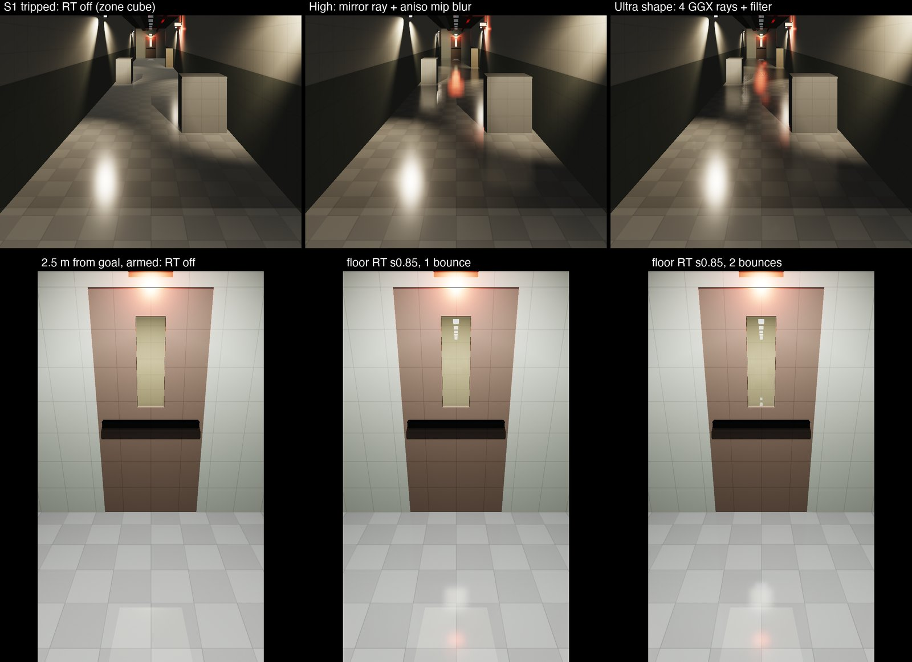

# 11 — Secondary reflections: G14 P1b design (glossy receivers, recursion, the Surface hook)

2026-10-03 · visual chat (游戏视觉) · workflow glass-rt-track, secondary-reflection investigation, design stage · **status: DESIGN** (no game code changed)

**The question.** Red showed a Control RTX on/off pair: a glass cabinet reflects the room, and a glossy parquet floor reflects the cabinet ("二次反射", secondary reflection). He says our window glass has none. He wants the cause found and fixed at the highest desktop spec.

**Red's decision (2026-10-03 14:1x).** The Run! corridor floor is **glossy vinyl tile** (waxed 12" VCT, smoothness ~0.75–0.85). It is the primary secondary-reflection receiver. Acceptance frames must show:
- the Run floor reflecting the red EXIT signs and the emergency heads;
- a glass door or window in that floor, together with that glass's own reflection (two bounces).

The Surface-shader hook must cover that floor, including the RoomStream materials.

**Inputs, read in full:**
- `01_code_review.md`, `02_runtime_probe.md`, `03_research.md`, `10_rt_glass_design.md`, `11a_glossy_surfaces.md`, `11b_multibounce_research_bench.md`.
- `../../room_visuals/10_run_directions.md`.
- Red's working copy, read only, at 17:1x: `FrontRoomsSurface.shader`, `FrontRoomsSurfaces.cs`, `FrontRoomsRoomStream.cs` (rooms, Run props, doors, recycle, rebase), `FrontRooms3DGame.cs` (camera, embedded map), `FrontRoomsMapWorld.cs` (`Awake`, `CreateEmbedded`), `FrontRoomsPostStack.cs`, `FrontRoomsLook.cs`, `FrontRooms_URP_Renderer.asset`, `QualitySettings.asset`, `Run_Floor.mat`, `FrontRoomsRenderSetup.cs` `SurfaceDefs`, `NativePlugin/FrontRoomsMetalGlassRT.mm`.
- The glass track's `proj_glass` `FrontRoomsGlass.shader` (the `[G14-HOOK]` blocks).
- The G14 implement stage's `proj_rt` `NativePlugin/FRGlassRTShared.h` and the kernel function list (snapshot 17:14, read only; that stage is still writing).
- URP 17.3 source in `proj_rt/Library/PackageCache`.

**What was written:**
- this report;
- `11_bench/` (bench 4 source `rt_bench4.mm.txt`, timing, quality, diff and image logs, `timing_summary.txt`);
- `images/11_run_floor_sheet.jpg`, `images/11_run_floor_detail.jpg`.

Nothing else under `Frontrooms3D/` was touched. No Unity was started. The bench ran standalone in `scratchpad/rt_bench2/b4/`.

**Tags.**
- **MEASURED** = timed or computed on Red's M3 Max for this report (bench 4), or quoted from 11b with its run.
- **ESTIMATE** = arithmetic or judgement.
- **UNVERIFIED** = not confirmed.

**Machine load.** The Mac was heavily loaded by other tracks (Blender, Unity batch jobs): CPU 1-minute load **407–510** during every bench run. Every timing line in the logs carries its load. Timing tables give the median of 8 per-pass medians (4 processes × 2 passes, each pass the median of 11 dispatches), with the minimum where the spread matters. The bench-3 cross-check configs reproduced 11b's numbers at their minimum: `O_G1` 0.86 ms vs 11b 0.87 ms at 1080p; `O_QF1m` 3.45 vs 3.50 ms.

---

## 0. For Red

**Why our glass shows no secondary reflection today.** There are three layers, stacked, plus two content facts.
1. **Nothing is ray traced in the game.**
   - The RT controller is only created for a standalone map: `FrontRoomsMapWorld.cs:487-488`. The main game builds the map embedded, with `standalone = false` (`FrontRoomsMapWorld.cs:506`, called from `FrontRooms3DGame.cs:578`).
   - Even where the controller exists, the pass waits for a texture that only the pass creates, so it never runs (`FrontRoomsMetalGlassRT.cs:53`, R1).
   - Forcing it on crashes Unity: the compute pipeline is nil (R2; 02 run 2).
2. **ChatGPT's kernel is single-bounce and glass-only** (`NativePlugin/FrontRoomsMetalGlassRT.mm`):
   - any pixel whose first hit is not glass returns early (`:279`);
   - glass gets exactly one reflection ray (`:285-296`);
   - the hit is shaded flat with a fake sun and never reflects again (`:230-243`);
   - a miss shows a blue sky (`:223-228`).
3. **Our own G14 design is also one bounce, and glass-only** (`10` §1.3, §1.5).
   - Receivers are `Glass_Window` only.
   - A pane seen in a pane shows the static zone cube.
   - A floor, a CRT or chrome never gets its own reflection.
4. **Content.** Level 0 and the Office have carpet floors (smoothness 0.08). Carpet does not reflect, in life or in Control. The only hard floor in the game is the Run corridor.
5. **Raster.** Nothing in the raster reflects the room either: there are no probes and no SSR, and `FrontRoomsLook.SetZoneReflection` is still a stub (`FrontRoomsLook.cs:28-36`).

**What Control does.** Every glossy surface traces its own reflection, one bounce. That is why the floor shows the cabinet. Recursion (glass inside glass) is a smaller extra (11b).

**What we will add (P1b, after G14 P0/P1):**
- **Any glossy surface becomes a mirror receiver**, not just windows. The main one is the waxed Run floor, at your 0.75–0.85 (I propose a mean of 0.80). Also CRT screens, chrome, glazed ceramics, the door's brushed steel and brass. On Ultra, add cherry and ebony.
- **Reflections inside reflections.** Glass seen in the floor shows its own reflection and the room behind it. A window seen in a window reflects too. That is 2 bounces on High and 3 on Ultra.
- **Blur that matches the surface.**
  - Waxed tile gives the soft vertical streaks you see on real hospital floors.
  - Glass and chrome stay sharp.
  - There is no TAA and no smearing, and a still camera never shimmers.
- **A hook in our wall/floor shader**, like the glass one:
  - with RT off it is bit-for-bit today's image;
  - WebGL never contains it.

**What it costs** (M3 Max, 1440p, MEASURED in a standalone bench under heavy load; in-engine numbers come later):
- **Run corridor, floor reflections:**
  - High 1.3–1.7 ms;
  - Ultra 3.0–3.7 ms;
  - plus about 0.5 ms shared with the glass trace.
- **Wide title-stream Run room** (floor is 37 % of the screen): about 2.4 ms.
- **A Level 0 or Office view with one window** (ESTIMATE):
  - High about 3.3–3.6 ms;
  - Ultra about 4.4–5.1 ms;
  - two windows facing each other add up to +2.8 ms while they fill a quarter of the screen.
- **Memory:** about 195 MB more at 1440p.
- **Time:** about 9–12 working days after G14 P1.

**What you will see:**
- **Run corridor (the big change).** The floor turns into a dark, waxed mirror. The red EXIT signs, the emergency heads, props and the lit door glass show as long soft streaks running toward you. In the bench, a third of the floor changes visibly (mean 9/255, up to 169/255). The wide title-stream Run room changes even more: 58 % of the floor visibly.
- **The goal door's glass in the floor.** You see the glass and, inside it, its own reflection of the lamps.
  - This part is physically small: at most 19/255, on a few hundred pixels, at s 0.85 within 2.5 m.
  - The glass itself showing the waxed floor's lamp streak is much stronger: up to 83/255.
- **Windows facing windows.** A "mirror tunnel" of lamp reflections, up to 61–74/255.

**Where you will NOT see it (this is physically correct):**
- Carpet (all of Level 0 and the Office), wallpaper, drywall and ceiling tile.
- Matte wood and plastic, door veneer and painted steel. These keep today's soft cube light.
- A third bounce is invisible (≤ 6/255) and is cut off automatically.

**What I need from you:**
- Default quality: I recommend **Ultra**.
- Confirm the Run floor at mean 0.80.
- Confirm Direction B for the acceptance frames: the emergency heads are B's.
- A look at Ultra's fixed floor grain vs High's smooth blur, on one frame pair.

---

## 1. Why the bench changed the plan (bench 4, MEASURED)

11b measured an office with a glossy floor. This stage built **the Run corridor itself** (`11_bench/rt_bench4.mm.txt`; §5 has the method):
- the 1 × 9-cell alarm corridor of `room_visuals/10_run_directions.md`: 2.84 m clear, 27 m long;
- Direction B, tripped:
  - 4 twin-head battery units = 8 warm spots with emissive lamp faces;
  - a flag EXIT sign and the wall EXIT sign over the goal door;
- the RN-X goal door with its 0.25 × 0.75 m glass vision lite, and a lit Level 0 stub beyond it;
- the armed state as well, with lit wraps;
- the title stream's current Run room (11.5 × 12 m, two hanging EXIT signs, 70 % dead lamps, a chrome gurney);
- 3,000 far-away office instances, so the acceleration structure is as large as the real map's.

| Finding | Number (1080p, 8-bit after the tonemap) | Consequence for the design |
|---|---|---|
| **Receivers beyond glass are the visible change** | Run floor as a receiver vs the zone cube: tripped S1 mean **9.3/255**, p99 63, max 169, **33 %** of floor px ≥ 8/255. Near the goal: 8.1/255, 37 %. Title-stream Run room: **13.7/255**, p99 117, **58 %**. Armed S1: 3.0/255, 9 % | The Run floor must be a receiver on every RT tier |
| **Two bounces: floor → lite → lamp** | At s 0.85, 2.5 m from the door, armed: max **19/255**, 484 px ≥ 8. At s 0.80, near goal: max 9/255, 36 px. Tripped: ≤ 5/255 | Real but small. The acceptance frame must be staged to show it (§2.10 R2) |
| **Two bounces: lite → glossy floor → lamp** | The lite (a glass receiver) showing the waxed floor's lamp streak: max **83/255**, 110 px ≥ 24 | Glass must recurse into glossy hits |
| **Third bounce** | With the 0.004 cut-off: ≤ 6/255, 0 px ≥ 8 | Ultra's depth 3 is free with the cut-off. It stays for facing windows (11b: ≤ 12–18/255 without the cut-off) |
| **Cost of recursion** | Depth 1 → 2 → 3 in the corridor: no measurable change (1440p min 1.26 / 1.27 / 1.27 ms, median 1.30 / 1.30 / 1.31) | Only 1–2 % of floor px recurse: they hit the lite or chrome |
| **Rough-floor filter** | Mirror ray + **hardware-anisotropic mip blur** (k 2): no shimmer. Error vs a 128-ray reference: armed mean 1.24/255 (p99 12), tripped 3.04 (p99 64). That equals or beats 2 GGX rays + filter (1.14–3.47 mean, 0.9–5.4 % of px shimmering ≥ 8/255) at about half the cost | High uses it. It replaces 11b's untested "anisotropic blur" |
| **Oriented à-trous** (the straightforward anisotropic à-trous) | Visible striping at large strides (`images/11_run_floor_sheet.jpg` tile 4) | Rejected |
| **4 GGX rays + anisotropic mip filter** | Best error (armed 0.76/255, p99 7; tripped 2.53, p99 47). Shimmers on 0.3–2.9 % of px ≥ 8/255 if re-randomised every frame | Ultra, with world-anchored fixed jitter (no re-randomising) and a ray budget |
| **Checkerboard** (half the floor rays + fill) | Same image (error within 0.01/255). **No saving**: 1.62 vs 1.30 ms. The fill and filter cost more than the mirror rays saved | Not used on M3/M4. Kept as an option for the M1/M2 tier (P2) |
| **Floor share** | Run corridor S1 12 %, near goal 15 %, pitched 10° 17.6 %, 2.5 m from goal 19 %, title-stream Run room 37 % | Narrow corridors are cheap. The wide stream room is the floor-heavy case |

---

## 2. G14 P1b design (on top of `10_rt_glass_design.md`)

### 2.1 Scope and principles

- **One trace, two kinds of receivers** (Control's split, [G7] in 11b):
  - **glass**, the front layer only, written to `_FR_GlassRTReflection` (unchanged contract);
  - **opaque glossy surfaces**, the front-most opaque only, written to a new `_FR_SurfaceRTReflection`.

  An opaque receiver seen through glass also traces (Control traces every non-sky opaque pixel). Glass keeps G14's front-layer rule.
- **Desktop Mac M3/M4 only (Apple9).** P1b adds nothing to Windows (P3 ports it) and nothing to WebGL: no code, no variants, no output change.
- **Physically gated.** A surface reflects only if its real smoothness says so (11a classes). Carpet never does.
- **Deterministic first.** No TAA, no history, no per-frame noise. A still camera gives a still image.

### 2.2 Receivers per tier

**Effective smoothness** = the material's `mask.r × _Smoothness`, MEASURED per material in 11a (p10/p50/p90 over the mask's pixels). It is baked into a table, not read at runtime (§2.6).
- A **renderer is a receiver** if its material's **p90** effective smoothness reaches the tier threshold.
- **Every pixel** of a receiver then traces, with the blur set by that pixel's own roughness (§2.3).
- A hard per-pixel cut-off is avoided because it would make blotches on the VCT (p10–p90 0.70–0.89 at mean 0.80). The hook fades RT to the cube only above perceptual roughness 0.40–0.55 (`_FR_SurfaceRTFade`).

| Tier | Threshold (p90 s) | Opaque receivers (s p50 [p90]; m = metal) | Glass receivers (FrontRooms/Glass `_RTReceive = 1`) |
|---|---|---|---|
| **High** | s ≥ 0.75, or metal with s ≥ 0.60 | **`Run_Floor` 0.80 [0.89]** after Red's change (§3.3); `Prop_ScreenCRT` 0.86 face (CRTs); `Prop_GlassCRT` 0.84 (phone display; the interior window moves to glass, M3); `Prop_Chrome` 0.85 m (task-chair bases, bar stools, ply cabinet); `Prop_CeramicGlaze` 0.85; `Prop_Ceramic` 0.80; `Prop_VendingFront` 0.76 [0.82]; **`Run / chrome` 0.78 m** (gurney frame, rails, IV pole, sign rods; converted to Surface, §2.5.4); **`Door / brushed steel` 0.62 m** (title-door handles and kick plates; converted); `Prop_Brass` 0.60 m (pulls on 11 kits) | `Glass_Window` (panes, after C8); **`Glass_Wired`** (RN-X goal lite, Direction C lites; new, glass track); **`Glass_Cabinet`** (= `Prop_Glass` moved to FrontRooms/Glass: cabinet, hutch, vending and clock glass; M5) |
| **Ultra** | s ≥ 0.60, or metal with s ≥ 0.50 | everything in High, plus `Prop_WoodCherry` 0.71 [0.74]; `Prop_WoodEbony` 0.66 [0.69]; `Prop_WoodDark` 0.59 [0.61]; `Prop_Aluminium` 0.56 m [0.59] (filing-cabinet trim) | same |
| **Never** (all tiers) | — | `Run_Wall` 0.58 [0.59] (semi-gloss paint: broad sheen, keeps the cube); every carpet (0.075–0.08; damp ≤ 0.54 on < 1 % of the Shift floor); wallpapers 0.21; `Office_Wall` 0.31; ceilings 0.10–0.11; `Cove_Base` 0.38; `Door_Veneer` 0.47; painted steel 0.43; plastics ≤ 0.52; `Painted_Metal` 0.52; oak, teak, walnut ≤ 0.56; fabrics, board, paper. **Emissive lenses and signs** (`Troffer_Lens`, `Run_ExitSign`) are excluded by their EmissiveLens flag, whatever their smoothness (M2) | `Map test / glass` (URP/Lit; replaced by `Glass_Window`); `Prop_BottleBlue` (URP/Lit transparent, tiny); `Glass_Edge`, `Glass_Shard` (URP/Lit, hit-only) |

**Prerequisites** (otherwise RT would show wrong mirrors; 11a §6):
- **M1.** The Run gurney wheels and the exit-sign housings stop using `Office_BlackedGlass` (0.95). Wheels go to `Prop_Rubber`, housings to `Prop_PlasticBlack`. These are visual-chat edits in `RoomStream.EnsurePropMaterials` / `BuildProfileProps`. The redesign's kit replaces them anyway.
- **M2.** `Troffer_Lens` and `Run_ExitSign` get `_Smoothness` 0.85 (clear prismatic acrylic). As hits they never recurse.
- **M3.** The `Kit_InteriorWindow` pane moves to `Glass_Window`.
- **M5.** `Prop_Glass` moves to FrontRooms/Glass as `Glass_Cabinet` (glass track).

### 2.3 Rays per receiver pixel, and filtering (no TAA)

Perceptual roughness r = 1 − s comes from the receiver prepass, per pixel (normal map and damp flattening included).

| Pixel roughness | High | Ultra |
|---|---|---|
| r ≤ 0.10 (glass, black glass, CRT face, glaze) | 1 mirror ray, no blur. Glass keeps G14's smudge blur and back-surface image (`10` §1.6) | same |
| 0.10 < r ≤ 0.45, **planar horizontal** receiver (floors: SurfacePlanar and normal.y > 0.9) | 1 mirror ray + **anisotropic mip blur** with k = 2 (below) | **GGX VNDF rays** (Heitz 2018), **2–4 per pixel within a ray budget of 0.40 × the screen's pixels** (BFV Ultra's 40 % [G3 in 11b]): spp = min(4, ⌊0.40 / floor share⌋). If spp < 2, use the High path. Fixed world-anchored jitter, then the anisotropic mip blur with k = 1 |
| 0.10 < r ≤ 0.45, other receivers (props: chrome, brass, wood, vending) | 1 mirror ray + **plane-aware 2-pass à-trous** (bench 3's filter: 5×5 B3, plane-distance and normal weights, radius from the lobe footprint) | 2 GGX rays, world-anchored jitter (props are small: ≤ 0.1 ms per 1 % of the screen at 1440p, 11b) + the same à-trous |
| r > 0.45 inside a receiver | Faded to the cube in the hook (`_FR_SurfaceRTFade` (0.40, 0.55)). No extra rays | same |

**Anisotropic mip blur** (MEASURED best deterministic filter, bench 4):
- **Prep.** The resolve writes the floor-class radiance premultiplied by a floor mask, (rgb·m, m), into a mipmapped RGBA16F texture. A blit generates box mips.
- **Shape.** Each floor pixel computes:
  - the lobe footprint `r_in = k · α · hit / ((view + hit) · pixelAngle)` px, with α = r² (11b's BFV-style rule);
  - the screen image of the plane of incidence, `e = normalize(proj(P + 0.05·N) − proj(P))`;
  - `r_out = r_in · cos θi`. In-plane microfacet tilt turns the reflected ray by 2δ, out-of-plane by 2δ·cos θi, which is why lamps streak toward the viewer.
- **Gather.** Three trilinear probes with `max_anisotropy(16)` and explicit gradients (`gx = e·r_in`, `gy = e⊥·2·r_out`), at 0 and ±r_in/2 along `e`, weights ½ / ¼ / ¼. The result is divided by the mask, so walls and props never bleed in.
- **Cost.** 0.32–0.34 ms (1080p) and 0.58–0.64 ms (1440p) over the full screen. A dispatch rectangle cuts this further.
- **Calibration.** MEASURED in the corridor: k = 2 has the lowest mean 8-bit error at r 0.15 and 0.20 (1.91 and 3.04/255); at r 0.25, k = 1 is lower (4.04 vs 4.67). The linear relRMSE prefers k = 2–3, and k = 3 in the wide room (0.61 vs 1.00). P1b tunes k on frames R1/R5 in the range 1.5–3.

**World-anchored jitter** (Ultra; Control §46.6.1 via 11b):
- The (u1, u2) of sample i come from a hash of the receiver point quantised to 1 cm (`floor(positionWS × 100)`) and i. Never from the frame index.
- A still camera is then perfectly still. A moving camera shows fine grain that sticks to the floor, not crawling noise.
- The bench re-randomised per seed, so its shimmer numbers (0.3–2.9 % of px ≥ 8/255) are the upper bound for a moving camera (UNVERIFIED in engine; acceptance R1-U).

### 2.4 Recursion, Fresnel throughput, cut-off, misses

**Explicit stack** (the bench-3/4 shape): ≤ 8 entries per pixel; a ray budget of ≤ 8 (High) or ≤ 16 (Ultra) per pixel. Apple advises a small payload [A7], so P1b profiles the stack first.

**Path weight** w = receiver Fresnel × the product of each hit's Fresnel or transmission:
- the receiver Fresnel is the hook's own `EnvironmentBRDFSpecular`: dielectric F0 0.04, metals F0 = albedo, glass `_PaneF0` 0.08;
- a ray is spawned only if `importance · w > 0.004` (11b: this removes 99.7 % of third-bounce rays at no image cost).

| Tier | Max reflection depth | Glass layers seen through | Cut-off |
|---|---|---|---|
| High | **2** | 1 | 0.004 |
| Ultra | **3** | 2 | 0.004 |

Depth counts reflections: 1 = the receiver's own reflection ray (G14 today).

| What the ray hits | Shading at the hit (`10` §1.5 hit shader, unchanged) + continuation |
|---|---|
| **Glass** (Glass flag), **entering** face | **See-through**: continue straight on, × (1 − F)·0.9. This is a layer, not a bounce; after the layer limit, × the zone cube. **Reflect**: if depth < max and the cut-off allows, a mirror ray (glass ignores roughness, as in Control, Capcom and SEED), × F (pane two-surface Fresnel); otherwise F × the zone cube |
| Glass, **exiting** face (the back of the same 6 mm pane) | Pass through, no Fresnel, no layer count (11b §5.4). The pane's F0 0.08 already covers both surfaces. Without this rule the cube replaces the room behind every pane |
| **Mirror-like metal** (metallic ≥ 0.5 and s ≥ 0.75: `Prop_Chrome`, `Run / chrome`) | Direct lighting (metal: specular only, F0 = albedo) + a reflection ray × F(albedo), gated as below |
| **Glossy dielectric** (s ≥ 0.75: CRT, black glass, ceramic glaze, vending front, `Run_Floor` seen in glass) | Lit + (1 − F)·diffuse, and a reflection ray × F, gated as below. **Soft gate:** the traced share is g = 1 − smoothstep(0.10, 0.25, r_hit) (s 0.90 → 1, s 0.75 → 0). The rest uses the zone cube at the hit's roughness mip, so there is no hard edge in a reflection-of-a-reflection. At a hit the ray is a single mirror ray (no blur); its weight is small |
| **Rough** hit (s < 0.75), **EmissiveLens**, Shard | Hit shader only, plus F × the zone cube at the hit's roughness mip (G14 today) |
| **Miss** (nothing loaded within the far plane) | Zone cube (G6) in the ray direction × the zone's linear intensity |
| **Depth limit or cut-off reached** | Zone cube at the hit's roughness mip, × the remaining weight |

**Zone cube for Run.** G6 builds cubes for Level 0, Office, Tall, DeadLamp and the title-stream rooms. Run needs `ReflectionZone.Run` (armed capture; glass track, §3.1). In the closed corridor it is seen only through cut-offs and depth limits (≤ 0.4 % weight), so a Level 0 cube is an acceptable interim.

### 2.5 The Surface-shader hook (FrontRooms/Surface; lookdev owner = visual chat, shared with the wallpaper track)

#### 2.5.1 Contract (mirrors the glass hook, `[RT-HOOK-BEGIN]`/`[RT-HOOK-END]` markers)

| Item | Value |
|---|---|
| `_FR_SurfaceRTReflection` | Global Texture2D, per RT camera, RGBA16F, 1× the scaled target. RGB = reflected linear HDR radiance, filtered, **no Fresnel or strength**, fog remainder applied (as glass, `10` §1.5 fog row). **A = 0** (not traced) or **1 + linear eye depth (m)** of the receiver surface (a depth tag) |
| `_FR_SurfaceRTWeight` | Global float. 1 while this camera traced this frame and quality ≠ Off; 0 otherwise, and reset after transparents |
| `_FR_SurfaceRTFade` | Global float2, perceptual-roughness fade RT → cube, (0.40, 0.55) |
| `_FR_SURFACE_RT` | Global keyword, `multi_compile_fragment` in ForwardLit only. Enabled only between the trace and the End pass for the RT camera |
| Material properties | **None added.** All 86 Surface materials stay byte-identical (receiver selection is a table, §2.6) |

#### 2.5.2 ForwardLit change (exact)

After `half4 color = UniversalFragmentPBR(inputData, s);` and before `MixFog`:

```hlsl
// [RT-HOOK-BEGIN] G14 P1b: traced specular for glossy receivers. Keyword off = the code without the hook.
#if defined(_FR_SURFACE_RT)
    [branch] if (_FR_SurfaceRTWeight > 0.0)
    {
        half4 rt = (half4)LOAD_TEXTURE2D(_FR_SurfaceRTReflection, uint2(input.positionCS.xy));
        if (rt.a > 1.0h)
        {
            float myDepth = -TransformWorldToView(input.positionWS).z;
            if (abs((float)rt.a - 1.0 - myDepth) <= 0.02 + 0.01 * myDepth)   // this texel was traced for this surface
            {
                BRDFData b; half aRT = 1.0h;
                InitializeBRDFData(s.albedo, s.metallic, s.specular, s.smoothness, aRT, b);
                half3 rv = reflect(-inputData.viewDirectionWS, inputData.normalWS);
                half  ft = Pow4(1.0h - saturate(dot(inputData.normalWS, inputData.viewDirectionWS)));
                half3 env = GlossyEnvironmentReflection(rv, inputData.positionWS, b.perceptualRoughness, 1.0h, inputData.normalizedScreenSpaceUV);
                AmbientOcclusionFactor ao = CreateAmbientOcclusionFactor(inputData.normalizedScreenSpaceUV, s.occlusion);
                half w = (half)_FR_SurfaceRTWeight * (1.0h - smoothstep((half)_FR_SurfaceRTFade.x, (half)_FR_SurfaceRTFade.y, b.perceptualRoughness));
                // URP's GI added spec * ao.indirect * env; swap that share for the traced radiance. Traced rays resolve
                // occlusion themselves, so RT keeps only the material cavity, not SSAO.
                color.rgb += EnvironmentBRDFSpecular(b, ft) * w * (s.occlusion * rt.rgb - ao.indirectAmbientOcclusion * env);
            }
        }
    }
#endif
// [RT-HOOK-END]
```

Declarations, inside the same `#if`: `TEXTURE2D(_FR_SurfaceRTReflection); float _FR_SurfaceRTWeight; float2 _FR_SurfaceRTFade;`.

- **The math matches URP 17.3 exactly.** `GlobalIllumination` adds `EnvironmentBRDF(…, indirectSpecular, fresnelTerm) × occlusion`, with occlusion = `aoFactor.indirectAmbientOcclusion` = min(SSAO, surface occlusion) (`GlobalIllumination.hlsl:508-519`, `Lighting.hlsl:315-316`, `AmbientOcclusion.hlsl:59`).
- **It works whatever the raster's environment is:** Unity's default cube today, G6's zone cube, or N2's box-projected Run probe. The hook subtracts what `GlossyEnvironmentReflection` returns at this pixel.

#### 2.5.3 New pass `FRReflPrepass`

```
Pass { Name "FRReflPrepass"  Tags { "LightMode" = "FRReflPrepass" }  ZWrite On  ZTest LEqual  Cull [_Cull] }
```

- **Inputs.** The same `Vert` and the same evaluation as `Frag`, up to `inputData.normalWS` and `smoothness`: planar or mesh-UV frame, normal map, damp flattening, `mask.r × _Smoothness`.
- **Depth test.** It clips if the pixel is behind `_CameraDepthTexture` (tolerance 0.02 + 0.01·d), so a receiver hidden by a non-receiver never traces.
- **Outputs:**
  - SV_Target0 = linear eye depth (R32F);
  - SV_Target1 = (final world normal, perceptual roughness) (RGBA16F);
  - SV_Target2 = (F0 luminance, metallic, receiver class [1 floor-planar, 2 other], 0) (RGBA8).
- **Shared code.** To guarantee ForwardLit is unchanged, the evaluation is first **duplicated** into `FrontRoomsSurfaceRTPrepass.hlsl`, and test P1b-B3 checks the two against each other. Merging into one shared function happens only if the bit-identical test (P1b-B1) still passes after the refactor.
- **Not a raster change.** The pass is drawn only by the RT feature's RendererList (ShaderTagId "FRReflPrepass", rendering-layer bit 29 = opaque receiver, set at runtime on registered receivers, like G14's bit 30 for glass). URP never draws it otherwise.

#### 2.5.4 URP/Lit glossy metals become Surface materials

`Run / chrome` and `Door / brushed steel` are created by `FrontRoomsSurfaces.Lit` (`RoomStream.cs` `EnsurePropMaterials`). URP's Lit shader cannot take the hook. P1b adds:
- `FrontRoomsSurfaces.Metal(name, colour, smoothness, metallic)`: a FrontRooms/Surface material with white maps and `_MacroTone`/`_MacroDirt`/stains/grime at 0;
- the same two materials moved to it.

**Gate:** a raster frame with RT off must match the URP/Lit version within mean ≤ 0.5/255 and max ≤ 2/255 on those renderers (P1b-B2). If it does not, they stay URP/Lit and are hit-only (High then loses the Run chrome and door hardware as receivers).

#### 2.5.5 Platform isolation

- **WebGL.** `FrontRoomsGlassRTWebGLStripper` (RT-owned, `10` G-4) also strips every `_FR_SURFACE_RT` variant and the `FRReflPrepass` pass from FrontRooms/Surface. The WebGL variant count and output stay unchanged (Red's rule: WebGL changes are WebGL-only, and this is none).
- **Windows.** Windows player builds strip them too until P3. Output is unchanged; this only saves variants.
- **macOS.** ForwardLit's fragment variants double, because the keyword is `multi_compile_fragment`. This is a compile-time cost only.

### 2.6 Prepass, trace and dispatch changes (frame order)

**The move.** G14 traced at `BeforeRenderingTransparents` (`10` §1.2). P1b moves **both prepasses and the one native trace event to `AfterRenderingPrePasses`, before opaques**, because the Surface shader must read `_FR_SurfaceRTReflection` while it draws.

| # | Step | Event | What happens |
|---|---|---|---|
| 1 | URP DepthNormals prepass | prepass | Already runs every frame: SSAO is active with Source = DepthNormals (`FrontRooms_URP_Renderer.asset:69-76`), and every quality level uses the same URP asset. If SSAO is ever disabled, the feature declares `ScriptableRenderPassInput.Normal`, which forces the prepass (`UniversalRendererRenderGraph.cs:1609-1611`) |
| 2 | **FRRT Prepass** (raster) | `AfterRenderingPrePasses` | (a) Glass receivers: `FRGlassRTPrepass` (G-1), unchanged; (b) opaque receivers: `FRReflPrepass` (bit 29). Each has its own transient D32 and a manual test against `_CameraDepthTexture` |
| 3 | **FRRT Trace** (unsafe → `IssuePluginEventAndData`) | same | One native event: AS update, then trace kernels for glass pixels and opaque-receiver pixels (one dispatch over the union rectangle, class from the prepass), resolve, filters (§2.3). Then it sets `_FR_GlassRTReflection` / `_FR_SurfaceRTReflection`, the two weights, `_FR_GLASS_RT` and `_FR_SURFACE_RT` |
| 4 | Opaques | — | FrontRooms/Surface reads `_FR_SurfaceRTReflection` |
| 5 | Transparents | — | FrontRooms/Glass reads `_FR_GlassRTReflection` (unchanged) |
| 6 | FRRT End | `AfterRenderingTransparents` | Both keywords off, both weights 0 |

- **Side benefit.** Nothing is inserted between opaques and transparents any more, so `10` O1 (the MSAA store/reload split, 0.3–0.8 ms ESTIMATE) and fallback F1 disappear. The new boundary sits after the prepass, which is already a separate pass (UNVERIFIED cost; P1b-B10 measures it).
- **Dispatch.** CPU-projected bounds of visible receivers of both kinds give one rectangle. P2 moves to indirect 8×8 tiles. With no visible receiver, nothing is enqueued, both weights stay 0, and both keywords stay off (the Level 0 title corridor and carpet halls).

### 2.7 Scene registration: RoomStream, the Run module, the receiver table

- **Receiver table** (`Resources/Rendering/RT/FrontRoomsRTReceivers.asset`, RT-owned ScriptableObject).
  - An editor bake (`FrontRoomsRTReceiverBake`, reusing 11a's `matscan.py` method in C#) writes the effective smoothness p50/p90 and metallic of every `Resources/Surfaces/*.mat`.
  - Runtime `FrontRoomsSurfaces.Lit/Metal` materials are read directly (`_Smoothness`, `_Metallic`).
  - Registration looks a material up and sets the receiver flag (`FR_FLAG_RECEIVER`, already bit 11 in proj_rt's `FRGlassRTShared.h`) and rendering-layer bit 29.
  - Changing the quality tier re-evaluates flags in one frame.
- **RoomStream** (visual-chat code; not a map contract). The stream's rooms are not MapWorld chunks, so P0's chunk diff never sees them. Add to `FrontRoomsRoomStream`:
  - `public static event Action<FrontRoomsRoomStream> Created, Destroyed;`
  - `public event Action<int, Transform> RoomChanged;`: pool index and room root. Raised at the end of `BuildRoom`, of the recycle step (after `RefreshRoomMaterials` / `ApplyDoorPose`, `RoomStream.cs` ~:898-917), of `BeginPlayableSequence` re-dressing, and of `EndStreamAt`.
  - `public event Action<int> RoomReleasing;` (`DisposeOneRoom`, destroy).
  - `public event Action<float> Rebased;`: the z shift, from `RebaseIfNeeded` (:937-960). It rewrites static matrices, as the map's 192 m rebase does (`10` §1.4).

  Door leaves (`double door left/right` pivots) register as Dynamic. Lens renderers register as EmissiveLens, with their MPB `_EmissionColor` read `.linear` per frame, exactly like the map's lenses (`ApplyFixtureVisual`, :1725-1736). The stream's `Light`s (troffers, the red Run sign points) are found by P1's enabled-Light collection.
- **The map's Run module** (CR-1 to CR-6 of `room_visuals/10`). With CR-3 its shell uses `FrontRoomsSurfaces.Room(RoomRule.Run, …)`, so `Run_Floor` arrives through the same chunk registration as every chunk. **No new map API.**
- **Where Run rooms exist today.**
  - The title stream is lobby-only: `BeginPlayableSequence` has no caller, so the Run profile is not in play (`room_visuals/10` §9.5).
  - The map has no Run module yet.
  - Acceptance therefore uses a harness-built Run corridor and a harness-driven RoomStream Run room in `proj_rt` (§2.10). Both use the real materials.
- **Camera.** The title stream and the game use the same first-person camera (`FrontRooms3DGame.CreateCamera` → `FrontRoomsPostStack.ConfigureCamera` → `OptIn`). No change to `10` §1.8 except that "the title corridor has no receivers" now holds only for the Lobby/Shift/Exit (carpet) profiles.

### 2.8 Budgets per tier

**Time, GPU, 1440p.** MEASURED rows come from bench 4: median of 8 pass-medians, load 407–467. ESTIMATE rows use 11b's per-1 % costs.

| View | High | Ultra | Source |
|---|---|---|---|
| Run corridor S1, floor 12 % (trace + filter) | **1.30** (min 1.27) | 3 GGX rays by budget: **~3.4** (between 2 rays 2.58 and 4 rays 4.33) | MEASURED / ESTIMATE |
| Run corridor pitched 10°, floor 17.6 % | **1.71** | 2 rays: **3.2–3.7** (3.67 measured with the iso filter; ~0.3 less with the mip filter) | MEASURED |
| Run near goal / 2.5 m from goal, floor 15–19 %, depth 2 | **1.40 / 1.68** | ~3.0–3.6 (2 rays) | MEASURED / ESTIMATE |
| Title-stream Run room, floor 37 % | **2.36** | budget gives 1 ray, so the High path: **2.36** | MEASURED |
| + TLAS (2,048 / 4,096), prepasses, barriers | 0.35–0.55 | 0.65–0.85 | `10` §3.1 + ESTIMATE |
| **Run corridor total** | **1.7–2.3 ms** | **3.7–4.6 ms** | |
| Level 0 / Office, one window 25 % + glossy props ~9 % (11b §5.1) | 1.5 glass + 0.3 sharp props + 0.85 (mirror + filters) + 0.15–0.4 (2nd bounce) + 0.5 = **3.3–3.6 ms** | + GGX props (~1.2) + AA (0.15–0.6), depth 3 ≈ 0 with the cut-off: **4.4–5.1 ms** | ESTIMATE |
| Two windows facing, window 25 % | +2.8 ms over 1 bounce (GF2 − GF1) | +2.8 (GF3c = GF2) | MEASURED 11b |
| Break shot, 1080p High (pane fills the screen) | ~3.1–3.6 ms (11b §4.1). P1b adds recursion only where the pane sees a glossy surface, which is rare in carpet rooms | — | ESTIMATE |

All rows are standalone Metal under a load of 400–510, so treat them as ±30 % (ratios hold). The authoritative numbers are P1b-B10 in a player build on an idle machine.

**Memory** (persistent per RT camera, on top of G14's 103 MB at 1440p; ESTIMATE, P1b logs the real figures):

| Target | Format | 1440p |
|---|---|---|
| OpDepth | R32F | 14.7 MB |
| OpNormal (normal + roughness) | RGBA16F | 29.5 MB |
| OpMaterial (F0, metallic, class) | RGBA8 | 14.7 MB |
| Raw radiance + hit distance | RGBA16F + R16F | 36.9 MB |
| Floor mip chain (×4/3) | RGBA16F | 39.3 MB |
| À-trous ping-pong | RGBA16F | 29.5 MB |
| `_FR_SurfaceRTReflection` | RGBA16F | 29.5 MB |
| **Total** (+ 14.7 MB transient D32) | | **≈ 195 MB** (1080p ≈ 109 MB, 4K ≈ 437 MB) |

- **TLAS.** RoomStream adds ≤ ~1,000 instances (5 rooms) during the title. They and the map coexist only during the handoff. This is within the 2,048 / 4,096 caps by priority.
- **BLAS.** The stream's meshes are Unity's cube and cylinder: negligible.
- **P2 packing** (octahedral normals in RG16, half-resolution mips, reusing G14's raw texture) targets ≤ 120 MB.

### 2.9 Parity tests (P1b-B)

| # | Test | Pass |
|---|---|---|
| B1 | **Hook off is bit-identical.** FrontRooms/Surface with the hook vs the original, keyword off, the glass track's 175-frame set plus 25 Run frames | 0 differing bits (as glass G10: 175/175) |
| B2 | Lit → Surface metal conversion, RT off | mean ≤ 0.5/255, max ≤ 2/255 on the converted renderers; otherwise revert (§2.5.4) |
| B3 | `FRReflPrepass` vs ForwardLit's internal normal and smoothness (debug output) | ≤ 1e-3 per component on ≥ 99.9 % of receiver px |
| B4 | **Weighting identity:** the trace writes `GlossyEnvironmentReflection`-equivalent radiance (zone cube at the same mip) instead of tracing | RT-on frame = RT-off frame within 1/255 on receivers. Proves the swap and SSAO handling |
| B5 | Mirror reference: a test material s 1.0 on the Run floor vs G11's planar mirror camera | luminance ratio 0.9–1.1 in ≥ 95 % of 64-px blocks |
| B6 | Glossy reference: Run floor s 0.80, still camera; the 256-sample accumulation debug mode (FRFrame `jitter`/accumulation already exists in proj_rt) is the reference | High: mean ≤ 3.5/255 tripped, ≤ 1.5/255 armed (bench 3.04 / 1.24). Ultra ≤ 3.0 / 1.0 (bench 2.53 / 0.76). Still-camera frame-to-frame change **0 px** on both |
| B7 | Recursion ladder on staged facing windows (Level 0) | depth 2 vs 1: ≥ 50 % of glass px ≥ 2/255 (11b 73.5 %); depth 3 vs 2 with the cut-off: ≤ 1/255 on ≥ 99 % |
| B8 | Thin pane: the Run goal lite seen in the floor | hit-ID debug: see-through continuations reach the stub room. Cube on ≤ 0.5 % of see-through rays |
| B9 | Lamp sync: Direction B trip (heads on at t = 0.35 s), EXIT signs | the floor reflection changes on the same frame as the raster lamps (per-frame correlation ≥ 0.99 over 120 frames, as P1-B3) |
| B10 | Cost, macOS player, idle, 1080p and 1440p | Run R1 High ≤ 2.5 ms, Ultra ≤ 4.6 ms; R5 High ≤ 3.0 ms; Level 0 window view High ≤ 4.0, Ultra ≤ 5.5. Over budget: Ultra's ray budget drops from 0.40 to 0.25 of the screen |
| B11 | Isolation | WebGL player: 0 `_FR_SURFACE_RT` variants, 0 `FRReflPrepass` passes, WebGL variant count = baseline. Windows: `_FR_SurfaceRTWeight` never set |

### 2.10 Acceptance frames (JPG q85, ≤ 1600 px wide, `rt/images/P1b_*.jpg`; each Off / High / Ultra unless stated)

Run frames use the Direction B corridor of `room_visuals/10` §1.2/§3 (Red's recommended pick), with `Run_Floor` at mean 0.80 and the RN-X lite on `Glass_Wired`. They are built by the harness in `proj_rt`, plus a harness-driven RoomStream Run room. If Red picks A or C, R1 replaces the heads with A's hanging signs or C's strips.

| # | Frame | Pass (bench-4 values in brackets) |
|---|---|---|
| **R1** | Run S1, tripped t = +3 s: eye (0, 1.62, 1.5) → (0, 1.30, 27) | Floor vs Off: mean ≥ 6/255, ≥ 25 % of floor px ≥ 8/255 [9.3, 33 %]. The red EXIT streak and the −Z emergency heads' faces visible in the floor, elongated toward the camera. R1-U: a 2 s dolly at 1 m/s on Ultra; grain stays attached to the floor (no frame-to-frame noise on a still frame) |
| **R2** | Run 2.5 m from the goal, **armed**: eye (0, 1.62, 24.5) → (0, 0.60, 27); floor s 0.85 patch (or the whole floor if Red picks 0.85). Depth 1 / 2 / 3 | The lite and the wall EXIT sign visible in the floor. **Depth 2 vs 1 on floor px: max ≥ 12/255, ≥ 200 px ≥ 8/255** [19, 484]: the lite's own lamp reflection inside the floor's image. Depth 2 vs 1 on the lite: max ≥ 50/255 [83]: the floor's lamp streak inside the glass. Depth 3 vs 2: ≤ 6/255 |
| **R3** | Run near goal, tripped: eye (0, 1.62, 22) → (0, 0.90, 27) | Lite (warm next-zone light) and wall EXIT sign in the floor: ≥ 30 % of floor px ≥ 8/255 [37 %] |
| **R4** | Run S1 pitched 10° down (the floor-heavy cost frame) | B10 cost only |
| **R5** | Title-stream Run room (RoomStream `RoomRule.Run`, 11.5 m): eye (0, 1.62, 1.0) → (0, 1.30, 12) | Both hanging EXIT signs and the chrome gurney in the floor; ≥ 45 % of floor px ≥ 8/255 [58 %]. M1 fixed: wheels show no mirror |
| **M1** | Level 0 hall, carpet control, the window pose of `10` P0 (seed 4242) | **0 px ≥ 2/255 on carpet** Off vs High. No fake floor reflection |
| **M2** | Two panes facing across a Level 0 hall (staged). Depth 1 / 2 / 3 | Lamp "mirror tunnel": max ≥ 40/255 [61–74], ≥ 50 % of glass px ≥ 2/255 |
| **M3** | Office or pile `Kit_DisplayCabinet` (`Glass_Cabinet`) seen in a `Glass_Window`, with a CRT and a chrome chair base in the reflection | Depth 2 shows the cabinet glass's own reflection and the CRT's and chrome's reflections inside the window; depth 2 vs 1 ≥ 8/255 on those regions |
| **M4** | Office desk station in direct view: CRT face, chrome base (High), cherry hutch (Ultra) | Room reflected in the CRT (dark, sharp); hutch reflection soft on Ultra only |

### 2.11 Exact delta to `10_rt_glass_design.md`

| `10` § | Today | P1b change |
|---|---|---|
| §0 "What we will build" | glass only, one mirror ray | + glossy opaque receivers, 2/3-bounce recursion, roughness filtering |
| §1.2 frame order | prepass + trace at `BeforeRenderingTransparents`; O1 split risk; F1 fallback | Both prepasses + one trace at **`AfterRenderingPrePasses`** (§2.6). O1 and F1 retired. End disables both keywords |
| §1.3 which pixels trace | receivers = `_RTReceive` glass, front layer | + opaque receivers by the table (§2.2), bit 29, `FRReflPrepass`; dispatch rectangle = union; opaque receivers behind glass trace too |
| §1.4 scene | MapWorld diff (P0), map events (P2) | + RoomStream events (§2.7); `FR_FLAG_RECEIVER` used for opaque receivers; material record + receiver class and table p50/p90 (`FRMaterial.p2.w` or a new `p3`) |
| §1.5 hit shading, "Another pane" row | see-through + F × zone cube; one bounce | see-through + **F × traced reflection** (depth-limited); new rows for metal, glossy and rough hits, cut-off, entering/exiting faces (§2.4). Hit shader itself unchanged |
| §1.6 thin glass, AA | mirror only; smudge blur; edge filter; Ultra adaptive rays | unchanged for glass; + rough-receiver filters (§2.3): anisotropic mip blur, plane-aware à-trous, GGX with world-anchored jitter on Ultra |
| §1.7 output contract | `_FR_GlassRTReflection`, `_FR_GlassRTWeight`, `_FR_GLASS_RT` | + `_FR_SurfaceRTReflection`, `_FR_SurfaceRTWeight`, `_FR_SurfaceRTFade`, `_FR_SURFACE_RT` (§2.5.1) |
| §1.8 cameras | "title corridor has no receivers" | Run rooms (stream and map module) have receivers; same opt-in camera |
| §2.1 glass hook | G-1 to G-4 | unchanged; G-1 now runs before opaques (it needs no opaque colour) |
| §2.2 API | `Register(renderer, flags)` | + `FrontRoomsGlassRTFlags.Receiver` (bit 11) is set by the system from the table; callers do not pass it. + `FrontRoomsGlassRT.ReceiverTable` (read only) |
| §2.3 natives | `FRFrame` 496 B | + `float4 bounce` (max depth, cut-off, layer limit, ray budget) + `float4 gloss` (High/Ultra mode, k, GGX spp cap, fade). New kernels `fr_trace` (receiver class), `fr_premul`, `fr_aniso_gather`, `fr_atrous`. Each struct change also goes into the layout self-test |
| §2.4 map contract | C1–C8 | **no change** |
| §2.5 isolation | glass-pass stripping | + Surface `_FR_SURFACE_RT` and `FRReflPrepass` stripping on WebGL (and Windows until P3) |
| §2.6 settings table | trace, layers, edge AA | + rows: receiver threshold (0.75 / 0.60), rough method, max depth (2 / 3), cut-off 0.004, GGX budget (— / 0.40) |
| §3 budgets | glass-only, pre-correction | 11b §4.1 correction (+10–55 %) + §2.8 above |
| §4 phases | P0 → P1 → P2 → P3 → P4 | **P1b between P1 and P2.** Files: `FrontRoomsSurface.shader` (hook + pass), `FrontRoomsSurfaceRTPrepass.hlsl`, `FrontRoomsGlassRT.metal` (stack trace, filters), `…System.cs` (table, RoomStream source), `FrontRoomsRTReceivers.asset` + bake, `FrontRoomsSurfaces.cs` (`Metal`), `FrontRoomsRoomStream.cs` (events, M1), stripper. Acceptance §2.9–2.10. **9–12 working days** (ESTIMATE) |
| §5 decisions | D1–D6, O1–O6 | + §3.3 R-1…R-4; O1 closed by the move |

**Cheap now, expensive later.** These are asks to the running P0/P1 implement stage, with no scope change:
- write `FRTraceReflection` as an explicit-stack loop with depth = 1;
- keep two spare `float4` in `FRFrame` (or plan the size change into the self-test);
- keep the prepass and trace event placement a single constant.

---

## 3. What P1b needs from others

### 3.1 Glass track

1. **`Glass_Wired`**: FrontRooms/Glass, `_RTReceive = 1`, for the RN-X goal lite and Direction C's lites. The wire grid stays opaque geometry, so it enters the BLAS and shades as a hit.
2. **`Glass_Cabinet`**: `Prop_Glass` moved to FrontRooms/Glass with `_RTReceive = 1` (cabinet, hutch, vending and clock glass; 11a M5).
3. **`Kit_InteriorWindow`** pane on `Glass_Window` (11a M3), together with the kit owner.
4. **G6:** `ReflectionZone.Run` cube (armed capture). Low priority: a fallback only.
5. **Confirmations** (no work):
   - `FRGlassRTPrepass` (G-1) may run before opaques;
   - the `_FR_GLASS_RT` keyword being set during the opaque pass is harmless (glass draws only in transparents).

### 3.2 Map chat

**None expected.**
- The Run module's shell arrives through the existing chunk registration once CR-3 lands. That module is the room-visuals plan's business, not a new RT contract.
- RoomStream is visual-chat code.
- The only shared file touched by P1b is `FrontRoomsSurface.shader`, which belongs to lookdev. The wallpaper track (print layer) must be told where `[RT-HOOK]` sits, so their merge keeps it.

### 3.3 Red

| # | Decision | Recommended default |
|---|---|---|
| R-1 | Default RT quality on M3/M4 | **Ultra** (highest spec), if P1b-B10 holds Run ≤ 4.6 ms and window views ≤ 5.5 ms at your resolution; otherwise High |
| R-2 | Run floor smoothness | **Mean 0.80**: `Run_Floor` `_Smoothness` 1 → 1.52 keeps the wax-lane variation (p10–p90 0.70–0.89), inside your 0.75–0.85. It is content, so WebGL's raster floor also gets glossier highlights (cube or probe only, no RT). Say if WebGL should keep 0.525 instead (a WebGL-only material variant) |
| R-3 | Run direction for the acceptance frames | **B · Emergency Power** (its twin heads are "the emergency heads"). A or C swap R1's light source (§2.10) |
| R-4 | Ultra's floor look | One frame pair (R1 High vs Ultra, still and moving). Ultra = 2–4 GGX rays with grain fixed to the floor; High = a smooth deterministic blur. Default **Ultra as specified** |

---

## 4. Risks and open items

1. **In-engine numbers.** Everything is a standalone bench under load 400–510. The receiver prepass and the move before opaques are UNVERIFIED in URP; P1b-B10 settles them.
2. **Anisotropic mip blur** uses box mips. Its bias shows as slightly round lamp-streak ends: p99 64/255 vs 47 for 4 rays (tripped). That is acceptable for High and tunable with k.
3. **World-anchored jitter** under camera motion was not benchable (the bench re-randomises). R1-U checks it.
4. **Floor-in-glass recursion at hits uses one mirror ray**, so it is sharper than physical. Its weight is ≤ F_glass × F_floor (≤ 2 %); never visible in bench 4.
5. **Direction pick pending** (N2: WAIT-RED). Floor, signs and lite are common to A, B and C. Only R1's light source changes.
6. **Run rooms are not in play yet** (stream lobby-only; no map module). Acceptance is staged in the harness.
7. **Memory ~195 MB** at 1440p until P2 packing.

---

## 5. Bench 4: method and reproduce

**Where.** `scratchpad/rt_bench2/b4/rt_bench4.mm`, a copy of 11b's `rt_bench3.mm`, extended. Source: `11_bench/rt_bench4.mm.txt`. Apple M3 Max, `supportsFamily(Apple9)` = 1, macOS 26.6.2. Standalone Objective-C++ and Metal, no Unity.

**What it adds to bench 3:**
- the Run corridor (Direction B, tripped and armed), the title-stream Run room, and bench 3's office (used for the cross-check and as 3,000 far-away instances for TLAS realism);
- per-light colour, URP spot cone and range;
- per-instance tint and emissive-face direction;
- mirror-like metal hits;
- four floor filters: isotropic à-trous, oriented à-trous, hardware-anisotropic mip blur, and checkerboard + fill;
- a blur scale k.

**Image metrics.** Composite = base + Fresnel × reflection, × exposure (3.0 tripped, 1.0 armed, 2.5 stream room), ACES fit, sRGB.

**What it is not:**
- not the game's meshes, textures or URP;
- lamps are simple spots and points with a constant ambient; no SSAO;
- one view per case.

Ratios are the result.

**Logs** (`11_bench/`):
- `runA–D_timing.txt`: 4 processes, every line with its load;
- `timing_summary.txt`: min / p25 / median per config;
- `runQ_quality.txt`: floor error vs a 128-ray reference and seed-to-seed shimmer, Run S1 at r 0.15 / 0.20 / 0.25, the armed corridor and the stream room;
- `runX_diff.txt`: 8-bit differences between bounce counts and RT off/on;
- `runI_images.txt`.

**Figures:**
- `images/11_run_floor_sheet.jpg`: 12 tiles.
- `images/11_run_floor_detail.jpg`: crops.
  - Top row: S1 tripped, Off / High / Ultra shape.
  - Bottom row: 2.5 m from the goal, armed, Off / 1 bounce / 2 bounces. In the lite, the lamps; at its foot, the floor's lamp streak at depth 2. On the floor, the lite's image.

```
cd scratchpad/rt_bench2/b4
xcrun clang++ -std=c++17 -fobjc-arc -O2 -framework Metal -framework Foundation -framework CoreGraphics \
  -framework ImageIO -framework CoreText -framework CoreFoundation rt_bench4.mm -o rt_bench4
./rt_bench4 <tag> timing [idPrefix] | quality | diff | images
```



## 6. Sources

**Project documents:**
- `01_code_review.md` (R1, R2, R4, R18); `02_runtime_probe.md` (§3, run 2); `03_research.md` (§3, §5, §6).
- `10_rt_glass_design.md` (§1.2–1.8, §2.1–2.6, §3, §4, §5).
- `11a_glossy_surfaces.md` (§2–§6, M1–M5); `11b_multibounce_research_bench.md` (§2 research: Control [G7], BFV [G1][G3], Lumen [G10], HDRP [G12]; §4 bench; §5 proposal).
- `../../room_visuals/10_run_directions.md` (§1.2, §1.4, §3, §7, §9).
- `Documentation/VISUAL_CHAT_TASKS.md` (N2, G6, G14, G14b).

**Code, Red's working copy (read only, 17:1x):**
- `NativePlugin/FrontRoomsMetalGlassRT.mm:223-228, 230-243, 279, 285-296`.
- `Assets/Scripts/Rendering/FrontRoomsMetalGlassRT.cs:53`.
- `Assets/Scripts/FrontRoomsMap/FrontRoomsMapWorld.cs:487-489, 500-510`; `Assets/Scripts/FrontRooms3DGame.cs:263-275, 578`.
- `Assets/Scripts/Rendering/FrontRoomsLook.cs:28-36`; `FrontRoomsSurfaces.cs:20-52, 85-101`; `FrontRoomsPostStack.cs:64-74`.
- `Assets/Resources/Rendering/FrontRoomsSurface.shader:164-262` (ForwardLit `Frag`).
- `Assets/Scripts/FrontRoomsRoomStream.cs:15-60, 286, 358, 394-418, 610-625, 880-960, 1056-1080, 1208-1300, 1351-1404, 1406-1500, 1725-1736`.
- `Assets/Settings/FrontRooms_URP_Renderer.asset:51-53, 69-76` (Forward+, SSAO DepthNormals); `ProjectSettings/QualitySettings.asset` (one URP asset for all levels).
- `Assets/Resources/Surfaces/Run_Floor.mat` (`_Smoothness` 1); `Assets/Editor/Rendering/FrontRoomsRenderSetup.cs:305-306`.

**URP 17.3** (`proj_rt` PackageCache): `ShaderLibrary/GlobalIllumination.hlsl:508-519`; `Lighting.hlsl:315-316`; `AmbientOcclusion.hlsl:59`; `BRDF.hlsl:157-161`; `Runtime/UniversalRendererRenderGraph.cs:1013-1014, 1609-1611`.

**Glass track** (`proj_glass`, read only): `FrontRoomsGlass.shader` `[G14-HOOK]` blocks (the swap formula this hook mirrors).

**G14 implement stage** (`proj_rt`, read only, 17:14 snapshot): `NativePlugin/FRGlassRTShared.h` (`FR_FLAG_RECEIVER`, `FRFrame` 496 B, `FRMaterial` 160 B); `FrontRoomsGlassRT.metal` function list.

**External:** E. Heitz, "Sampling the GGX Distribution of Visible Normals", JCGT 7(4), 2018 (VNDF sampler, as in bench 3); Apple `MTLSamplerDescriptor.maxAnisotropy` and MSL `gradient2d` sampling (hardware anisotropic filtering used by the mip blur). All other external sources are 11b's [G1]–[G22], [A7], not re-cited here.
