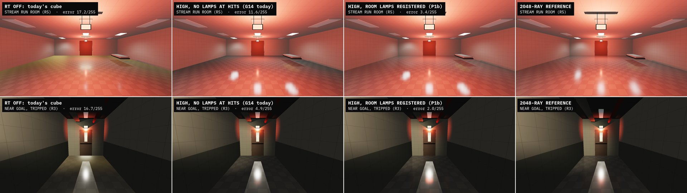

# 11 — Secondary reflections: G14 P1b design (glossy receivers, recursion, the Surface hook)

2026-10-03 · visual chat (游戏视觉) · workflow glass-rt-track, secondary-reflection investigation, design stage · revision 1: 2026-10-04 · revision 2: 2026-10-07 16:2x · **revision 3: 2026-10-07 19:xx** (answers check 3, §7.1) · **status: DESIGN** (no game code changed)

**The question.** Red showed a Control RTX on/off pair: a glass cabinet reflects the room, and a glossy parquet floor reflects the cabinet ("二次反射", secondary reflection). He says our window glass has none. He wants the cause found and fixed at the highest desktop spec.

**Red's decision (2026-10-03 14:1x).** The Run! corridor floor is **glossy vinyl tile** (waxed 12" VCT, smoothness ~0.75–0.85). That look is decided; the open question is only how each tier delivers it (§2.3). It is the main secondary-reflection receiver. Acceptance frames must show:
- the Run floor reflecting the red EXIT signs and the emergency heads;
- a glass door or window in that floor, together with that glass's own reflection (two bounces).

The Surface-shader hook must cover that floor, including the RoomStream materials.

**Inputs, read in full:**
- `01_code_review.md`, `02_runtime_probe.md`, `03_research.md`, `10_rt_glass_design.md`, `11a_glossy_surfaces.md`, `11b_multibounce_research_bench.md`; `../../room_visuals/10_run_directions.md`.
- **Main, read only, at `a5262fb`** (HEAD, 2026-10-07 17:25). The RT code is unchanged since `75cfdff`: `FRGlassRTShared.h` and `FrontRoomsGlassRT.metal` are md5-identical (`98bebe86…`, `4a616f5a…`), and `git diff --stat 279c144 a5262fb` touches nothing under `Assets/Scripts/Rendering`, `Assets/Scripts/FrontRoomsMap`, `Assets/Scripts/Office`, `Assets/Resources/Rendering`, `Assets/Editor/RT`, `Assets/Settings` or `NativePlugin`, and not `FrontRoomsRoomStream.cs`. `FrontRooms3DGame.cs` changed only by one-line `Application.isMobilePlatform` → `FrontRoomsHandheld.Active` swaps, so no cited line moved. Every "main" line number below is valid at `a5262fb` (re-checked 2026-10-07 19:0x).
- **Pre-Codex state, pinned to `7320ed1`**: every citation of the ChatGPT prototype and of MapWorld/3DGame/Look as they were then (§2.0, last paragraph).
- Codex audit: `research/codex_audit/00_main_state.md` §3.2, `10_review_glass-look.md` (F3, F5), **`10_review_rt.md` (F1, F2, F3, F6; today, RT files = `5e6e7f9` = `a5262fb`)**. `Documentation/VERIFICATION_LOG.md` VL086–VL087, **VL107, VL116–VL118**. `codex_audit/20_findings.md`, `rt/20_implementation.md` and `rt/30_final.md` still do not exist (checked 2026-10-07 19:0x).
- URP 17.3.0 source (`Library/PackageCache` of `$W/proj_audit`, the same package version as main).
- Check 3 (the workflow's issue list, 2026-10-07 evening); check 2 and its bench `$W/rt_bench2/chk_r1/`, `chk_r2/` (`$W` = `/Users/redwang/FrontRoomsVisualWork`).

**What was written in revision 3:**
- this report (revision 2 is kept as `11_bench/r3/11_secondary_reflections_r2.md.txt`; revision 1 as `11_bench/r2/11_secondary_reflections_r1.md.txt`);
- `11_bench/r3/`: bench 5d/5e patches, run scripts and logs; the Unity scan probe and its log (`.txt` copies);
- `images/11r3_lamp_gap_sheet.jpg`, `images/11r3_drop_fade_chart.png`, `images/11r3_walk_receivers.png`;
- rows VL148–VL150 in `Documentation/VERIFICATION_LOG.md` and their slides `2805:6151`, `2805:6160`, `2805:6169` (§5.5).

Nothing under `Assets/` was touched, and no Unity ran on Red's project. The benches ran standalone in `$W/rt_bench2/r3/b5/`. One Play-mode scan ran in a private clone, `$W/proj_g14b_r3` (main `a5262fb` + the shared tools + one probe, RT off).

**Tags.**
- **MEASURED** = timed, computed or counted on Red's M3 Max (40 GPU cores) for this report, or quoted with its run.
- **ESTIMATE** = arithmetic or judgement.
- **UNVERIFIED** = not confirmed.

**Machine load.** Every bench log line carries the 1/5/15-minute load. Image metrics (errors, frame differences, identities) and counts do not depend on load. Revision 3 ran at load 790–1,000 (28 Unity processes from other workflows), so it re-ran **no timing**; the GPU times in §2.10 are revision 2's (load 34–43) and stay **provisional** until `timing2` re-runs at load < 60 (§5.4).

---

## 0. For Red

**Why our glass shows no secondary reflection today** (main `a5262fb`):
1. **G14 is one bounce, and only glass receives.** Window glass does trace now: head-on, 71,919 pixels change (codex audit VL116). But a pane seen in a pane shows the zone cube, and a floor, CRT or chrome hit is lit once and stops. Nothing reflects twice. (Intact glass still reads weakly in Play: 2.9 luma against a bar of 12, VL107.)
2. **No floor receives.** Level 0 and the Office are carpet, which is correct. The only hard floor is the Run corridor, and Run rooms are not in play yet.
3. **Raster.** Run rooms borrow the Level 0 cube. There is no Run cube.
4. **G14 does not see the title stream at all.** It only scans map chunks, so RoomStream rooms and their lamps are invisible to it (and so would be the test corridor). If a Run room were traced today, walls and props in the reflection would get no lamp light: in the bench, the stream room's error goes from 3.4 to 11.6/255, and the red EXIT glow in a Run floor nearly vanishes (recall 78 % → 4–34 %). P1b registers each room and its lamps.

**What P1b adds:**
- **Glossy surfaces trace**, not just windows: the waxed Run floor at your 0.75–0.85 (mean 0.80), CRT screens, chrome, glazed ceramics, the vending front, Run door steel. On Ultra also cherry, ebony, dark wood and aluminium. Small metal hardware (knobs, roses, plates under 25 cm) keeps today's look.
- **Reflections inside reflections**: 2 bounces on High, 3 on Ultra.
- **Blur that matches the surface.** Waxed tile gives soft streaks toward you; glass and chrome stay sharp. No TAA, no smearing; a still camera never shimmers.

**What each Mac shows on the Run floor** (ESTIMATE: today's raster frame was measured once, 5.58 ms at 1080p on the M3 Max under load, then scaled by GPU cores and pixels; the game measures each Mac and picks, §2.9):

| Mac | 1080p | 1440p |
|---|---|---|
| M3 Max, M4 Max, 40 cores | **Ultra** | **Ultra** (High in heavy views) |
| M3 Max, M4 Max, 30–32 cores | **Ultra** | **High** where it fits, else glass only |
| M3 Pro, M4 Pro, 18–20 cores | **High**, if it fits | **Glass only**: the game alone may miss 60 fps here |
| M3 Pro, 14 cores; M3, M4 | **Glass only** | **Glass only** |
| RT Off; M1/M2; Windows; WebGL; iOS | **Today's floor, unchanged** | same |

- So a **Pro at 1440p may show today's floor**. Only the Max chips are sure to get the waxed traced floor at 1440p.
- "Glass only" = today's Run floor; window glass still traces. After R-2a/R-2b the raster floor improves on every Mac (below).

**When the tier drops in play** (the frame went over budget): the floor fades from traced to cube **and** from waxed (0.80) back to today's 0.525 together, over 1.5 s. MEASURED: no frame changes more than 0.35 % of floor pixels by ≥ 8/255. The 16-frame fade planned before changed up to 9.7 %: a visible pop. Choosing RT Off in the menu switches behind the pause card. So a waxed floor is never left under the raster cube unless you approve R-2b. A tier only rises while no glossy surface is on screen.

**What it costs** (M3 Max, 1440p, bench, provisional):
- GPU: Run corridor **High 1.7–2.4 ms, Ultra 3.4–4.8 ms**; the wide title-stream Run room High 2.8–3.1 ms (Ultra's 2 rays there 6.5–7.2 ms, error 3.4 → 1.4/255, only if the frame fits).
- Memory: 194 MB more at 1440p (209 MB at the peak of a frame). Macs with 8 GB stay glass only.
- **Main thread: P1b waits for G14's own fix.** Today G14 costs 2.8 ms of main thread on every frame with a window in view (budget 0.3 ms). On the audit's walk, P1b would raise the share of such frames from 77 % to 92 % (High) or 100 % (Ultra). So P1b lands only after G14's main-thread fix and its crash guard (codex audit F3, F1).

**What you will see** (bench, Run corridor, error vs a 2048-ray reference, 0–255 display scale):
- Today's cube on a waxed floor is far off: mean error 24/255. High brings it to 2.8, Ultra to 2.3.
- The glass lite showing the floor's lamp streak: up to 73/255. The lite's own reflection inside the floor: up to 16/255 on 0.09 % of the floor.
- A third bounce: invisible (≤ 7/255), cut off automatically.

**The Run cube for the raster tiers needs one cube per corridor state.** In the tripped corridor, a tripped-state cube brings the floor error from 24 to 6.9/255 (near the goal 16.7 → 6.2). An armed-state cube there is worse than today's cube: 29/255. So the cube must switch on the same frame as the lights. In the armed corridor an armed cube gives 3.7 (today 3.9). The wide stream room stays wrong with any single cube (18/255).

**Where you will NOT see it** (physically correct): carpet, wallpaper, drywall, ceiling tile, matte wood and plastic, door veneer, painted steel.

**What I need from you:**
- **R-1** Default tier: automatic, from measured GPU time (the table above). Your manual choice always wins.
- **R-2a** Run cubes (one armed, one tripped, switched at the trip) on every tier. This changes every Run surface's raster reflection, WebGL included. Recommended: yes.
- **R-2b** The waxed floor on the raster tiers, after R-2a. Recommended: yes on desktop; WebGL can keep today's floor.
- **R-3** Direction B for the acceptance frames.
- **R-4** One frame pair, still and moving: Ultra's near grain vs High's smooth blur.

---

## 1. What the benches show

Bench 4 built the Run corridor itself (1 × 9 cells, 2.84 m clear, 27 m; Direction B, tripped and armed; the RN-X goal door with its 0.25 × 0.75 m wired lite and a lit Level 0 stub; the title stream's Run room, 11.5 × 12 m; 3,000 far office instances so the acceleration structure is as large as the real map's). Bench 5/5b added main's real `Refl_Level0` cube, scene-captured cubes, a 2048-ray reference, the soft gate, footprint-aware jitter, a far fade and a dolly test. Bench 5c (revision 2) added the design's own ray tree (`TREE=1`, §2.5), cube swaps between corridor states and ray-count ramps. **Bench 5d/5e** (revision 3) add reflection hits without lamps (`HITLAMPS=0`, G14 in RoomStream rooms today) and tier-drop sequences in view (`tween`, `tween2`). Bench 6/6f time the stack on top of main's own G14 kernel. The **Unity scan** (revision 3) counts receivers in the real game. §5 has the method. Unless a row says otherwise, numbers are bench 5c/5d `TREE=1`, main's Level 0 cube × 0.5, soft gate on, far fade 6–12 mm, at 1920 × 1080.

| Finding | Number (1080p display error /255 unless stated) | Consequence |
|---|---|---|
| **Today's cube is badly wrong on a waxed floor** | RT-off frame with main's `Refl_Level0` × 0.5 (what main puts on Run rooms) vs the 2048-ray reference: S1 tripped **24.2**, near goal 16.7, stream room 17.2, S1 armed 3.9 | "Vs Off" mostly measures how wrong the Off cube is. Acceptance uses error vs the reference (§2.12) |
| **RoomStream lamps must reach the RT lamp list** (r3) | Reflection hits without lamps (G14 today in a RoomStream room) vs with them, High: stream room **3.36 → 11.57** (Off 17.15); S1 tripped 2.80 → 6.33; near goal 1.97 → 4.88; S1 armed 1.18 → 3.69. Red EXIT streak recall: S1 78.0 → 33.8 %, near goal 78.2 → **3.9 %** | Each RoomStream room registers as a source with its Lights (§2.8). New gate B9b |
| **A drop must fade slowly, floor and weight together** (r3) | Worst frame, share of floor px changing ≥ 8/255, over 5 views: RT weight 1 → 0 in 16 frames (revision 2's plan) **9.7 %**; 32 frames 3.8 %; weight and twin smoothness together over 90 frames **≤ 0.35 %** (main's cube) and ≤ 0.28 % (Run cube, S1). Smoothness alone over 60 frames ≤ 0.44 % | B16's 0.5 % holds with a 90-frame joint fade (§2.3, §2.9) |
| **Surface receivers in the real map** (r3, Unity scan) | Seed 516574485, 25 chunk roots, ~3,600 MeshRenderers: High receivers 10–34 loaded at once (task chairs, CRTs, vending fronts, phones, ply cabinets), 9–29 with the 25 cm slot rule; Ultra 18–45. Traced frames on codex VL117's walk: today 77.4 %, with P1b High **92.1 %**, Ultra **100 %** | P1b depends on G14's main-thread fix (§2.10) |
| **A Run cube must match the corridor state** | Tripped corridor, Off error: Level 0 cube 24.2 / 16.7 (S1 / near goal); **armed capture 29.2 / 14.1**; **tripped capture 6.9 / 6.2**. Armed corridor: armed capture 3.7 / 2.3 (S1 / 2.5 m), tripped capture 4.6 / 2.5, Level 0 cube 3.9 / 2.6. Stream room: its own capture 18.1 | One Run cube per state, switched on the trip frame (§2.3). R-2a is per state |
| **Receivers beyond glass are the visible change** | Floor px ≥ 8/255 changed, Off → High (S1 / near goal / stream room / S1 armed): flat cube 32.9 / 37.0 / 57.8 / 8.6 %; main's Level 0 cube 57.5 / 49.9 / 53.0 / 13.0 %; the scene's own capture × 0.5 18.3 / 19.4 / 60.4 / 11.3 % | The Run floor is a receiver on every RT tier |
| **RT vs reference** | High: S1 2.80, near goal 1.97, stream room 3.36, S1 armed 1.18. Ultra: 2.33 / 1.19 / (High path) / 0.74. Stream room with 2 GGX rays: **1.40**. Red EXIT streak recall: High 78 %, Ultra 78–100 % | Both tiers cut the error 3–14× vs today's cube |
| **The reference converges** | S1 tripped, 128 / 256 / 512 / 1024 rays vs 2048: px mean 2.30 / 1.99 / 1.70 / 1.40, p99 40 / 37 / 28 / 22; 8×8-block means 0.71 / 0.49 / 0.34 / 0.26 (p99 13.8 / 7.9 / 4.7 / 3.3). Other views by 256–512 rays (512: px mean ≤ 1.06, p99 ≤ 13) | S1 is firefly-limited per pixel, so B6 gates 8×8 block means against a 2048-ray reference |
| **Two bounces, with the soft gate** | 2.5 m from the goal, armed, depth 2 vs 1: the lite shows the floor's lamp streak, max **73/255** (main's cube; flat 71; corridor cube × 0.5 **63**; 85 without the gate). The lite's own lamp image in the floor: max **16/255 on 359 px = 0.089 % of the view's 402,693 floor px** (flat 15 / 331; corridor cube × 0.5 15 / 345; 20 / 509 without the gate) | Real but small. R2 thresholds hold on every cube (§2.12) |
| **Third bounce** | With the 0.004 cut-off: ≤ 7/255, 0 px ≥ 8 (every cube) | Ultra's depth 3 is free; it stays for facing windows |
| **Stack and facing rule, on main's kernel** | Facing rule = main bit for bit at depth 1 (0 of 443,629 / 559,308 / 745,106 traced px) and = G14's `lastGlass` rule at depths 2–3, also with a mirrored lite. Cost vs main (median ratio): depth 1 0.96–0.98×, depth 2 1.03–1.09×, depth 3 1.03–1.10× | See-through in registers, reflection-only stack of maxDepth − 1, facing from the unflipped normal × sign(det) (§2.5) |
| **Grain under motion** | Forward dolly, far floor 6–12 m, frame-to-frame change of the error: re-seeded jitter 11.3/255; 1 cm world cells 7.9; footprint-aware cells 5.4; **footprint-aware + far fade 2.7**; High 2.4 | Ultra uses footprint-sized cells and fades to High's path on the far floor (§2.4) |
| **Ray-count switches** | Instant switch, share of floor px changing ≥ 8/255 on one frame: 1→2 rays 0.07–11.3 %, 2→3 0.00–0.52 %, 3→4 0.00–0.28 %. **Ramped over 16 frames with a per-tile phase: worst frame ≤ 0.011 %** (no far fade ≤ 0.29 %) | Rays per tile ramp on the GPU (§2.4); B12 passes in the bench |
| **Rough-floor filter** | Mirror ray + hardware-anisotropic mip blur (k 2): best deterministic filter (bench 4). Oriented à-trous stripes; checkerboard saves nothing (1.62 vs 1.30 ms) | Unchanged from bench 4 |
| **Floor share** | S1 at eye level 12.0 %, near goal 15.1 %, pitched 10° 17.6 %, 2.5 m from goal 19.4 %, stream room 37.2 % | Narrow corridors are cheap; the wide room is the floor-heavy case |

Revision 3's sanity run (`r3_sanity_accept_l0exr.txt`) reproduces revision 2's `accept` figures to the last digit (S1 24.17 / 2.80 / 2.33, near goal 16.70 / 1.97 / 1.19, stream room 17.15 / 3.36, S1 armed 3.92 / 1.18 / 0.74): the patches change nothing unless switched on.

---

## 2. G14 P1b design (on top of main's G14 and `10_rt_glass_design.md`)

### 2.0 Main at `a5262fb`: where the reflection stops today

**What runs.** G14 starts from `FrontRoomsPostStack.ConfigureCamera` (`FrontRoomsPostStack.cs:74`, `FrontRoomsGlassRT.OptIn`). Its default comes from the Unity quality level: Ultra at level 5, High at 3–4, Off below (`FrontRoomsGlassRTSystem.cs:82-83`). Mac players default to level 5 (`QualitySettings.asset:338`), so a player defaults to Ultra; iPhone defaults to level 2 (`:342`) and WebGL to 3 (`:339`), where the façade is a no-op anyway (`FrontRoomsGlassRT.cs:65-71`). The plugin needs Apple9 (M3/M4) and fails closed elsewhere (`FrontRoomsMetalGlassRT.mm:235-240`).

**Which glass traces.** `Glass_Window` (`_RTReceive` 1) gets rendering-layer bit 30 (`FrontRoomsGlassRTSystem.cs:707`), and bit 30 is drawn with the `FRGlassRTPrepass` pass (`FrontRoomsMetalGlassRTRendererFeature.cs:156-171`). Main's `FrontRoomsGlass.shader` has that pass since `9eddc35` (`:526-536`), and `70644f0` gates the roll by traced coverage (`:343-360`). So:
- **kit windows trace**: `FrontRoomsInteractableKit.DressWindow` hangs a 6 mm `Glass_Window` slab (a closed Unity cube) inside each dressed map window and hides the map's pane renderer (`FrontRoomsInteractableKit.Window.cs:66-69`, `:166-187`, material at `:201`; called from `FrontRoomsMapWorld.cs:1338-1342`);
- **the map's own pane cube** (`FrontRoomsMapWorld.cs:1313-1319`, 30 mm, `ModuleUnits.GlassThickness`) is still `Map test / glass` on URP/Lit (`:3210`) until contract C8. It is traced as glass but receives nothing; it only shows when the kit's dress fails or the pane is broken.

**Measured in Play** (codex audit, clone of main with RT files = `a5262fb`):
- **VL116**: G14 now changes window glass. Head-on at 1.5 m, High vs Off: 71,919 px ≥ 8/255 (3.5 % of the frame), max 144/255; Ultra 72,138; RT Off twice: 0 px. VL086's "adds nothing" is fixed by `9eddc35`.
- **VL107** (window landing W1): the intact pane still barely reads against the broken one: 2.9 luma at 1 m (W-L0; 2.8 W-OF), against an art bar of 12.
- **VL117 / F3**: G14's main thread costs p50 2.78 ms, p99 8.03 ms on traced frames, 0.14 ms on frames with no window in view.
- **VL118 / F1**: an exception in `BuildFrame` freezes the frame and repeats ZBinningJob errors; a verified 20-line guard is waiting (`codex_audit/runtime/rt/rt_failclosed.diff`).

**Why there is no second bounce.** G14's `FRTraceReflection` (`FrontRoomsGlassRT.metal:421-489`) is a loop over glass layers along **one** ray:
- a pane hit adds `Fr × the zone cube` in the mirror direction and continues straight through with `T *= 1 − (0.11 + 0.89·F⁵)` (`:467-472`); the pane's own reflection is never traced;
- the pane's back face is skipped by instance id (`lastGlass`, `:439`, `:454`, `:473`);
- the first opaque hit is shaded (`FRShade`: SH + zone cube + direct lamps, `:336-409`) and **returned** (`:479-485`); a glossy floor or chrome hit never reflects again;
- receivers come only from the glass prepass (`FR_FLAG_RECEIVER`, `FRGlassRTShared.h:43`, set for FrontRooms/Glass with `_RTReceive` 1, `FrontRoomsGlassRTSystem.cs:470`, `:683`), so no opaque surface ever traces.

**Why RoomStream rooms are invisible to G14** (new in revision 3):
- The scene registry is built only from the map: `UpdateScene` finds `FrontRoomsMapWorld` (`FrontRoomsGlassRTSystem.cs:891`), diffs its chunk roots (`DiffChunks`, `:958-983`) and rescans them (`Rescan`, `:995-1026`), which also caches a `LampRec` per Light under the chunk (`:1017-1024`).
- `BuildLamps` reads lamps only from `chunks.Values → c.lights` (`:1318-1336`). `Rebase` shifts only chunk instances and chunk lights when the map root moves (`:942-956`).
- RoomStream builds its rooms under its own roots: 12 fixture spot lights per room (`FrontRoomsRoomStream.cs:1101-1106`; Run range 6.5 m, `:1379`) and, in Run rooms, two red EXIT point lights (`:1484-1489`). None of them is under a map chunk, so none reaches the RT lamp list, and none of the rooms' renderers is traced.

**Raster.** `FrontRoomsLook.SetZoneReflection` is live (`FrontRoomsLook.cs:38-41`): G6's cubes `Refl_Level0/Office/Tall/DeadLamp` at linear 0.5/0.5/0.45/0.5 (`FrontRoomsZoneReflection.cs:43`, `:48`), crossfaded over 0.5 s. There is no Run zone (`FrontRoomsLook.cs:29`) and no title-stream cube: RoomStream forces the Level 0 cube for the whole title (`FrontRoomsRoomStream.cs:351-352`), and the game picks the zone of the player's cell (`FrontRooms3DGame.cs:1101-1121`). The RT trace samples the same cube: `EnvCube` reads `RenderSettings.customReflectionTexture` (`FrontRoomsGlassRTSystem.cs:1411-1427`).

**Content.** `Prop_Glass` and `Prop_BottleBlue` are on FrontRooms/Glass with `_RTReceive` 0 (`8ef5b64`); so is `Glass_ShardClear`. Main has 84 FrontRooms/Surface materials (83 at `7320ed1`). Kit meshes are one object with several material slots (`Tools/Blender/frontrooms_kit/kitlib.py`, `export`; sidecar `slots`): `Kit_CRTMonitor` carries `Prop_ScreenCRT` next to three plastics, `Kit_TaskChair` `Prop_Chrome` next to fabric and plastic. Run rooms exist only in RoomStream (`BeginPlayableSequence`, `FrontRoomsRoomStream.cs:612`, still has no caller), and the map has no Run theme (`ZoneTheme` {Level0, Office}).

**Before Codex** (`7320ed1`, for the record): the prototype controller was created only for a standalone map (`FrontRoomsMapWorld.cs:487-489`; the game builds it embedded, `:506`, from `FrontRooms3DGame.cs:578`); its pass waited for a texture only the pass created (`FrontRoomsMetalGlassRT.cs:53`); the kernel returned early for non-glass first hits (`FrontRoomsMetalGlassRT.mm:279`), traced one ray (`:285-296`), shaded hits flat with a fake sun (`:230-243`) and sent misses to a blue sky (`:223-228`); `SetZoneReflection` was a stub (`FrontRoomsLook.cs:28-36`).

### 2.1 Scope and principles

- **One trace, two kinds of receivers** (Control's split, [G7] in 11b):
  - **glass**, the front layer only, written to `_FR_GlassRTReflection` (G14's contract, unchanged);
  - **opaque glossy surfaces**, the front-most opaque only, written to a new `_FR_SurfaceRTReflection`.

  An opaque receiver seen through glass also traces. Glass keeps G14's front-layer rule.
- **macOS only.** The hook and passes exist only in StandaloneOSX players and the macOS editor; every other build target strips them (an allowlist, §2.6.6). Windows waits for P3.
- **No silent raster change.** With RT Off, and on every non-RT platform, P1b leaves the image bit for bit as today (B1). P1b edits no `.mat` file. Every raster look change is listed in §2.3 and waits for Red (R-2a, R-2b). The one cross-platform shader change is a hidden per-material constant that defaults to 0 and is read only inside the hook (§2.6.1), as the print layer did.
- **Physically gated, per material slot.** A surface reflects only if its real smoothness says so (11a classes), decided per material slot, not per renderer. Carpet never does.
- **Deterministic first.** No TAA, no history, no per-frame noise. A still camera gives a still image.

### 2.2 Receivers per tier

**Effective smoothness** = the material's `mask.r × _Smoothness`, MEASURED per material in 11a (p10/p50/p90 over the mask's pixels). It is baked into a table, not read at runtime (§2.8).

**The receiver unit is the material slot** (revision 3). Kit meshes mix materials in one renderer (§2.0, Content). A renderer-level flag would trace the CRT's beige plastic too (s 0.516 → r 0.48 → weight 0.41 under the pixel fade). So:
- a **slot is a receiver** if its material's **p90** effective smoothness reaches the tier threshold **and** its submesh's largest world extent is **≥ 0.25 m**. Smaller receiver slots (lock knobs 0.06 m, roses 0.07 m, levers 0.13 m, strikes and escutcheons ≤ 0.20 m, door number plates 0.10 m, key hooks, keys; per the kit sidecars) stay **hit-only**: they keep today's cube look and still appear inside other reflections;
- a **renderer is a surface receiver** if any slot is. Only its receiver slots trace (the per-slot flag, §2.6.1); the other slots keep today's look exactly;
- **every pixel** of a receiver slot with perceptual roughness r ≤ 0.55 traces, with the blur set by its own roughness (§2.4). Above r 0.55 it shows the cube. The hook fades RT to the cube between r 0.40 and 0.55, so the waxed VCT (p10–p90 r 0.11–0.30) never blotches.

| Tier | Threshold (p90 s) | Opaque receiver materials (s p50 [p90]; m = metal) | Glass receivers (FrontRooms/Glass `_RTReceive = 1`) |
|---|---|---|---|
| **High** | s ≥ 0.75, or metal with s ≥ 0.60 | **Run floor 0.80 [0.89]** (the waxed twin on RT tiers, §2.3); `Prop_ScreenCRT` 0.86 face; `Prop_GlassCRT` 0.84 (phone display, interior-window pane); `Prop_Chrome` 0.85 m (chair bases, stools, ply cabinet, door hardware); `Prop_CeramicGlaze` 0.85; `Prop_Ceramic` 0.80; `Prop_VendingFront` 0.76 [0.82]; `Office_BlackedGlass` 0.95 (except renderers flagged MatteHit, §2.3); **`Run / chrome` 0.78 m** and **`Door / brushed steel` 0.62 m** (their Surface twins on RT tiers, §2.3); `Prop_Brass` 0.60 m | `Glass_Window` (kit window slabs: trace today); `Glass_Wired` (RN-X goal lite, Direction C lites; new); `Prop_Glass` with `_RTReceive` 1 (cabinet, hutch, vending and clock glass; after Red's F3 call) |
| **Ultra** | s ≥ 0.60, or metal with s ≥ 0.50 | everything in High, plus `Prop_WoodCherry` 0.71 [0.74]; `Prop_WoodEbony` 0.66 [0.69]; `Prop_WoodDark` 0.59 [0.61]; `Prop_Aluminium` 0.56 m [0.59] | same |
| **Never** (all tiers) | — | `Run_Wall` 0.58 [0.59]; every carpet (0.075–0.08); wallpapers 0.21; `Office_Wall` 0.31; ceilings 0.10–0.11; `Cove_Base` 0.38; `Door_Veneer` 0.47; painted steel 0.43; plastics ≤ 0.52; `Painted_Metal` 0.52; oak, teak, walnut ≤ 0.56; fabrics, board, paper. **Emissive lenses and signs** (`Troffer_Lens`, `Run_ExitSign`): never receivers, never recurse at hits (`FR_MAT_NO_RECURSE`, §2.5) | `Map test / glass` (URP/Lit, the map's pane cube until C8); `Prop_BottleBlue`, `Glass_ShardClear` (FrontRooms/Glass, `_RTReceive` 0); `Glass_Edge`, `Glass_Shard` (hit-only) |

**MEASURED in the real map** (Unity scan, §5.4; seed 516574485; `Verification/g14b_r3/scan_log.txt`):

| Loaded map (25 chunk roots) | MeshRenderers | G14 glass receivers | High, any slot | High, slot ≥ 0.25 m | Ultra, any slot | Ultra, slot ≥ 0.25 m |
|---|---|---|---|---|---|---|
| At the start | 3,550 | 18 | 27 | 23 | 33 | 29 |
| At the walk's start window | 3,748 | 38 | 34 | 29 | 45 | 40 |
| At the walk's end | 3,597 | 56 | 10 | 9 | 18 | 17 |
| Unique over the run | — | 80 | 41 | 35 | 56 | 50 |

- High receivers today are `Kit_TaskChair` (chrome base), `Kit_CRTMonitor`, `Kit_VendingMachine`, `Kit_DeskPhone` (dropped by the size rule) and `Kit_PlyCabinet`; Ultra adds `Kit_FilingCabinet`'s aluminium trim.
- **No lock or door-hardware kit is dressed on this seed** (`Kit_Lock_*`, `Kit_DoorLeaf_*`, `Kit_DoorNumberPlate*` exist in `Resources/Props/Models` but no loaded chunk spawns them). When they are dressed, the size rule keeps their knobs, roses, levers, strikes and plates hit-only; door-leaf chrome or aluminium larger than 0.25 m (kick or push plates) would be receivers.

### 2.3 How each tier delivers the waxed floor (Red's decision), with no silent changes

**Rule.** RT tiers get the look through **runtime material copies** and **RT-side material overrides**. The `.mat` files, the RT-off image and every non-RT platform stay as today. The raster tiers change only through R-2a (Run cubes) and R-2b (waxed `Run_Floor.mat`), each with Red's OK.

**Two kinds of runtime copy** (`FrontRoomsSurfaces`, cached, one per source material, created only on macOS while `Active`):
- **`RtCopy(m)`**: `new Material(m)` with `_RTSurfaceReceive` = 1 (§2.6.1) and every other value unchanged. The RT system swaps a renderer's **receiver slots** to their RT copy at registration and back on removal, on `RoomReleasing` and after the surface tier is off. The copy draws exactly like `m` until the hook is on and weighted, so the swap is invisible whenever it happens (B1b, B11). This is what makes the receiver unit a slot (§2.2).
- **`RtDress(m)`**: the look-changing twins, applied **only when a room is dressed** (never in view):
  - **the waxed twin** = `RtCopy(Run_Floor)` with `_Smoothness` 1.52 (mean 0.80, p10–p90 0.70–0.89). One material shared by every Run room;
  - **Metal twins** of the URP/Lit `Run / chrome` and `Door / brushed steel` (§2.6.5), with `_RTSurfaceReceive` = 1.

**Where the twin enters.** `FrontRoomsSurfaces.Room()` alone cannot carry it: `FrontRooms3DGame.BuildMaterials` calls it once and caches the result (`FrontRooms3DGame.cs:397-412`); RoomStream receives the cached arrays (`:238-240`, `:432-436` → `FrontRoomsRoomStream.cs:299`, `:372`) and reuses them in `BuildRoom` (`:1070`) and `RefreshRoomMaterials` (`:1506`) through `ProfileMaterial` (`:1343-1347`). MapWorld also caches its theme palettes once (`FrontRoomsMapWorld.cs:3173-3186`). So:
- **RoomStream (visual-chat code).** `ProfileMaterial` returns `FrontRoomsSurfaces.RtDress(m)`: the waxed twin when `m` is `Run_Floor` and `FrontRoomsGlassRT.SurfaceFloorTwin` is true, else `m`. `RefreshRoomMaterials` also swaps `Run / chrome` and `Door / brushed steel` for their Metal twins on that room's renderers under the same switch. They run only in `BuildRoom` (`:1128`), in `BeginPlayableSequence` (`:625`; it re-dresses only rooms still sealed behind the handoff door, `:605-610`) and on a recycle (`:918`; the oldest room, behind the player), so the dressing never changes in view.
- **The map's Run module** (map chat, CR-7 in §3.2). The Run theme must look its floor up at each chunk build instead of caching it with the palette, so chunks built after a tier change get the matching floor and built chunks keep theirs. Kit props in map chunks need nothing from the map: their receiver slots get `RtCopy` at registration.
- `FrontRoomsGlassRT.SurfaceFloorTwin` is false on every non-macOS platform (the façade's `#if`, as `FrontRoomsGlassRT.cs:65-71`), so WebGL and iOS never see a copy or a twin.

| Item | RT tiers (Mac M3/M4, High/Ultra) | RT Off on the same Mac; M1/M2 Macs; Windows; WebGL; iOS |
|---|---|---|
| Run floor | The **waxed twin**, dressed per room while `SurfaceFloorTwin` | `Run_Floor` as today (`_Smoothness` 1, mean 0.525). After R-2b: `Run_Floor.mat` → 1.52 |
| Receiver slots of kit props (CRT face, chrome base, …) | `RtCopy` of the slot's material: same values, `_RTSurfaceReceive` 1 | The `.mat` asset, as today |
| Reflection source | Traced (§2.4–2.5); the zone cube only at cut-offs, misses and the (1 − g) share | The zone cube: Level 0 today (`FrontRoomsRoomStream.cs:351-352`). After R-2a: the Run cube of the current state |
| Run chrome, door steel | Runtime **Metal twins** (`FrontRoomsSurfaces.Metal`), same values, so they take the hook (B2) | URP/Lit materials as today |
| Lenses, EXIT sign faces (11a M2) | RT-side only: their material record gets `FR_MAT_NO_RECURSE` (§2.5); never receivers. Hit smoothness = raster smoothness | Unchanged. A 0.85 acrylic look is optional content for later, on all platforms, with Red's OK |
| Gurney wheels, sign housings on `Office_BlackedGlass` (11a M1) | RT-side only: RoomStream registers them with the new instance flag `MatteHit` (bit 13): never a receiver, hit smoothness clamped to 0.45, no recursion | Unchanged |

**Tier changes in play** (revision 3; the controller is in §2.9):
- **A drop to glass-only fades the floor and the weight together.** When the surface tier turns off in view (budget drop), `_FR_SurfaceRTWeight` goes 1 → 0 **and** the waxed twin's `_Smoothness` goes 1.52 → the raster value (1.0 today; 1.52 after R-2b, then nothing to tween) **over the same 90 frames, linearly**. The twin is one runtime material, so this is one `SetFloat` per frame. The trace keeps running until the weight is 0. Then the twin has `Run_Floor`'s values exactly, so it is left in place; each room gets `Run_Floor` itself at its next dress (identical), and the RT copies go back to their assets sliced (identical). **MEASURED** (bench 5d/5e, below): worst frame ≤ 0.35 % of floor px ≥ 8/255 in every view, with main's cube and with the Run cube.
- **Why not the old plan.** Revision 2 faded only the weight, over 16 frames, and left the twin waxed under the raster cube until the room recycled. MEASURED: that fade changes up to 9.7 % of floor px ≥ 8/255 on one frame (S1 tripped), and the waxed floor under main's Level 0 cube is the 24/255 state (S1; 16.7 near goal, 17.2 stream room), kept for as long as the room lived (the player's own room recycles only after they leave it; map Run chunks keep it until they unload). That was an unapproved raster look on M3/M4 Macs. It is withdrawn.
- **Ultra → High** in view: every tile ramps to High's path over 16 frames (§2.4; worst frame ≤ 0.011 %).
- **RT Off chosen in the menu**: the switch happens while the pause card covers the view (`overlayImage` at 98 % alpha on desktop), so it is instant: weight 0, twin `_Smoothness` 1.0, keyword off.
- **Rises happen out of view only**: when no candidate surface receiver and no Run floor has been inside the camera frustum for 10 frames (CPU frustum tests, §2.9), or at load before the first Run room. Then the twin's smoothness and the RT copies are applied at once.

**The drop fade, MEASURED** (bench 5d `tween` / 5e `tween2`; floor px share changing ≥ 8/255 between consecutive frames, worst frame of the sequence [max change /255]; main's Level 0 cube × 0.5 | the Run cube of the view's state × 0.5):

| Sequence | S1 tripped | Near goal | Stream room | S1 armed | 2.5 m armed (s 0.85) |
|---|---|---|---|---|---|
| Weight 1 → 0 over 16 frames (revision 2) | **9.68 %** [39] \| 1.10 % [77] | 2.88 % \| 1.07 % | 3.35 % \| 3.38 % | 0.10 % \| 0.00 % | 0.00 % \| 0.00 % |
| Weight over 32 frames | 3.80 % \| 0.67 % | 1.24 % \| 0.19 % | 1.79 % \| 1.35 % | 0.00 % \| 0.00 % | 0.00 % \| 0.00 % |
| Weight over 90 frames, twin stays waxed (the R-2b case) | 0.043 % \| 0.31 % | 0.000 % \| 0.000 % | 0.021 % \| 0.008 % | 0.000 % \| 0.000 % | 0.000 % \| 0.000 % |
| Smoothness 1.52 → 1.0 alone, 60 frames | 0.30 % \| 0.02 % | 0.44 % \| 0.00 % | 0.00 % \| 0.17 % | 0.00 % \| 0.00 % | 0.00 % \| 0.00 % |
| **Weight + smoothness together, 90 frames (design)** | **0.35 %** [40] \| **0.28 %** [22] | **0.00 %** \| **0.00 %** | **0.011 %** \| **0.012 %** | **0.00 %** \| **0.00 %** | **0.00 %** \| **0.00 %** |
| Weight + smoothness together, 60 frames | 0.98 % \| 0.57 % | 0.03 % \| 0.01 % | 0.10 % \| 0.28 % | 0.00 % \| 0.00 % | 0.00 % \| 0.00 % |
| Weight + smoothness together, 120 frames | 0.14 % \| 0.12 % | 0.00 % \| 0.00 % | 0.00 % \| 0.00 % | 0.00 % \| 0.00 % | 0.00 % \| 0.00 % |

- Easing the weight (w = 1 − t², slow start) helps S1 but hurts the stream room (0.87 % at 90 frames, where the last, fastest steps land on its bright cube side); the design stays linear.
- Full logs: `11_bench/r3/b5/r3_tween_*.txt`, `r3_tween2_*.txt`. Chart: `images/11r3_drop_fade_chart.png` (VL149).

**What each raster tier shows after R-2a and R-2b** (MEASURED in bench 5c, Off frame vs the 2048-ray reference, Run cube = the scene's own capture × 0.5, G6's cap):

| Corridor state | Cube | S1 | Near goal / 2.5 m |
|---|---|---|---|
| Tripped (Direction B after the trip) | Level 0 (main today) | 24.2 | 16.7 |
| Tripped | **Armed capture (wrong state)** | **29.2** | 14.1 |
| Tripped | **Tripped capture** | **6.9** | **6.2** |
| Armed | Level 0 (main today) | 3.9 | 2.6 |
| Armed | **Armed capture** | **3.7** | **2.3** |
| Armed | Tripped capture (wrong state) | 4.6 | 2.5 |
| Stream room (no states) | its own capture / Level 0 | 18.1 / 17.2 | — |

- **One cube per state.** G6 captures `RunArmed` and `RunTripped` (corridor) plus one stream-room cube. The cube **snaps on the trip frame** (`SetZoneReflection(…, 0)`), so it changes with the raster lamps; it crossfades over the usual 0.5 s only when a Run room becomes or stops being current. During a 0.5 s crossfade after the trip the error would sit between 29.2 and 6.9, which is why the trip snaps.
- **The Run-cube switch itself is R-2a.** Until Red says yes, RoomStream and the map keep the Level 0 cube on every tier. The RT tiers do not need it: their traced result is the same with either cube (S1 High 2.80 with Level 0, 2.80 with the Run cube; near goal 1.97 / 1.97).
- **The stream room** stays wrong with any single cube (18/255): the hanging signs land in the wrong place. Box projection would help, but the Surface shader has none (`room_visuals/10` §7.6) and URP's is off (`FrontRooms_URP.asset:55`); adding it touches every Surface draw, so it is a separate lookdev item (UNVERIFIED).

**WebGL.** P1b changes nothing visible on WebGL. Its one shader-level change there is the hidden `_RTSurfaceReceive` constant in the Surface CBUFFER (default 0, unread outside the stripped hook; §2.6.1); it is listed in the WebGL track's change list as "no visual change". R-2a changes WebGL's Run reflections (new cubes, WebGL size by G6's import override) and R-2b its Run floor; both must be listed there too. Red may keep 0.525 on WebGL with a WebGL-only material variant.

### 2.4 Rays per receiver pixel, and filtering (no TAA)

Perceptual roughness r = 1 − s comes from the receiver prepass, per pixel (normal map and damp flattening included). **Trace range = fade range:** a receiver pixel traces if r ≤ 0.55 (`_FR_SurfaceRTFade.y`), and the hook blends RT → cube over r 0.40–0.55 (`_FR_SurfaceRTFade`). The prepass, the trace and the hook read the same two constants, so no pixel ever gets RT weight without a trace, and no traced pixel is thrown away above 0.55.

| Receiver class, pixel roughness | High | Ultra |
|---|---|---|
| **Floor-planar** (world-projected Surface, normal.y > 0.9), every r ≤ 0.55 | 1 mirror ray + **anisotropic mip blur**, k = 2. The blur radius is ∝ α = r², so it shrinks smoothly to 0 for the glossiest texels: no sharp/blur switch inside the floor | **GGX VNDF rays** (Heitz 2018) near, with **footprint-aware jitter**; **far fade** to High's path; anisotropic mip blur, k blending from 1 (near) to 2 (far). Rays per 16×16 tile from the GPU budget (below) |
| **Other receivers**, every r ≤ 0.55 (CRT face 0.86 → r 0.14, chrome 0.15, glaze 0.15, `Prop_GlassCRT` 0.16, black glass 0.05; vending front 0.24, cherry 0.29, ebony 0.34, door steel 0.38, brass 0.40, dark wood 0.41, aluminium 0.44) | 1 mirror ray + plane-aware 2-pass à-trous (bench 3: 5×5 B3, plane and normal weights). **Radius = the lobe footprint × smoothstep(0.16, 0.24, r)**: 0 at r ≤ 0.16, so the mirror-like materials stay unfiltered, then continuous. Glass keeps G14's smudge blur and back-surface image (`10` §1.6) | The same mirror path, **blended toward 2 GGX rays** (footprint-aware jitter) by smoothstep(0.16, 0.30, r); inside the band both are traced; the same à-trous |
| r > 0.55 inside a receiver slot | not traced; the cube, as the raster | same |

**No hard edge at r 0.16** (revision 3). Revision 2 switched the filter (none → à-trous) and, on Ultra, the estimator (mirror → 2 GGX) at r 0.16. That edge sits between materials (0.14–0.16 below, 0.24 and up above), but roughness also varies inside one material: the CRT face (r 0.14) grades into its bezel area (r 0.53, 11a). A hard switch would draw a seam there, and the à-trous radius would jump from 0 to the full lobe footprint (about 12 px at 1440p for an object 2 m behind a receiver seen from 2 m; ESTIMATE from §2.4's footprint formula, k = 1). Now the radius fades in over r 0.16–0.24 and Ultra's GGX share over r 0.16–0.30, so CRT, chrome, glaze and black glass stay sharp and the result is continuous in r. UNVERIFIED for non-floor receivers (the benches hold only the floor class and glass); B3, B4 and M4 cover it in-engine.

**Anisotropic mip blur** (MEASURED best deterministic filter, bench 4):
- **Prep.** The resolve writes the floor-class radiance premultiplied by a floor mask, (rgb·m, m), into a mipmapped RGBA16F texture; a blit generates box mips.
- **Shape.** Footprint `r_in = k · α · hit / ((view + hit) · pixelAngle)` px (α = r²); plane-of-incidence direction `e = normalize(proj(P + 0.05·N) − proj(P))`; `r_out = r_in · cos θi` (in-plane tilt 2δ, out-of-plane 2δ·cos θi: lamps streak toward the viewer).
- **Gather.** Three trilinear probes, `max_anisotropy(16)`, explicit gradients (`gx = e·r_in`, `gy = e⊥·2·r_out`), at 0 and ±r_in/2 along `e`, weights ½ / ¼ / ¼, divided by the mask.
- **Cost.** 0.58–0.69 ms at 1440p over the full screen (r1 timing). A dispatch rectangle cuts this.
- **Calibration.** vs the 2048-ray reference (S1 tripped, r 0.20): k 1 / 2 / 3 → mean error 3.33 / 2.80 / 3.38, 8×8-block p99 38 / 37 / 66. k = 2 for High.

**Footprint-aware jitter** (Ultra; Wyman & McGuire, "Hashed Alpha Testing", 2017):
- The (u1, u2) of sample i hash the receiver point quantised to a cell the size of the pixel's floor footprint (along the view: `pixelAngle · d / cos θ`), at two power-of-two levels blended by the fractional level, with W&M's CDF correction. Never from the frame index. Sample i hashes (cell, i) only, so **n + 1 rays reuse the n rays' samples** (nested; the ramps below rely on it).
- Why not 1 cm cells: at 1440p and 76° FOV one pixel covers 2.4 mm of floor at 1 m, 7.8 mm at 3 m, 26 mm at 6 m and ~100 mm at 12 m. Far pixels span many 1 cm cells, so any motion picks a new cell and the noise crawls; near the camera 4–5 pixels share one cell and look blocky.
- **Far fade.** Between pixel footprints (across the view, `pixelAngle · d`) of **6 and 12 mm** — 5.5–11 m at 1440p, 4.1–8.3 m at 1080p — Ultra blends to High's mirror ray, and k blends from 1 to 2. Beyond 12 mm it is High's path.
- **MEASURED** (bench 5c, design tree, forward dolly at 1 m/s, S1 tripped, frame-to-frame change of the error vs a per-frame 2048-ray reference, display/255, ground distance 0–3 / 3–6 / 6–12 / 12+ m):

| Jitter | Forward dolly | Strafe, 6–12 m | Still-frame error, 6–12 m |
|---|---|---|---|
| Re-seeded each frame (bench 4) | 1.03 / 2.51 / **11.32** / 9.05 | 12.52 | 7.04 |
| World 1 cm cells (11 as written) | 0.45 / 1.42 / **7.94** / 6.92 | 7.49 | 6.52 |
| Footprint-aware cells | 0.48 / 1.51 / **5.39** / 3.60 | 6.28 | 7.11 |
| **Footprint-aware + far fade (design)** | 0.48 / 1.38 / **2.69** / 1.04 | 4.70 | 9.80 |
| High (deterministic) | 0.34 / 0.81 / **2.35** / 1.04 | 4.75 | 10.76 |

  The far fade costs some still-frame accuracy far away (S1 mean error 1.88 → 2.33; High 2.80) and buys motion stability equal to High's. Bench 4's 0.3–2.9 % seed-to-seed shimmer is **not** an upper bound: re-seeded per frame, the far band moves by 11/255.

**Rays per tile, on the GPU, with hysteresis and ramps** (Ultra floor):
- **Budget.** The tier controller (§2.9) sets a ray budget R (rays per frame for the floor class) from measured frame time; there is no fixed share. After the prepass, `fr_tile_count` counts floor-class pixels per 16×16 tile and in total (one atomic per tile); `fr_spp_plan` (one threadgroup) computes c = R / floor px, costing far-faded tiles at 1 ray first. Each tile's target is n* = clamp(c, 1, 4); n = 1 is High's path.
- **Hysteresis per tile, on the GPU:** rise to n + 1 only when c ≥ 1.2·(n + 1) has held for 60 frames (1 s); drop to n − 1 when c < 0.8·n has held for 60 frames, at once (still ramped) when c < 0.6·n.
- **Ramp, not switch.** A new ray's weight goes 0 → 1 over **16 frames**; a dropped ray's 1 → 0 and is traced until its weight is 0. Each tile starts its ramp after a hashed phase of 0–7 frames, so the switch never lands on one frame. The ramp blends the two nested estimators linearly before the mip blur (which is linear). n = 1 ↔ 2 blends High's mirror path and 2 GGX rays.
- **State:** 2 bytes per tile (n + hold counter; ramp weight in 1/16 steps), 28.8 KB at 1440p. The trace reads n and the weight per tile; dispatch is indirect. No CPU readback.
- **Why.** The band now spans 2.4 ≤ c < 3.6 for the 2 ↔ 3 pair. At the S1 eye pose with R = 0.40 × screen that is floor share 11.1–16.7 %, i.e. pitch −1° to +8.5° (`v5_share.txt`), so a ±5° nod or head bob crosses at most one edge, once.
- **MEASURED** (bench 5c `ramp`, design tree, main's cube, share of floor px changing ≥ 8/255 between consecutive frames, worst frame of the ramp; each cell: with the far fade / without):

| View | 1 → 2 rays: instant | ramped | 2 → 3: instant | ramped | 3 → 4: instant | ramped |
|---|---|---|---|---|---|---|
| S1 tripped | 3.47 % / 7.37 % | **0.004 % / 0.293 %** | 0.43 % / 2.04 % | 0.000 % / 0.069 % | 0.03 % / 1.45 % | 0.000 % / 0.030 % |
| Near goal | 7.73 % / 7.74 % | 0.011 % / 0.010 % | 0.52 % / 0.52 % | 0.000 % / 0.000 % | 0.28 % / 0.27 % | 0.000 % / 0.000 % |
| Pitched 10° | 1.88 % / 4.88 % | 0.001 % / 0.187 % | 0.25 % / 1.14 % | 0.001 % / 0.036 % | 0.04 % / 0.90 % | 0.000 % / 0.017 % |
| Stream room | 11.30 % / 12.39 % | 0.000 % / 0.001 % | 0.09 % / 0.25 % | 0.000 % / 0.000 % | 0.02 % / 0.08 % | 0.000 % / 0.000 % |
| S1 armed | 0.07 % / 2.27 % | 0.000 % / 0.009 % | 0.00 % / 0.20 % | 0.000 % / 0.004 % | 0.00 % / 0.06 % | 0.000 % / 0.000 % |
| 2.5 m from goal, armed | 0.38 % / 0.38 % | 0.000 % / 0.000 % | 0.01 % / 0.01 % | 0.000 % / 0.000 % | 0.00 % / 0.00 % | 0.000 % / 0.000 % |

  "Ramped" = 16 frames with the per-tile phase. Full tables (N = 8 / 12 / 16, phase 0 / 8): `11_bench/r2/b5/r2_t1_ramp_l0exr.txt`, `r2_t1_ramp_l0exr_nofarfade.txt`. A few firefly pixels still jump on one ramp frame (up to 107/255 near the goal, ≤ 0.011 % of floor px). 12 frames already pass (worst 0.40 % without the far fade); 16 leaves margin.

### 2.5 Recursion: stack, Fresnel throughput, facing, cut-off, misses

**Layout** (MEASURED on main's kernel, bench 6/6f):
- The **see-through continuation stays in registers**, exactly as G14's layer loop does (`tMin`, `T`, `layers`).
- Only **reflection branches** are pushed, on a stack of **maxDepth − 1** entries: 1 on High, 2 on Ultra.
- Entry: 28 bytes: origin (12), octahedral direction (4), half3 weight (6), half cone (2), meta (4: depth 2 bits, layers 2 bits, 28 bits reserved). **No `lastGlass`**, in the entry or in registers: the facing rule replaces it (below), and a pushed branch always starts outside any pane (on the incident side of a pane, or on an opaque surface).
- At depth 1 the revised loop with the facing rule is main bit for bit (0 of 443,629 / 559,308 / 745,106 traced px in views A / B / G) at 0.96–0.98× main's time.
- Revision 1's "first layout costs another 4–9 %" stays withdrawn (revision 2: that layout drew a different image; check 2's `chk_r1/b6/chk_cmpn_*.txt`). Every acceptance number here comes from bench 5c's `TREE=1`, the design tree.

**Facing rule** (which glass face the ray is leaving):
- G14's `FRFetchHit` flips `nGeo` toward the ray (`FrontRoomsGlassRT.metal:160`), so "exiting = dot(dir, nGeo) > 0" is never true. Revision 1's rule could not work.
- **Design:** `FRFetchHit` computes `h.entering = dot(cross(w1 − w0, w2 − w0), rayDir) · sign(det(o2w)) < 0` **before** the flip, from the world positions it already reads. Unity's meshes have cross(e1, e2) pointing out of front faces; a negative-scale instance reverses the world winding, which sign(det) restores. `sign(det)` comes from a new instance flag `Mirrored` (bit 14), set by the C# side from `localToWorldMatrix.determinant < 0` at registration and on each transform refresh.
- Glass hit, **exiting**: pass through with no Fresnel and no layer. **Entering**: the pane rules below.
- **MEASURED** (bench 6f; views B and G; 10,189 / 18,251 glass hits, half of them exiting; and with the lite instance mirrored, x scale −0.25): the unflipped cross × sign(det) is wrong on **0** hits; the cross without the determinant is wrong on **100 %** of the mirrored lite's hits; the intersector's `triangle_front_facing` with Metal's default winding is also right on 0 (object space), with counter-clockwise winding wrong on 100 %. Images: identical to G14's `lastGlass` rule at depths 1–3. Cost vs `lastGlass` at the same depth: +0.6 to +2.6 % (median ratios, load 36–43). `triangle_front_facing` is the equivalent fallback (+1.0 to +2.9 %).
- **Closed glass only.** The rule needs watertight glass with outward normals: a single-sided glass quad seen from behind would read as exiting and vanish from reflections. Map panes are closed (Unity cubes, 30 mm; the kit's interim slab 6 mm). Kit cabinet glass must be closed too (kit-owner check, §3.1); B8 lists every FrontRooms/Glass mesh with boundary edges. A multi-panel instance counts each panel it enters.

**Path weight** w = receiver Fresnel × the product of each hit's Fresnel or transmission:
- receiver Fresnel = the hook's `EnvironmentBRDFSpecular` (dielectric F0 0.04, metals F0 = albedo, glass `_PaneF0` 0.08);
- pane terms are **G14's own**: reflectance `Fr = 0.08 + 0.92·F⁵` and transmission `1 − (0.11 + 0.89·F⁵)` (`FrontRoomsGlassRT.metal:467-468`, the `Glass_Window` alpha). Bench 5c/5d `TREE=1` uses the same terms. `FrontRoomsGlassRT.cs:19` still documents "x(1-F)0.9"; that is a comment fix for the glass-rt-track (§3.1);
- a ray is spawned only if `importance · w > 0.004` (11b: removes 99.7 % of third-bounce rays at no image cost).

| Tier | Max reflection depth | Glass layers seen through | Cut-off | Shadowed lamps per hit | Stack entries |
|---|---|---|---|---|---|
| High | **2** | 1 | 0.004 | G14's 4 (bench 4) | 1 |
| Ultra | **3** | 2 | 0.004 | G14's 16 (bench 8) | 2 |

Depth counts reflections: 1 = the receiver's own ray (G14 today).

| What the ray hits | Shading + continuation |
|---|---|
| **Glass, exiting face** (facing rule) | Pass through: no Fresnel, no layer |
| **Glass, entering face** | **Layer limit reached:** the pane shows the zone cube along the ray × T and the branch ends (G14 today, `:456-462`). **Otherwise, see-through** in registers: × `1 − (0.11 + 0.89·F⁵)`, a layer, not a bounce. **Reflect:** if depth < max, a stack entry is free and the cut-off allows, push a mirror ray × Fr from 2 mm outside the pane (glass ignores roughness, as in Control, Capcom and SEED); otherwise Fr × the zone cube (G14 today) |
| **Mirror-like metal** (metallic ≥ 0.5, s ≥ 0.75) | `FRShade` (direct light + SH + its cube specular) + push a reflection × F(albedo), gated as below |
| **Glossy dielectric** (s ≥ 0.75: CRT, black glass, glaze, vending front, the Run floor seen in glass) | `FRShade` + push a reflection weighted `T × g × envSpec` with the **soft gate** g = 1 − smoothstep(0.10, 0.25, r_hit) (s 0.90 → 1, 0.80 → 0.26, 0.75 → 0). **When the branch is pushed, `g × envSpec × occlusion × cube(R, r_hit)` is subtracted from `FRShade`'s result**, so the cube keeps only the (1 − g) share and nothing is counted twice (bench 6 `b6_stack.metal.txt:195-200`; bench 5c `tracePathD`). `FRShade` gains one out-parameter, its `envSpec × occlusion` weight; its colour is unchanged. One mirror ray at a hit |
| **Rough** hit (s < 0.75), a material with `FR_MAT_NO_RECURSE` (lenses, signs), an instance with `MatteHit`, shards | `FRShade` only, with the cube at the hit's roughness mip (G14 today) |
| **Miss** | Zone cube in the ray direction × the zone's linear intensity |
| **Depth limit or cut-off** | Zone cube at the hit's roughness mip × the remaining weight |

**`FR_MAT_NO_RECURSE`** is a material flag: `FRMaterial.flags` bit 8 (`1u << 8`, `FRGlassRTShared.h:134`, next to `FR_MAT_*` bits 0–6 at `:61-67`). Bit 7 is left free: the glass-rt-track's pre-wipe copy (`proj_rt`, lost 2026-10-05) used it for `FR_MAT_PRINT`. `MatteHit` and `Mirrored` are instance flags in `FRInstance.flags`. `emission.w` of the material record carries only the receiver class (§2.8).

**The soft gate, MEASURED** (bench 5c, design tree; 2.5 m from the goal, armed, depth 2 vs 1; main's cube / flat / the armed corridor capture **× 0.5**): the lite showing the floor's lamp streak drops from 85 / 83 / 74 to **73 / 71 / 63** /255; the lite's own lamp image in the floor from 20 / 19 / 19 on 509 / 479 / 489 px to **16 / 15 / 15** on 359 / 331 / 345 px (0.089 / 0.082 / 0.086 % of the view's 402,693 floor px at 1920 × 1080). Near the goal (armed, r 0.20) the floor effect falls from 9 to 7/255. The gate stays: a single mirror ray at an r 0.20 hit would draw a lamp sharper than the floor really shows it.

### 2.6 The Surface-shader hook (FrontRooms/Surface; lookdev owner = visual chat, shared with the wallpaper track)

#### 2.6.1 Contract (mirrors the glass hook, `[RT-HOOK-BEGIN]`/`[RT-HOOK-END]` markers)

| Item | Value |
|---|---|
| `_FR_SurfaceRTReflection` | Global Texture2D, per RT camera, RGBA16F, 1× the scaled target. RGB = reflected linear HDR radiance, filtered, **no Fresnel or strength**, fog remainder applied. **A = the class-signed depth tag**: 0 = not traced; **+(1 + linear eye depth in m)** for a floor-planar receiver; **−(1 + linear eye depth)** for any other receiver |
| `_FR_SurfaceRTWeight` | Global float: the surface tier's weight (1 while traced; fades 1 → 0 over **90 frames** on a drop to glass-only, §2.3); **0 when nothing was traced**; reset after transparents |
| `_FR_SurfaceRTFade` | Global float2 (0.40, 0.55): the hook's RT → cube fade, and `.y` is the prepass's and the trace's cut (§2.4) |
| `_FR_SURFACE_RT` | Global keyword, `multi_compile_fragment` in ForwardLit only. **On while `FrontRoomsGlassRT.Active`** (new façade member = `FrontRoomsGlassRTSystem.Active`, `FrontRoomsGlassRTSystem.cs:175`: Supported and quality not Off) **and the surface tier is not capped off** (8 GB cap, §2.9). Not tied to the requested quality, and not toggled per frame or per tier. Prewarmed under the same condition (§2.6.4) |
| **`_RTSurfaceReceive`** (new, revision 3) | Per-material `half`, `[HideInInspector]`, default **0**, declared in the `UnityPerMaterial` CBUFFER of every pass (outside any `#if`, as the print layer did, `FrontRoomsSurface.shader:83-88`), so the SRP Batcher layout is one per shader. Set to 1 **only on runtime `RtCopy`/`RtDress` materials** (§2.3); no `.mat` asset ever carries it (B11). Read only inside the hook and `FRReflPrepass` |
| Instance flags | **`SurfaceReceiver` = `FR_FLAG_SURFACE_RECEIVER` (1u << 12)**, set only by the system from the receiver table. **`MatteHit` (1u << 13)**, callers may pass it. **`Mirrored` (1u << 14)**, set by the system (§2.5). G14's `Receiver` (bit 11) keeps its meaning: "drawn into the glass prepass" |
| Rendering-layer bit | **28** (`SurfacePrepassBit`), new, kept in its **own field** `Inst.surfacePrepassBit` (below). It selects the renderers `FRReflPrepass` draws, and the hook tests it per draw |
| Material assets | **None changed.** All 84 Surface `.mat` files in main stay byte-identical |

**Bit 28 is free in main `a5262fb`.** `TagManager.asset:45-46` defines only `Default` (bit 0). The only code that writes `renderingLayerMask` is `FrontRoomsGlassRTSystem` (bits 30 `PrepassBit`, 29 `OverrideBit`, `:29-31`, `:721-733`): a search of `Assets/**/*.cs` finds no other writer, and all 46 renderers serialized in `*.prefab`, `*.unity` and `*.asset` under `Assets/` carry the default mask 1. Light layers are off (`FrontRooms_URP.asset:76`); the renderer has only SSAO and the RT feature (`FrontRooms_URP_Renderer.asset:27`, `:68`, `:94`), no decals. B11 re-checks it in the build.

**Why a new flag, bit and field.**
- In main a renderer carrying G14's `Receiver` flag gets bit 29 unless its material is FrontRooms/Glass with `_RTReceive` 1 (`FrontRoomsGlassRTSystem.cs:707`), and bit 29 is drawn into the **glass** prepass with an override shader (`FrontRoomsMetalGlassRTRendererFeature.cs:173-182`). The Run floor would be traced as glass. `Rematerial` also clears `Receiver` on every material swap (`:1262-1273`). So P1b never touches bit 11, 29 or 30.
- `Inst` has one `prepassBit` field, and `SetPrepassBit` clears the previous bit first (`:721-727`). Sharing it would drop the glass bit or the surface bit. P1b adds `surfacePrepassBit` with its own `SetSurfacePrepassBit`/`ClearSurfacePrepassBit`.
- **Bit 28 is cleared on every removal path**: `RemoveInst` (`:754-767`), `SetEnabled(false)` (`:783-792`), `DropChunk` (through `RemoveInst`, `:985-993`), `ResetStatics` (`:1519-1530`), `DropRoot` (RoomStream's `RoomReleasing`, §2.8), a material re-evaluation that finds no receiver slot left, and on every instance after the surface tier is off (sliced, §2.10). The same paths put the receiver slots back to their asset materials. Belt and braces: the feature draws `FRReflPrepass` only while the surface tier is on, so a stale bit can never trace.

#### 2.6.2 ForwardLit change (exact)

After `half4 color = UniversalFragmentPBR(inputData, s);` and before `MixFog`:

```hlsl
// [RT-HOOK-BEGIN] G14 P1b: traced specular for glossy receivers. Keyword off = the code without the hook.
#if defined(_FR_SURFACE_RT)
    // Per-draw gate, uniform per draw: only renderers on rendering-layer bit 28 (URP 17.3
    // ShaderVariablesFunctions.hlsl:607-609) and only material slots the RT system swapped to an RT copy.
    // Every other draw (walls, ceilings, carpet, non-receiver slots) pays this branch and no texture load.
    [branch] if (_FR_SurfaceRTWeight > 0.0 && _RTSurfaceReceive > 0.5h && (GetMeshRenderingLayer() & (1u << 28)) != 0u)
    {
        float myDepth = -TransformWorldToView(input.positionWS).z;
        float2 dz = float2(ddx(myDepth), ddy(myDepth));   // the branch above is uniform per draw; the one below is not
        #if defined(_FR_MESH_UV)
            float myClass = -1.0;                                        // other receiver
        #else
            float myClass = inputData.normalWS.y > 0.9 ? 1.0 : -1.0;     // floor-planar receiver (the prepass's rule)
        #endif
        float tol = 0.02 + 0.01 * myDepth;
        int2 px = int2(input.positionCS.xy);
        half4 rt = (half4)LOAD_TEXTURE2D(_FR_SurfaceRTReflection, px);
        bool ok = (float)rt.a * myClass > 1.0 && abs(abs((float)rt.a) - 1.0 - myDepth) <= tol;
        if (!ok)
        {
            // MSAA edge (4x colour, 1x prepass): this pixel's centre traced another receiver, or none.
            // Take a 4-neighbour of the same class whose tag matches this fragment's depth at that neighbour.
            int2 o[4] = { int2(1,0), int2(-1,0), int2(0,1), int2(0,-1) };
            [unroll] for (int k = 0; k < 4; k++)
            {
                half4 q = (half4)LOAD_TEXTURE2D(_FR_SurfaceRTReflection, px + o[k]);
                float zk = myDepth + dot(dz, (float2)o[k]);
                if ((float)q.a * myClass > 1.0 && abs(abs((float)q.a) - 1.0 - zk) <= tol + abs(dot(dz, (float2)o[k]))) { rt = q; ok = true; break; }
            }
        }
        if (ok)
        {
            BRDFData b; half aRT = 1.0h;
            InitializeBRDFData(s.albedo, s.metallic, s.specular, s.smoothness, aRT, b);
            half3 rv = reflect(-inputData.viewDirectionWS, inputData.normalWS);
            half  ft = Pow4(1.0h - saturate(dot(inputData.normalWS, inputData.viewDirectionWS)));
            half3 env = GlossyEnvironmentReflection(rv, inputData.positionWS, b.perceptualRoughness, 1.0h, inputData.normalizedScreenSpaceUV);
            AmbientOcclusionFactor ao = CreateAmbientOcclusionFactor(inputData.normalizedScreenSpaceUV, s.occlusion);
            half w = (half)_FR_SurfaceRTWeight * (1.0h - smoothstep((half)_FR_SurfaceRTFade.x, (half)_FR_SurfaceRTFade.y, b.perceptualRoughness));
            // URP's GI added spec * ao.indirect * env; swap that share for the traced radiance. Traced rays resolve
            // occlusion themselves, so RT keeps only the material cavity, not SSAO.
            color.rgb += EnvironmentBRDFSpecular(b, ft) * w * (s.occlusion * rt.rgb - ao.indirectAmbientOcclusion * env);
        }
    }
#endif
// [RT-HOOK-END]
```

Declarations, inside the same `#if`: `TEXTURE2D(_FR_SurfaceRTReflection); float _FR_SurfaceRTWeight; float2 _FR_SurfaceRTFade;`. `_RTSurfaceReceive` lives in the CBUFFER (§2.6.1).
- **The math matches URP 17.3 exactly.** `GlobalIllumination` adds `EnvironmentBRDF(…, indirectSpecular, fresnelTerm) × occlusion`, with occlusion = `aoFactor.indirectAmbientOcclusion` = min(SSAO, surface occlusion) (`GlobalIllumination.hlsl:508-519`, `Lighting.hlsl:315-316`, `AmbientOcclusion.hlsl:59`, `BRDF.hlsl:157-161`).
- **It works whatever the raster's environment is** (Level 0 cube, a Run cube, a future probe): it subtracts what `GlossyEnvironmentReflection` returns at this pixel.
- **Who can take a traced value** (revision 3). Only a fragment of a receiver slot on a bit-28 renderer, and only a tag of its own class at its own depth. A wall, ceiling or prop fragment never enters the block, so a wall base next to the floor, or a prop standing on it, cannot pick up the floor's traced streak (revision 2's loop ran for every Surface fragment whose own centre was untraced, and its 7 cm tolerance at 5 m accepted contact edges). A chrome base standing on the floor cannot take the floor's tag either: the classes differ.
- **Cost** (corrected). Non-receiver draws (walls, ceilings, carpet; ≈ 80 % of a corridor frame) pay one uniform branch and **no** texture load. Receiver fragments pay 1 RGBA16F load; the 4 neighbour loads run only where the centre tag does not match (MSAA edge pixels and receiver/receiver contacts). Revision 2's sentence ("4 loads only on mismatching receiver pixels") was wrong: as written, every non-receiver Surface pixel paid 5 loads.
- **MSAA.** Main renders with 4× MSAA (`FrontRooms_URP.asset:28`) and G14's prepass is 1× (`FrontRoomsMetalGlassRTRendererFeature.cs:160`). Without the neighbour check, floor samples in an edge pixel whose centre lies on a prop get the cube: a 1-px fringe where props meet the floor. B14 measures the fringe with and without the check, and that non-receivers stay untouched (UNVERIFIED until then; the bench has no MSAA).

#### 2.6.3 New pass `FRReflPrepass`

```
Pass { Name "FRReflPrepass"  Tags { "LightMode" = "FRReflPrepass" }  ZWrite On  ZTest LEqual  Cull [_Cull] }
```

- **Inputs.** The same `Vert` and the same evaluation as `Frag` up to `inputData.normalWS` and `smoothness`: planar or mesh-UV frame, normal map, damp flattening, `mask.r × _Smoothness`.
- **Slot gate.** `clip(_RTSurfaceReceive − 0.5)` first: non-receiver slots of a receiver renderer write nothing.
- **Depth test.** It clips if the pixel is behind `_CameraDepthTexture` (tolerance 0.02 + 0.01·d), so a receiver hidden by a non-receiver never traces. It also clips at r > `_FR_SurfaceRTFade.y`.
- **Outputs:** SV_Target0 = linear eye depth (R32F); SV_Target1 = (world normal, perceptual roughness) (RGBA16F); SV_Target2 = (F0 luminance, metallic, receiver class [1 floor-planar: world-projected and normal.y > 0.9; 2 other], 0) (RGBA8). The resolve writes the class-signed tag.
- **Shared code.** The evaluation is first **duplicated** into `FrontRoomsSurfaceRTPrepass.hlsl`; B3 checks it against ForwardLit. Merging into one function happens only if B1 still passes.
- **Drawn only** by the RT feature's RendererList: ShaderTagId `FRReflPrepass`, `renderingLayerMask = 1u << 28`, and only while the surface tier is on. URP never draws it otherwise.

#### 2.6.4 Keyword policy and prewarm

- **Keyword on while `Active` and the surface tier is not capped off** (§2.6.1). Switching it on only when a receiver appears would make Metal compile the keyword variant of every visible Surface draw on that frame: a hitch the first time a Run room comes into view. A tier change between glass-only, High and Ultra never toggles it.
- **Prewarm.** At load, under the same condition, warm the ForwardLit `_FR_SURFACE_RT` variants with a Unity 6 `GraphicsStateCollection` recorded by the harness (Run corridor, stream Run room, Level 0, Office; 4× MSAA HDR target), with `ShaderVariantCollection.WarmUp` as a fallback.
- **What this costs in identity.** A uniform branch alone is not bit-exact (VL037: 49 of 90 checks differed; behind the keyword 175/175 matched). So, with RT on and no receiver in view, the image may differ from today's by ≤ 1/255 (gate B1b). With RT Off, and on every machine where `Active` is false, the keyword is off and the image is bit for bit today's (B1).
- **Same issue in G14.** G14 toggles `_FR_GLASS_RT` per frame with the weight (`FrontRoomsMetalGlassRTRendererFeature.cs:222`); the glass-rt-track may want the same policy (§3.1).

#### 2.6.5 Runtime Surface twins for URP/Lit metals

`Run / chrome` and `Door / brushed steel` are created by `FrontRoomsSurfaces.Lit` (`FrontRoomsRoomStream.cs:1400`, `:1405`); URP/Lit cannot take the hook.
- P1b adds `FrontRoomsSurfaces.Metal(name, colour, smoothness, metallic)`: a FrontRooms/Surface material with white maps and `_MacroTone`/`_MacroDirt`/stains/grime at 0, and `_RTSurfaceReceive` 1.
- RoomStream puts the Metal twins on a room only when it dresses that room with `SurfaceFloorTwin` true (§2.3); the URP/Lit materials stay for RT Off and every other platform.
- **Gate B2:** with RT on and the trace weight forced to 0, the twin matches the URP/Lit version within mean ≤ 0.5/255, max ≤ 2/255 on those renderers. If not, they stay URP/Lit and hit-only, and High loses them as receivers.

#### 2.6.6 Platform isolation (an allowlist)

- **One stripper, RT-owned** (`Editor/RT/FrontRoomsSurfaceRTStripper.cs`): it removes every `_FR_SURFACE_RT` variant and the `FRReflPrepass` pass on **every build target except StandaloneOSX**. The macOS editor compiles on demand and is not a build. iOS (TestFlight builds `a50abb4`, `756a031`, `279c144`), Android, WebGL, Windows and any future target keep today's variant count and output.
- **G14's two strippers check only WebGL** (`Editor/RT/FrontRoomsGlassRTWebGLStripper.cs:23`, `Editor/Rendering/FrontRoomsGlassRTStripper.cs:21`), so iOS builds ship `FRGlassRTPrepass` and the `_FR_GLASS_RT` variants today (codex audit F6). That is G14's; the same allowlist is offered to the glass-rt-track (§3.1).
- **macOS.** ForwardLit's fragment variants double (`multi_compile_fragment`): a compile-time and prewarm cost.
- **B11** counts variants per target (StandaloneOSX, iOS, Android, WebGL, Windows) against a baseline build.

### 2.7 Prepass, trace and dispatch (frame order)

**The move.** G14 traces at `BeforeRenderingTransparents` (`FrontRoomsMetalGlassRTRendererFeature.cs:43`). P1b moves **both prepasses and the one native trace event to `AfterRenderingPrePasses`**, before opaques, because the Surface shader reads `_FR_SurfaceRTReflection` while it draws.

| # | Step | Event | What happens |
|---|---|---|---|
| 0 | FRRT Timer begin | `BeforeRendering` | Plugin event 2 (frame GPU time, §2.9) |
| 1 | URP DepthNormals prepass | prepass | Already runs every frame: SSAO uses DepthNormals (`FrontRooms_URP_Renderer.asset:68-76`), one URP asset for every level. If SSAO is ever disabled, the feature declares `ScriptableRenderPassInput.Normal` (`UniversalRendererRenderGraph.cs:1609-1611`) |
| 2 | **FRRT Prepass** (raster) | `AfterRenderingPrePasses` | (a) Glass receivers: G14's prepass, unchanged (bits 30/29); (b) opaque receivers: `FRReflPrepass` (bit 28, receiver slots only). Each has its own transient D32 and a manual test against `_CameraDepthTexture` |
| 3 | `fr_tile_count`, `fr_spp_plan` | same | Per-tile floor counts, Ultra rays, hysteresis and ramp weights per tile (§2.4) |
| 4 | **FRRT Trace** (`IssuePluginEventAndData`) | same | One native event: AS update; trace for glass and opaque-receiver pixels (indirect over tiles); resolve; filters. Sets both textures, both weights, both keywords |
| 5 | Opaques | — | FrontRooms/Surface reads `_FR_SurfaceRTReflection` |
| 6 | Transparents | — | FrontRooms/Glass reads `_FR_GlassRTReflection` (unchanged) |
| 7 | FRRT End | `AfterRenderingTransparents` | Weights 0; `_FR_GLASS_RT` per G14's policy; `_FR_SURFACE_RT` stays on while `Active` |
| 8 | FRRT Timer end | `AfterRendering` | Plugin event 3 |

- **Side benefit.** Nothing sits between opaques and transparents any more, so `10` O1 (the MSAA store/reload split) and its F1 go away. Running at `AfterRenderingPrePasses` is valid in forward: the prepass is full, depth priming is off (`FrontRooms_URP_Renderer.asset:52`) and `_CameraDepthTexture` is set before that event (check 1 confirmed this against URP 17.3).
- **Dispatch.** The CPU-projected bounds of visible receivers (glass from G14's watch, surface receivers from their own list, §2.8) give a coarse rectangle; tiles inside it are dispatched indirectly. With no visible receiver nothing is traced and both weights stay 0.
- **Fail closed.** The record-time code of steps 2–4 sits inside the try/catch that codex audit F1 adds around `EnsureTargets`/`SendTargets`/`BuildFrame` (`FrontRoomsMetalGlassRTRendererFeature.cs:136-145`); on an exception `FailClosed` sets RT Off for the session, both weights stay 0 and the surface keyword goes off.

### 2.8 Scene registration: the receiver table, RoomStream as a source, per-frame work

**Receiver table** (`Resources/Rendering/RT/FrontRoomsRTReceivers.asset`, RT-owned ScriptableObject):
- An editor bake (`FrontRoomsRTReceiverBake`, 11a's `matscan.py` method in C#) writes the effective smoothness p50/p90 and metallic of every `Resources/Surfaces/*.mat`.
- Runtime `FrontRoomsSurfaces.Lit/Metal` materials and the twins are read directly (`_Smoothness`, `_Metallic`); an `RtCopy` is looked up by its source.
- **Registration, per slot** (one dictionary hit per material instance id): for each slot k whose material passes the tier threshold and whose submesh's world extent (`Mesh.GetSubMesh(k).bounds` × `lossyScale`) is ≥ 0.25 m, swap the slot to `RtCopy(m)` and record the slot's world AABB; if any slot passed, set **`SurfaceReceiver` (bit 12)** and **rendering-layer bit 28**, and refresh `materialBase` for the swapped slots. Removal and tier-off reverse it (only slots still holding the RT copy go back).
- A tier change re-evaluates flags and slots **sliced over frames** (128 instances per frame, §2.10), never in one frame, and only out of view (rises) or after the fade (drops).
- **Material record** (`FRMaterial`, 160 B, `FRGlassRTShared.h:123-137`). The kernel reads only `tile.xy` and `emission.xyz` of those two vectors (`FrontRoomsGlassRT.metal:210`, `:223`); `Describe` fills the rest with 0 (Surface: `tile.zw`), 1 (every other kind: `tile = Vector4.one`) or the emission colour's alpha (`emission.w`), and nothing reads them. P1b writes `tile.z` = p50, `tile.w` = p90 and `emission.w` = the receiver class (0 none, 1 floor-planar, 2 other) as a float. `FR_MAT_NO_RECURSE` goes into `flags` bit 8 (§2.5). **`p2.w` is the alpha cutoff** (`:132`) and is not used. The layout self-test (`fr_layout`, `FrontRoomsGlassRT.metal:929-959`) gains the three fields and the flag; the C# mirror changes with it.

**Surface receivers are not watched and not priority** (revision 3). G14 puts every `Receiver`, glass, dynamic and manual instance on its per-frame `watch` list (`:694`, `:708`) and gives it TLAS priority. P1b's surface receivers are static: `SurfaceReceiver` does not set `priority`, so they are not re-read every frame and do not crowd the TLAS's priority class. Material swaps reach them through events instead: RoomStream's `RoomChanged` (below), chunk rebuilds (`Rescan`), and the system's own swaps.

**Per-frame visibility of surface receivers.** The system keeps a list of live surface receivers with their receiver-slot AABBs, grouped per chunk or root (one AABB per group). Each traced camera tests the group AABB against the frustum, then the members of visible groups (`GeometryUtility.TestPlanesAABB`). This one list feeds the dispatch rectangle (§2.7), the "is a surface receiver visible" early-out, and the controller's rise rule (§2.9). It runs whether the tier is on or not, over the **candidate** receivers (the table's verdict without the swap), so the rise rule has a source while the tier is off. Size: 9–29 live High receivers on today's map (Unity scan, slot rule on), ≤ ~200 with a full RoomStream title.

**RoomStream as a scene source** (visual-chat code; not a map contract; revision 3 adds the lamps):
- **What G14 lacks.** Its registry, lamp list and rebase know only map chunks (§2.0). RoomStream rooms need their renderers **and their Lights** in it.
- **External roots in the RT system.** New internal API: `int AddRoot(Transform root, Func<Renderer, FrontRoomsGlassRTFlags> classify)`, `RescanRoot(int id)`, `DropRoot(int id)`. Each root is a `ChunkRec` (`:569-579`) with `external = true` and its own `rootPos`, kept in a separate dictionary `roots`. It is never in `chunks`, so `DiffChunks`' stale-chunk drop (`:977-982`) and `OnMapLost` (`:933-940`) never drop it. It works without a map (the title): `UpdateScene` must drain `rescanQueue` and run the root move check whether or not a map exists (today the drain sits inside `if (map != null)`, `:895-905`).
- **Rescan.** `RescanRoot` queues the root on G14's `rescanQueue` (sliced by `RegisterBudgetMs`). `Rescan` (`:995-1026`) runs unchanged on it: new renderers are registered (with the root's classifier instead of the name-based `Classify`), gone ones removed, and **every Light under the root is cached with `MakeLamp`** (inactive profile variants included; `BuildLamps` checks `isActiveAndEnabled` and reads the intensity per frame, as it does for the map). For an external root, `Rescan` also re-reads the material ids of existing instances and refreshes `materialBase`, receiver slots and bit 28 where they changed: RoomStream re-materials walls, floors and ceilings on a recycle (`RefreshRoomMaterials`, `:1502-1556`), which the map never does.
- **Lamps.** `BuildLamps` iterates `chunks.Values` **and** `roots.Values` with the same per-group cull (`lightCenter`, `lightRadius`, 30 m) and the same 128-lamp cap (`:1318-1336`). A RoomStream room has 12 fixture spots (`:1086-1112`) plus, in Run rooms, 2 red EXIT point lights (`:1484-1489`); five rooms give ≤ 70 Lights.
- **Moves.** Each frame `UpdateScene` compares every external root's position with its `rootPos` (≤ 6 roots) and shifts that root's instance rows and bounds, its `LampRec` positions and its light centre by the difference (`ShiftChunk`, the body of `Rebase` (`:942-956`) restricted to one record, dynamic instances included). This covers RoomStream's rebase (`RebaseIfNeeded` moves each room root by the 192 m step, `:939-960`), a recycle (`:906` moves the oldest root to the new end) and any other move; no `Rebased` event is needed.
- **Events RoomStream adds:**
  - `public static event Action<FrontRoomsRoomStream> Created, Destroyed;`
  - `public event Action<int, Transform> RoomChanged;` raised at the end of `BuildRoom` (`:1058-1128`), of the recycle step (`:891-920`, after `RefreshRoomMaterials` `:918` and `ApplyDoorPose` `:919`), of `BeginPlayableSequence` (`:612`) and of `EndStreamAt` (`:505`). The RT system answers with `AddRoot` (first time) or `RescanRoot`;
  - `public event Action<int> RoomReleasing;` from `DisposeOneRoom` (`:548`) and `OnDestroy`. The RT system answers with `DropRoot`: `DropChunk` removes every instance (bit 28 cleared, receiver slots restored) and the room's lamps;
  - the twin dressing in `ProfileMaterial`/`RefreshRoomMaterials` (§2.3).
- **The classifier RoomStream passes:** door leaves `Dynamic | Door`; fixture diffusers (`fluorescent diffuser N`) `EmissiveLens` (MPB `_EmissionColor` read per frame, as `ApplyFixtureVisual`, `:1727`); gurney wheels and sign housings `MatteHit`; everything else none.
- **The harness Run corridor** (acceptance, §2.12) registers its root the same way (`AddRoot` with the same classifier), so its Lights reach the lamp list too.
- **Gate B9b** (§2.11): in a RoomStream Run room and in the harness corridor, `TryGetStats.lamps` ≥ the room's enabled Lights within 30 m (+1 when a directional light is on), on every frame of B9's trip sequence, and B9 passes there.
- **Why it matters, MEASURED** (bench 5d `HITLAMPS=0`, reflection hits lit by ambient, emission and the cube only, as G14 would light them in a RoomStream room today; main's cube; `11_bench/r3/b5/r3_hitlamps0_accept_l0exr.txt`):

| View | High error vs reference: lamps at hits → none | Ultra | Red EXIT streak recall, High | Off |
|---|---|---|---|---|
| Stream room (R5) | **3.36 → 11.57** (px ≥ 8/255: 10.5 → 52.7 %) | (High's path) | — (no red streak) | 17.15 |
| S1 tripped (R1) | 2.80 → 6.33 | 2.33 → 6.08 | **78.0 → 33.8 %** | 24.17 |
| Near goal, tripped (R3) | 1.97 → 4.88 | 1.19 → 4.33 | **78.2 → 3.9 %** | 16.70 |
| S1 armed | 1.18 → 3.69 | 0.74 → 3.32 | — | 3.92 |
| 2.5 m armed, glass px | 0.00 → 3.54 | 0.00 → 3.54 | — | 7.58 |

  Sheet: `images/11r3_lamp_gap_sheet.jpg` (VL148).

**R-2a only:** RoomStream sets `ReflectionZone.RunArmed`/`RunTripped` when a Run room is current and snaps it on the trip (FrontRoomsHunter's alarm, `FrontRoomsHunter.cs:123`). Until Red says yes, it keeps the Level 0 cube (`:351-352`).

**The map's Run module** (`room_visuals/10` CR-1 to CR-6). The twin cannot arrive through `FrontRoomsSurfaces.Room()` alone, because MapWorld caches its palette (`FrontRoomsMapWorld.cs:3173-3186`). Two contract requests go into its CR list: the per-chunk floor lookup (CR-7) and, with R-2a, the zone-picker line (CR-8) (§3.2).

**Where Run rooms exist today.** The title stream is lobby-only (`BeginPlayableSequence` has no caller) and the map has no Run module. Acceptance uses a harness-built Run corridor and a harness-driven RoomStream Run room (§2.12).

**Camera.** Unchanged: the title stream and the game share `FrontRoomsPostStack.ConfigureCamera` → `OptIn`.

### 2.9 Default tier from measured GPU time, with automatic drop

**Frame-time source.** G14 reads its own stage times: acceleration, trace and resolve from stage-boundary counters when the device has them (`CapCounters`), else the command buffer (`FrontRoomsMetalGlassRT.mm:637-677`). The **whole-frame** GPU time (`StTimerFrameGpuMs`) is written only by plugin events 2/3 (`:685-706`), and today only the editor harness issues them (`Editor/RT/FrontRoomsGlassRTVerify.cs:311-315`); `FrameTimingManager` is off (`ProjectSettings.asset:156`, `enableFrameTimingStats: 0`). So **P1b's RT feature issues events 2 and 3 around the RT camera in players** (§2.7, steps 0 and 8; macOS only, inside the feature that already exists there). The plugin adds a completion handler to the command buffer current at each event; the frame time is the span from the first buffer's GPU start to the last one's GPU end (an upper bound if URP splits the frame). P1b does **not** change `enableFrameTimingStats`. The controller reads `TimerFrameGpuMs` (frame) and `GpuMsTotal` or `GpuMsCommandBuffer` (RT stages) through `TryGetStats` (`FrontRoomsGlassRTSystem.cs:1460-1483`).

**The controller** (C#, RT-owned; one policy for the surface tier; offered to the glass-rt-track for glass too):
- **Budget.** The frame's GPU time ≤ 90 % of the target frame time: 15.0 ms at the 60 fps target. The target is the game's frame-rate setting, not the display's refresh. There is no fixed RT share: RT may use whatever the frame leaves ("highest spec"). Within that, the controller sets the Ultra ray budget R (§2.4) and the tier.
- **Start tier, before the first Run room** (never in view):
  1. the persisted result for this GPU name and render resolution (PlayerPrefs `FrontRooms.GlassRT.Auto`);
  2. else a prediction from the GPU core count (the plugin reads IOKit's `gpu-core-count`; `MTLDevice.name` as a fallback), the render resolution and the class table below: predicted frame = raster + RT, and the highest tier whose prediction fits the budget; if the raster alone does not fit, glass-only;
  3. else High.
- **Drop** (in view): Ultra → High (tile ramps, 16 frames), then High → glass-only (weight and twin smoothness together over 90 frames, §2.3), when the frame's 30-frame average stays over budget for 0.5 s. A drop to glass-only also clears `SurfaceFloorTwin` for rooms dressed afterwards. While a 90-frame fade runs the frame stays over budget; the fade is the price of no pop (1.5 s).
- **Rise** (out of view only): when no **candidate** surface receiver and no Run floor has been inside the camera frustum for 10 frames (the CPU frustum list of §2.8, which runs while the tier is off), and the frame has run under 70 % of the budget for 10 s; at most once per room; never again after two drops in a session.
- **Persist** the result. A user choice (`FrontRooms.GlassRT`, `-frGlassRT`) always wins.
- **Memory.** On Macs with ≤ 8 GB unified memory the surface tier is capped **off (glass-only)** until P2's packing lands. Capping at High would save nothing: the 194 MB of targets is the same on both tiers.

**Where each GPU class lands** (ESTIMATE, revision 3: **every row scales both the raster frame and RT** by the same core factor (40 / cores) and by pixels (1440p = 1.78 × 1080p, assumed pixel-bound). Raster frame = VL087's RT-off frame GPU p50, **5.58 ms at 1920 × 1080, 4× MSAA, M3 Max 40-core**, measured on a shared, loaded machine, so it may be high. RT = the bench's corridor totals, provisional. Budget 15 ms. B13 measures each class):

| Class | Cores | Factor | Raster 1080p / 1440p | + High (1080p / 1440p) | + Ultra (1080p / 1440p) | Tier at 1080p | Tier at 1440p |
|---|---|---|---|---|---|---|---|
| M3 Max, M4 Max | 40 | × 1 | 5.6 / 9.9 | 6.6–6.9 / 11.6–12.3 | 7.5–8.3 / 13.3–14.7 | **Ultra** | **Ultra**, High in heavy views |
| M3 Max, M4 Max | 30–32 | × 1.25–1.33 | 7.0–7.4 / 12.4–13.2 | 8.2–9.2 / 14.5–16.4 | 9.4–11.0 / 16.7–19.6 | **Ultra** | **High** where it fits, else glass only |
| M3 Pro, M4 Pro | 18–20 | × 2–2.2 | 11.2–12.3 / 19.9–21.9 | 13.1–15.3 / over | over | **High** if it fits | **glass only** (raster alone over budget) |
| M3 Pro | 14 | × 2.9 | 16.2 / 28.8 | over | over | **glass only** | **glass only** |
| M3, M4 | 8–10 | × 4–5 | 22–28 / 40–50 | over | over | **glass only** | **glass only** |

- **Tell Red:** on a Pro at 1440p the game alone may miss 60 fps, so the Pro floor at 1440p is likely today's floor. Mac Retina panels render above 1440p by default (a 14" MacBook Pro's 3024 × 1964 is 1.6 × 1440p), which lowers every row; the controller decides from measured time, not from this table.
- Whether glass itself should drop when even glass-only misses the budget is G14's policy, offered to the glass-rt-track (§3.1).

### 2.10 Budgets per tier

**Time, GPU, 1440p** (trace + filter; MEASURED in revision 2, bench 5c `timing2`, design tree, footprint jitter, far fade, interleaved, 3 processes, **load 34–40**; median [min]; revision 1's run at load 8–9 in brackets, 8–19 % higher: GPU clocks vary between runs, ratios hold). **Provisional:** check 3 could not re-check them, and revision 3 ran at load 790–1,000; they are frozen for B10 only after `timing2` re-runs at load < 60 (§5.4).

| View (floor share) | High | Ultra by the old 0.40 share | Ultra alternatives |
|---|---|---|---|
| Run S1 (12.0 %) | **1.32** [1.28] (r1 1.43) | 3 rays: **3.14** [3.03] (r1 3.73) | 2 rays 2.36; 4 rays 4.00 |
| Run near goal (15.1 %) | **1.42** [1.37] (r1 1.60) | 2 rays: **2.75** [2.62] (r1 3.11) | 3 rays 3.77 |
| Run pitched 10° (17.6 %) | **1.61** [1.53] (r1 1.79) | 2 rays: **3.12** [2.87] (r1 3.65) | 3 rays 4.30 |
| Run 2.5 m from goal, armed (19.4 %) | **1.69** [1.64] (r1 1.87) | 2 rays: **3.35** [3.20] (r1 3.90) | — |
| S1 armed (12.0 %) | **1.32** [1.28] | 3 rays: **3.73** [3.47] | — |
| Title-stream Run room (37.2 %) | **2.31** [2.24] (r1 2.59) | 1 ray → High's path: **2.31** | **2 rays: 6.34** [5.45] (r1 5.88); error 3.36 → 1.40 |
| + TLAS (2,048 / 4,096), prepasses, tile plan, ramps, barriers | 0.35–0.55 | 0.65–0.85 | ESTIMATE (`10` §3.1) |
| **Run corridor total** | **1.7–2.4 ms** | **3.4–4.8 ms** | |
| Level 0 / Office, one window 25 % + glossy props ~9 % (11b §5.1) | 1.5 glass + 0.3 sharp props + 0.85 + 0.15–0.4 + 0.5 = **3.3–3.6 ms** | + GGX props (~1.2) + AA (0.15–0.6): **4.4–5.1 ms** | ESTIMATE |
| Two windows facing, window 25 % | +2.8 ms over 1 bounce | +2.8 | MEASURED 11b |

- **Which rows are measured.** Every High and Ultra row above is MEASURED (bench 5c); the "+ TLAS" row and the Level 0 / Office row are ESTIMATES; the class table in §2.9 is an ESTIMATE built from these. Nothing is interpolated.
- The design tree costs the same as revision 1's tree in bench 5c (median ratio 0.85–1.06 per view, `r2_timing2_summary.txt`). On main's real kernel the stack and facing rule add 3–10 % (bench 6f, §1).
- The far fade saves no time in the corridor: the fade band (5.5–11 m) traces both paths.
- The authoritative numbers are B10 in a player build on an idle machine.

**Main thread** (revision 3). **G14 itself is 5–10× over its bar today** (codex audit F3, VL117, clone with RT files = `a5262fb`, 900-frame walk, RT High, G14's own stopwatch):

| Frames | n | G14 main thread |
|---|---|---|
| A window in view (traced) | 727 | p50 2.78 ms, p95 5.10, p99 8.03, max 20.59 |
| Traced, no mesh upload | 699 | p50 2.76, p99 5.23 |
| No window in view | 173 | p50 **0.14 ms** |

  The cost is the full per-frame scan of ~3,500 registered instances (`foreach (var i in insts)`, `:1137-1152`, plus `SelectNearest`) and a ~1,700-instance frame packet (`:1194-1227`); `BuildFrame` returns early only when no receiver is visible (`if (visible == 0)`, `:1125`). Bars: design `10` §3.3 ≤ 0.3 ms p99; P0-A7 ≤ 0.5 ms on non-streaming frames and ≤ 1.5 ms on streaming frames.

**What P1b does to it, MEASURED** (Unity scan, §5.4; the same seed, start window and walk path as VL117, RT off, G14's own visibility test over the receivers each class would register):

| Walk, 900 frames | Frames with a receiver in the frustum (= traced) |
|---|---|
| G14 today (glass) | **697 (77.4 %)** (VL117 counted 727 traced with RT on) |
| + P1b High, any slot | 833 (92.6 %) |
| **+ P1b High, slots ≥ 0.25 m (design)** | **829 (92.1 %)** |
| + High, slots ≥ 0.25 m, projected ≥ 32 px / ≥ 64 px | 770 (85.6 %) / 697 (77.4 %) |
| + P1b Ultra, any slot / slots ≥ 0.25 m | **900 (100 %)** / 900 (100 %) |

- So, **with G14's main-thread code as it is, P1b turns 15 % (High) to 23 % (Ultra) of all frames from 0.14 ms into ~2.8 ms frames.** P1b's own delta would then be ~2.6 ms at p95/p99, far over its 0.30 ms p99 bar. B15 fails by design until G14 is fixed.
- **Hence the dependency** (revision 3): P1b lands only after the glass-rt-track has landed
  1. **F1**: the fail-closed guard around `BuildFrame` (verified patch `codex_audit/runtime/rt/rt_failclosed.diff`), because P1b adds record-time work in the same path;
  2. **F3**: a persistent candidate set updated on chunk/root add and remove instead of the full scan, a static/dynamic TLAS split (refit on unchanged membership), and the map's chunk events (contract C3/C5) instead of the per-frame diff. Codex's VL087 registration fix alone is not enough.
- **Projected-size rule: considered, not adopted.** A ≥ 64 px rule would keep the traced share at today's 77.4 % on this walk. But it would switch a CRT's or a chair base's reflection from cube to traced at a distance threshold, with no per-instance fade in this design: a pop on the object as you walk up. The static 0.25 m slot rule (§2.2) removes the tiny hardware without that pop; once F3 lands, a traced frame's main-thread cost is small and the controller handles the GPU side.
- **P1b's own per-frame work** (after F3):

| P1b main-thread work | How it is bounded |
|---|---|
| Surface-receiver frustum list (§2.8) | 9–29 live High receivers on today's map (scan, size rule on: p50 25, max 29 on the walk); grouped per chunk/root, ~µs per frame |
| RoomStream roots: register a recycled room (~160 renderers; ~800 in the 5-room stream, VL093) and its ~14 Lights | Sliced at 0.25 ms per frame inside G14's 1 ms registration budget (`RegisterBudgetMs`, `:42`) |
| External-root move check | ≤ 6 position compares per frame; a shift touches only that root's instances and lamps |
| Receiver-table lookup and slot swaps | One dictionary hit per registered or re-materialed slot |
| Tier change: flag, bit and slot re-evaluation | Sliced, 128 instances per frame |
| Tier controller, twin tween | A few float averages and one `SetFloat` per frame |

- **Budget and gate B15** (re-stated): measured with the system's stopwatch (`Breakdown`/`Mark`, `:1244-1257`, plus one P1b mark), in a player, on the 900-frame walk plus a RoomStream recycle, a rebase and a tier flip:
  - P1b's own delta over G14-with-F3: **≤ 0.10 ms p50, ≤ 0.30 ms p99**;
  - total RT main thread (G14 + P1b): **≤ 0.5 ms on every non-streaming frame** (P0-A7), traced or not, and **≤ 1.5 ms p99 on streaming frames**;
  - report the traced-frame share on the walk next to it.

**Memory** (persistent per RT camera, on top of G14's 103 MB at 1440p (`10` §3.2); ESTIMATE, P1b logs the real figures):

| Target | Format | 1440p |
|---|---|---|
| OpDepth | R32F | 14.7 MB |
| OpNormal (normal + roughness) | RGBA16F | 29.5 MB |
| OpMaterial (F0, metallic, class) | RGBA8 | 14.7 MB |
| Raw radiance + hit distance | RGBA16F + R16F | 36.9 MB |
| Floor mip chain (×4/3) | RGBA16F | 39.3 MB |
| À-trous ping-pong | RGBA16F | 29.5 MB |
| `_FR_SurfaceRTReflection` | RGBA16F | 29.5 MB |
| Tile counts + spp/ramp state (14,400 tiles) | R32U + 2 × R8 | 0.09 MB |
| **Persistent total** | | **194 MB** (1080p ≈ 109 MB, 4K ≈ 437 MB) |
| + transient D32 during the prepass | D32 | +14.7 MB → **209 MB peak** |

- Arithmetic: 2560 × 1440 = 3.69 Mpx; 4 B/px = 14.7 MB (decimal). Sum 194.2 MB; with the D32 208.9 MB. The RT material copies (≤ ~15 materials) and the external roots' records are negligible.
- **TLAS.** RoomStream adds ≤ ~1,000 instances (5 rooms) during the title; the map and the stream coexist only during the handoff, within the 2,048 / 4,096 caps by priority. **BLAS:** Unity's cube and cylinder, negligible.
- **P2 packing** (octahedral normals in RG16, half-resolution mips, reusing G14's raw texture) targets ≤ 120 MB.

### 2.11 Parity tests (P1b-B)

| # | Test | Pass |
|---|---|---|
| B1 | **RT Off is bit-identical.** Surface shader with the hook and `_RTSurfaceReceive` vs the original, keyword off; the glass track's 175-frame set + 25 Run frames. Also: the waxed twin at `_Smoothness` 1.0 vs `Run_Floor`, and every `RtCopy` vs its asset, keyword off | 0 differing bits |
| B1b | **Keyword on, weight 0** (`Active`, nothing traced) vs keyword off, same 200 frames | max ≤ 1/255 (a uniform branch is not bit-exact, VL037) |
| B2 | Runtime Metal twins vs URP/Lit, RT on with weight forced 0 | mean ≤ 0.5/255, max ≤ 2/255 on those renderers; else they stay URP/Lit (§2.6.5) |
| B3 | `FRReflPrepass` vs ForwardLit's normal and smoothness (debug output) | ≤ 1e-3 per component on ≥ 99.9 % of receiver px |
| B4 | **Weighting identity:** the trace writes the `GlossyEnvironmentReflection`-equivalent radiance instead of tracing | RT-on frame = RT-off frame within 1/255 on receivers |
| B5 | Mirror reference: s 1.0 test floor vs G11's planar mirror camera | luminance ratio 0.9–1.1 in ≥ 95 % of 64-px blocks |
| B6 | **Glossy reference**: Run floor at mean 0.80, still camera, vs a **2048-ray** accumulation from a new debug mode `FR_DEBUG_GGXREF` (§2.13). **The reference uses the tier's own ray tree**: the tier's max depth (High 2, Ultra 3), its glass-layer limit (1 / 2), its shadowed lamps per hit (G14's 4 / 16; the bench's references used 4 / 8), cut-off 0.004 and the soft gate at hits; only the receiver's own rays change: 32 independent GGX VNDF rays per floor px per frame, no filter, no far fade, no jitter cells. (G14's own accumulation is sub-pixel jitter AA capped at 32 frames, `FrontRoomsGlassRTSystem.cs:44-45`, `:1186-1189`, `:1221`, and cannot serve.) Errors on **8×8-pixel block means** | High: block mean ≤ 3.1/255 tripped, ≤ 1.25 armed; block p99 ≤ 46 / 12. Ultra: ≤ 2.4 / 0.7, p99 ≤ 43 / 11 (bench 5c, main's cube, own-tree references: High 2.50 / 0.99, p99 36.7 / 9.4; Ultra 1.92 / 0.56, p99 34.2 / 8.5). Still camera, no ramp running: **0 px** change frame to frame |
| B7 | Recursion ladder on staged facing windows (Level 0) | depth 2 vs 1: ≥ 50 % of glass px ≥ 2/255 (11b 73.5 %); depth 3 vs 2: ≤ 1/255 on ≥ 99 % |
| B8 | Thin pane and facing: the Run lite seen in the floor, the lite also as a **mirrored** instance; an editor scan of every FrontRooms/Glass mesh | hit-ID debug: see-through continuations reach the stub room; cube on ≤ 0.5 % of see-through rays; mirrored = normal image; the scan lists every glass mesh with boundary edges (must be empty, or those meshes are fixed) |
| B9 | Lamp sync: Direction B trip, EXIT signs, **in the harness corridor and in a RoomStream Run room** | RT floor reflection changes on the same frame as the raster lamps (correlation ≥ 0.99 over 120 frames); with R-2a, the raster cube snaps on that frame too |
| **B9b** | **RT lamp list covers RoomStream** (new): the same two scenes, every frame of B9's sequence, plus a recycle and a RoomStream rebase in view of a Run room | `TryGetStats.lamps` ≥ the room's enabled Lights within 30 m (+1 with a directional light); after the rebase, no lamp is more than 1 mm from its Light's position |
| B10 | Cost, macOS player, idle (load < 1 per core), 1080p and 1440p | Run R1 High ≤ 2.5 ms, Ultra ≤ 4.8; R5 High ≤ 3.2; Level 0 window High ≤ 4.0, Ultra ≤ 5.5; frame GPU ≤ 15 ms in every acceptance frame on the tier the controller picks. **Provisional** until `timing2` re-runs at load < 60 |
| B11 | Isolation | Variant counts per target (StandaloneOSX, iOS, Android, WebGL, Windows) vs a baseline build: 0 `_FR_SURFACE_RT` variants and 0 `FRReflPrepass` passes except on StandaloneOSX. No renderer outside RT receivers carries bit 28, and none does after RoomStream recycles, `SetEnabled(false)`, chunk drops, a tier flip to off and a Play-mode restart. No material asset has `_RTSurfaceReceive` ≠ 0, and no renderer holds an RT copy after the tier is off |
| B12 | **Ray-count stability** (Ultra): a 2 s pitch sweep ±5° around the S1 eye pose and a scripted R change, camera otherwise still | still frames with no ramp running: 0 px change; at most 1 switch per tile per second; **no frame with > 0.5 % of floor px ≥ 8/255** (bench 5c: worst ramp frame 0.011 % with the far fade, 0.29 % without) |
| B13 | **Tier controller** on a base M3 or M4, an M3/M4 Pro and the M3 Max, at 1080p and 1440p | start tier inside the budget before the first Run room; drops within 0.5 s of a budget break and fades them; rises only with no candidate receiver in the frustum; never oscillates more than twice per session; report the raster-only frame time per class |
| B14 | **MSAA, receivers and non-receivers** (extended): props standing on the Run floor, a CRT and a chair at a desk, 4× MSAA | (a) **non-receiver px** (walls, cove base, prop bodies, non-receiver slots of receiver renderers) within 2 px of a receiver: **0 px ≥ 1/255** between RT on and keyword-on/weight-0; (b) receiver px along prop/floor edges: ≤ 1 % fall back to the cube with the neighbour check; report the fringe without the check and with it, both with the per-draw gate on |
| B15 | **Main thread** (`FrontRoomsGlassRTSystem` stopwatch, player): 900-frame walk + a RoomStream recycle + a rebase + a tier flip, **after F1 and F3** | P1b's delta ≤ 0.10 ms p50, ≤ 0.30 ms p99; total RT main thread ≤ 0.5 ms on every non-streaming frame and ≤ 1.5 ms p99 on streaming frames; traced-frame share reported (scan: 77.4 % → 92.1 % High, 100 % Ultra) |
| B16 | **Tier transitions in view**: a forced drop Ultra → High → glass-only while looking down the S1 floor (tripped and armed), near the goal and in the stream room; then a room recycle and a rise out of view | no frame with > 0.5 % of floor px ≥ 8/255 (bench: 90-frame joint fade ≤ 0.35 %); after the fade the floor equals today's RT-off floor within 1/255; the dressed floor material never changes on screen |

### 2.12 Acceptance frames (JPG q85, ≤ 1600 px wide, `rt/images/P1b_*.jpg`; each Off / High / Ultra unless stated)

Run frames use the Direction B corridor of `room_visuals/10` §1.2/§3, the waxed twin (mean 0.80) and the RN-X lite on `Glass_Wired`, built by the harness and registered with `AddRoot`, plus a harness-driven RoomStream Run room. **All pixel thresholds below are at 1920 × 1080**; pixel counts are also given as a share of the view's floor px.

**Which cube.** The Off frame and every RT fallback use **main's `Refl_Level0` × 0.5** until R-2a, then the Run cube of the frame's corridor state. Each frame records which one.

**How it passes.** (1) Error vs a 2048-ray own-tree reference (per pixel here; 8×8-pixel block means in B6). (2) Streak checks on the mask S = floor px where |reference − Off| ≥ 24/255: **captured energy** (sum of signed change toward the reference ÷ the reference's change) and **recall** (share of S that moves at least half as far as the reference). S depends on the Off cube, so recall thresholds are given per cube. (3) The "vs Off" change is reported for the record, not gated.

Bench values in brackets (bench 5c, design tree): [main's Level 0 cube | the Run cube of the frame's state × 0.5], High / Ultra.

| # | Frame | Pass |
|---|---|---|
| **R1** | Run S1, tripped t = +3 s: eye (0, 1.62, 1.5) → (0, 1.30, 27) | Error vs reference: High px mean ≤ 3.5, Ultra ≤ 3.0 [2.80 / 2.33 \| 2.80 / 2.33]. All streaks: captured energy 0.85–1.20 [1.00 / 0.98 \| 0.97 / 0.99]; recall ≥ 90 % with the Level 0 cube [98.5 / 98.6], ≥ 75 % with the tripped Run cube [81.6 / 87.2]. **Red EXIT streak** recall ≥ 70 % [78.0 / 78.0] or ≥ 50 % [57.7 / 64.5]. R1-U: a 2 s dolly at 1 m/s on Ultra: far-floor (6–12 m) frame-to-frame error change ≤ 1.3 × High's [2.69 vs 2.35] |
| **R2** | Run 2.5 m from the goal, **armed**: eye (0, 1.62, 24.5) → (0, 0.60, 27); floor s 0.85 patch. Depth 1 / 2 / 3, soft gate on | The lite and the wall EXIT sign in the floor. **Depth 2 vs 1 on floor px: max ≥ 12/255 and ≥ 0.05 % of floor px ≥ 8/255** (= 200 px of the bench view's 402,693 floor px) [16, 0.089 % = 359 px \| armed Run cube 15, 0.086 % = 345 px; flat 15, 0.082 % = 331 px]. **Depth 2 vs 1 on the lite: max ≥ 40/255** [73 \| 63; flat 71]. Depth 3 vs 2: ≤ 7/255 [7, 0 px ≥ 8] |
| **R3** | Run near goal, tripped: eye (0, 1.62, 22) → (0, 0.90, 27) | Error vs reference: High ≤ 2.5, Ultra ≤ 1.6 [1.97 / 1.19 \| 1.97 / 1.19]. Red streak (lite + wall EXIT sign) recall: High ≥ 70 % [78.2] or ≥ 55 % [66.3]; Ultra ≥ 90 % [99.7 \| 98.8] |
| **R4** | Run S1 pitched 10° down (the floor-heavy cost frame) | B10 cost; B12 sweep |
| **R5** | Title-stream Run room (RoomStream `RoomRule.Run`, 11.5 m): eye (0, 1.62, 1.0) → (0, 1.30, 12) | Both hanging EXIT signs and the chrome gurney in the floor. Error vs reference ≤ 4.2 on High's path [3.36 \| 3.33], ≤ 1.8 when the controller grants 2 rays [1.40]; all-streak recall ≥ 85 % [91.5 \| 93.0]. Wheels show no mirror (`MatteHit`). B9b passes in this frame (without the room's lamps the bench gives 11.57) |
| **M1** | Level 0 hall, carpet control, `10` P0's window pose (seed 4242) | **0 px ≥ 2/255 on carpet** Off vs High |
| **M2** | Two panes facing across a Level 0 hall (staged). Depth 1 / 2 / 3 | Lamp "mirror tunnel": max ≥ 40/255 [61–74, 11b], ≥ 50 % of glass px ≥ 2/255 |
| **M3** | `Kit_DisplayCabinet` glass (`Prop_Glass`, `_RTReceive` 1) seen in a `Glass_Window`, with a CRT and a chrome chair base in the reflection | Depth 2 shows the cabinet glass's own reflection and the CRT's and chrome's inside the window; depth 2 vs 1 ≥ 8/255 on those regions |
| **M4** | Office desk station in direct view: CRT face, chrome base (High), cherry hutch (Ultra) | Room reflected in the CRT, dark and sharp (r 0.14 → sharp row); hutch reflection soft, Ultra only; the CRT's plastic housing and the chair's fabric unchanged vs keyword-on/weight-0 (B14a) |
| **M5** | Raster tiers after R-2a/R-2b: S1 and near goal tripped, S1 and 2.5 m armed, R5, with RT Off and the Run cube **of each state** | Recorded for Red with their error vs the reference (bench: tripped 6.9 / 6.2 with the tripped cube, 29.2 / 14.1 with the armed cube; armed 3.7 / 2.3 with the armed cube; stream room 18.1) |

### 2.13 Exact delta to main's G14 and to `10_rt_glass_design.md`

P1b merges **on top of main's G14** (`a5262fb`; Codex's copy is the base), **after F1 and F3** (§2.10).

| Area | Main today | P1b change |
|---|---|---|
| `10` §0 | glass only, one mirror ray | + glossy opaque receivers, 2/3-bounce recursion, roughness filtering |
| Frame order (`10` §1.2; feature `:43-44`) | prepass + trace at `BeforeRenderingTransparents` | both prepasses + one trace at **`AfterRenderingPrePasses`**; timer events 2/3 at `BeforeRendering`/`AfterRendering`; O1 retired; inside F1's try/catch |
| Which pixels trace (`10` §1.3) | `_RTReceive` glass, front layer (bit 30, override bit 29) | + opaque receiver **slots** by the table and the 0.25 m rule; **bit 28** in its own `surfacePrepassBit` field, `SurfaceReceiver` (bit 12), `_RTSurfaceReceive` on runtime copies, `FRReflPrepass` |
| Scene (`10` §1.4; System.cs) | map chunk scan, `Receiver` from `_RTReceive`, lamps from map chunks only | + **external roots** (`AddRoot`/`RescanRoot`/`DropRoot`: RoomStream rooms and the harness corridor, with their Lights in `BuildLamps` and their own move check); `SurfaceReceiver` in registration, separate from `Receiver`, **not watched, not priority**; per-slot RT copies; a surface-receiver frustum list; bit 28 cleared on every removal path; `MatteHit` (bit 13), `Mirrored` (bit 14); material record fields (§2.8); sliced re-evaluation |
| Trace (`FRTraceReflection`, `.metal:421-489`; `FRFetchHit` `:136-180`) | layer loop, one ray, `lastGlass` by instance | the same loop for see-through + a reflection-only stack of maxDepth − 1 packed entries; **facing from the unflipped normal × sign(det)**, `lastGlass` removed; hit rows of §2.5; `FRShade` returns its `envSpec × occlusion` weight |
| Filters | none for opaque | + `fr_tile_count`, `fr_spp_plan` (rays, ramps, hysteresis), `fr_premul`, `fr_aniso_gather`, `fr_atrous` |
| `FRFrame` (`FRGlassRTShared.h:155-174`, 496 B) | no spare float4 | grows to 528 B: + `float4 bounce` (max depth, cut-off, layer limit, ray budget R) + `float4 gloss` (mode, k near/far, far fade lo/hi). Into the layout self-test and the C# mirror |
| `FRMaterial` (160 B) | `tile.zw`, `emission.w` unread; `flags` bits 0–6 | `tile.z` p50, `tile.w` p90, `emission.w` receiver class; **`flags` bit 8 `FR_MAT_NO_RECURSE`**; self-test extended |
| Debug modes (`FRGlassRTShared.h:75-77`) | none, parity, hit id | + `FR_DEBUG_GGXREF` (3): 32 independent GGX VNDF rays per floor px per frame, **on the tier's own tree** (max depth, layer limit, shadowed lamps, cut-off 0.004, soft gate), seed = frame index, float32 sum + count, no cap, still camera; the harness reads the mean after 64 frames (2,048 rays) for B6 |
| Output contract (`10` §1.7) | `_FR_GlassRTReflection`, `_FR_GlassRTWeight`, `_FR_GLASS_RT` | + `_FR_SurfaceRTReflection` (class-signed tag), `_FR_SurfaceRTWeight`, `_FR_SurfaceRTFade`, `_FR_SURFACE_RT`, per-material `_RTSurfaceReceive` |
| API (`10` §2.2) | `Register(renderer, flags)` | + flags `SurfaceReceiver`, `Mirrored` (system only), `MatteHit` (callers); `AddRoot`/`RescanRoot`/`DropRoot`; `FrontRoomsGlassRT.Active`, `SurfaceFloorTwin`, `ReceiverTable`, tier-controller events |
| Isolation (`10` §2.5) | WebGL-only strippers | + an allowlist stripper: `_FR_SURFACE_RT` and `FRReflPrepass` kept only on StandaloneOSX |
| Settings (`10` §2.6) | trace, layers, edge AA | + receiver threshold (0.75 / 0.60), slot size 0.25 m, max depth (2 / 3), cut-off 0.004, ray budget from the controller, ramp 16 frames + phase 0–7, hysteresis ±20 % / 1 s, far fade (— / 6–12 mm), soft gate (0.10, 0.25), fade (0.40, 0.55), sharp-row fades (radius 0.16–0.24, Ultra GGX 0.16–0.30), drop fade 90 frames |
| Default tier | Unity quality level (`System.cs:82-83`) | measured frame time + class/resolution start + faded drops + out-of-view rises (§2.9), offered for glass too |
| Map contract (`10` §2.4) | C1–C8 | no change to C1–C8; CR-7 (per-chunk Run floor) and CR-8 (zone picker, with R-2a) in the Run module's list |
| Phases (`10` §4) | P0 → P1 → P2 → P3 → P4 | **P1b between P1 and P2, after F1 and F3**. Files: `FrontRoomsSurface.shader` (hook, pass, `_RTSurfaceReceive`), `FrontRoomsSurfaceRTPrepass.hlsl`, `FrontRoomsGlassRT.metal`, `FRGlassRTShared.h` + C# mirror, `FrontRoomsMetalGlassRT.mm` (core count, GGXREF), `…System.cs` (table, flags, bits, slots, external roots, lamp list, frustum list, controller), `FrontRoomsGlassRT.cs` (façade), the renderer feature (timer passes), `FrontRoomsRTReceivers.asset` + bake, `FrontRoomsSurfaces.cs` (`Metal`, `RtCopy`, `RtDress`), `FrontRoomsRoomStream.cs` (events, dressing, classifier, R-2a cube), `FrontRoomsLook.cs`/`FrontRoomsZoneReflection.cs` (Run zones, R-2a), stripper, prewarm collection. Acceptance §2.11–2.12. **12–15 working days** (ESTIMATE; +1 for the external roots and slot copies) |

**Merge notes for the running G14 work** (asks, no scope change): keep the see-through state in `FRTraceReflection` in registers as it is; reserve instance flag bits 12–14 and material flag bit 8; keep the prepass and trace event placement one constant; land F1 and F3 first.

---

## 3. What P1b needs from others

### 3.1 Glass-rt-track

1. **F1 (fail-closed guard) and F3 (main-thread cost)** fixed before P1b lands (§2.10). F1 has a verified patch (`codex_audit/runtime/rt/rt_failclosed.diff`, VL118). F3 needs the persistent candidate set, the static/dynamic TLAS split and chunk events, not only the registration fix of VL087.
2. **`Glass_Wired`**: FrontRooms/Glass, `_RTReceive = 1`, for the RN-X goal lite and Direction C's lites. The wire grid stays opaque geometry.
3. **`Prop_Glass` → `_RTReceive` 1** (cabinet, hutch, vending and clock glass), once Red settles audit F3 of the glass-look review (keep or revert the prop-glass move). Kit cabinet glass must be closed boxes with outward normals (§2.5, B8).
4. **`Kit_InteriorWindow`** pane on `Glass_Window` (11a M3), with the kit owner.
5. **G6: `RunArmed`, `RunTripped` and the stream-room cube** (intensity 0.5, WebGL import override). Only with R-2a.
6. **Observations on G14 itself** (no P1b dependency):
   - window glass now traces in Play (VL116: 71,919 px ≥ 8/255 head-on, max 144/255), but the intact pane still reads at 2.9 luma vs the art bar of 12 (VL107, W1). P1b's second bounce adds the floor and CRT to that pane, not more contrast on Level 0's carpet halls;
   - the two strippers let iOS ship G14's prepass and `_FR_GLASS_RT` variants (F6; §2.6.6; the same allowlist is offered);
   - `FrontRoomsGlassRT.cs:19` still says "x(1-F)0.9"; the kernel uses `1 − (0.11 + 0.89·F⁵)`.
7. Optional: the same keyword prewarm and measured default tier for `_FR_GLASS_RT` (§2.6.4, §2.9), and a policy for dropping glass when even glass-only misses the budget.
8. **Confirmations** (no work): G14's prepass may run before opaques; `_FR_GLASS_RT` set during opaques is harmless (glass draws only in transparents).

### 3.2 Map chat (contract requests, exact)

- **CR-7, Run floor per chunk** (lands with the Run module). Today `level0`/`office` palettes are built once (`FrontRoomsMapWorld.cs:3173-3186`). The Run theme must not cache its floor: at each chunk build it calls `FrontRoomsSurfaces.Room(RoomRule.Run, FrontRoomsSurfaces.Slot.Floor)` through `FrontRoomsSurfaces.RtDress(…)` (or takes a `Func<Material>`), so a chunk built after a tier change gets the matching floor and built chunks keep theirs until they unload (the drop tween makes a kept twin equal to `Run_Floor`, §2.3).
- **CR-8, zone picker** (only with R-2a). In `UpdateReflectionZone` (`FrontRooms3DGame.cs:1101-1121`), after the dead-lamp test: Run cells → `ReflectionZone.RunArmed` or `RunTripped` by the corridor state, snapped (blend 0) on the trip.
- **C8** (the map pane on `Glass_Window`) stays as planned.
- No request for kit props: their receiver slots get RT copies at registration.
- The wallpaper track must be told where `[RT-HOOK]` sits in `FrontRoomsSurface.shader` and that `_RTSurfaceReceive` joins the CBUFFER after the print fields, so their merge keeps both.

### 3.3 Red

| # | Decision | Recommended default |
|---|---|---|
| R-1 | Default RT tier on M3/M4 | **Automatic** (§2.9): Ultra where the measured frame allows, else High, else glass-only. Your manual choice always wins. Expect a Pro at 1440p to stay glass-only |
| R-2a | Run cubes on every tier: `RunArmed` and `RunTripped` in the corridor (snapped at the trip) and one stream-room cube | **Yes.** Measured raster floor error in the tripped corridor 24 → 6.9/255 (near goal 16.7 → 6.2); armed 3.9 → 3.7; the wrong-state cube would make it worse (29). Changes every Run surface's reflection on RT Off, M1/M2, Windows, WebGL and iOS |
| R-2b | Waxed floor on the raster tiers (`Run_Floor.mat` `_Smoothness` 1 → 1.52), after R-2a | **Yes on desktop.** **WebGL**: listed as a change, or keep 0.525 with a WebGL-only variant. With R-2b a drop to glass-only fades only the RT weight (bench ≤ 0.043 %) |
| R-3 | Run direction for the acceptance frames | **B · Emergency Power** |
| R-4 | Ultra's floor look | One frame pair, still and a 2 s dolly: Ultra (near grain, far fade) vs High (smooth). Default **Ultra as specified** |

---

## 4. Risks and open items

1. **In-engine numbers.** Everything but the receiver scan is a standalone bench. The receiver prepass, the move before opaques, the tile plan, the ramps and the drop fade are UNVERIFIED in URP; B10, B12, B13, B14 and B16 settle them.
2. **G14's main thread and crash path** (F3, F1) block P1b. Without F3, P1b turns 15–23 % of frames into ~2.8 ms frames.
3. **GPU classes.** Scaled by core count and pixels from one loaded measurement; B13 must run on a base M3/M4 and a Pro. A Pro at 1440p is likely glass-only.
4. **GPU times are provisional** (revision 2, load 34–43). Re-run `timing2` at load < 60 before B10's thresholds are frozen (§5.4).
5. **The far floor on Ultra.** The far fade trades still-frame accuracy (S1 error 1.88 → 2.33) for motion stability equal to High's. R-4 shows Red both.
6. **Box mips** in the anisotropic blur round the streak ends (S1 8×8-block p99: High 36.7; Ultra 34.2 with the far fade).
7. **Floor-in-glass recursion uses one mirror ray at the hit**, sharper than physical; its weight is ≤ F_glass × F_floor and the soft gate limits it.
8. **Keyword always on while `Active`** costs bit-identity with RT on and nothing in view (≤ 1/255, B1b); RT Off stays bit-identical.
9. **Runtime material copies.** Receiver slots wear RT copies while the tier is on. No script in `Assets/Scripts` compares materials by reference or name (searched 2026-10-07), but a later one could; B11 checks that copies go back.
10. **Raster tiers in the wide Run room** need box projection to place the signs; that is a separate lookdev change (§2.3).
11. **Direction pick pending** (N2: WAIT-RED). Only R1's light source changes.
12. **Run rooms are not in play yet**; acceptance is staged in the harness.
13. **Memory 194 MB (209 MB peak)** at 1440p until P2 packing; 8 GB Macs stay glass-only.
14. **Open glass meshes** would vanish from reflections from behind under the facing rule (B8 scans for them).
15. **Fireflies** still jump on one ramp frame on a few pixels (≤ 0.011 % of the floor). A luminance clamp on GGX samples is the fix if B12 shows them.
16. **The drop fade costs 1.5 s over budget.** The frame stays at High's cost while the floor fades; a shorter fade pops (16 frames: 9.7 %).

---

## 5. Benches: method and reproduce

### 5.1 Bench 4 (report 11, 2026-10-03)

`rt_bench4.mm` (source `11_bench/rt_bench4.mm.txt`), a copy of 11b's `rt_bench3.mm`, extended with the Run corridor (Direction B, tripped and armed), the title-stream Run room, bench 3's office (cross-check and 3,000 far instances), per-light colour/cone/range, per-instance tint and emissive faces, metal hits, four floor filters and a blur scale k. Apple M3 Max, Apple9, macOS 26.6.2. Composite = base + Fresnel × reflection, × exposure (3.0 tripped, 1.0 armed, 2.5 stream room), ACES fit, sRGB. Not the game's meshes, textures or URP; simple spot/point lamps, constant ambient, no SSAO, no MSAA. Logs: `11_bench/runA–D_timing.txt`, `timing_summary.txt`, `runQ_quality.txt`, `runX_diff.txt`, `runI_images.txt`.

### 5.2 Revision-1 benches (2026-10-03 22:4x – 2026-10-04 07:2x)

- **Bench 5** (`11_bench/r1/b5/rt_bench5.mm.txt` + `patch5.py.txt`): main's `Refl_Level0.exr` (md5 `d6acc839…`, identical in main at `a5262fb`) as a cube × 0.5, GGX-prefiltered mips, URP's roughness→mip mapping; scene-captured cubes (`CUBE=own`, `OWNSCALE`); references from independent 64-ray blocks up to 2048 rays (cached); the soft gate (`SOFTGATE=1`); footprint-aware jitter (`JITTER=2`); a dolly test; interleaved timing (`timing2`); floor share vs pitch; acceptance metrics (`accept`); dumps for `ana5.py`.
- **Bench 5b** (`rt_bench5b.mm.txt` = bench 5 + `patch5b.py.txt`): the far fade (`FARFADE=lo,hi` mm), High and hybrid dolly modes, `DOLLYREF`, `OWNSCALE`.
- **Bench 6** (`11_bench/r1/b6/rt_bench6.mm.txt` + `b6_stack.metal.txt`): **main's own** `FRGlassRTShared.h` + `FrontRoomsGlassRT.metal` (md5-identical at `75cfdff`, `279c144` and `a5262fb`: `98bebe86…`, `4a616f5a…`), compiled as the plugin does (Metal 3.0, fast math, 8×8 groups), every corridor instance an `FR_KIND_SURFACE` material. Kernels `main`, `s1/s2/s3`, `f2/f3`.

### 5.3 Revision-2 benches (2026-10-07 16:2x – 17:1x)

- **Bench 5c** (`11_bench/r2/b5/rt_bench5c.mm.txt` = bench 5b + `patch5c.py.txt`; `TREE=0` reproduces bench 5b to the last digit): `TREE=1` (the design tree of §2.5), `ARMEDCUBE=1` / `TRIPCUBE=1`, mode `ramp` (+ `RAMPIMG=1`).
- **Bench 6f** (`11_bench/r2/b6/rt_bench6f.mm.txt` + `b6_stack_f.metal.txt`, from `patch6f.py.txt`): the facing truth per glass hit against `lastGlass`, `triangle_front_facing`, the unflipped cross × sign(det) and the cross alone; `MIRROR=1`; `NOTIME=1`.
- **Loads.** Timing: bench 5c `timing2` 34–36, bench 6f 36–43. Image runs 27–560.

### 5.4 Revision-3 benches and the Unity scan (2026-10-07 18:5x – 19:3x)

- **Bench 5d** (`11_bench/r3/b5/patch5d.py.txt`: bench 5c → 5d; every 5c mode unchanged; the sanity `accept` run reproduces revision 2 to the last digit, `r3_sanity_accept_l0exr.txt`):
  - `HITLAMPS=0`: `shadeHit` skips the lamp loop at **reflection-ray hits** (a `fromTrace` argument); the primary image and the reference keep their lamps (`refBlocks` turns it off). Log `r3_hitlamps0_accept_l0exr.txt`; images `r3_hitlamps0_dump_{D20,B20}.txt`. `r3_hitlamps0_accept_own05.txt` is **void and unused**: the bench captures its scene cubes with the same hit shading, so with `HITLAMPS=0` those cubes lost their lamps too (its Off errors differ from revision 2's; its RT errors equal the Level 0 run's, 6.33 / 4.88 / 11.65).
  - mode `tween`: per frame, gbuffer + High's trace + filter at that frame's roughness, and a composite mode that blends RT and cube with weight `pad4` × the per-pixel fade (0.40–0.55), in linear HDR before exposure and tonemap, as the hook does. Sequences: weight fades (16, 32), smoothness tweens (16–90), both at once (32–90), fade then tween. Logs `r3_tween_l0exr.txt`, `r3_tween_own05.txt`.
- **Bench 5e** (`patch5e.py.txt`: 5d → 5e): mode `tween2`: weight fades of 60–120 frames, eased fades (w = 1 − t^p, p 2 and 3), joint fades of 90–120 frames. Logs `r3_tween2_l0exr.txt`, `r3_tween2_own05.txt`.
- **Unity scan** (`11_bench/r3/unity/G14bRecvScan.cs.txt`, clone `$W/proj_g14b_r3` only; log `scan_log.txt`, frames `walk_receivers.tsv.txt`): plays `FrontRooms3D.unity` with `-frGlassRT off`, `Random.InitState(4242)` → run seed 516574485; finds the same head-on Level 0 window as codex audit's `CxRtPlayProbe` (`Window pane (282, 206)-(282, 207)`) and walks its path (90-cell BFS, 8 m/s, 900 frames, ping-pong, the same sway). Classifies every MeshRenderer under the map's chunk roots as G14 does (LOD0 only, not shadow-only, not static-batched) by material slot against §2.2's lists, with the submesh world extent; per frame, G14's visibility test (enabled, active, culling mask, frustum vs bounds; the receiver-slot AABB for the size rule) and the projected size at 2560 × 1440.
- **Loads.** Every log line carries it: 790–1,000 during revision 3 (28 Unity processes of other workflows). Images and counts do not depend on it; **no timing was taken**.

**Reproduce** (rebuild from the archived `.txt` copies; `R` = this folder's `11_bench`):

```
W=/Users/redwang/FrontRoomsVisualWork; R="…/Documentation/research/glass/rt/11_bench"; P="…/Frontrooms3D"
# bench 5c as in revision 2 (r2/b5), then:
mkdir -p $W/rt_bench2/r3/b5 && cd $W/rt_bench2/r3/b5
cp $W/rt_bench2/r2/b5/rt_bench5c.mm $W/rt_bench2/r2/b5/Refl_Level0_main75cfdff.exr . ; cp -c $W/rt_bench2/r2/b5/refcache_* .
cp "$R/r3/b5/patch5d.py.txt" patch5d.py; cp "$R/r3/b5/patch5e.py.txt" patch5e.py
$W/venv/bin/python patch5d.py && $W/venv/bin/python patch5e.py
for b in rt_bench5d rt_bench5e; do xcrun clang++ -std=c++17 -fobjc-arc -O2 -framework Metal -framework Foundation -framework CoreGraphics \
  -framework ImageIO -framework CoreText -framework CoreFoundation $b.mm -o $b; done
TREE=1 CUBE=l0exr SOFTGATE=1 FARFADE=6,12 ./rt_bench5d r3s accept                        # sanity: = revision 2
HITLAMPS=0 TREE=1 CUBE=l0exr SOFTGATE=1 FARFADE=6,12 ./rt_bench5d r3nl accept             # issue 1 (+ CUBE=own OWNSCALE=0.5)
TREE=1 CUBE=l0exr SOFTGATE=1 FARFADE=6,12 ./rt_bench5d r3tw tween                         # issue 4 (+ CUBE=own OWNSCALE=0.5)
TREE=1 CUBE=l0exr SOFTGATE=1 FARFADE=6,12 ./rt_bench5e r3t2 tween2                        # longer / eased fades
# check 3 item 5f, at load < 60 only (uptime), BEFORE B10 is frozen:
TREE=1 CUBE=l0exr SOFTGATE=1 JITTER=2 FARFADE=6,12 ./rt_bench5d r3t1_1 timing2 A_H A_U2 A_U3 A_U4 B_H B_U2 B_U3 C_H C_U2 C_U3 D_H D_U2 G_H G_U2
# Unity scan, in a private clone only (W/TOOLS.md §2), Play mode, no -quit:
cp "$R/r3/unity/G14bRecvScan.cs.txt" <clone>/Assets/Editor/Audit/G14bRecvScan.cs
Unity -batchmode -projectPath <clone> -buildTarget OSXUniversal -executeMethod G14bRecvScan.RunBatch -frGlassRT off -logFile <log>
```

`r3_run1.sh.txt`, `r3_run2.sh.txt` and `r3_run3.sh.txt` hold the exact sequences that produced the logs. Sheets and charts: `11_bench/r3/img/mk_*.py.txt`.

### 5.5 Figures and verification log

- `images/11_run_floor_sheet.jpg`, `images/11_run_floor_detail.jpg` (bench 4); `images/11r1_compare_sheet.jpg`, `images/11r1_dolly_sheet.jpg` (revision 1); `images/11r2_run_cube_per_state.jpg`, `images/11r2_ray_ramp_sheet.png`, `images/11r2_facing_rule.png` (revision 2). Their numbers hold on the design tree.
- `images/11r3_lamp_gap_sheet.jpg`: stream room and near goal (tripped), each as RT Off with main's cube | High with no lamps at reflection hits (G14 in a RoomStream room today) | High with the room's lamps (P1b) | the 2048-ray reference, error /255 on each tile.
- `images/11r3_drop_fade_chart.png`: worst frame of each drop sequence (share of floor px ≥ 8/255), five views, against B16's 0.5 % line.
- `images/11r3_walk_receivers.png`: the 900 walk frames as three strips (G14 today, P1b High, P1b Ultra), traced today / added by P1b / not traced.



Logged in `Documentation/VERIFICATION_LOG.md` §3 and placed in the Figma section FRONTROOMS · VISUAL VERIFICATION LOG (`2595:6093`, grown to 38 rows for VL148–150; cover VL000 updated: 146 checks, 464 images):
- VL082 · G14b · Run floor bench 4 · DONE — slide `2626:6093`.
- VL083 · G14b · The Off cube on a waxed floor · FINDING — slide `2626:6109`.
- VL084 · G14b · Ultra grain under motion · FINDING — slide `2626:6118`.
- VL110 · G14b · One Run cube per state · WAIT-RED — slide `2765:6093`.
- VL111 · G14b · Ray-count ramps · PASS — slide `2765:6108`.
- VL112 · G14b · Facing rule on main's kernel · PASS — slide `2765:6117`.
- **VL148** · G14b · RoomStream lamps in RT · FINDING — slide `2805:6151` — `11r3_lamp_gap_sheet.jpg`.
- **VL149** · G14b · Floor drop fades in view · PASS — slide `2805:6160` — `11r3_drop_fade_chart.png`.
- **VL150** · G14b · Surface receivers on a walk · FINDING — slide `2805:6169` — `11r3_walk_receivers.png`.

---

## 6. Sources

**Project documents:**
- `01_code_review.md` (R1, R2, R4, R18); `02_runtime_probe.md` (§3, run 2); `03_research.md` (§3, §5, §6).
- `10_rt_glass_design.md` (§1.2–1.8, §2.1–2.7, §3.1–3.3, §4, §5).
- `11a_glossy_surfaces.md` (§1–§6, M1–M5); `11b_multibounce_research_bench.md` (§2: Control [G7], BFV [G1][G3], Lumen [G10], HDRP [G12]; §4 bench; §5 proposal).
- `../../room_visuals/10_run_directions.md` (§1.2, §1.4, §3, §7.6, §9).
- `../../codex_audit/00_main_state.md` §3.2; `../../codex_audit/10_review_glass-look.md` F3, F5; **`../../codex_audit/10_review_rt.md` F1, F2, F3, F6; `runtime/rt/rt_failclosed.diff`, `CxRtPlayProbe.cs.txt`, `walk_frames_high.tsv`**.
- `Documentation/VISUAL_CHAT_TASKS.md` (N2, G6, G14, G14b); `Documentation/VERIFICATION_LOG.md` (VL037, VL086, VL087, VL093, **VL107, VL116, VL117, VL118**).
- Check 3: the workflow's issue list of 2026-10-07 (evening). Check 2: its issue list and `$W/rt_bench2/chk_r1/`, `chk_r2/`. Check 1: `$W/wf/g14b_check1.txt`.

**Main, `a5262fb`, read only:**
- `NativePlugin/FrontRoomsGlassRT.metal:136-180 (160), 210, 223, 336-409, 421-489, 929-959`; `NativePlugin/FRGlassRTShared.h:31-43, 61-67, 75-77, 110-137, 155-174`; `NativePlugin/FrontRoomsMetalGlassRT.mm:235-240, 637-677, 685-706`.
- `Assets/Scripts/Rendering/GlassRT/FrontRoomsGlassRT.cs:6, 16-41, 65-71`; `FrontRoomsGlassRTSystem.cs:29-31, 42-45, 82-83, 175, 463-470, 548-609, 654-708, 721-733, 754-792, 880-1026, 1042-1054, 1094-1155, 1186-1227, 1244-1273, 1318-1384, 1411-1427, 1460-1483, 1519-1530`; `Assets/Scripts/Rendering/FrontRoomsMetalGlassRTRendererFeature.cs:43-44, 136-145, 156-197, 219-245`; `FrontRoomsMetalGlassRT.cs` (23 lines).
- `Assets/Editor/RT/FrontRoomsGlassRTWebGLStripper.cs:23, 32-33`; `Assets/Editor/Rendering/FrontRoomsGlassRTStripper.cs:21`; `Assets/Editor/RT/FrontRoomsGlassRTVerify.cs:311-315`.
- `Assets/Resources/Rendering/FrontRoomsGlass.shader:105, 343-360, 485-497, 526-536`; `Assets/Resources/Rendering/FrontRoomsSurface.shader:11-52, 63-89, 98-135`; `Assets/Resources/Surfaces/Glass_Window.mat`, `Prop_Glass.mat`, `Prop_BottleBlue.mat`, `Glass_ShardClear.mat` (`_RTReceive`), `Run_Floor.mat` (`_Smoothness` 1).
- `Assets/Resources/Props/Models/Kit_*.json` (`slots`, `boundsMin/Max`); `Tools/Blender/frontrooms_kit/kitlib.py` (`export`).
- `Assets/Scripts/Rendering/FrontRoomsPostStack.cs:74`; `FrontRoomsLook.cs:29, 38-41`; `FrontRoomsZoneReflection.cs:43-48, 137-200`; `FrontRoomsSurfaces.cs:20-25, 86`; `Assets/Resources/Rendering/Reflections/Refl_Level0.exr`.
- `Assets/Scripts/FrontRoomsRoomStream.cs:55-67, 93-105, 286-299, 336-352, 360-372, 505, 548-575, 612, 891-920, 939-960, 1058-1128, 1343-1347, 1370-1379, 1395-1406, 1470-1556, 1559-1569, 1705-1727, 1770`; `Assets/Scripts/FrontRooms3DGame.cs:231-241, 397-412, 428-436, 1101-1121`; `Assets/Scripts/FrontRoomsMap/FrontRoomsMapWorld.cs:1313-1319, 1338-1342, 3165-3210`; `FrontRoomsModuleUnits.cs:61`; `Assets/Scripts/Office/FrontRoomsInteractableKit.Window.cs:20-25, 53-70, 162-201`; `Assets/Scripts/Office/FrontRoomsOfficeKit.cs:660-690`; `Assets/Scripts/FrontRoomsHunter.cs:123`.
- `Assets/Settings/FrontRooms_URP.asset:28, 55, 76`; `FrontRooms_URP_Renderer.asset:27, 52, 68-76, 94`; `ProjectSettings/QualitySettings.asset:328-343`; `ProjectSettings/TagManager.asset:45-46`; `ProjectSettings/ProjectSettings.asset:156`.

**Pre-Codex, `7320ed1`, read only:**
- `NativePlugin/FrontRoomsMetalGlassRT.mm:223-228, 230-243, 279, 285-296`; `Assets/Scripts/Rendering/FrontRoomsMetalGlassRT.cs:53`.
- `Assets/Scripts/FrontRoomsMap/FrontRoomsMapWorld.cs:487-489, 500-510`; `Assets/Scripts/FrontRooms3DGame.cs:263-275, 578`.
- `Assets/Scripts/Rendering/FrontRoomsLook.cs:28-36`; `FrontRoomsSurfaces.cs:20-52, 85-101`; `FrontRoomsPostStack.cs:64-74`.
- `Assets/Resources/Rendering/FrontRoomsSurface.shader:164-262` (ForwardLit `Frag`); `Assets/Editor/Rendering/FrontRoomsRenderSetup.cs:305-306`.

**URP 17.3.0**: `ShaderLibrary/GlobalIllumination.hlsl:508-519`; `Lighting.hlsl:315-316`; `AmbientOcclusion.hlsl:59`; `BRDF.hlsl:157-161`; **`ShaderVariablesFunctions.hlsl:607-609` (`GetMeshRenderingLayer`), `UnityInput.hlsl:119` (`unity_RenderingLayer`)**; `Runtime/UniversalRendererRenderGraph.cs:1013-1014, 1609-1611`.

**External:** E. Heitz, "Sampling the GGX Distribution of Visible Normals", JCGT 7(4), 2018; C. Wyman and M. McGuire, "Hashed Alpha Testing", I3D 2017 (footprint-scaled hash cells, two-level blend, CDF correction); Apple MSL `intersection_result::triangle_front_facing` and `intersector::set_triangle_front_facing_winding`, `MTLSamplerDescriptor.maxAnisotropy`, MSL `gradient2d`; Unity 6 `GraphicsStateCollection`, `ShaderVariantCollection.WarmUp`, `Mesh.GetSubMesh`. All other external sources are 11b's [G1]–[G22], [A7].

---

## 7. Check response

### 7.1 Check 3 (2026-10-07, evening)

| # | Issue | Change, or rejection with evidence |
|---|---|---|
| 1 | RoomStream lamps never reach the RT lamp list, so traced hits in RoomStream rooms get no direct light | **Fixed, and measured.** Confirmed in main: `BuildLamps` reads only `chunks.Values → c.lights` (`FrontRoomsGlassRTSystem.cs:1318-1336`), `Rescan` fills them only under map chunk roots (`:1017-1024`), `Rebase` shifts only chunk records (`:942-956`); RoomStream's 12 fixture spots and 2 red EXIT lights per Run room (`FrontRoomsRoomStream.cs:1101-1106`, `:1484-1489`) are outside every chunk. Design (§2.8): **external roots** (`AddRoot`/`RescanRoot`/`DropRoot`), one `ChunkRec` per RoomStream room in a separate `roots` dictionary (so `DiffChunks` and `OnMapLost` never drop it), with `MakeLamp` records of all its Lights; `BuildLamps` iterates chunks and roots; `RoomChanged` → rescan (also re-reads re-materialed instances and light colour/range), `RoomReleasing` → `DropRoot`; moves (RoomStream's 192 m rebase, recycles) by a per-frame root-position diff and a per-root shift that includes dynamic instances. The harness corridor registers the same way. New gate **B9b** (`TryGetStats.lamps` ≥ the room's enabled Lights; lamps within 1 mm after a rebase); B9 now runs in a RoomStream Run room and the corridor. Bench 5d `HITLAMPS=0` (hits without lamps, as G14 today): R5 error **3.36 → 11.57**, R1 2.80 → 6.33, R3 1.97 → 4.88; red EXIT recall 78.0 → 33.8 % (S1) and 78.2 → 3.9 % (near goal) (`r3_hitlamps0_accept_l0exr.txt`). VL148 |
| 2 | The MSAA neighbour fallback lets non-receiver fragments take traced reflections; the cost sentence was wrong | **Fixed.** The hook now enters only for `_FR_SurfaceRTWeight > 0 && _RTSurfaceReceive > 0.5 && (GetMeshRenderingLayer() & (1u << 28)) != 0` (URP 17.3 `ShaderVariablesFunctions.hlsl:607-609`; per draw, uniform). The tag is class-signed (floor-planar +, other −), so a receiver also cannot take a receiver of the other class at a contact (chrome base on the floor). Cost sentence corrected: non-receiver draws pay one branch and no load; receivers 1 load, 4 more only at mismatching pixels (§2.6.2). **B14 extended**: non-receiver px (and non-receiver slots) within 2 px of a receiver: 0 px ≥ 1/255 vs keyword-on/weight-0; the fringe reported with the gate, with and without the neighbour check. The bench has no MSAA, so the fringe stays UNVERIFIED until B14 |
| 3 | The main-thread budget leaves out that receivers turn almost every frame into a traced frame | **Fixed, and measured.** Unity scan on the real game (seed 516574485, codex VL117's start window and path; §5.4): live High receivers p50 25 (any slot 29), unique 35 (41); traced frames today 77.4 % → **92.1 % (High) / 100 % (Ultra)**. With G14's current loop (VL117: 2.78 ms traced vs 0.14 ms untraced) that fails B15 by design. Changes (§2.10, §2.8, §2.9): P1b depends on **F1** (fail-closed guard) and **F3** (persistent candidate set, static/dynamic TLAS split, chunk events), not on VL087's registration fix alone; surface receivers are **not watched and not priority** (RoomStream swaps arrive by `RoomChanged`); a per-frame CPU frustum list of surface-receiver slot AABBs (also over candidates while the tier is off) is the rise rule's visibility source; **a 0.25 m receiver-slot size rule** keeps small hardware hit-only. A projected-size rule was **considered and not adopted** (≥ 64 px would hold 77.4 %, but it switches an object's look at a distance with no per-object fade). B15 re-stated: P1b delta ≤ 0.10 / 0.30 ms, total ≤ 0.5 ms on every non-streaming frame (P0-A7), ≤ 1.5 ms p99 streaming, traced share reported. The check's "hundreds of receivers per loaded map" does not hold on today's main (9–34 loaded at once; no lock or door-hardware kit is dressed on this seed); with door kits dressed, the size rule keeps knobs, roses, levers, strikes and plates out. VL150 |
| 4 | After a tier drop or RT Off, the waxed twin stays under the raster cube as long as the room lives | **Fixed, and measured.** A drop to glass-only now fades `_FR_SurfaceRTWeight` 1 → 0 **and** the twin's `_Smoothness` 1.52 → the raster value (1.0; nothing to tween after R-2b) together, linearly, over **90 frames**; then the twin equals `Run_Floor` and rooms take `Run_Floor` at their next dress. Bench 5d/5e (`tween`, `tween2`): worst frame ≤ **0.35 %** of floor px ≥ 8/255 over five views with main's cube (S1 0.35, near goal 0.00, stream room 0.011, S1 armed 0.00, 2.5 m 0.00) and 0.28 % with the Run cube (S1). The check's proposal (smoothness ≥ 1 s alone) passes too (60 frames ≤ 0.44 %), but the **weight fade itself fails at revision 2's 16 frames (9.7 %)** and at 32 (3.8 %), so the two run together over 90. RT Off from the menu switches behind the 98 % pause card. Behaviour stated in §0 and §2.3; revision 2's "keep the twin until recycle" withdrawn. VL149 |
| 5a | The class table was inconsistent (raster scaling on base M3/M4 only) | **Fixed.** Every row scales raster and RT by the same core factor and gives 1080p and 1440p (§2.9): raster 5.58 ms at 1080p (VL087, M3 Max, loaded machine) × 1.78 for 1440p; Pro 18–20-core: raster 19.9–21.9 ms at 1440p → **glass-only at 1440p**, High at 1080p only if it fits; 14-core Pro and base: glass-only. §0 tells Red the Pro floor may be today's floor at 1440p |
| 5b | `FR_MAT_NO_RECURSE` described two ways | **Fixed.** `FRMaterial.flags` bit 8 (`1u << 8`; bits 0–6 used, `FRGlassRTShared.h:61-67`, field `:134`); `emission.w` carries only the receiver class (§2.5, §2.8, §2.13). Bit 7 left free (the lost `proj_rt` used it for `FR_MAT_PRINT`) |
| 5c | `FR_DEBUG_GGXREF` must name its ray tree | **Fixed.** B6 and §2.13: the reference runs the tier's own tree (max depth 2 / 3, layer limit 1 / 2, shadowed lamps as the tier, cut-off 0.004, soft gate at hits); only the receiver's rays change (32 GGX VNDF per px per frame, no filter, far fade or jitter cells). That is how the bench's references were made (`ref = hi` / `refU = ul` with 64 GGX, no filter) |
| 5d | R2's pixel counts are at 1920 × 1080 | **Fixed.** §2.12 states 1920 × 1080 for every pixel threshold; R2 now gates **≥ 0.05 % of floor px ≥ 8/255** (= 200 of the view's 402,693 floor px); bench 0.089 / 0.086 / 0.082 % (359 / 345 / 331 px) |
| 5e | Re-pin and update (HEAD, VL116, VL107) | **Fixed.** Re-pinned to **`a5262fb`** (HEAD after `5e6e7f9`; RT files md5-identical; `FrontRooms3DGame.cs` changed only by one-line swaps, cited lines unchanged; every cited line re-checked). §2.0 and §3.1 item 6: VL116 (71,919 px ≥ 8/255 head-on; "UNVERIFIED" removed) and VL107 (intact glass 2.9 luma vs a bar of 12) |
| 5f | Timing tables not re-checked; re-run `timing2` at low load before B10 is frozen | **Not done here, by load: rejected for this revision with evidence.** The machine ran at load 790–1,000 for all of revision 3 (every log line carries it; 28 Unity processes of other workflows), so a re-run would measure contention. B10 and §2.10 are marked **provisional**; §5.4 gives the exact command and the condition (load < 60) |
| s | Re-verify the whole doc | Re-checked every main citation at `a5262fb`. **Found and fixed one more gap:** kit meshes carry several material slots in one renderer (`Kit_CRTMonitor`: `Prop_ScreenCRT` + 3 plastics), so a renderer-level receiver would have traced the beige plastic (weight 0.41). Receivers are now per slot, via runtime RT copies with a hidden `_RTSurfaceReceive` constant (§2.2, §2.3, §2.6). Also: the sharp row's hard edge at r 0.16 replaced by fades (à-trous radius over r 0.16–0.24, Ultra's GGX share over 0.16–0.30), because roughness varies inside one material (CRT face 0.14 → bezel 0.53) (§2.4); trace range = fade range restated with one constant (§2.4, §2.6.1); the 90-frame weight fade replaces 16 everywhere (§2.6.1, §2.9, B16) |

### 7.2 Check 2 (2026-10-07, afternoon)

Answered by revision 2; its table is in `11_bench/r3/11_secondary_reflections_r2.md.txt` §7.1. Superseded by revision 3: issue 5's "the twin stays on a room until it recycles" and the 16-frame weight fade (check 3 issue 4); issue 7's main-thread dependency on VL087 alone (check 3 issue 3); issue 10's removal paths (now also `DropRoot` and slot restores); item s's MSAA wording (check 3 issue 2) and timing note (check 3 item 5f).

### 7.3 Check 1 (2026-10-03)

Revision 1 answered check 1; its table is in `11_bench/r2/11_secondary_reflections_r1.md.txt` §7. Superseded parts are listed in revision 2's §7.2.
