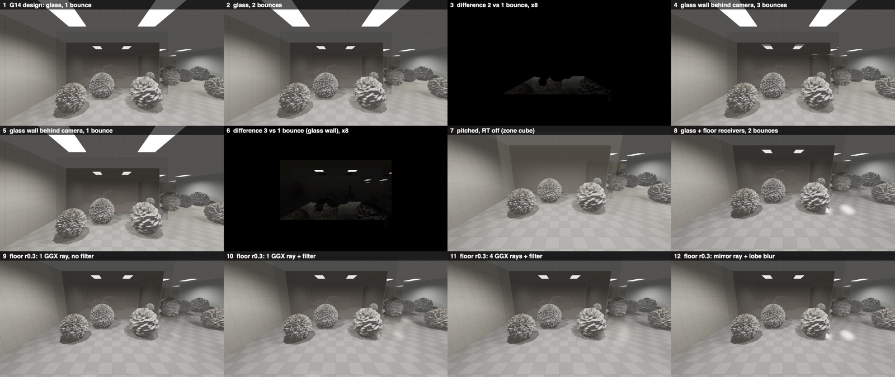

# 11b — Secondary reflections: how shipped games do them, and what they cost on the M3 Max

2026-10-03 · visual chat (游戏视觉) · workflow glass-rt-track, secondary-reflection investigation, research + bench stage · **status: DONE** (no project file changed)

**The question.** Red showed a Control RTX on/off pair: a glass cabinet reflects the room, and a glossy parquet floor reflects the cabinet (labelled "二次反射", secondary reflection). He says our window glass has none, and wants the cause found and fixed at the highest desktop spec. This stage answers two parts:
- **(a) research:** how shipped games get secondary reflections;
- **(b) bench:** what one, two and three bounces, wider receivers and glossy rays cost on Red's M3 Max.

The surface inventory is `11a_glossy_surfaces.md`. The fix is a later stage.

**Inputs, read in full:** `01_code_review.md`, `02_runtime_probe.md`, `03_research.md`, `10_rt_glass_design.md`, `11a_glossy_surfaces.md`.
- Also read: the 03 benches (`03_bench/rt_bench.mm.txt`, `rt_bench2.mm.txt` and their logs).
- New sources: the Control chapter of Ray Tracing Gems II, **read in full this time** (03 could not fetch it); the Battlefield V GTC slides (text extracted); and the Lumen, HDRP, Metro and Cyberpunk pages (§7).

**What was written.**
- This report.
- `11b_bench/`: the bench source `rt_bench3.mm.txt` and its logs.
- `images/11b_multibounce_sheet.jpg`.

Nothing else under `Frontrooms3D/` was touched. No Unity was started. The bench ran standalone, from the scratchpad copy `scratchpad/rt_bench2/`.

**Tags.**
- **MEASURED** = timed or computed on Red's M3 Max for this report.
- **ESTIMATE** = arithmetic or judgement.
- **UNVERIFIED** = not confirmed from a source read for this report.

Sources are cited as [A..] Apple, [G..] games and graphics, [D..] project documents (§7).

**Machine load.** The Mac was heavily loaded by other workflow tracks throughout: CPU 1-minute load averages of 320–460. Every timing line in the logs carries its own `load` value, and every timing table below gives the load range of the runs it comes from. Each number is the median of 11 timed dispatches; tables give the median and range over 2 passes × 2 separate process runs. Run-to-run spread was mostly within ±15 %, with occasional single-pass spikes, which the ranges show.

---

## 0. For Red

1. **Why our glass shows no secondary reflection.** There are four causes, stacked:
   - **(a) Nothing is ray traced in the game today.** This was already established in 01/02.
   - **(b) Even the planned system traces only the window glass, with one bounce.** This is true of ChatGPT's prototype and also of the G14 design (`10` §1.3, §1.5).
     - In the prototype, a pixel traces only when it is glass. It gets one mirror ray, flat fake-sun shading and a blue sky.
     - In G14, the receivers are `Glass_Window` only. When a reflection ray hits another pane, that pane shows the static zone cube. When it hits a glossy object, the object shows the zone cube too.
     - Neither ever puts a reflection on a floor, a CRT or chrome.
   - **(c) Content.** The main game's floors are carpet (`11a`). The Level 0 and Office rooms have nothing like Control's parquet. The glossy things are small props: CRTs, chrome, black glass, cabinet glass, cherry and ebony.
   - **(d) Raster.** The raster gives those props no room reflection either: there are no probes, no SSR, and the zone cube is a stub (`11a` §0.4).
2. **What Control actually does: one bounce, on every surface.** The Remedy/NVIDIA chapter [G7] describes it:
   - **Opaque surfaces:** one GGX ray per pixel on **every non-sky pixel**. The hits are lit by clustered dynamic lights, with precomputed GI standing in for the second bounce.
   - **Glass:** the nearest transparent layer gets one mirror ray. The result is stored as a radiance + depth texture that the forward transparent pass reads. That is the same hand-off G14 uses.
   - **Fallback:** past 60 m, cube maps.

   So the glossy floor in Red's screenshot reflects the cabinet because **the floor is a receiver**, not because of recursion. Whether the cabinet glass shows its own reflection inside the floor's reflection is not described. The chapter puts blended objects into the acceleration structure under a separate cull mask, which suggests opaque reflection rays skip them (UNVERIFIED).

   The other references (§2):
   - Battlefield V, Cyberpunk 2077 (2020 RT), Metro EE and default Lumen are also single-bounce, with a probe, GI or surface-cache fallback.
   - Recursion is an option at extra cost: Lumen "Max Reflection Bounces" ≥ 2, the HDRP bounce count, HDRP recursive rendering, and Cyberpunk's path-traced Overdrive mode.
3. **The bench (MEASURED, M3 Max, synthetic office, §3–§4).**

   | Case | 1080p | 1440p |
   |---|---|---|
   | Glass receivers only (25 % of the screen), 1 bounce (the G14 shape) | 0.87 ms | 1.49 ms |
   | Same, **2 bounces** (18.7 % of glass pixels recurse: the glossy floor seen in the glass) | 1.21 ms | 1.98 ms |
   | Same, 3 bounces | 1.41 ms | 2.23 ms |
   | Same, carpet floors as in Level 0/Office (nothing to recurse into) | 0.99 → 1.03 ms | 1.50 → 1.51 ms (no change) |
   | Two windows facing each other, 1 → 2 → 3 bounces (95 % of glass pixels recurse) | 1.46 → 3.09 → 3.69 ms | 2.38 → 5.20 → 6.42 ms |
   | Glass + glossy floor receivers, 53.5 % of the screen: glass + 1 GGX ray + filter on the floor | 5.04 ms | 8.44 ms |
   | Same, 4 GGX rays + filter | 13.7 ms | 22.9 ms |
   | Same, one mirror ray + roughness blur | 3.50 ms | 5.57 ms |

   - **A second bounce costs about 2× a first bounce per pixel that recurses:** ~0.07 ms (1080p) or ~0.11 ms (1440p) per 1 % of the screen.
   - **A third bounce is invisible.** It changes ≤ 1/255 on 99 % of glass pixels, even with a dark room beyond the pane. A Fresnel importance cut-off of 0.004 removes it automatically.
   - **Glossy (non-mirror) floor rays cost 3–4× a glass mirror ray per pixel with 1 ray + filter, and 5–6× with 2 rays.** They are incoherent, and they need a filter because there is no TAA.
4. **What the secondary reflection looks like in pixels** (MEASURED, 8-bit display values after the tonemap, §4.3):
   - **Floor in the glass, 2nd bounce:** at most 10/255 (16/255 with a dark room beyond). It touches 15–19 % of glass pixels.
   - **Facing windows (pane in pane):** up to 61/255 (74/255 dark beyond) on lamp-lens reflections. 74–88 % of glass pixels change by ≥ 2/255.
   - **Turning the floor into a receiver** (Control's actual effect): mean 8.8/255, p99 53/255, up to 114/255. 33 % of floor pixels change by ≥ 8/255.

   **The biggest visual change is receivers beyond glass, not recursion.**
5. **Recommendation for the highest desktop spec** (ESTIMATE; the design stage decides, §5):
   - **(i) Receivers.** Extend receivers from `Glass_Window` to every surface with smoothness ≥ 0.6, or metallic ≥ 0.5 and smoothness ≥ 0.5 (`11a` §5). Pick the ray type by smoothness:
     - **≥ 0.8:** one mirror ray, plus a small lobe blur for 0.8–0.9;
     - **0.6–0.8:** 2 GGX rays plus a 2-pass edge-aware filter, or a deterministic mirror ray plus an anisotropic lobe blur. The second is the only option for large floors.
   - **(ii) Recursion.** Allow a **second bounce** only when the hit's smoothness is ≥ 0.8: glass, CRT, black glass, chrome, glazed ceramics. Rougher hits keep the zone cube. Use the 0.004 Fresnel cut-off and no third bounce.
   - **(iii) No TAA.** Use a fixed, world-anchored ray jitter, as Control does ([G7] §46.6.1). Never re-randomize per frame.
   - **Cost.** For a typical main-game window view at 1440p: ≈ 3.7–4.6 ms total GPU (ESTIMATE, §5.1), against G14 Ultra's 2.2–3.4 ms (which also needs point 6's correction). A glossy Run floor would add 3.8–5.2 ms with mirror + blur, and 3–5× that with 2–4 GGX rays.
6. **Correction to 03/10.** Bench 1 and bench 2 had the same C++/MSL struct mismatch as the prototype's R4: 72 vs 80 bytes in bench 1, 88 vs 96 in bench 2. Every instance after the first was shaded from garbage pointers.
   - Corrected bench 2 is **1.5–2.8× slower (about 2×)** than the buggy build, measured the same minute, for the production-shading case: 1440p glass 25 % 1.24–1.63 ms (buggy 0.57–0.89); 1080p pane filling the screen 2.44–2.76 ms.
   - **Against the values that 03/10 quote, the corrected numbers are 10–55 % higher.** The break shot on High at 1080p rises from 2.1–3.1 ms to ~3.1–3.6 ms. Today's correct numbers are G1 above and §4.1.

---

## 1. What "secondary reflection" needs

| | Meaning | In FrontRooms | What G14 does today |
|---|---|---|---|
| **(i) Receivers beyond glass** | Surfaces other than glass trace their own reflection rays. The glossy floor that shows the cabinet is this. | In the main game, small props (`11a` §4): CRT faces 0.86, black glass 0.95, the interior-window pane 0.84, chrome 0.85 (metal), cabinet/hutch/vending glass 0.92, cherry 0.71, ebony 0.66, brass 0.60 (metal). The only reflective floor is the Run corridor's VCT, at 0.525. | None. Opaque glossy surfaces get Unity's default reflection ×0.3 in the raster |
| **(ii) Recursion** | A reflection ray that hits a specular surface continues: glass seen in glass, or a glossy floor seen in glass. Each step is weighted by the hit's Fresnel. | Pane in pane (two windows facing each other), a CRT or chrome inside a window's reflection, and the floor's reflection seen in the glass | A hit pane is see-through + F × zone cube. Every other hit is shaded flat + zone cube (`10` §1.5) |
| **(iii) Roughness-dependent rays and filtering** | Non-mirror receivers need rays spread over the GGX lobe, plus a filter. Without TAA the filter must be spatial only. | Cherry, ebony, brass, the Run VCT, `Door_Veneer` (sheen) | Not needed for glass: it is a mirror, and smudges are blurred deterministically (`10` §1.6) |

**Physics, for scale (ESTIMATE, Schlick).**
- A pane reflects 8 % face-on (`_PaneF0` 0.08) and a dielectric floor 4–25 % (`11a` §2).
- So a secondary reflection is a product of two Fresnel weights: 8 % × 8 % = 0.6 % for pane in pane, or 8 % × (4–25 %) for a floor seen in glass.
- It reads only where the reflected thing is bright (lamp lenses) or the background is dark (dark-beyond windows, dark cabinet interiors).
- §4.3 measures this.

---

## 2. How shipped games get secondary reflections (research)

| Game / engine | Receivers | Bounces at a reflection hit | Glossy (rough) rays and filter | Glass |
|---|---|---|---|---|
| **Control** (Remedy, Northlight, 2019) [G7] | **Every non-sky pixel** traces one reflection ray from the raster G-buffer. Ray length depends on roughness: about 3 m at roughness 1, rising exponentially to about 200 m at roughness 0 | **One.** One unified PBR shading model for all hits, lit by a view-space light cluster. **Precomputed voxel GI approximates the second bounce at hits** (and the first bounce for misses, sampled at the ray end) | GGX importance sampling, ray direction jittered by **world-space-position-based noise**. Denoiser: firefly clamp, temporal accumulation with variance clipping, then a spatial filter run twice per direction, with bilateral, hit-distance and smoothness weights (SVGF-inspired [G15]). Fresnel is demodulated before filtering | Transparent surfaces are found with primary rays against transparents only (limited by opaque depth). **Nearest layer only**, one **mirror** ray (roughness ignored, normal map kept), ray length 60 m, then a cube-map fade. Radiance + depth go to a texture; the forward transparent pass uses it when the depths match |
| | Cost at 2560×1440 on an RTX 3090 (Table 46-1) | Opaque reflections: trace 1.0–1.4 ms + shade 1.1–1.4 ms + denoise 0.8 ms ≈ **3.2–3.3 ms** | | Transparent reflections: **0.4–1.5 ms** (trace + shade). All RT effects together: 7.1–8.9 ms |
| **Battlefield V** (DICE, 2018) [G1][G3] | Materials with smoothness ≥ 0.9 (Low/Medium) or ≥ 0.5 (High/Ultra). The ray budget is 15–40 % of the screen's pixels, spread by variable-rate tracing (more on water and at grazing angles). Screen-space march first; rays only where it fails | **One.** The closest-hit shader returns a G-buffer-format payload. A separate lighting pass loops over point lights, spot lights and **reflection volumes**, so a reflective surface seen in a reflection shows its probe | Spatial "BRDF filter" (ray reuse after Stochastic SSR), a temporal filter, and an image filter sized by an {angle, roughness} lookup table. Slide budget: spatial 1.45 + temporal 0.24 + image 1.00 ms of a 6.29 ms pipeline (GPU and resolution not stated on the slides: UNVERIFIED) | Windows are traced like any other surface ([G4], in 03) |
| **Cyberpunk 2077** (2020 RT) [G9] | All surfaces, opaque and transparent, up to several kilometres | **Single bounce** (NVIDIA's wording) | Denoised (NRD per secondary sources, UNVERIFIED) | Transparent reflections on glass |
| **Cyberpunk 2077 RT Overdrive** (2023) [G22] | Path tracing | Reflections now carry bounced detail and run at full resolution (NVIDIA). Bounce count not stated (UNVERIFIED) | ReSTIR / NRD / Ray Reconstruction (UNVERIFIED details) | — |
| **Metro Exodus EE** (4A, 2021) [G8] | Ray-traced reflections only where SSR fails | Hits use the same low-detail material system as the RT GI, with full PBR lighting from analytic lights. Recursion is not described | — | not described |
| **UE5 Lumen** [G10] | Up to **Max Roughness to Trace** (higher = much more GPU) | **Max Reflection Bounces**, default 1: no reflections inside mirror-like surfaces seen in a reflection. Epic: 2+ avoids black areas in reflections when the budget allows. **Surface Cache** mode (default) lights hits from the cached lighting, which cannot represent view-dependent material logic, so a mirror seen in a reflection shows its cached lighting, not a reflection. **Hit Lighting** evaluates lighting at the hit. Epic: hardware RT is the only way to get high-quality mirror reflections | Lumen's own temporal denoiser (03) | High Quality Translucency Reflections: a mirror reflection on the **front layer** only; other layers use the Radiance Cache. Max Refraction Bounces makes translucents traced (more cost) |
| **Unity HDRP** [G12][G12b] | Minimum Smoothness. Full Resolution = one ray per pixel per frame | RT reflections have **Bounce Count**: cost grows **exponentially**. **Last Bounce** and **Ray Miss** choose the fallback (probes, sky) | **Sample Count**: cost grows linearly. Optional denoiser | **Recursive Rendering**: reflection and refraction rays recursively, up to a max depth, for multi-layer transparents (Unity's example: car headlights). Recursive objects get no other RT effects. Unity recommends RT reflections, not recursion, for simple mirrors |

**Lessons for FrontRooms.**
1. **Receivers are what make Control's floor shot.**
   - Control, BFV and Cyberpunk all trace **every sufficiently glossy surface**, with one bounce.
   - A reflection inside a reflection is a **fallback**: GI in Control, probes in BFV, the surface cache in Lumen.
   - G14 has the fallback (the zone cube), but its receivers are glass only. That gap explains Red's "no secondary reflection" better than recursion does.
2. **Recursion is the expensive, optional extra.**
   - Lumen ships it off by default, and HDRP warns that the cost grows exponentially.
   - For pane in pane, Lumen and Control both limit glass to the **front layer**, as G14 already does.
3. **Glossy rays all lean on temporal accumulation.**
   - Control, BFV, Lumen and NRD all accumulate over frames. FrontRooms has no TAA on purpose (`03` §6.2).
   - Without history, the options are:
     - (a) more rays per pixel;
     - (b) a stronger spatial filter (BFV's image filter, the à-trous filter here);
     - (c) deterministic approximations: a mirror ray plus a roughness blur, fixed world-space jitter (Control), and roughness-limited ray length (Control).
   - §4.4 measures (a)–(c).
4. **Glass stays a mirror everywhere.** Control ignores glass roughness, and Capcom (03 [G16]) and SEED (03 [G2]) do too: no stochastic rays and no denoiser on panes. That stays true for G14 and for any second bounce that lands on glass.

---

## 3. The bench (what was built)

**Where.** `scratchpad/rt_bench2/rt_bench3.mm`, a copy of 03's bench 2 scene, extended. Source: `11b_bench/rt_bench3.mm.txt`; build line in its header. Standalone Objective-C++ and Metal, no Unity: Apple M3 Max, 40 GPU cores, `supportsFamily(Apple9)` = 1, macOS 26.6.2.

**Scene.** It is the same synthetic office as 03 benches 1–2:
- a 96 m square of 6 m cells, with floor and ceiling slabs, 0–2 walls per cell, two troffer lens boxes per cell (emission 8 linear) and 6 props per cell (2k–20k triangles);
- **2,991 instances, 15.04 M instanced triangles**.

What bench 3 adds:
- **Glass.**
  - A 6 mm pane 1.5 m in front of the camera, filling the centre 25 % of a 76° 16:9 view.
  - 77 interior glass partitions (30 % of cells).
  - A glass display cabinet with an object inside (Control's case).
  - An optional **facing glass wall** 0.5 m behind the camera, 5 × 2.8 m. It is only visible to rays when enabled (instance mask 0x04): the two-windows-facing-each-other case.
  - All glass uses the two-surface pane Fresnel (Schlick, F0 0.08).
- **Floor.** The floor slabs can be a glossy VCT-like dielectric (F0 0.04, roughness 0.2/0.3/0.4) or matte carpet (Level 0 / Office).
- **Receiver classification.** A G-buffer pass (untimed) stands in for the raster prepass: 1 = glass receiver, 2 = glossy-floor receiver, 3 = glossy but not a receiver.
- **Trace kernel.** One kernel per receiver pixel, with an explicit ray stack (8 entries, budget 16 rays):
  - **Fresnel-weighted continuation.** On glass: see-through × (1−F)·0.9 plus reflection × F. On a glossy floor: diffuse × (1−F) plus reflection × F.
  - **Max bounce depth 1–3**, an optional **importance cut-off** (pixel Fresnel × path weight), and optional **recursion gating by the hit's roughness**.
  - At every hit: URP-style troffer lamps (32, spot falloff), shadow rays for the 4 nearest shadowing lamps (bounce 2 optional), a texture-array albedo with ray-cone mips, GGX lamp highlights, an ambient term, and emission.
  - A zone-cube stand-in at misses and at the last bounce.
  - **Thin panes:** the back face of a 6 mm pane is passed through and never counted as a second glass layer (§5.4).
- **Glossy receivers.** 1, 2, 4 or 8 GGX VNDF rays per pixel (Heitz 2018), or one mirror ray. Then a **2-pass edge-aware à-trous filter** (5×5 B3 taps, depth/normal weights). Its radius follows the GGX lobe footprint α·hit/(view + hit), which is BFV's {roughness, distance} rule. A 1-pass variant also runs.
- **Three views.**
  - **Level:** glass receivers cover 25.1 %.
  - **Pitched 6°:** glass 25.6 % + floor 27.9 % = **53.5 %**.
  - **Pitched 14°:** glass 28.0 % + floor 37.1 % = 65.1 %.
- **Timing.** GPU time per command buffer (`GPUEndTime − GPUStartTime`), trace and filter separately. 14 dispatches, the first 3 dropped, median of 11. 2 passes per process, 2 processes per configuration.
- **Counters.** Receiver share, rays and shadow rays per receiver pixel, and the share of glass and floor receiver pixels that actually spawn a 2nd and a 3rd bounce.
- **Image metrics.** Composite = base + Fresnel × reflection, ×1.6 exposure, ACES fit, sRGB.
  - Bounce-count differences: max-channel |Δ| in 8-bit, per receiver class.
  - Glossy quality: error against a **128-ray reference**, plus the change between two noise seeds. That change is the frame-to-frame shimmer you would see without TAA if the noise were re-randomized every frame.
- **"Dark beyond" mode.** The view through each pane is scaled to 5 %, which simulates a dark room behind the window.

**Configurations** (ids as in the logs):
- `G1` = G14's shape: glass receivers, 1 bounce, the world's floor VCT at roughness 0.3.
- `G2`, `G3` = 2 and 3 bounces.
- `G2s` = recursion only on hits with roughness ≤ 0.2.
- `G2c` = importance cut-off 0.004.
- `G2n` = no shadow rays at bounce 2.
- `G3u` = 2 glass layers.
- `G1k`, `G2k` = carpet floors.
- `GF*` = facing glass wall.
- `P*`, `Q*` = pitched views.
- `PF*`, `QF*` = glass + floor receivers.
- Suffix `r` = raw, `f` = 2-pass filter, `f1` = 1-pass filter, `s2`/`s4` = 2/4 rays, `m` = mirror ray + lobe blur.
- `PR2*` / `PR4*` = floor roughness 0.2 / 0.4.

**What it is not.** It is not Unity and not the game's meshes or textures. It is one view of a synthetic scene, with a naive filter (it reads RGBA32F positions per tap). There is no Unity load on the GPU besides what other processes put there. Treat absolute numbers as ±30 % and **ratios as the result**. The authoritative numbers come from the in-engine timers that `10` §3.4 plans.

An earlier attempt of this stage (load ~420, scratchpad `attempt1_*`) did not handle the 6 mm pane's back face. Its glass numbers are superseded by these.

---

## 4. Results (MEASURED)

### 4.1 Correction to 03's bench 1 and bench 2 (struct layout)

Bench 1 declares the per-instance record as 72 bytes in C++ and 80 bytes in MSL. Bench 2 declares 88 in C++ and 96 in MSL. The cause is that MSL `float4` is 16-byte aligned; this is the same defect as the prototype's R4.
- Every instance after the first was read at the wrong stride, so vertex and index pointers were garbage. The kernel completed without a command-buffer error, so nobody noticed.
- Traversal cost (TLAS/BLAS) is unaffected; hit fetch and shading are.
- Fix: `alignas(16)` plus 2 pad words (`11b_bench/bench2_struct_fix.diff.txt`). Bench 3 has a `static_assert(sizeof == 96)`.

Interleaved runs, same minute (`11b_bench/bench2_struct_check.txt`; 1-minute load 438–440):

| bench 2 case | as in 03 (buggy), today | **fixed**, today | 03 / `10` §3 quoted |
|---|---|---|---|
| C: 1440p, glass 25 %, production shading, 1 ray | 0.57–0.89 ms | **1.24–1.63 ms** | 0.86–1.36 |
| E: same, 4 rays per pixel | 2.23–2.63 ms | **4.89–6.18 ms** | 4.31–5.39 |
| G: 1080p, glass 25 % | 0.52–0.57 ms | **0.79–0.98 ms** | 0.73–0.89 |
| I: 1080p, pane fills the screen (the break shot) | 0.99–1.38 ms | **2.44–2.76 ms** | 1.57–2.44 |

03's quoted values happen to sit near the fixed ones because 03 ran under heavier GPU contention. At equal load, the buggy shading is 1.5–2.8× cheaper than the correct shading (same-run pairs; about 2× typical). Against the 03/10 quoted values, the corrected ones are 10–55 % higher.

For G14:
- trace + shading at 1440p with a 25 % window is **~1.5 ms**;
- the 1080p break shot is **~2.4–2.8 ms for the trace alone**;
- the worst case on High (`10` §3.1) therefore rises from 2.1–3.1 to **~3.1–3.6 ms** (ESTIMATE: + TLAS 0.25–0.3 + prepass 0.15–0.25 + resolve 0.3), against the destruction plan's +2 ms.

### 4.2 Bounces: cost

Median (range) in ms over runs B and C, **1-minute load 389–395 (B) and 450–457 (C)**. "Recurse" = share of glass receiver pixels whose reflection ray spawned a 2nd bounce; "3rd" = share reaching a 3rd bounce.

| Config | Receivers | Recurse / 3rd | rays / shadow rays per receiver px | 1080p | 1440p |
|---|---|---|---|---|---|
| `G1` 1 bounce (G14 shape) | glass 25.1 % | 0 / 0 | 1.00 / 2.26 | **0.87** (0.81–2.87*) | **1.49** (1.31–1.92) |
| `G2` 2 bounces | same | 18.7 % / 0 | 1.19 / 2.95 | **1.21** (1.08–1.98) | **1.98** (1.80–2.03) |
| `G2c` 2 bounces, cut-off 0.004 | same | 18.7 % / 0 | 1.19 / 2.95 | 1.34 (1.26–2.17) | 2.07 (1.99–2.19) |
| `G2n` 2 bounces, no shadow rays at bounce 2 | same | 18.7 % / 0 | 1.19 / 2.26 | 1.09 (1.00–1.61) | 1.80 (1.67–1.82) |
| `G2s` 2 bounces, recurse only on hits r ≤ 0.2 | same | 0 / 0 (the floor is r 0.3) | 1.00 / 2.26 | 0.94 (0.84–1.05) | 1.54 (1.39–1.93) |
| `G3` 3 bounces | same | 18.7 % / 0 | 1.19 / 2.95 | 1.41 (1.27–1.60) | 2.23 (2.12–2.45) |
| `G3u` 3 bounces, 2 glass layers | same | 18.7 % / 0 | 1.19 / 2.95 | 1.32 (1.27–1.52) | 2.00 (1.77–2.26) |
| `G1k` / `G2k` carpet floors, 1 / 2 bounces | same | 0 / 0 | 1.00 / 2.26 | 0.99 / 1.03 | 1.50 / 1.51 |
| `GF1` facing glass wall, 1 bounce (see-through + cube) | same | 0 / 0 | 2.90 / 2.26 | **1.46** (1.32–2.30) | **2.38** (1.99–2.63) |
| `GF2` facing glass wall, 2 bounces | same | 95.1 % / 0 | 4.23 / 5.06 | **3.09** (2.71–3.45) | **5.20** (3.89–5.80) |
| `GF3` facing glass wall, 3 bounces | same | 95.1 % / 29.2 % | 4.70 / 5.97 | 3.69 (3.45–4.03) | 6.42 (5.48–6.99) |
| `GF3c` same, cut-off 0.004 | same | 95.1 % / **0.1 %** | 4.23 / 5.06 | **3.13** (2.93–4.91) | **5.18** (4.94–5.47) |
| `GF3u` same, 2 glass layers | same | 95.1 % / 29.2 % | 4.71 / 5.99 | 3.72 (3.60–3.83) | 6.22 (6.04–6.97) |

\* one contended pass; the other three were 0.81–0.92.

What this means:
- **Cost per pixel.** A first-bounce mirror ray on glass costs **0.035 ms (1080p) / 0.059 ms (1440p) per 1 % of the screen**. A second bounce costs **~0.07 / ~0.11 ms per 1 % of the screen that recurses**:
  - G2 − G1: 0.34 ms over 4.7 % of the screen at 1080p, 0.49 ms at 1440p;
  - GF2 − GF1: 1.63 ms over 23.9 % at 1080p, 2.82 ms at 1440p.
  - So a second bounce is about **2× a first bounce**: its rays are incoherent after two reflections, and it adds shadow rays (2.26 → 2.95 per pixel).
- **Recursion only costs where it happens.** With carpet floors (Level 0 / Office) the second bounce costs nothing (`G2k` = `G1k`). Cost scales with how much of what the glass sees is itself specular.
- **The worst case is two windows facing each other.** +1.6 ms (1080p) / +2.8 ms (1440p) over one bounce, when a window fills a quarter of the screen.
- **Third bounce.** A third bounce adds 0.2–1.2 ms. The **0.004 cut-off removes 99.7 % of third-bounce rays** at no image cost (§4.3): pane F 0.08 × 0.08 × 0.08 ≈ 0.0005 < 0.004.
- **Shadow rays at bounce 2** cost 0.1–0.2 ms (`G2n`). Their visual effect was not measured.
- **Thin panes double the see-through traversals.** `GF1` traces 2.90 rays per pixel without recursing: the pane's back face, the facing pane's front and back faces, then the room. That is +0.6 ms (1080p) / +0.9 ms (1440p) over `G1`. Single-sided pane geometry in the acceleration structure, or a skip-own-pane rule, would remove the back-face passes (§5.4).

### 4.3 Bounces: what you see (8-bit display difference, 1080p)

From `11b_bench/runB_diff_quality.txt` (1-minute load 395–400). "Dark beyond" = the view through the pane at 5 %, i.e. a dark room behind the window; the reflection terms are unchanged.

| Comparison | Pixels | mean \|Δ\| /255 | p99 | max | ≥ 2/255 | ≥ 8/255 | ≥ 24/255 |
|---|---|---|---|---|---|---|---|
| 1 vs 2 bounces, glass (`G1`/`G2`) | glass 25.1 % | 0.58 | 7 | 10 | 15.1 % | 0.4 % | 0 |
| same, **dark beyond** | glass | 1.21 | 12 | 16 | 18.7 % | 5.0 % | 0 |
| 2 vs 3 bounces (`G2`/`G3`), lit and dark beyond | glass | 0.00 | 0 | 0 | 0 | 0 | 0 |
| 1 vs 2 bounces, carpet (`G1k`/`G2k`) | glass | 0.00 | 0 | 0 | 0 | 0 | 0 |
| **Facing windows**, 1 vs 2 (`GF1`/`GF2`) | glass | 2.35 | 7 | **61** | 73.5 % | 0.9 % | 0.6 % |
| same, **dark beyond** | glass | 3.83 | 13 | **74** | 88.4 % | 4.6 % | 0.6 % |
| Facing windows, 2 vs 3 (`GF2`/`GF3`) | glass | 0.15 | 1 | 12 | 0.3 % | 0 | 0 |
| same, dark beyond | glass | 0.26 | 1 | 18 | 0.7 % | 0.2 % | 0 |
| Glossy floor, 1 vs 2 bounces (`PF1m`/`PF2m`) | floor 37.1 % | 0.02 | 1 | 2 | 0.2 % | 0 | 0 |
| **Floor as a receiver vs zone cube** (`P1`/`PF1m`) | floor 37.1 % | **8.76** | **53** | **114** | 99.8 % | **33.0 %** | 4.5 % |

What this means:
- **Two bounces are worth having only where the glass sees another mirror.** That means pane in pane, a CRT, black glass or chrome inside a window's reflection, and lamp lenses seen through them. There the second bounce is a real, visible feature: up to 61–74/255.
- **A glossy floor seen in glass is subtle** (≤ 10–16/255). So is a floor's reflection of glass (≤ 2/255), because the second Fresnel weight is small.
- **Three bounces are never worth it.**
- **Receivers beyond glass are the visible change.** A traced floor instead of the cube changes a third of the floor by ≥ 8/255. That is the effect in Red's Control screenshot.

Figure: `images/11b_multibounce_sheet.jpg` (1080p tiles, halved):
- (1) G14 shape; (2) 2 bounces; (3) their difference ×8;
- (4) facing glass wall, 3 bounces; (5) the same with 1 bounce; (6) their difference ×8: the lens "mirror tunnel";
- (7) pitched view, RT off (zone cube); (8) glass + floor receivers, 2 bounces;
- (9)–(12) floor at roughness 0.3: 1 GGX ray raw, 1 ray + filter, 4 rays + filter, mirror + lobe blur.



### 4.4 Receivers 25 % vs 50–65 %, and glossy rays + filter

Floor roughness r = perceptual roughness (α = r²; smoothness = 1 − r). 1 bounce unless stated. **1-minute load: runs B/C 389–457 (14° view); runs D/E 321–378 (6° view).**

| Config | Receivers (glass + floor) | Rays per receiver px | 1080p total (filter) | 1440p total (filter) |
|---|---|---|---|---|
| `Q1` glass only, 6° view | 25.6 % | 1.00 | **1.10** (1.02–1.21) | **1.66** (1.49–1.84) |
| `QF1m` + floor r0.3, mirror ray + lobe blur | **53.5 %** | 1.02 | **3.50** (3.35–3.77; filter 0.78–0.82) | **5.57** (5.42–5.93; 1.31–1.36) |
| `QF1f` + floor r0.3, 1 GGX ray + 2-pass filter | 53.5 % | 1.01 | **5.04** (4.13–5.17; 0.89–1.01) | **8.44** (7.54–9.15; 1.54–1.79) |
| `QF1s2` same, 2 GGX rays | 53.5 % | 1.54 | 7.73 (7.45–8.30) | 13.28 (12.80–13.63) |
| `QF1s4` same, 4 GGX rays | 53.5 % | 2.62 | 13.66 (12.86–14.12) | 22.89 (22.05–23.70) |
| `QF2f` / `QF2m` 2 bounces, GGX + filter / mirror + blur | 53.5 % | 1.10 / 1.12 | 5.34 / 3.84 | 9.34 / 6.61 |
| `P1` glass only, 14° view | 28.0 % | 1.00 | 1.04 (0.84–1.09) | 1.70 (1.35–1.98) |
| `PF1r` + floor r0.3, 1 GGX ray, no filter | 65.1 % | 1.01 | 4.29 (4.13–4.49) | 6.62 (5.84–7.14) |
| `PF1f1` 1 GGX ray + 1-pass filter | 65.1 % | 1.01 | 4.98 (filter 0.59–0.65) | 7.19 (0.91–0.93) |
| `PF1f` 1 GGX ray + 2-pass filter | 65.1 % | 1.01 | **5.07** (filter 1.11–1.18) | **8.50** (1.83–1.84) |
| `PF1s2` 2 GGX rays + filter | 65.1 % | 1.59 | 8.01 (7.37–8.63) | 13.32 (12.70–13.65) |
| `PF1s4` 4 GGX rays + filter | 65.1 % | 2.77 | 14.03 (13.02–14.40) | 22.43 (20.93–23.93) |
| `PF1m` mirror ray + lobe blur | 65.1 % | 1.02 | **3.34** (3.16–3.56) | **5.48** (4.96–5.87) |
| `PF2f` / `PF2m` / `PF3f` / `PF3m` 2–3 bounces | 65.1 % | 1.08–1.10 | 5.43 / 3.79 / 5.65 / 4.07 | 9.82 / 5.78 / 8.87 / 6.57 |
| `PR2` / `PR2s2` / `PR2s4` floor r0.2, 1 / 2 / 4 rays + filter | 65.1 % | 1.02 / 1.61 / 2.80 | 4.76 / 7.38 / 12.40 | 7.93 / 12.23 / 20.42 |
| `PR4` / `PR4s2` / `PR4s4` floor r0.4, 1 / 2 / 4 rays + filter | 65.1 % | 0.99 / 1.57 / 2.74 | 5.15 / 8.24 / 15.36 | 8.41 / 14.84 / 27.37 |

**Cost per 1 % of the screen** (ESTIMATE from the medians; floor = (glass + floor − glass only) / floor share; 1080p / 1440p):

| Receiver kind | 14° view | 6° view |
|---|---|---|
| Glass, mirror ray | 0.037 / 0.061 ms | 0.043 / 0.065 ms |
| Floor, mirror ray + lobe blur | 0.062 / 0.102 | 0.086 / 0.140 |
| Floor, 1 GGX ray + 2-pass filter | 0.109 / 0.183 | 0.141 / 0.243 |
| Floor, 2 GGX rays + filter | 0.188 / 0.313 | 0.238 / 0.416 |
| Floor, 4 GGX rays + filter | 0.350 / 0.559 | 0.450 / 0.761 |

**Quality without TAA** (1080p, 14° view, floor pixels 37.1 % of the screen, 8-bit display values; 1-minute load 394–400). "Error" is against the 128-ray reference with the same bounce count. "Shimmer" is the change between two noise seeds, i.e. a pattern re-randomized every frame. 2 bounces at r 0.3 give the same numbers as 1 bounce.

| Floor r | Method | Error mean / p99 | ≥ 4/255 | Shimmer mean | Shimmer ≥ 2 / ≥ 8 |
|---|---|---|---|---|---|
| 0.2 | 1 ray raw | 2.51 / 39 | 12.3 % | 2.09 | 20.7 % / 4.2 % |
| 0.2 | 1 ray + 2-pass filter | 1.30 / 16 | 8.1 % | 0.67 | 10.1 % / 1.0 % |
| 0.2 | 2 rays + filter | 1.13 / 15 | 6.8 % | 0.49 | 8.9 % / 0.4 % |
| 0.2 | 4 rays + filter | 0.92 / 8 | 4.5 % | 0.55 | 6.0 % / 0.1 % |
| 0.2 | mirror + lobe blur | 1.56 / 26 | 8.2 % | 0 | 0 / 0 |
| 0.3 | 1 ray raw | 3.48 / 32 | 21.1 % | 2.74 | 30.5 % / 5.3 % |
| 0.3 | 1 ray + **1-pass** filter | 2.86 / 29 | 17.0 % | 2.58 | 20.4 % / 8.2 % |
| 0.3 | 1 ray + 2-pass filter | 2.18 / 21 | 14.5 % | 1.36 | 19.3 % / 3.6 % |
| 0.3 | 2 rays + filter | 1.84 / 16 | 12.3 % | 0.95 | 18.3 % / 1.6 % |
| 0.3 | 4 rays raw | 3.45 / 33 | 18.5 % | 3.60 | 21.4 % / 9.8 % |
| 0.3 | 4 rays + filter | 1.34 / 9 | 6.1 % | 0.88 | 14.5 % / 0.4 % |
| 0.3 | 8 rays + filter | 1.12 / 7 | 4.9 % | 0.63 | 7.0 % / 0.1 % |
| 0.3 | mirror + lobe blur | 2.50 / 27 | 15.7 % | 0 | 0 / 0 |
| 0.4 | 1 ray raw | 4.34 / 45 | 32.5 % | 3.69 | 35.6 % / 6.9 % |
| 0.4 | 1 ray + 2-pass filter | 2.94 / 20 | 25.4 % | 1.72 | 30.9 % / 3.9 % |
| 0.4 | 2 rays + filter | 2.44 / 17 | 19.7 % | 1.06 | 21.9 % / 0.8 % |
| 0.4 | 4 rays + filter | 1.53 / 9 | 7.2 % | 1.01 | 16.6 % / 0.3 % |
| 0.4 | mirror + lobe blur | 3.36 / 31 | 25.7 % | 0 | 0 / 0 |

What this means:
- **Glossy floor rays cost 3–4× a glass mirror ray per pixel with 1 ray + filter, and 5–6× with 2 rays + filter.** There are two reasons. GGX directions are incoherent, and floor rays travel far at grazing angles; the 6° view costs more per pixel than the 14° view. Also, the filter is a fixed 0.8–1.8 ms per frame. Control's equivalent is 3.2–3.3 ms for all opaque reflections at 1440p on an RTX 3090 [G7].
- **Without TAA, rays must be filtered.**
  - Even 4 rays without a filter shimmer: 9.8 % of pixels change by ≥ 8/255 at r 0.3, because the fireflies from the lenses spread.
  - A single sparse filter pass lowers the mean error but makes strong shimmer worse than no filter at r ≥ 0.3: ≥ 8/255 on 8.2 % vs 5.3 % of pixels at r 0.3, and 17.5 % vs 6.9 % at r 0.4.
  - The 2-pass filter is the minimum. **2 rays + 2-pass filter** is the cheapest acceptable stochastic setting at r ≤ 0.3 (shimmer ≥ 8/255 on ≤ 1.6 % of pixels). **4 rays + filter** is clean at all three roughnesses (≤ 0.4 %).
  - Over 37 % of the screen, these cost 8.0 / 14.0 ms at 1080p and 13.3 / 22.4 ms at 1440p. That is **affordable for small props, not for a full floor**.
- **Mirror ray + lobe blur never shimmers** and costs about ⅔ of 1 GGX ray. It is biased: p99 error 26–31/255. Lamp reflections come out as round blobs instead of streaks stretched toward the viewer (tiles 11 vs 12 of the figure). An **anisotropic** blur stretched by 1/cos θ along the reflection direction should cut that bias; this is not measured (ESTIMATE).
- **The cheapest deterministic options no stochastic method matches:**
  - Control's roughness-limited ray length;
  - fixed world-space jitter, so a still camera never shimmers and a moving one shows grain that sticks to the surface (Control, [G7] §46.6.1).

---

## 5. What this means for G14 (proposal for the design stage; ESTIMATE)

### 5.1 Receivers beyond glass

1. **Which materials** (from `11a` §4–5).
   - **Sharp (s ≥ 0.8):** CRT faces, `Office_BlackedGlass` (after M1: wheels → rubber), `Prop_GlassCRT` (interior window, after M3), chrome, glazed ceramics → **one mirror ray**, plus a lobe blur for s 0.80–0.90.
   - **Glossy (0.6 ≤ s < 0.8):** cherry, ebony, brass, the vending front, Run chrome → **2 GGX rays + 2-pass filter** (props are small: ~0.2–0.4 ms per 1 % of the screen at 1440p).
   - **Cabinet, hutch and vending glass:** move `Prop_Glass` to FrontRooms/Glass (`11a` M5) so it is a glass receiver.
   - **Broad sheen (s < 0.6), including today's Run VCT at 0.525:** zone cube, unchanged.
   - **If Red raises the Run VCT to s ≈ 0.7–0.75** (`11a` M4): **mirror ray + anisotropic lobe blur** on the floor, ~3.8–5.2 ms at 1440p for 37 % of the screen. Stochastic rays there would cost 12–28 ms (2–4 rays + filter).
2. **How opaque receivers get rays** (architecture; UNVERIFIED in URP).
   - G14 traces from a glass-only prepass after opaques. Opaque receivers need their own reflection G-buffer: position or depth, normal, roughness, F0 and receiver class.
   - Candidates:
     - (a) A **`FRReflPrepass` pass** on FrontRooms/Surface and the prop Lit material, after URP's DepthNormals. The trace then runs **before** the opaque pass, and the opaque shaders read `_FR_ReflRT` in place of their environment term.
     - (b) Tracing after opaques, with an additive pass.
   - Both need a **hook in FrontRooms/Surface** like the glass hook: the lookdev owner's contract.
   - (a) also lets one dispatch serve glass and opaque receivers: glass is depth-tested against the prepass depth. It may avoid G14's render-pass split (O1).
3. **Budget, main-game view with one window at 1440p** (ESTIMATE, per-1 % costs of §4.4):
   - glass 25 % × 0.06 = 1.5 ms;
   - sharp props ~5 % × 0.06–0.10 = 0.3–0.5 ms;
   - glossy props ~4 % × 0.3–0.4 = 1.2–1.7 ms;
   - second bounce on 5–15 % of glass pixels = 0.15–0.4 ms;
   - TLAS + prepass 0.5 ms.

   **≈ 3.7–4.6 ms**, against G14 Ultra's 2.2–3.4 ms (which also needs §4.1's correction). Facing windows add up to 2.8 ms while they fill a quarter of the screen.

### 5.2 Recursion

- **Max 2 bounces**, with **mirror rays only**, continued only when the hit has s ≥ 0.8 (glass, CRT, black glass, chrome, ceramics). Every other hit ends with the zone cube at its roughness mip, as `10` §1.5 does today.
  - This keeps every traced image deterministic, so glass needs no filter.
  - It matches Lumen's front-layer and max-bounces approach [G10].
- **Importance cut-off 0.004** (pixel Fresnel × path weight). It removes 3rd bounces (≤ 1/255 on 99 % of pixels) at no image cost.
- **Shadow rays at bounce 2:** optional. They cost 0.1–0.2 ms; their visual effect is not measured.
- **Kernel shape:** an explicit stack of ≤ 8 entries and ≤ 16 rays per pixel worked on the M3 Max with no failures. Apple advises a small ray payload for occupancy [A7], so the stack is the first thing to profile in P1.

### 5.3 Glass in glass

`10` §1.5 "Another pane: see-through + F × zone cube" becomes "see-through + F × **traced mirror** (bounce 2)" on Ultra.
- Cost: +1.6 / +2.8 ms in the worst case (§4.2).
- Effect: lamp reflections in facing windows, up to 61–74/255.

### 5.4 Two implementation rules the bench exposed

1. **Thin-pane back faces.** A see-through ray inside a 6 mm box pane hits that pane's own back face.
   - If that hit counts as "the next glass layer", the 1-layer limit (`10` §1.5) ends there. The zone cube then replaces the room behind the pane, which is what the earlier attempt drew.
   - Rule: count a glass layer only on **entering** hits (geometric normal against the ray), and pass exiting hits through without Fresnel. The pane F0 0.08 already covers both surfaces.
   - Alternatives: register panes as single-sided quads in the acceleration structure, or skip the own pane by instance id. This also saves the extra traversals of §4.2.
2. **Shared struct layouts** need a `static_assert` and a GPU readback test (as `10` §1.9 already plans). The benches show the bug class hides silently.

---

## 6. Open items / UNVERIFIED

1. **What exactly Red's Control frame shows.** Does the floor's reflection of the cabinet include the cabinet glass's own reflection? Per [G7], opaque reflection rays most likely skip blended objects (cull mask), so probably not (UNVERIFIED for that frame).
2. **Overdrive's bounce count**, and Lumen's exact requirements for Max Reflection Bounces (hit lighting / hardware RT): not stated on the pages read.
3. **BFV's per-pass costs:** GPU and resolution are not on the slides.
4. **The anisotropic lobe blur:** proposed, not measured.
5. **Half-resolution glossy tracing:** one ray per 2×2 pixels plus upsample, as in PICA PICA and HDRP. It would cut floor trace cost by ~4×, at the risk of more shimmer. Not measured.
6. **The filter** is a naive implementation (RGBA32F position reads, 25 taps × 2 passes). A packed-depth version should be cheaper; BFV's image filter is 1.0 ms [G1].
7. **In-engine numbers.** Receiver shares in real Office views and the cost of a receiver prepass in URP: measure in a player build (`10` §3.4).
8. **All bench timings** ran at CPU load 320–460, with unknown GPU contention from other processes.

---

## 7. Sources

**Games and graphics**
- [G1] Johannes Deligiannis, Jan Schmid (EA DICE), "'It Just Works': Ray-Traced Reflections in 'Battlefield V'", NVIDIA GTC 2019, session S91023. The slide text was extracted for this report (pipeline, lighting loop with reflection volumes, filters, slide timings). https://developer.download.nvidia.com/video/gputechconf/gtc/2019/presentation/s91023-it-just-works-ray-traced-reflections-in-battlefield-v.pdf
- [G3] HotHardware, "NVIDIA GeForce RTX Ray Tracing In Battlefield V Explored Pre And Post Patch", 2018 (BFV smoothness thresholds and ray budgets; as cited in 03). https://hothardware.com/reviews/battlefield-v-ray-tracing-performance?page=2
- [G5] NVIDIA GeForce news, "Control: Multiple Stunning Ray-Traced Effects Raise The Bar For Game Graphics", 2019. https://www.nvidia.com/en-us/geforce/news/control-rtx-ray-tracing-dlss-out-now/
- [G7] Juha Sjöholm, Paula Jukarainen (NVIDIA), Tatu Aalto (Remedy), "Ray Tracing in Control", *Ray Tracing Gems II*, chapter 46, Apress 2021, open access (CC BY-NC-ND). **Read in full**: §46.1.3–46.1.4, §46.2 (one ray per non-sky pixel, roughness-limited ray length, unified hit shading, GI for the second bounce and for misses), §46.3 (transparent reflections: nearest layer, mirror ray, 60 m, depth-matched texture), §46.6 (denoisers, world-space jitter), §46.7 (Table 46-1). https://link.springer.com/chapter/10.1007/978-1-4842-7185-8_46 ; preprint https://developer.download.nvidia.com/ray-tracing-gems/rtg2-chapter46-preprint.pdf
- [G8] 4A Games, "In-depth technical dive into Metro Exodus PC Enhanced Edition", 6 May 2021 (re-read for reflections). https://www.4a-games.com.mt/4a-dna/in-depth-technical-dive-into-metro-exodus-pc-enhanced-edition
- [G9] Andrew Burnes, NVIDIA GeForce news, Cyberpunk 2077 ray-traced effects, 25 June 2020 and 9 Dec 2020 ("single bounce", all surfaces; as cited in 03). https://www.nvidia.com/en-us/geforce/news/cyberpunk-2077-ray-tracing-dlss-geforce-now-screenshots-trailer/
- [G10] Epic Games, "Lumen Global Illumination and Reflections" (Max Reflection Bounces, Ray Lighting Mode, Max Roughness to Trace, High Quality Translucency Reflections, Max Refraction Bounces) and "Lumen Technical Details" (surface cache, hardware RT for mirrors), UE 5.x documentation, read 2026-10-03. https://dev.epicgames.com/documentation/en-us/unreal-engine/lumen-global-illumination-and-reflections-in-unreal-engine ; https://dev.epicgames.com/documentation/en-us/unreal-engine/lumen-technical-details-in-unreal-engine
- [G12] Unity HDRP 17.3, Screen Space Reflection override, ray-traced properties (Mode, Bounce Count, Sample Count, Ray Miss, Last Bounce, Full Resolution), read 2026-10-03. https://docs.unity3d.com/Packages/com.unity.render-pipelines.high-definition@17.3/manual/reference-screen-space-reflection.html
- [G12b] Unity HDRP 17.3, "Recursive rendering", read 2026-10-03. https://docs.unity3d.com/Packages/com.unity.render-pipelines.high-definition@17.3/manual/Ray-Tracing-Recursive-Rendering.html
- [G15] Christoph Schied et al., "Spatiotemporal Variance-Guided Filtering", HPG 2017 (the à-trous filter family; cited by [G7]). https://research.nvidia.com/publication/2017-07_spatiotemporal-variance-guided-filtering-real-time-reconstruction-path-traced
- [G22] NVIDIA GeForce news, "Cyberpunk 2077: Technology Preview Of New Ray Tracing Overdrive Mode Out Now", April 2023. https://www.nvidia.com/en-gb/geforce/news/cyberpunk-2077-ray-tracing-overdrive-update-launches-april-11
- Eric Heitz, "Sampling the GGX Distribution of Visible Normals", JCGT 7(4), 2018 (the VNDF sampler used in the bench; method from memory, not re-read).

**Apple**
- [A7] Jedd Haberstro, "Explore GPU advancements in M3 and A17 Pro", Apple tech talk 111375, 2023 (intersector API, small payloads; as cited in 03). https://developer.apple.com/videos/play/tech-talks/111375/

**Project documents**
- [D1] `01_code_review.md` (R4 struct mismatch). [D2] `02_runtime_probe.md`. [D3] `03_research.md` (§2.3–2.4 benches, §3 table). [D4] `10_rt_glass_design.md` (§1.3, §1.5, §1.6, §3). [D5] `11a_glossy_surfaces.md` (§2, §4, §5, §6).

---

## 8. Reproduce

```
cd scratchpad/rt_bench2      # copy of 03_bench, extended
xcrun clang++ -std=c++17 -fobjc-arc -O2 -framework Metal -framework Foundation -framework CoreGraphics \
  -framework ImageIO -framework CoreText -framework CoreFoundation rt_bench3.mm -o rt_bench3
./rt_bench3 <tag> timing [idPrefix]   # all configs, or only those whose id starts with idPrefix (e.g. Q)
./rt_bench3 <tag> diff                # 8-bit bounce differences
./rt_bench3 <tag> quality             # glossy error vs 128-ray reference, seed-to-seed shimmer
./rt_bench3 <tag> images              # PNG tiles + 4x3 sheet
```

The logs in `11b_bench/` are as follows. Runs B and C were made before the Q configs and the dark-beyond composite were added; the trace and filter kernels are unchanged since then.
- `runB_timing.txt` and `runC_timing.txt`: all configs except Q;
- `runD/E_timing_view2.txt`: the Q configs;
- `runB_diff_quality.txt`;
- `bench2_struct_check.txt`.

The bench 2 struct fix is `bench2_struct_fix.diff.txt`.
