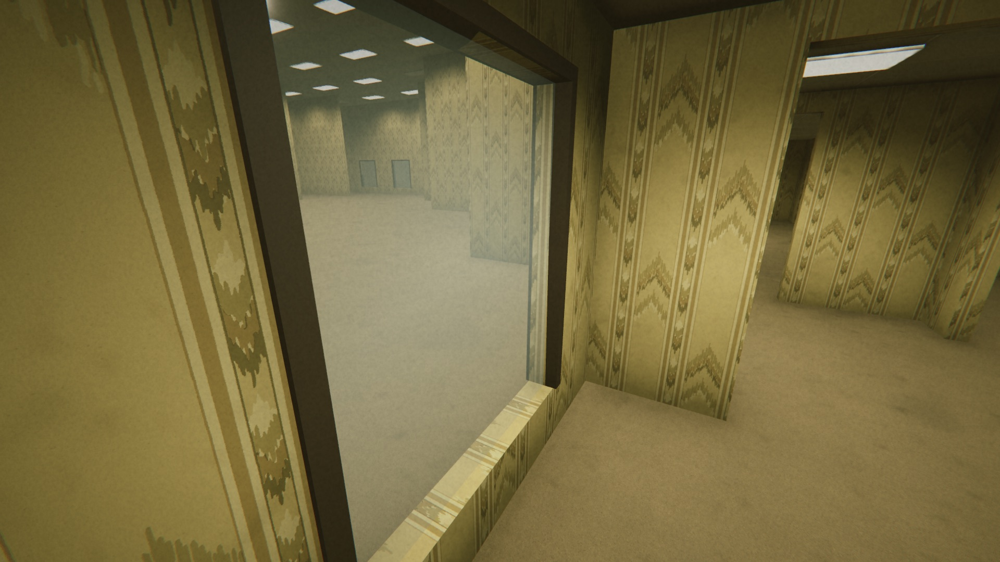
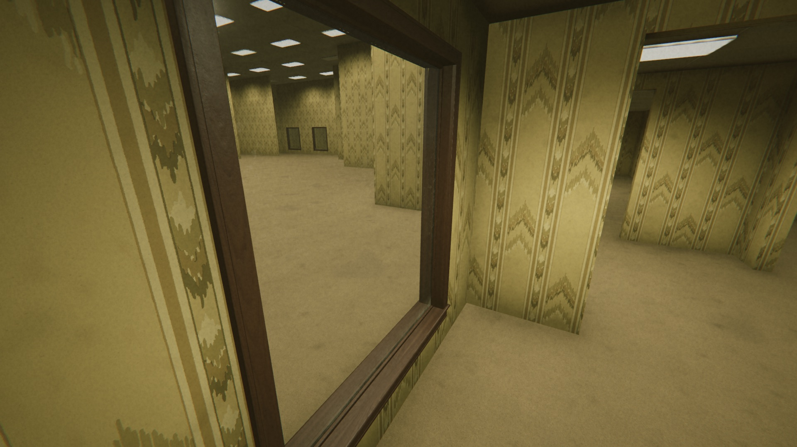
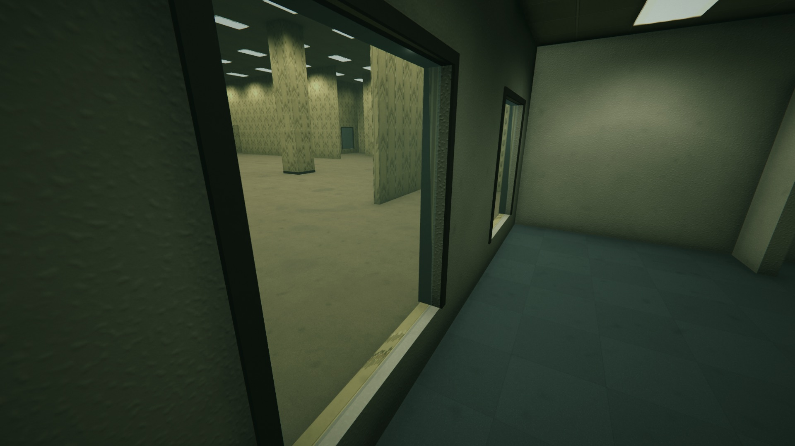
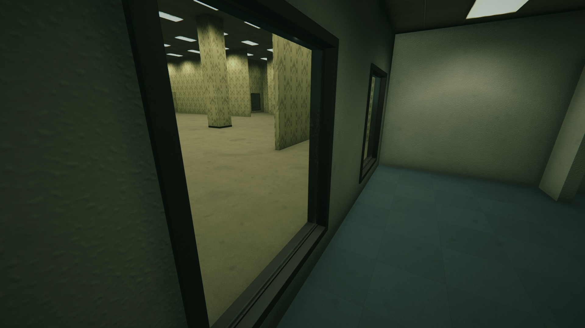
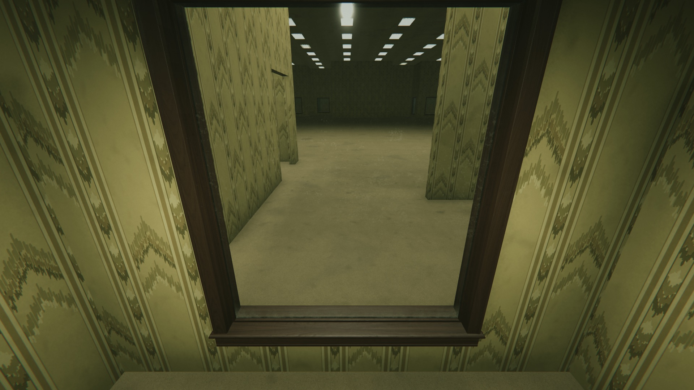
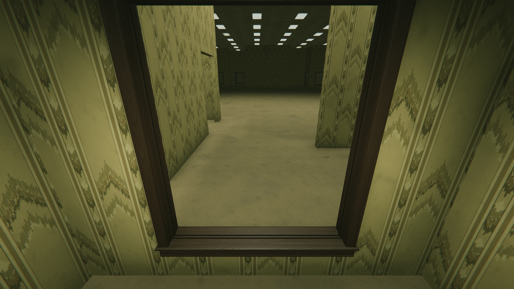
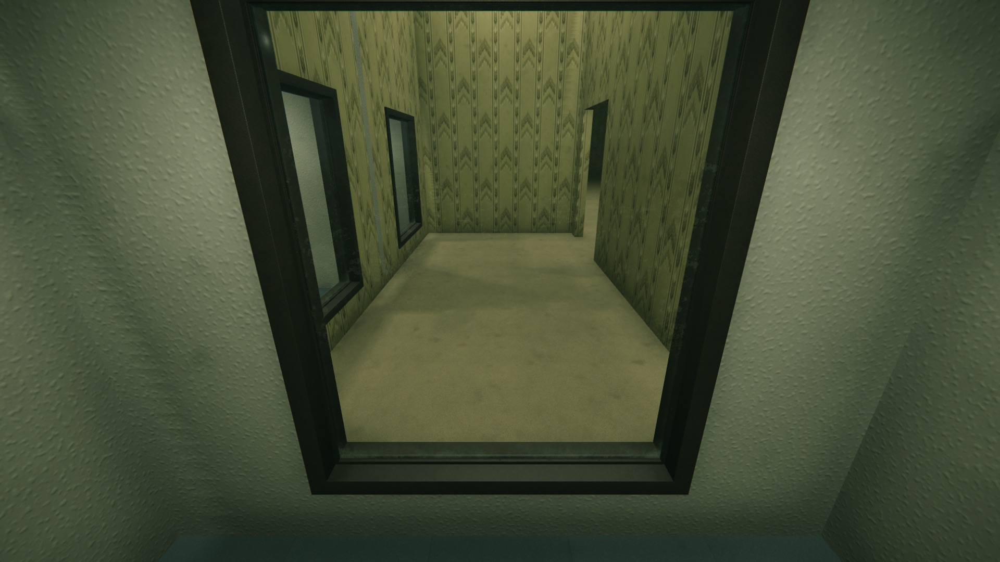
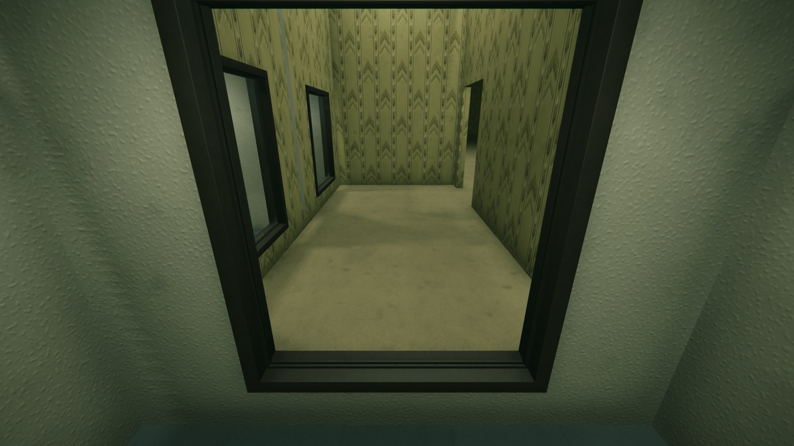

# 01 — Window landing: the clone integration (W-L0 wood, W-OF steel)

Status: DONE, 2026-10-03 12:35. The windows now have real structure, but only in a private clone (`scratchpad/proj_win`). Nothing under `Frontrooms3D/Assets` was changed. The only files written in the real project are in this folder.

Red: "build the window's real structure, not one pane of glass" (re-raised 2026-10-03: "the windows are still just one pane of glass").

Design inputs: `../06_period_windows.md`; `../10_spec.md` §5, §9.4, §10.4. Binding: `../00_map_constraints.md`.

---

## 0. Short answer

- **What landed (in the clone):**
  - Every map window gets an unscaled root, `Window {a}-{b}`.
  - Every window gets a real frame: walnut W-L0 on Level 0 rooms, dark-bronze steel W-OF on Office rooms.
  - Every window gets 16 mm stops on both faces and a 6 mm glass slab. The slab sits 12 mm behind the stops.
- **Gameplay is unchanged:**
  - The pane collider is the same 1.4 × 1.65 × 0.03 box, with the same name, on the wall line.
  - The collision mesh is the same, vertex for vertex.
  - The E ray and the sight rays hit the same things, before and after a break.
  - The Relay's probe still passes through a broken window. The player's climb still works.
- **The kit models are in.**
  - When I started (11:58), the G4 FBX files did not exist, so I built placeholders to the exact §5.2 section.
  - Steel arrived at 12:03, wood at 12:28. The final run uses the real `Kit_WindowFrame_Wood` (12:28 build) and `Kit_WindowFrame_Steel` (12:27 build).
  - The facade picks the FBX when it exists and falls back to the placeholder when it doesn't. The swap is one line (the `FrameAsset` names).
- **The contract for the map chat:**
  - One file, `FrontRoomsMapWorld.cs`: 57 lines added and 1 removed, in 8 marked `[WINDOW-KIT]` blocks (7 diff hunks).
  - It applies cleanly to the real file as of 12:32 (`git apply --check` only; nothing was written).
  - Without the visual facade, the map builds exactly as today.
- **Tests (clone):**

| Suite | Result |
|---|---|
| Window landing, edit mode, kit models | **38,538 checks, 0 failed**: 411 windows (366 W-L0, 45 W-OF), 10 seeds, 14,794 shell meshes compared |
| Window landing, edit mode, placeholders (run 3) | **38,949 checks, 0 failed** |
| Play mode, the real game (seed 4242) | **17 / 17** |
| Map chat's `FrontRoomsMapInteractionTests` | **108 / 108** |
| Map chat's `FrontRoomsLevelDesignerTests` | **138 / 138** |

| | |
|---|---|
|  |  |
| W-L0 today: trim boxes, bare wallpaper sill, a milky 3 cm cube | W-L0 landed: walnut casing, through-stool with horns and nosing, apron, wood stops, 6 mm `Glass_Window` |
|  |  |
| W-OF today | W-OF landed: pressed-steel sleeve, integral stop (hall side), screwed stop (office side) |

---

## 1. Where everything is

| What | Path | Owner |
|---|---|---|
| The clone | `scratchpad/proj_win` (cp -Rc of `proj_audit` + rsync of the real Assets/Packages/ProjectSettings/NativePlugin/Tools, re-synced 12:26) | this workflow |
| **Contract diff** (map chat) | `window_landing/FrontRoomsMapWorld.window-kit.diff` (against the real file, sha256 `61a4c6f136a1…`, 12:21) | map chat |
| Re-apply script (survives line drift) | `window_landing/apply_window_kit.py.txt` (anchored on content; refuses a file that already has the blocks) | — |
| **Facade** (visual chat, new file) | clone `Assets/Scripts/Office/FrontRoomsInteractableKit.Window.cs`; copy `window_landing/FrontRoomsInteractableKit.Window.cs.txt` | visual chat |
| Edit-mode harness | clone `Assets/Editor/Audit/FrontRoomsWindowLandingTests.cs`; copy `…Tests.cs.txt`; log `window_landing_log.txt` | clone only |
| Play-mode harness | clone `Assets/Editor/Audit/FrontRoomsWindowLandingPlay.cs`; copy `…Play.cs.txt`; log `play_log.txt` | clone only |
| Kit models used | `window_landing/kit_models_used.txt` (sha256 and build time per file, copied read-only from `proj_int`) | G4 |
| Glass (read-only copies from `proj_glass`, 11:58) | `FrontRoomsGlass.shader`, `Glass_Window.mat`, `Glass_Edge.mat`, `Glass_Shard.mat`, `GlassGrime_M.png`, `GlassSmear_N.png`, `FrontRoomsGlassPane.cs` | glass track |
| Frames | `window_landing/images/` (18 JPG); full PNGs in the clone's `Verification/window_landing*/` | — |

---

## 2. The contract diff, and why each line

The diff against the real `FrontRoomsMapWorld.cs` (12:21, with the map chat's uncommitted Option A door work) has 7 hunks: 57 lines added, 1 removed. Every added line sits inside a `[WINDOW-KIT BEGIN] … [WINDOW-KIT END]` block. The one removed line is the old `pane.AddComponent<FrontRoomsMetalGlassTarget>();`, which moves inside a block.

### 2.1 `Window`: two hooks

```diff
         public bool pushing;
+        // [WINDOW-KIT BEGIN] …
+        public Transform root;
+        public Renderer glass;
+        // [WINDOW-KIT END]
```

- `root` is the unscaled `Window {a}-{b}`. It holds the frame and outlives the pane.
  - GD3's `FrontRoomsGlassBreakable` goes here (spec §5.4: "never from the scaled pane cube that Kill destroys").
- `glass` is the visible slab. Crack hooks (`ImpactUV`, `SetCrack`) and the RT target belong on it.
  - Without the kit, `glass` is the pane cube's renderer, as today.

### 2.2 Two `MethodInfo`s, resolved like the Office kit

```diff
     static MethodInfo officeDress, officeDressOld, pileBuild;
+    static MethodInfo windowDress, paneDress;
+    static bool WindowKit { get { ResolveDressers(); return windowDress != null && paneDress != null; } }
```

```diff
+            var interactables = assembly.GetType("FrontRoomsInteractableKit");
+            if (interactables != null && windowDress == null)
+            {
+                windowDress = interactables.GetMethod("DressWindow", …, new[] { typeof(Transform), typeof(ZoneTheme), typeof(bool) }, null);
+                paneDress = interactables.GetMethod("DressPane", …, new[] { typeof(GameObject), typeof(Material) }, null);
+            }
```

- The map already calls the visual session's Office kit and pile through reflection, so it builds without them (`ResolveDressers`). The window kit uses the same pattern.
- **Both or neither:** if either method is missing, `WindowKit` is false, and windows build exactly as today (trims, visible cube, RT target on the cube).
  - Tested: every "today" build in the harness is this path (the hooks set to null). 411 windows: visible cube, RT target on it, no root.
  - So the map chat can land this diff before or after the visual chat lands the facade.
- Like the Office kit call, the facade call has no try/catch. If the facade throws, `Build`'s guard leaves that chunk out and logs it. In 10 seeds it never threw.

### 2.3 No map trims on a kit window (doors keep theirs)

```diff
+        var kitWindow = kind == EdgeKind.Window && WindowKit;
+        if (!kitWindow)
+        {
         // Frame: two jambs and a head in the trim colour.
         … (the 6 trim lines, unchanged) …
+        }
```

- The trims of a 6 m block are merged into one mesh, so a kit cannot hide one window's trims. The map has to leave them out.
- Only window edges change. Door edges run the same 6 lines (arches return before them).
- **Tested:** in 10 seeds the kit build is identical to today's in every one of the 14,794 shell meshes (walls, floors, ceilings, columns and the collision mesh), except for exactly 3 trim boxes per window. That is 1,233 boxes for 411 windows. Each removed box is a window jamb (centre 0.735 m off the opening centre, Y 1.175) or a window head (Y 2.035). Every door trim and column cove is unchanged, box for box.
- The trims are render-only, so leaving them out has no gameplay effect. It also removes the hidden overdraw under the sleeve, and it lets the steel member use its real profile later (spec §6.5 item 9).

### 2.4 The window root and the frame, before the broken-window return

```diff
+            Transform windowRoot = null;
+            if (kitWindow)
+            {
+                windowRoot = new GameObject("Window " + a + "-" + b).transform;
+                windowRoot.SetParent(chunk.root.transform, false);
+                windowRoot.localPosition = start + along * c;
+                windowRoot.localRotation = Quaternion.LookRotation(across, Vector3.up);
+                var roomIsB = Cache.ZoneOf(a).height == ZoneHeight.Tall;
+                windowDress.Invoke(null, new object[] { windowRoot, Cache.ZoneOf(roomIsB ? b : a).theme, roomIsB });
+            }
             if (brokenWindows.Contains(edge)) return;
```

- **Position.** `start + along * c` is the opening centre on the wall line, at floor level.
  - This is also `Window.position` (`openingCenter`), so the event points (`GlassHold`, `GlassBroken`) do not move.
- **Rotation.** `across` points from cell a into cell b, so local +Z goes into b. The root has no scale.
- **Member.** A window always joins a Tall hall to a Low or Standard room (`FrontRoomsMap.Resolve`).
  - The non-tall side is the room. Its theme picks the member: Level 0 → W-L0, Office → W-OF.
  - `roomIsB` tells the facade which way face A must look.
- **Placement.** It is built **before** `if (brokenWindows.Contains(edge)) return;`, so a broken window keeps its frame and stops when its chunk is rebuilt.
  - Tested: every chunk was rebuilt after its windows broke. Each one got its frame back, with no pane, and still no trims.
- **Name.** `Window {a}-{b}` is new. No hazard name is used (no `Door hinge*`, `Light` or `fluorescent light*`).

### 2.5 The visible slab replaces the visible cube

```diff
             pane.GetComponent<Renderer>().sharedMaterial = glass;
-            pane.AddComponent<FrontRoomsMetalGlassTarget>();
+            var visibleGlass = kitWindow ? paneDress.Invoke(null, new object[] { pane, glass }) as Renderer : null;
+            if (visibleGlass == null) pane.AddComponent<FrontRoomsMetalGlassTarget>();
             var window = new Window { pane = pane, edge = edge, position = openingCenter };
+            window.root = windowRoot;
+            window.glass = visibleGlass != null ? visibleGlass : pane.GetComponent<Renderer>();
```

- The pane cube keeps its name, collider, scale, material and `windowByCollider` entry. `DressPane` only **disables** its `MeshRenderer`.
- `DressPane` hangs a child `Window glass` from the pane. It is the visible slab:
  - Unity's cube mesh, scaled to **1.391 × 1.642 × 0.006**, sharing the pane's centre (0, 1.175, 0);
  - no collider; `Glass_Window` (fallback: the map's own material); no shadow;
  - `FrontRoomsMetalGlassTarget` on it.
- Because the slab is a child of the pane, `Kill(window.pane)` on break takes the slab with it.
  - In Play, the pane and the slab are gone on the next frame, and the frame stays (play test).
- **Why the RT target moves:** the RT controller only registers *enabled* renderers that carry the component (`FrontRoomsMetalGlassRT.cs:149-153`). Left on the hidden cube, it would silently ignore every window (`06` §4.3).
- The `glass` argument passes the map's own material as the fallback. If the glass track's `Glass_Window` is not in the project yet, the slab still draws, 6 mm thick, with today's material.

---

## 3. The facade (visual chat file)

`FrontRoomsInteractableKit.Window.cs` is a `static partial class`, so the door and key parts can live in their own files (spec §6.1).

| Call | Does |
|---|---|
| `DressWindow(root, roomTheme, faceAIntoB)` | Spawns `Kit_WindowFrame_Wood` (Level 0) or `Kit_WindowFrame_Steel` (Office) through `FrontRoomsKitLibrary.Spawn(…, colliders: false, label: "Window frame (kit)")`. Rotates by 0° or 180° so face A (kit +Z) looks into the room. Strips any collider the FBX might carry. If the FBX is missing, it builds the placeholder instead |
| `DressPane(pane, fallback)` | The slab (§2.5) |
| `FrameAsset[]` | **The one-line swap**: `{ "Kit_WindowFrame_Wood", "Kit_WindowFrame_Steel", "Kit_WindowFrame_Steel_Enamel", "Kit_WindowFrame_Alu" }`. Run and Exit are listed but not used yet (no map windows) |

The placeholder is built to the exact spec §5.2 numbers. It is one shared mesh per member, with 2 submeshes (the main slot and `Prop_Rubber`), and UVs in metres along each piece. Its key numbers:

| | W-L0 placeholder | W-OF placeholder |
|---|---|---|
| Lining / soffit face | \|X\| 0.6995, head 1.9995, stool top 0.3505 | the same, soffit Z ±0.105 |
| Stops | 16 × 16, Z ±(0.006 → 0.022), sight line \|X\| 0.6835, Y 0.3665 / 1.9835, 3 mm eased arris, mitred, both faces | the same: integral on face B, channel bead on face A |
| Face band | casing X 0.6995 → 0.775, Z 0.080 → 0.1005/0.105 back-bevel, head to 2.075 | C section, band 0.0755 (sill 0.076: Y 0.2745), returns to the wall face |
| Extras | through-stool X ±0.800, Z ±0.121, Y 0.3255 → 0.3505, half-round nosings; aprons Y 0.250 → 0.3255 | 30 oval heads Ø 7 × 1.5 mm, jambs from Y 0.4175 at 0.2164, head and sill from X −0.6325 at 0.2108 |
| Glazing line | `Prop_Rubber`, Z ±(0.003 → 0.006), 10 mm into the pocket | the same |
| Triangles | 368 | 960 |

---

## 4. What the tests check (and the numbers)

The edit-mode harness builds each seed twice at (4992, 0, 4992): once with the hooks off ("today") and once with the kit on. It compares the two builds. All root-space geometry is composed in chunk-local metres, because a float at 5,000 m resolves only about 0.5 mm.

| Check | Rule | Result (final run) |
|---|---|---|
| Root | name `Window {a}-{b}`, scale 1, at `Window.position` (floor), +Z into b | 411 / 411 |
| Member and facing | Level 0 room → walnut, Office → steel; frame +Z toward the room cell | 411 / 411 |
| Render-only | no `Collider`, no `Light` under the root (intact, broken, rebuilt) | 0 found |
| **Clear opening** | no frame vertex in X ±0.6835 × Y 0.3665–1.9835 at any Z (0.1 mm) | 0 found (intact, broken, rebuilt) |
| **Stop band** | inside the wall cut, only the stops and the soffit: \|Z\| ≤ 0.022, plus ≤ 1.5 mm for screw heads or bends, never over the clear opening | pass; steel kit face B bends reach \|Z\| 0.0224 over the band |
| Stops | stop-line corners at (±0.6835, 0.3665 / 1.9835) on both faces (placeholder: also the outer corners) | 411 / 411 |
| Pane | name kept; collider 1.4 × 1.65 × 0.03 on the wall line, centre (0, 1.175, 0); still mapped (`IsArchitecture`); renderer disabled; no RT target | 411 / 411 |
| Slab | 1 child `Window glass`; no collider; `Glass_Window` / `FrontRooms/Glass`; no shadow; RT target; root-space X ±0.6955, Y 0.354–1.996, Z ±0.003; bite 12 / 12.5 / 12.5 mm; 3 mm gap to the stops; inside the pane box | 411 / 411 |
| Rays (E ray, sight) | 2 directions × 7 X × 8 Y rays plus the Relay's probe capsule, same first hit and distance as today, before and after the break | 411 / 411 identical |
| Break | `Hold` breaks; `GlassBroken` fires once; pane and slab destroyed; frame unchanged vertex for vertex; `PassageBetween` Open | 411 / 411 |
| Relay probe after the break | capsule r 0.3, 0.4–1.95 m, through the opening both ways | clear at 411 / 411 |
| Shell | 14,794 meshes identical; trim meshes = today minus 3 boxes per window | pass |
| Rebuild after the break | frame back, no pane, no trims | pass |

**Play mode (the real game, `FrontRooms3D.unity`, `Random.InitState(4242)`, run seed 516574485):** for the nearest W-L0 and W-OF windows,

- the game's own aim ray hits the pane collider, and the prompt reads `HOLD E · BREAK GLASS`;
- in Play, the root holds the frame and the slab is lit with `Glass_Window` and the RT target;
- `Hold` breaks the window; on the next frame the pane and slab are gone and the frame stays;
- the game's `TryStartClimb` and `Climb` carry the player through the framed opening into the hall cell.

| | |
|---|---|
|  |  |
| W-L0 in the game (game camera, post on), intact | the same view, broken: frame and stops stay, the opening is clear |
|  |  |
| W-OF in the game, intact | broken |

More frames in `images/`: both faces at 1.6 m (`*_A_1.6m`, `*_B_1.6m`), the W-L0 sill at 0.4 m, a head corner at 0.3 m, and broken views, each today vs landed. The W-OF screw close-up is too dark to read in edit-mode lamp light, so it is not included. The screws are checked by geometry, and a lit inspection render belongs to the Figma stage.

---

## 5. Cost

Every timing below is marked **re-measure**. The machine load during the runs was 48–535 (`uptime`), far above 32.

| Item | Today | Landed | Note |
|---|---|---|---|
| Triangles per window, LOD0 | 24 (3 trim boxes) + 12 (cube) | W-L0 kit 2,310 (LOD1 924); W-OF kit 3,838 (LOD1 1,374) | spec budgets: 2,600 and 3,600 (−11 %, +7 %, within ±15 %) |
| Renderers per window | 0 (trims merged) + 1 transparent | +1 frame renderer (2 submeshes, casts shadows) + 1 transparent slab | the slab replaces the cube one for one |
| `BuildForCapture`, 25 chunks | 235–533 ms | 250–445 ms | 10 seeds; no difference visible at this load; **re-measure** |
| Render, W-L0 room view, 1920 × 1080, 4× MSAA, median of 15 | 55.7 ms | 52.6 ms | load ~480; **re-measure** |

Spec T10 (the audit harness's seed 4242 frames 01/04/23/34/35, draws and frame time before and after) is not done here. It needs a quiet machine.

---

## 6. Promotion list (what enters Red's project, in order, after Red reviews the doors + windows proposal)

| # | Item | Owner | Notes |
|---|---|---|---|
| 1 | `Assets/Scripts/Office/FrontRoomsInteractableKit.Window.cs` (new) | visual chat | Inert until the map calls it |
| 2 | Glass G1/G3: `Resources/Rendering/FrontRoomsGlass.shader`, `Resources/Surfaces/Glass_Window.mat`, `Glass_Edge.mat`, `Textures/GlassGrime_M.png`, `GlassSmear_N.png` (+ .meta) | glass track | Promote from `proj_glass`, not from my read-only copies. Without it the slab uses the map's material |
| 3 | `Kit_WindowFrame_Wood`, `Kit_WindowFrame_Steel` (+ `_Enamel`) FBX + JSON in `Resources/Props/Models` | G4 / visual chat | Build from the real `Tools/Blender/frontrooms_kit/assets/interact_window_*.py` (they changed after the FBX I tested). The facade picks them up with no code change |
| 4 | The `[WINDOW-KIT]` diff to `FrontRoomsMapWorld.cs` | **map chat** | Contract request. If the file drifts, `apply_window_kit.py` re-applies the same blocks by content |
| — | NOT to promote: `Assets/Editor/Audit/FrontRoomsWindowLanding*.cs` | — | Clone-only harness; copies are here as `.cs.txt` |

Items 1–3 change nothing on screen until item 4 lands. Item 4 changes nothing until item 1 lands.

---

## 7. Asks and hand-offs

**Map chat (关卡设计)**

1. Apply the `[WINDOW-KIT]` blocks (§2), or say what to change.
2. Confirm the **S1 rule** (`10_spec` §6.6 item 2): render-only frame parts may stand 16 mm into the 1.4 × (0.35–2.0) opening.
   - Measured: they stay in \|X\| ≥ 0.6835, Y ≤ 0.3665 or ≥ 1.9835, \|Z\| ≤ 0.0235.
   - Nothing collides there, and the climb and the Relay pass at 411 / 411.

**GD3 (glass destruction)**
- Hang `FrontRoomsGlassBreakable` on `Window.root`.
- Drive cracks from `Window.glass` (the slab: its UV frame covers the hidden 12 mm bite).

**G14 (RT)**
- The target is now on the slab.
- The glass track's G10 harness swaps materials on the pane renderer. With the kit it must use `Window.glass`, because the pane renderer is disabled.

**G4 (kit) — measured deviations, all small:**
- Wood: Y 0.2485 → 2.0765, against the spec's 0.250 → 2.075 (1.5 mm at each end).
- Steel: sill band bottom 0.2750, against 0.2745.
- Steel: face-B bend radii reach \|Z\| 0.0224, against the 0.022 stop face.
- Steel: the 12:03 build had mitre vertices 0.3 mm inside the sight line (0.6832). The 12:27 build passes.

**Red**
- `Kit_MiniBlind_Raised` exists now (12:28) but is **not placed**. It needs your yes and a share by edge hash (`06` §3.2).
- Run and Exit have no map windows. When they get some, `DressWindow` needs a member argument, not a theme.

**Sound**
- The kit JSON carries the tags `frame_wood` / `frame_steel`. Read them with `FrontRoomsKitLibrary.GetInfo(name).HasTag(...)`. Nothing new was wired for sound.

---

## 8. Runs (clone, Unity 6000.3.10f1, batch, with graphics)

| Run | What | Load (`uptime`, 1 min) | Result |
|---|---|---|---|
| run1 | first pass, placeholders | 281 → 300 | 455 harness false-fails (world-space float error at 5 km, screw domes) → harness fixed |
| run3 | placeholders, 10 seeds | 49 → 62 | PASS 38,949 / 0 |
| run4–5 | steel kit 12:03 | 502–536 | corner tolerance for bent steel → harness widened to 0.5 mm for kit models only |
| final | wood 12:28 + steel 12:27 kits, edit + play + map suites | 486 → 408 | PASS 38,538 / 0; play 17 / 17; map 108 / 108; designer 138 / 138 |

Real project state used: `FrontRoomsMapWorld.cs` with uncommitted map-chat edits (12:21; HEAD `c69c7d7` for that file). The diff was checked against it at 12:32.
