# 02 — Window landing: tests and frames (W-L0 wood, W-OF steel)

Status: DONE, 2026-10-03 17:10 (run 2, "try again"). All work ran in private clones. Nothing under `Frontrooms3D/Assets` was changed. The only files written in the real project are in this folder.

> **Superseded in part (2026-10-07, r6).** §7 ("the contract diff needs no change") is wrong since the map chat's 17:16 window model: see `03_contract_map.md` (contract r6) and `04_promotion.md`. §6 item 2 is corrected in place. The tests were re-run on main `279c144` with the r6 harness (`FrontRoomsWindowTF.r5.cs.txt`; logs in `tf_logs/r6/`).

Inputs: `01_integration.md` (the patch, the facade, the contract diff), `../10_spec.md` §5, §9.4, §11, `../00_map_constraints.md`.

---

## 0. Short answer

**The window kit changes no gameplay.** I built 10 seeds three ways and compared them:

- **base** = the real project today (no patch);
- **kitoff** = the patch, with the facade hooks set to null (the case where the map chat lands the diff first);
- **kit** = the patch + the facade + the G4 kit models + the glass.

| Test | base | kit | Same? |
|---|---|---|---|
| Map chat: `FrontRoomsMapVerification` (100 seeds) | 100 / 100 | 100 / 100 | identical |
| Map chat: `FrontRoomsRelayNavTest` | 60 / 60 hunts | 60 / 60 hunts | identical |
| Map chat: `FrontRoomsMapInteractionTests` | 126 / 126 | 126 / 126 | identical |
| Map chat: `FrontRoomsLevelDesignerTests` | 138 / 138 | 138 / 138 | 1 line differs: the palette lists 5 more kits (§6 item 3) |
| Map chat: `FrontRoomsFixtureTickTests`, `CameraRigTests`, `CaptionsTests` | 28, 25, 9 | 28, 25, 9 | identical |
| **Opening clear after the break** (no default-layer collider in X ±0.70 × Y 0.35–2.00) | 411 / 411 | 411 / 411 | identical |
| **E ray hits the pane first, before the break** | 22,194 / 22,194 rays | 22,194 / 22,194 | identical |
| **Relay sight blocked by the pane, then open after the break** | 13,152 → 13,152 | 13,152 → 13,152 | identical |
| **Climb** (from ≤ 0.95 m, 0.6 s, 0.55 m duck) | 7,398 / 7,398 starts | 7,398 / 7,398 | identical, path for path |
| **Determinism** (chunk drop + rebuild, and a second world) | 250 / 250 chunks | 250 / 250 chunks | — |
| Window harness verdict | PASS 3,422 / 0 | PASS 5,888 / 0 (kitoff PASS 3,359 / 0) | — |
| Window landing edit test (`01` harness, re-run) | — | PASS 38,538 / 0 | as `01` |
| Play mode, the real game (seed 4242) | — | PASS 17 / 17 | as `01` |

- **kitoff equals base** in every signature: 15,759 shell meshes, 250 chunks, all rays, overlaps and climbs. So the map chat can land the diff before the facade, and nothing changes.
- **kit differs from base only where it should:** exactly 1,233 trim boxes are gone (3 per window × 411 windows), and every chunk with a window gains its frame. The 176 chunks without a window are identical.
- **Budgets:** W-L0 2,322 / 1,044 tris (spec 2,600 / 1,000: −10.7 %, +4.4 %). W-OF 3,862 / 1,438 (spec 3,600 / 1,300: +7.3 %, +10.6 %). All inside ±15 %. One renderer, 2 submeshes, 0 lights per frame.
- **Frames:** 50 cameras, each one shot before (today) and after (kit), from the same position. Plus 6 frames from the real game in Play mode.

| | |
|---|---|
| 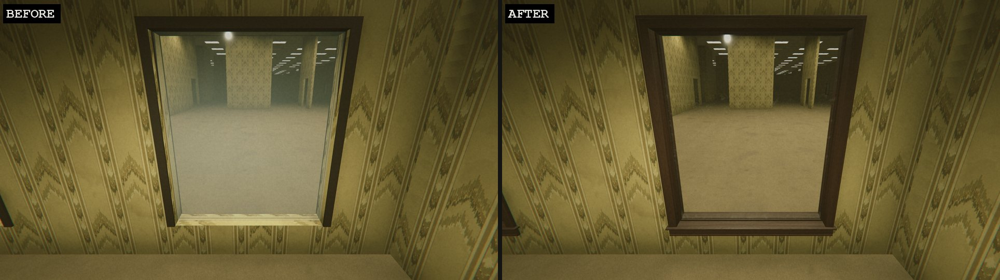 | 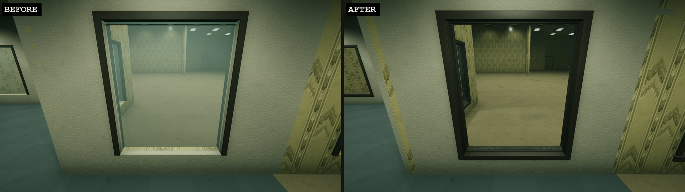 |
| W-L0 (Level 0 room side), 1.5 m, eye 1.62 m. Before: trim boxes, bare wallpaper sill, milky 3 cm cube. After: walnut casing, stool with nosing, apron, stops, 6 mm glass | W-OF (Office room side), same camera rule. After: dark-bronze pressed-steel sleeve and channel stop |

**What run 2 fixed** (the 13:13 attempt stopped before writing this report):

1. **The frames were too dark.** The harness moved the lamps' "player" with `Transform.Find("CAPTURE / eye")`. Unity reads `/` as a path, so it found nothing. The lamps stayed lit only around the spawn, far from the windows. Run 2 looks the eye up by name. Now 7–13 lamps are lit within 6 m of each camera, as in the game.
2. Re-synced from the real project at 16:49 (Red's 13:22 commit `b67d05c`). The kit models are the 16:45 G4 builds.
3. The screw close-up now looks at the stop's sight-line face, where the screws are.
4. Three more map suites. The trim count now includes trim meshes that vanish completely.

---

## 1. Setup

| Item | Value |
|---|---|
| Clones | `scratchpad/proj_win` (patch + facade + kit + glass) and `scratchpad/proj_win_base` (real project only). Both re-synced from the real project at 16:49 with `rsync -a --delete` (Assets, Packages, ProjectSettings, NativePlugin, Tools) |
| Real map file | `FrontRoomsMapWorld.cs` sha256 `f733a6d11ded`, 12:38, committed in `ef061ae`. **The contract diff still applies to it** (`git apply --check`, 17:07). The clone's patched file has exactly the diff's +/− lines (applied with `apply_window_kit.py`) |
| Kit models (from `proj_int`, copied 16:49) | `Kit_WindowFrame_Wood` 16:45:36 (fbx `9af5b7047502`), `Kit_WindowFrame_Steel` 16:45:46 (`d1739b8b5721`), `_Steel_Enamel` 16:45:47. List: `tf_logs/kit_models_used_r2.txt` |
| Glass (read-only copies from `proj_glass`) | `FrontRoomsGlass.shader`, `Glass_Window.mat`, `Glass_Edge.mat`, `Glass_Shard.mat`, `GlassGrime_M.png`, `GlassSmear_N.png`, `FrontRoomsGlassPane.cs` (unchanged since `01`) |
| Harness | `Assets/Editor/Audit/FrontRoomsWindowTF.cs` in both clones (copy: `FrontRoomsWindowTF.cs.txt`). It compiles with and without the patch: it reads `Window.root` / `Window.glass` and the facade by reflection |
| Seeds | checks: 20261001, 516574485, 4242, 1990, 7, 1955, 1993, 8086, 6502, 68000 (411 windows: 366 W-L0, 45 W-OF). Map root at (4992, 0, 4992), a multiple of 192 m |
| Unity | 6000.3.10f1, batch, with graphics, 1920 × 1080, 4× MSAA, the game's post stack (`FrontRoomsPostStack.ConfigureCamera`) |

Runs (all exit 0; times and `uptime` 1-minute load in `tf_logs/runs_load.txt`):

| Run | Start → end | Load |
|---|---|---|
| base, final | 16:57:35 → 17:00:21 | 392 → 444 |
| kitoff + kit, final | 16:57:35 → 17:01:22 | 392 → 459 |
| window landing edit test (`01` harness) | 16:53:55 → 16:55:34 | 366 → 371 |
| play mode (`01` harness) | 16:55:34 → 16:56:49 | 371 → 400 |

The load was far above 32 the whole time, so **every timing below is marked re-measure**. The counts (tris, renderers, draws) do not depend on load.

---

## 2. The map chat's own suites, with and without the patch

The harness calls each suite's `RunBatch` in the same Editor session, then copies its JSON report. Reports: `tf_logs/suites_base/` and `tf_logs/suites_kit/`.

| Suite | base | kit | Compared (timings removed) |
|---|---|---|---|
| `FrontRoomsMapVerification` (100 seeds, 4-chunk radius) | 100 passed, 0 failed | 100, 0 | identical |
| `FrontRoomsRelayNavTest` | 60/60 arrived, 0 pass-throughs, 0 frames in architecture, 23 doors broken | the same | identical |
| `FrontRoomsMapInteractionTests` | 126 / 0 | 126 / 0 | identical |
| `FrontRoomsLevelDesignerTests` | 138 / 0 | 138 / 0 | 137 of 138 lines identical. The palette line reads "54 kits: 38 floor" today and "59 kits: 43 floor" with the kit (§6 item 3) |
| `FrontRoomsFixtureTickTests` | 28 / 0 | 28 / 0 | identical |
| `FrontRoomsCameraRigTests` | 25 / 0 | 25 / 0 | identical |
| `FrontRoomsCaptionsTests` | 9 / 0 | 9 / 0 | identical |

(The log line "Chunk (1, 0) failed to build … tools: forced build failure" comes from the interaction suite's own deliberate failure test. It appears in base too.)

---

## 3. Added checks

Every check runs in all three variants on all 411 windows. Every result is written as a signature per window. A script then compares the signatures across variants (`tf_compare.py.txt`, output `tf_logs/compare_out.txt`).

### 3.1 The opening is clear after the break

- **Rule (`00`):** no collider of any default-layer object inside X ±0.70 × Y 0.35–2.00 of the window root after the break.
- **How:** `Physics.OverlapBox` in window-root space, |Z| ≤ 0.078 (the wall cut). I inset it 2 mm, because the wall's own faces touch X ±0.70 and a float at 5 km resolves about 0.5 mm.
- Also on all layers, and through the whole climb corridor (|Z| ≤ 0.95 on both sides).

| | base | kit |
|---|---|---|
| Before the break: inside the opening | the pane only, 411 / 411 | the pane only, 411 / 411 |
| After the break, default layer | clear 411 / 411 | clear 411 / 411 |
| After the break, all layers | clear 411 / 411 | clear 411 / 411 |
| Climb corridor after the break | no pane, no frame part: 411 / 411 | the same |
| Chunk rebuilt after the break | no pane comes back; clear 411 / 411 | frame comes back (411), no pane, clear 411 / 411 |
| Colliders anywhere under a window root | — | 0 |

### 3.2 The E ray hits the pane before the break

- **How:** the game's own ray (`Physics.Raycast`, reach 2.4, all layers, triggers ignored). 54 rays per window: both sides × eye 0.6 / 1.2 / 2.0 m back × aim X −0.55 / 0 / +0.55 × Y 0.6 / 1.2 / 1.8.
- **Before the break:** 22,194 of 22,194 rays hit the pane collider first, in base and kit. 0 hit a frame part or the shell first.
- **After the break:** 0 rays hit a pane or a frame part.
- **In the real game** (play test): the game's own aim ray hits the pane, and the prompt reads `HOLD E · BREAK GLASS`, for both members.

### 3.3 The Relay's sight ray: blocked by the pane, open after the break

- **How:** the Relay's own `FrontRoomsMapHunter.Visible`, against a 0.3 × 1.75 m test player. 32 lines per window: the Relay on either side at 1.5 / 3.0 m, the player at 1.0 / 2.0 m, both shifted ±0.4 / ±0.3 m sideways.

| | base | kit |
|---|---|---|
| Before the break: blocked by the pane | 13,152 / 13,152 | 13,152 / 13,152 |
| Before the break: the Relay sees the player | 0 | 0 |
| After the break: the Relay sees the player | 13,152 / 13,152 | 13,152 / 13,152 |
| After: blocked by a frame part | — | 0 |

### 3.4 The climb is unchanged

- **The numbers are read from the game,** not copied: `ClimbSeconds` 0.6, `ClimbLift` 0.35, `ClimbDuck` 0.55, `Reach` 2.4 (`FrontRooms3DGame.cs:182`, `:174`). The patch does not touch that file.
- **How:** `TryStartClimb` and `Climb` replayed step by step. Starts at 0.95 / 0.6 / 0.2 m back × −0.44 / 0 / +0.44 m sideways, from both sides: 18 per window. The path is sampled 31 times. Feet use the game's smoothstep with a 0.35 m arc. The eye drops by 0.55 × arc.

| | base | kit |
|---|---|---|
| Climbs that start and land in the next cell | 7,398 / 7,398 | 7,398 / 7,398 |
| Climb signatures (start, body overlaps, landing) | — | identical to base, 411 / 411 |
| Body capsule touches a frame part | — | 0 |
| Closest the eye comes to the clear zone's edge (X ±0.6835 × Y 0.3665–1.9835) | 0.244 m | 0.244 m (near-plane half-diagonal is 0.096 m, so the camera never clips the frame) |
| Real game (play test) | — | `TryStartClimb` starts through the framed opening; the player lands in the hall cell, both members |

### 3.5 Counts per window, per chunk and per view, against the spec

**Per window** (all 411 windows; `00` asks for one renderer, no lights, an LOD1):

| | LOD0 tris | LOD1 tris | Spec (§9.4) | Renderers | Submeshes (colour draws) | Shadow submeshes | Lights |
|---|---|---|---|---|---|---|---|
| W-L0 `Kit_WindowFrame_Wood` | 2,322 | 1,044 | 2,600 / 1,000 (−10.7 % / +4.4 %) | 1 | 2 | 2 | 0 |
| W-OF `Kit_WindowFrame_Steel` | 3,862 | 1,438 | 3,600 / 1,300 (+7.3 % / +10.6 %) | 1 | 2 | 2 | 0 |
| Glass slab | 12 | — | — | 1 (replaces the cube's 1) | 1 transparent | 0 (the cube had 1) | 0 |

**Per chunk** (250 chunks, 74 with windows; kit minus base):

| | Min | Median | Max | Total |
|---|---|---|---|---|
| Renderers (LOD0) | 0 | +2 | +6 | +138 |
| Colour-pass submeshes (≈ draws) | +1 | +7 | +19 | +549 (1.34 per window) |
| Shadow-casting submeshes | 0 | +2 | +6 | +138 |
| Transparent renderers | 0 | 0 | 0 | 0 |
| Lights | 0 | 0 | 0 | 0 |
| LOD0 tris | +2,286 | +12,970 | +33,592 | +1,008,846 |

- **Why so few renderers:** each frame adds 1 renderer, and each block whose trim mesh held only window trims loses 1 (273 such meshes are gone). The slab replaces the cube one for one.
- **Shadow casters fall by 273 renderers but gain 138 submeshes.** Today's milky cube casts a shadow; the slab does not (spec). The frames do cast shadows.
- **Worst chunk:** seed 7, chunk (−1, 1), 8 W-L0 + 4 W-OF: tris 4,632 → 38,224; +2 renderers, +14 submeshes.
- **All 250 chunks:** tris 2,177,984 → 3,186,830 (+46.3 %). Renderers 34,037 → 34,175 (+0.4 %).

**Per view** (camera frustum, each LODGroup's active LOD; the 3 m room views and the tall-hall views of the hero windows):

| View | Renderers | Submeshes | Tris | Frames at LOD0 / LOD1 | Render ms (re-measure) |
|---|---|---|---|---|---|
| W-L0 room, 3 m | 841 → 841 | 845 → 860 | 25,821 → 45,873 (+78 %) | 4 / 11 | 23.8 → 24.3 |
| W-L0 hall side, 3 m | 777 → 778 | 785 → 791 | 26,042 → 33,602 (+29 %) | 2 / 3 | 22.5 → 24.0 |
| W-L0 tall hall, 5 m | 908 → 910 | 916 → 925 | 29,678 → 39,254 (+32 %) | 2 / 5 | 25.7 → 27.0 |
| W-OF room, 3 m | 1,414 → 1,411 | 1,440 → 1,457 | 48,914 → 78,732 (+61 %) | 4 / 16 | 36.7 → 36.3 |
| W-OF hall side, 3 m | 357 → 358 | 424 → 428 | 30,292 → 40,194 (+33 %) | 3 / 0 | 16.4 → 15.9 |
| W-OF tall hall, 5 m | 411 → 412 | 478 → 483 | 31,948 → 44,100 (+38 %) | 4 / 0 | 23.9 → 17.2 |

- Render ms is the median of 30 renders at 1920 × 1080 with 4× MSAA. At load 390–450 the noise is larger than the difference.
- **The frames switch LOD later than the spec says** (§6 item 2). With the spec's 4 m switch, more of these frames would draw at LOD1.

### 3.6 Determinism

| | base | kit |
|---|---|---|
| Every chunk dropped and rebuilt (`Drop` + `Build` + `DressNext`): chunk signatures identical | 250 / 250 | 250 / 250 |
| A second, independent world of the same seed | 250 / 250 | 250 / 250 |

A chunk signature hashes every renderer and collider in the chunk: name path, chunk-local transform (0.01 mm), mesh vertices and indices, materials, shader, shadow mode, enabled state and collider sizes. For the kit it covers the window roots, frames, panes and slabs.

### 3.7 "Both or neither"

With the patch in and the facade hooks null (kitoff), every signature equals base: 10 window counts, 15,759 shell meshes, 250 chunk signatures, 250 chunk counts, and 411 × (E rays before and after, sight before and after, three overlaps, climb). So the map chat can land the diff on its own.

---

## 4. Frames

**How they were made.**
- Edit mode, the map built at (4992, 0, 4992). The game's post stack and ambient.
- The map's capture eye (the lamps' "player") moves under each camera, so the lamps near the camera are lit as in the game.
- A camera at 1.62 m is the game's eye height (`ModuleUnits.PlayerEye`).
- Face A = the room (non-tall) side; face B = the tall hall side.
- Frames marked **insp** add a point light 0.1 m above the camera. It is **not in the game**. It only makes the close-ups readable.
- The same windows are picked in base and kit (4 / 4 identical picks). The picks: a room lamp that is steady, a hall lamp that is lit, and at least 3.3 m free on both sides.

| Member | Hero window | Dead-lamp window |
|---|---|---|
| W-L0 | seed 4242, edge (2, −11)–(3, −11); room lamp Steady, hall lamp Steady | seed 4242, edge (0, 21)–(1, 21); room lamp Dead, hall lamp Steady |
| W-OF | seed 1993, edge (10, −8)–(10, −7); Steady / Steady | seed 101, edge (−2, 2)–(−1, 2); Dead / Steady |

### 4.1 Both faces, 1.5 m and 3 m, and 45°

| | |
|---|---|
| 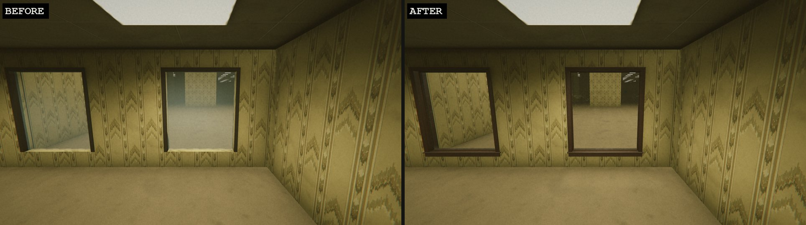 | 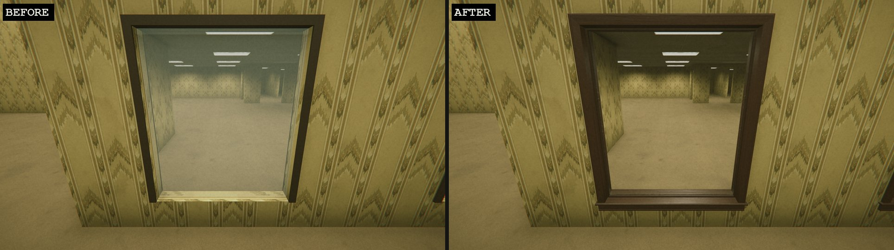 |
| W-L0 face A (room), 3 m | W-L0 face B (hall), 1.5 m: the through-stool shows on both faces |
| 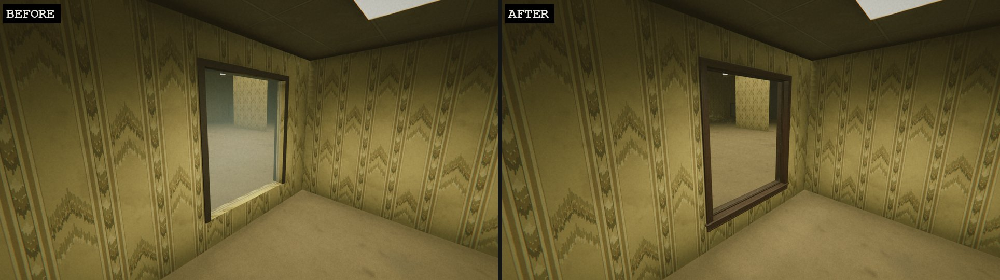 | 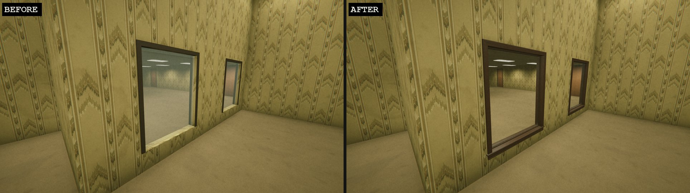 |
| W-L0 face A, 45°, 2.4 m | W-L0 face B, 45° |
| 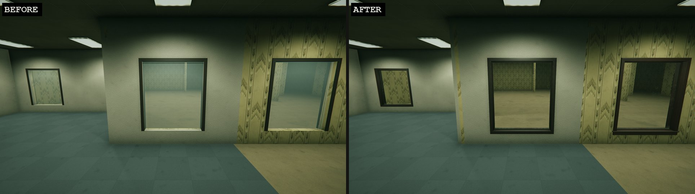 | 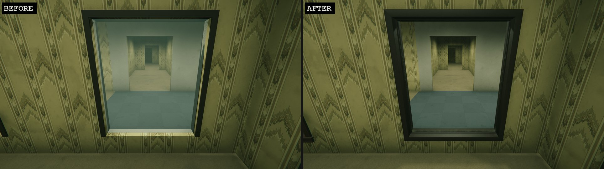 |
| W-OF face A (office), 3 m | W-OF face B (hall), 1.5 m: integral stop |
| 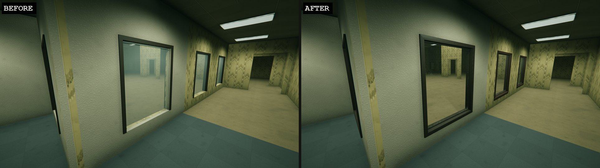 | 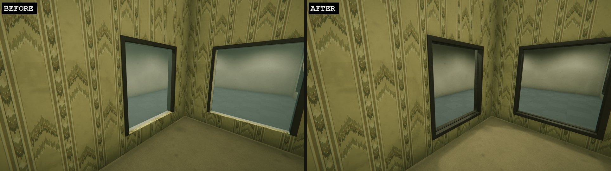 |
| W-OF face A, 45° | W-OF face B, 45° |

### 4.2 Close-ups at about 0.3 m (stop, stool, screws)

| | |
|---|---|
| 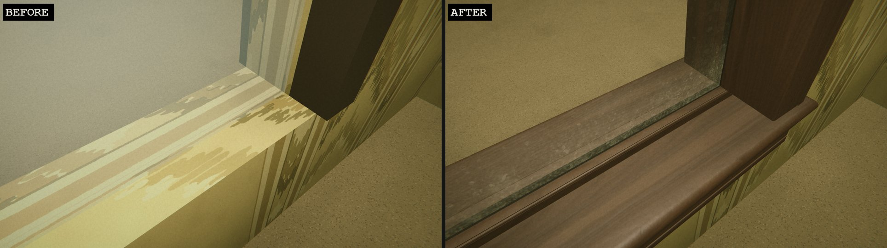 | 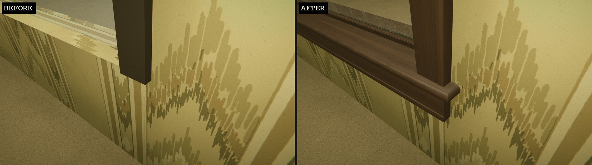 |
| W-L0 sill: stool, nosing, wood stop, glazing line, glass grime | W-L0 stool horn, apron and casing foot |
| 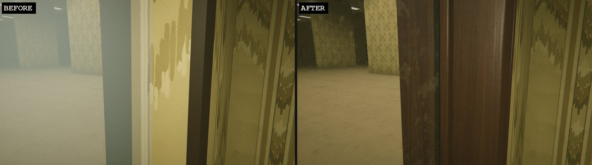 | 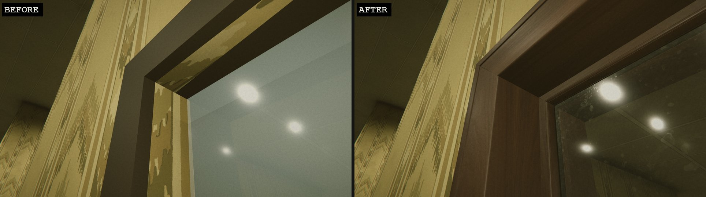 |
| W-L0 jamb stop, seen from inside the opening | W-L0 head corner from the hall side: lamps reflect in the glass |
| 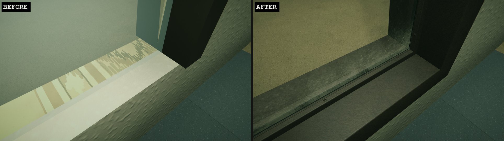 | 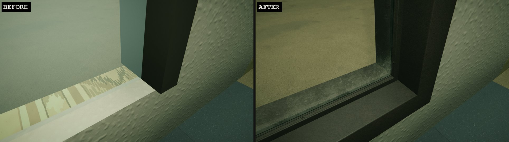 |
| W-OF sill, office side: channel stop, tape line | W-OF sill corner: mitre, one sill screw |
| 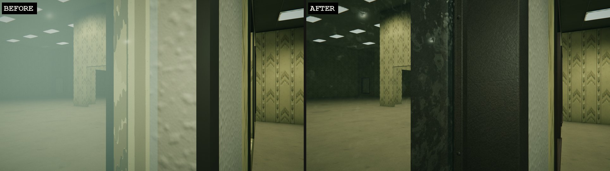 | 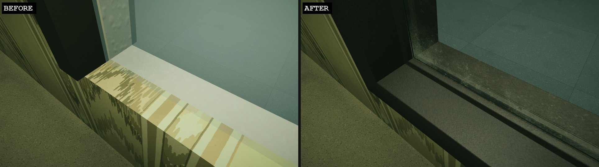 |
| W-OF jamb channel stop, office side | W-OF sill, hall side: integral stop |

The W-OF screws are real but dark on dark bronze. The crop below has its contrast stretched (an analysis aid, not a render). It shows the two slotted oval heads at Y 1.067 and 1.283 in the channel, the tape line and the glass edge:

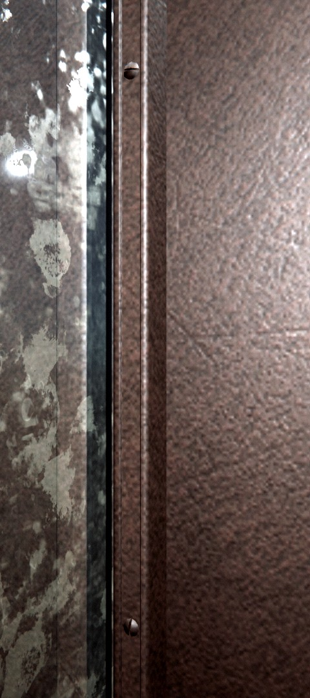

### 4.3 The tall-hall side, a dead-lamp room, the broken state

| | |
|---|---|
| 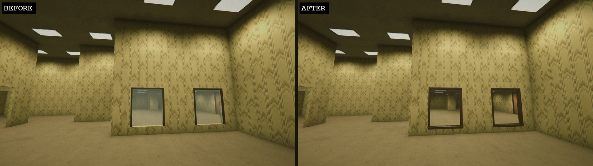 | 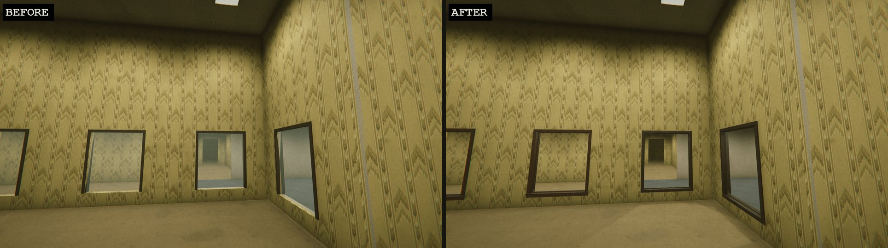 |
| W-L0 from the 5.4 m hall, 5 m back | W-OF from the hall |
| 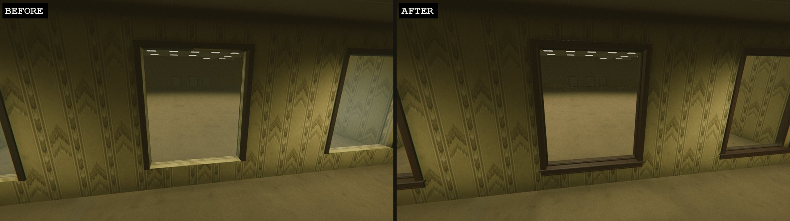 | 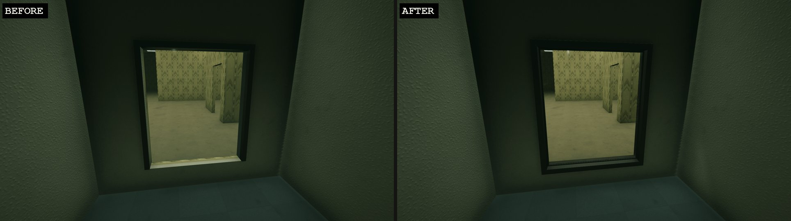 |
| W-L0, room lamp dead | W-OF, room lamp dead: the bronze nearly vanishes, as today's dark trims did |
| 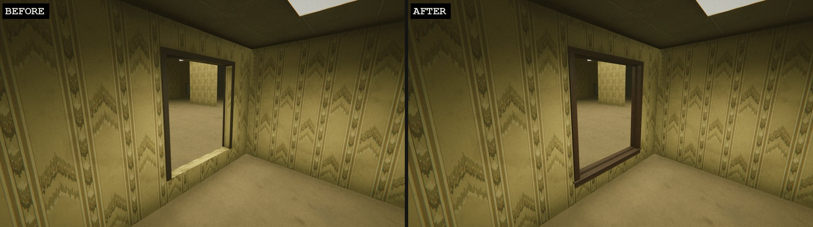 | 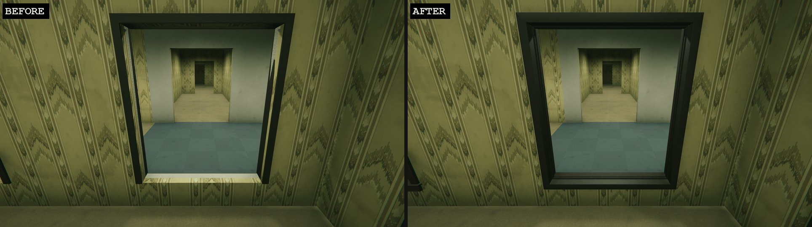 |
| W-L0 broken: frame, stool and stops stay; the opening is clear | W-OF broken, hall side |
| 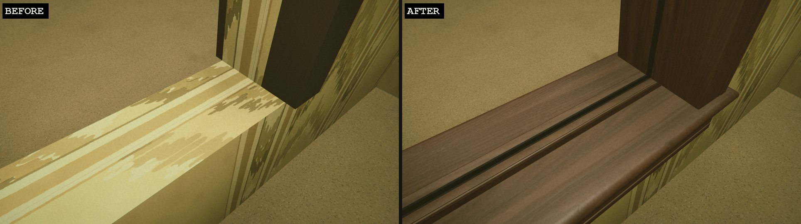 | 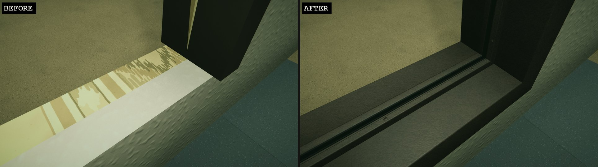 |
| W-L0 broken, sill | W-OF broken, sill |

### 4.4 In the real game (Play mode, seed 4242, run seed 516574485)

| | | |
|---|---|---|
| 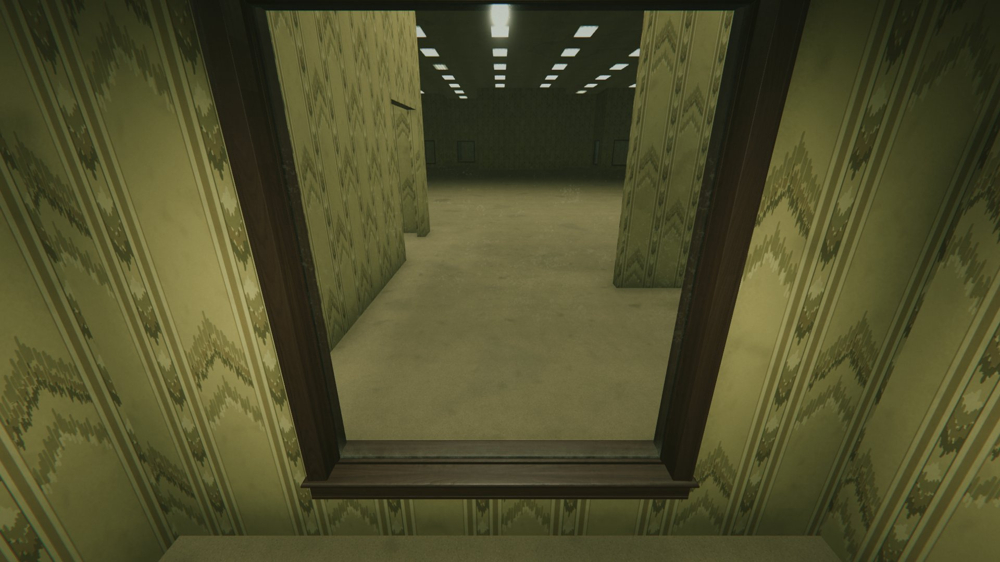 | 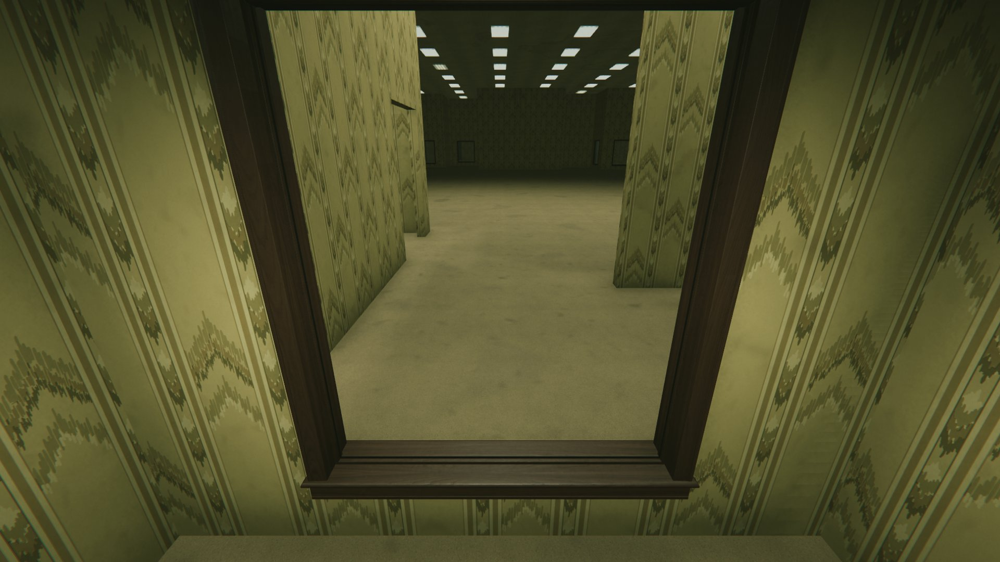 | 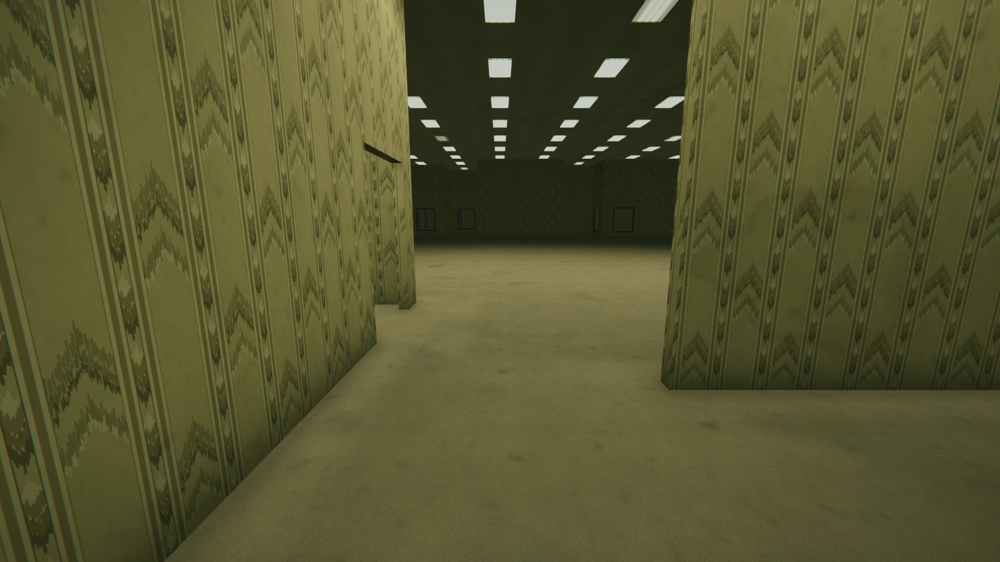 |
| W-L0, intact (game camera, post on) | broken, next frame | mid-climb, eye 1.44 m |
| 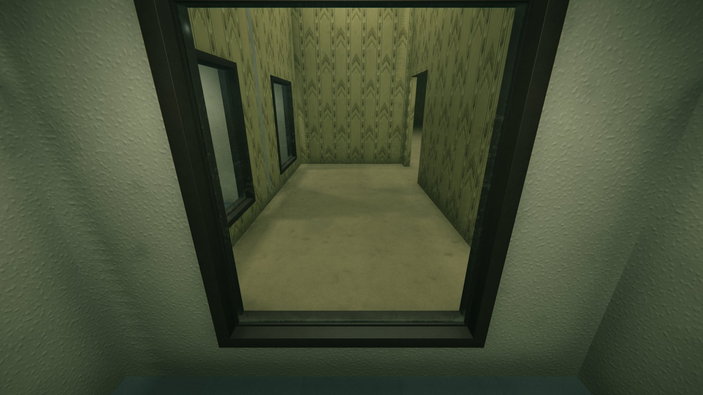 | 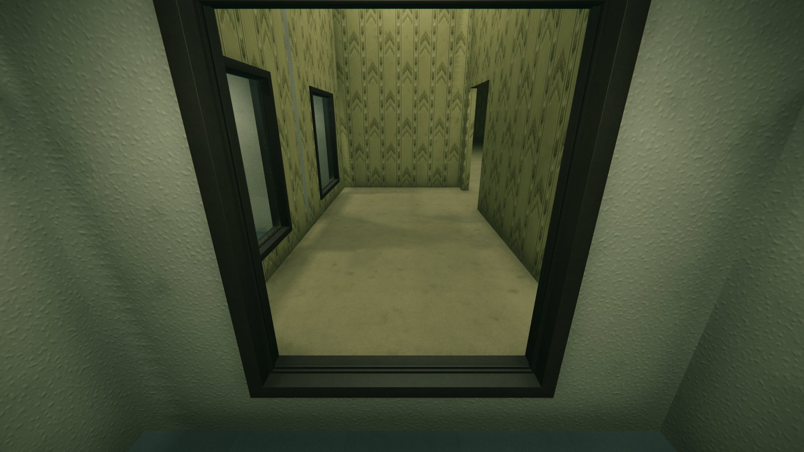 | 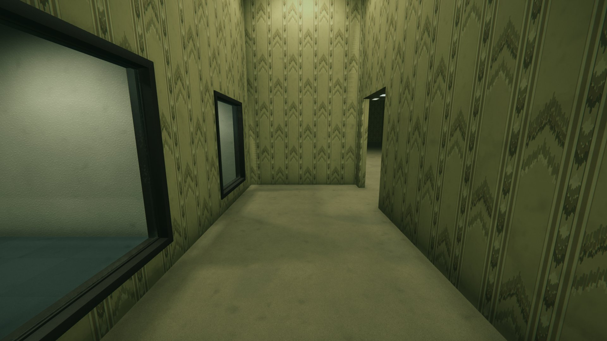 |
| W-OF, intact | broken | mid-climb |

### 4.5 Frame index

Every camera has three files in `images/`: `tf_<camera>_before.jpg` and `tf_<camera>_after.jpg` (1920 × 1080), and `tf_<camera>_pair.jpg` (before | after). Full PNGs stay in the clones' `Verification/window_tf/frames_base|frames_kit/`.

| Camera | Eye (window root: X, Y, Z; Z toward the side named) | Aim | FOV |
|---|---|---|---|
| `{L0,OF}_A_front_1.5m` (+ `_insp`) | (0, 1.62, 1.5), room | (0, 1.175, 0) | 76 |
| `{L0,OF}_A_front_3m` | (0, 1.62, 3.0), room | (0, 1.175, 0) | 76 |
| `{L0,OF}_A_45deg_2.4m` | (1.70, 1.62, 1.70), room | (0, 1.175, 0) | 76 |
| `{L0,OF}_B_front_1.5m` (+ `_insp`), `_B_front_3m`, `_B_45deg_2.4m` | the same, hall side | (0, 1.175, 0) | 76 |
| `{L0,OF}_A_close_sill_0.3m` (+ `_insp`) | (−0.40, 0.64, 0.22) | (−0.56, 0.37, 0.02) | 50 |
| `L0_A_close_horn_0.3m` (+ `_insp`) | (−0.95, 0.56, 0.32) | (−0.76, 0.34, 0.08) | 50 |
| `OF_A_close_corner_0.3m` (+ `_insp`) | (−0.44, 0.66, 0.30) | (−0.64, 0.41, 0.02) | 50 |
| `L0_A_close_stop_0.3m` (+ `_insp`) | (−0.43, 1.25, 0.16) | (−0.6835, 1.20, 0.014) | 50 |
| `OF_A_close_screws_0.3m` (+ `_insp`) | (−0.43, 1.175, 0.16) | (−0.6835, 1.175, 0.014) | 50 |
| `{L0,OF}_B_close_sill_0.3m`, `_B_close_head_0.3m` (+ `_insp`) | (0.40, 0.64, 0.22) / (0.50, 1.80, 0.22), hall | (0.56, 0.37, 0.02) / (0.70, 1.99, 0.04) | 50 |
| `{L0,OF}_hall_tall_5.0m` | (0.6, 1.62, 5.0), hall | (0, 2.3, 0) | 76 |
| `{L0,OF}_deadlamp_A_front_2m`, `_deadlamp_B_45deg_2.1m` | (0.3, 1.62, 2.0) room / (1.5, 1.62, 1.5) hall | (0, 1.175, 0) | 76 |
| `{L0,OF}_broken_A_45deg_2.4m`, `_broken_B_front_1.5m`, `_broken_A_close_sill_0.3m` (+ `_insp`) | as the intact views | as intact | 76 / 50 |

The world position, line of sight and lit-lamp count of every frame are in `tf_logs/kit_log.txt` and `base_log.txt` (lines starting `frame`).

---

## 5. Cost and timing

| Item | base | kit | Note |
|---|---|---|---|
| `BuildForCapture`, 25 chunks, median of 10 seeds | 216 ms | 209 ms (kitoff 207 ms) | load 400–450, **re-measure** |
| Render of the 6 views (§3.5) | 16.4–36.7 ms | 15.9–36.3 ms | load 390–450, **re-measure** |
| Spec T10 (audit harness, seed 4242 frames 01/04/23/34/35, draws and frame time) | — | — | **still open.** It needs a quiet machine (load under 32) |

The load numbers are `uptime` 1-minute averages, logged at the start and end of each run and at every measurement.

---

## 6. Findings and asks

None of these blocks the landing. Each one has an owner.

1. **Intact glass is now hard to tell from a broken window at 1.5 m** (glass track, Red).
   - Measured: the mean luma difference, intact vs broken, from the same camera at 1.5 m. Today's milky cube: 13.1 (W-L0) and 10.6 (W-OF). Kit with `Glass_Window`: 5.5 and 6.0. That is about half.
   - In the game frames (§4.4) the intact pane shows only a lamp glint and faint grime.
   - The prompt `HOLD E · BREAK GLASS` still appears. But the player may not see glass before aiming at it. The glass track should check how readable the pane is at 1–3 m.
2. **The frames switch LOD later than the spec says, and vanish at 58.5 m** (visual chat: `Assets/Editor/Rendering/FrontRoomsKitImporter.cs:75-76`).
   - The importer sets 0.10 / 0.02 screen height for every kit. For a 1.828 m frame at 76° that is LOD0 → LOD1 at 11.7 m and culled at 58.5 m.
   - The kit JSON asks for `lodDistances` [4, 12, none]. For the frames that means 0.292 / 0.098, and no cull.
   - ~~The culling matters: the glass slab has no LOD, so past 58.5 m in a long hall a window shows glass with no frame.~~ **Corrected 2026-10-07:** at the shipped `buildRadius` 2 the far plane is `SightDistance` = 2 × 24 − 2 = 46 m (`FrontRoomsMapWorld.cs:71`), so a 58.5 m cull never shows. It could only show if `buildRadius` were raised live to 3 or more. The real cost item was the late LOD0 → LOD1 switch (11.7 m against the spec's 4 m): a triangle and draw item, not a visual bug. Main's importer fix (`663e858`) now gives 4 m and no cull (`04_promotion.md` §2).
3. **The Level Designer palette offers the window frames as floor furniture** (G4 / map chat).
   - The window and blind JSONs carry `"placement": "Floor"`. So once they are in `Resources/Props/Models`, the palette grows from 54 to 59 kits ("43 floor").
   - Fix either side: G4 writes a non-palette placement for interactables, or `FrontRoomsModuleEditing.PaletteKits` skips kits tagged `interactable`. Doors, locks and keys will need the same.
4. **Shadows change** (note only). Today's milky cube casts a shadow. The slab does not (spec §5.4 slab, "no shadow"). The frames do. Per chunk: −273 shadow renderers, +138 shadow submeshes in total.
5. **W-OF in a dead-lamp room and the screw heads** (visual chat). Dark bronze in lamp light reads close to today's dark trims (§4.3). The 30 screws exist, but at 0.3 m they are legible only with the inspection light or a contrast stretch.
6. **G4 is still iterating.** `interact_window_common.py` changed at 16:47:58, after the 16:45 frame builds. Only the blinds were rebuilt (16:48). When G4 lands its final frames, re-run step 3 of §8 (about 4 minutes) and compare the numbers in §3.5.
7. **Measured kit deviations** (unchanged from `01` §7): wood Y 0.2485 → 2.0765 (spec 0.250 → 2.075); steel sill band bottom 0.2750 (spec 0.2745); steel face-B bends reach |Z| 0.0224 against the 0.022 stop face, on 60 vertices.

---

## 7. Promotion list (no change to `01` §6, with three notes)

The order stays as in `01` §6: facade → glass G1/G3 → kit FBX + JSON → the `[WINDOW-KIT]` diff (map chat).

- ~~**The contract diff needs no change.**~~ **Out of date since 17:16 that day:** the map chat's window model (its own `Window.root`, the breakable hook, `GlassBreakRecord`, the events) broke this diff. Use `03_contract_map.md` (r6).
- **Before item 3** (kit FBX + JSON): take G4's final build. Fix `placement` in the JSONs (finding 3). Decide the LOD importer change (finding 2).
- **Do not promote** `Assets/Editor/Audit/FrontRoomsWindowTF.cs` or the other `FrontRoomsWindowLanding*` harnesses. They are clone-only; copies are here as `.cs.txt`.

---

## 8. Reproduce

1. Make two clones (`cp -Rc` of `proj_audit`, then rsync the real Assets, Packages, ProjectSettings, NativePlugin and Tools). Apply `apply_window_kit.py.txt` to one of them. Into that one, copy the facade, the glass files and the kit FBX/JSON (`01` §1).
2. Copy `FrontRoomsWindowTF.cs.txt` to `Assets/Editor/Audit/FrontRoomsWindowTF.cs` in both clones.
3. Run in each clone (one Unity per clone; the two clones may run at once):
   ```
   /Applications/Unity/Hub/Editor/6000.3.10f1/Unity.app/Contents/MacOS/Unity -batchmode \
     -projectPath <clone> -executeMethod FrontRoomsWindowTF.RunAll -logFile <log>
   ```
   - In the unpatched clone it writes `Verification/window_tf/base_*`.
   - In the patched clone it writes `kitoff_*` and `kit_*`, the frames and the suite reports.
   - About 2–4 minutes per clone at load 400.
4. `python3 tf_compare.py.txt` (the signature comparison), then `tf_frames_out.py.txt <outdir>` (needs Pillow) for the JPGs.

Files in this folder from this run: `02_tests_frames.md`, `FrontRoomsWindowTF.cs.txt`, `tf_compare.py.txt`, `tf_frames_out.py.txt`, `tf_logs/` (logs, suite JSONs, loads, kit versions) and `images/tf_*.jpg` (157 files).
