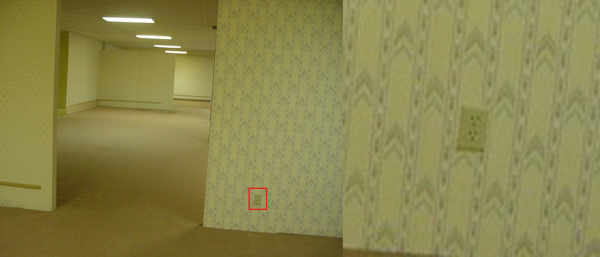
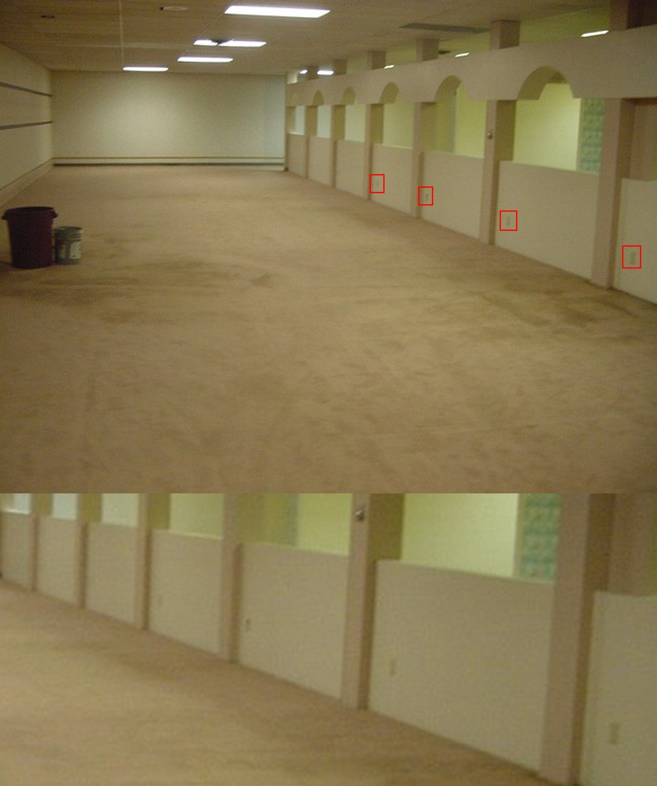
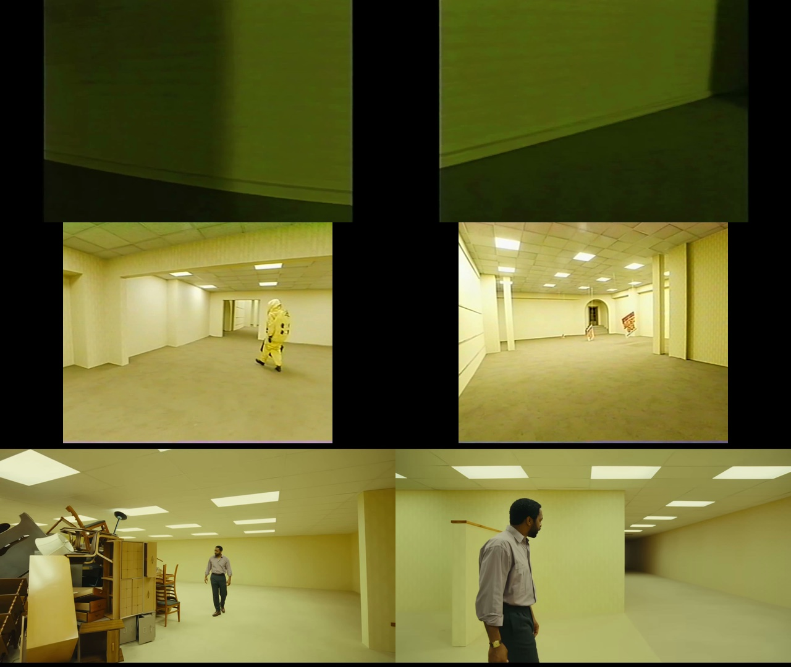
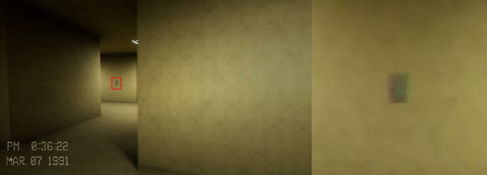

# 01 — Period research: power outlets and low-voltage wall devices (US commercial, 1990)

Status: DONE (2026-10-03). Research only. No project file outside this folder was changed.
Written for: the outlet spec (`10_spec.md`, next step), the Blender kit author, and the planner in `Assets/Scripts/Office/` (see `02_code_paths.md`).
Binding inputs: `../office_and_film/22_era_lock.md` (now = 1990, newest design 1993, oldest ~1955), `../office_and_film/03_ip_canon.md` line 183 ("outlet-plate grime"), `02_code_paths.md` (map geometry, `baseTop`, faces).
Evidence images: `images/` (4 JPGs). Source ledger with URLs, dates and licences: `SOURCES.md` (keys S01–S39 below). Media we still want: `media_candidates.md` (nothing was downloaded for this note).

**How to read this.**
- Inches as the trade states them, then metres for the kit (Z up, metres).
- **[read]** = I read the page or document myself. **[search]** = only a search-engine summary (page refused or not parsed). Treat [search] as UNVERIFIED.
- **[frame]** = I looked at the frame or photo myself. **ESTIMATE** = a designer number with no source. Measure a real object before final modelling.
- **Modern sheet, timeless form** = a current catalogue for a form that existed in 1990. Plate and device sizes are fixed by NEMA practice and have not changed.

---

## 0. Answers in one table

| Question | Answer for FrontRooms | Why (short) | § |
|---|---|---|---|
| Are outlets canon? | **Yes, in the founding photos. No, in Kane's and the A24 film's Level 0.** One plate in the Level 0 photo; one plate per half-wall bay in its sister photo. Kane and the A24 trailer show bare walls. Escape the Backrooms shows one 1-gang plate at about switch height. | The real 2002 building had them. The CG and film versions cleaned them off. | 1 |
| How many? | **Sparse.** About one per wall bay in rooms; far fewer in corridors. Never a code-style 12 ft grid everywhere. | The photo rhythm; commercial code has no spacing rule. | 1, 7 |
| Main device | **NEMA 5-15R duplex receptacle, ground pin down, side-wired**, in a **standard 1-gang plate 2.75 × 4.50 in (69.8 × 114.3 mm)**, one centre screw. | The 1990 default. | 2, 3 |
| Plate depth (proud of wall) | Thermoset plate **0.22 in (5.6 mm)**; stainless plate **0.19 in (4.7 mm)**. Receptacle face about flush with the plate front, **≤ 1.5 mm proud** (ESTIMATE). | Leviton size guide [read]. | 3 |
| Plate colour, Level 0 | **Ivory thermoset** (default). Almond and brown as older stock; white as "recent repair". | Ivory was the colour of choice until the very late 1980s. | 3.4 |
| Plate colour, Office | **Ivory or almond**; **stainless** in lobbies and public areas; **orange isolated-ground receptacles** at computer desks. | Period practice; orange body was the IG mark until the 1996 NEC [search]. | 2.4, 3.4 |
| Receptacle height | **0.31 m (12 in) to centre** by default. Newer runs 0.41–0.46 m (16–18 in). The founding photos measure **0.31–0.33 m** and **0.35–0.43 m**. | Pre-ADA practice; the ADA 15 in minimum only applied to buildings first occupied after 26 Jan 1993. | 1, 7.1 |
| Switches near doors | **Toggle**, ivory, **1.22 m (48 in) to centre**, on the latch side, **0.05–0.30 m from the trim**. Rocker (Decora) only as a rare upgrade. | Commercial norm; ADAAG reach range. | 4 |
| Phone and data | **1-gang plate with one or two modular phone jacks (RJ11)**, at outlet height, beside a power outlet. Office extras: **IBM data connector** or **BNC** coax plates. An old **4-prong jack** as a second-hand relic. | Modular since the 1976 FCC program; 10BASE-T only arrived in Sept 1990. | 5 |
| Open-office power | Prop-owned, not wall-planner: **cubicle panel base receptacles** (Steelcase 9000 type), **floor "tombstone" fittings** on poke-throughs, rare **power poles**. | 1970s–80s systems furniture. | 6 |
| Back-to-back on one wall | Never opposite each other. **Offset ≥ 0.61 m (24 in)** across the 0.16 m map wall. | UL fire-rated-wall rule; also sound. | 7.4 |
| Wear | Paint/grime, crooked plate, missing screw, cracked thermoset plate, missing plate, blank plate, scorch above one face. Frequencies in §8. | Brittle thermoset; abandoned store. | 8 |
| Forbidden by the era lock | **Tamper-resistant shutters / "TR"**, **USB faces**, screwless snap plates, LED-lit GFCIs, TIA-568 labels, anything dated after 1990. Avoid ivory IG receptacles marked only with a triangle (reads post-1996). | Post-1993 designs. | 10 |

---

## 1. Canon: do outlets appear in the Backrooms?

### 1.1 The founding photos (2002, the real building) — **yes**

Both photos are on disk (`Research/week02/ip-research/stills/`, Commons, "copyrighted free use"; S01, S02). They are 640 × 480 Sony Cyber-shot frames taken 56 s apart on the same floor.

**DSC00161 (the Level 0 photo) [frame].**
- One **vertical 1-gang duplex plate** low on the right-hand wall, the chevron-papered pier. Two receptacle faces show as dark dots.
- **Height:** the plate is 21 px tall (= 4.5 in), and its bottom is 49.5 px above the floor line. That gives a centre of **about 12.9 in (0.33 m)**, ±1.5 in.
- **Width check:** 15 px ≈ 3.2 in against the true 2.75 in (blur and slight angle). So it is a **standard-size plate**, not a jumbo.
- **Colour:** mean RGB of the plate is (131, 130, 68); the paper next to it is (147, 146, 95). The plate reads **about 11 % darker and warmer** than the paper under the photo's yellow cast: an ivory or almond plate, or a grimy one.
- The wallpaper runs **behind** the plate. That is the normal order: paper first, plate on top.
- **No baseboard** on this wall: the paper runs to the carpet. This matches the map walls, which have no base (`02_code_paths.md` §0.1).
- The plate sits about **0.4–0.5 m from the wall's free end** (scaled from the plate width).

**DSC00159 (56 s earlier) [frame].**
- A run of **half-height partitions with arched openings above**, split into bays by pilasters.
- **One plate in every bay** that is resolvable (four marked), all low.
- **Same side every time:** each plate sits **about 0.1–0.2 m beside the pilaster** at the far end of its bay. This is how an electrician runs a circuit along a wall: one box per bay, fixed to the same framing member.
- **Height:** about **14–17 in (0.35–0.43 m)** to centre. The range comes from two scales (plate height or a 42 in half-wall); the plates are only 7–8 px tall.
- A small round metal fitting sits high on one pilaster. It is **not** an electrical plate (unidentified; maybe a hook or a door holder).

### 1.2 Kane Pixels — **no outlets seen**

- **Found Footage** (S03): I looked at frames every 2 s from about 0:14 to 4:15 (contact sheets 2–8 of 18). **No receptacle, switch or jack plate is identifiable.**
  - The walls carry only a thin base trim, painted arrows, graffiti and the "face" drawing.
  - One small bright object sits on a pier edge at about 1 m, at ≈ 3:02 (frame 92). It is unresolvable: possibly a switch, possibly a highlight.
- **Everything Must Go** (S04): frames every ≈3 s, 0:00–3:10 (sheets 1–4 of 20). The store has base trims, arches, veneer doors and horizontal wall rails. **No plates are identifiable.**
- Read: Kane strips the walls to make them generic. The absence is a stylistic choice, not period evidence.

### 1.3 A24, *Backrooms* (2026) — **none in the trailer**

- **Trailer** (S05), 1 frame/s, 0:16–0:63 (Level 0 shots): bare yellow walls, a **brown wood wall rail** (its end is visible at 0:32). **No plates.**
- **Behind the scenes** (S06) at ≈ 0:18: the built Level 0 set shows a small dark round mark on a wall, about 0.4 m up. It is unresolved (could be a box hole, a mark or a camera dot).
- The film's set-decoration rule was "nothing post-early 1990s" (`01_film_production.md`), so outlets would be legal there. The trailer simply does not show any.

### 1.4 Games

- **Escape the Backrooms 1.0 launch trailer** (S07), ≈ 0:57, under the VHS stamp "PM 0:36:22 MAR. 07 1991" [frame].
  - **One 1-gang plate on a far corridor wall at roughly 1.1 m** (0.4 of the wall height).
  - That is **switch height**, with no door nearby. A light switch that controls nothing is a cheap, canon-flavoured "wrong" detail (§9.6).
- **The Backrooms 1998** (S08): sheets 2 and 4 [frame], none identifiable (and this game's 1998 date is outside our lock anyway).

### 1.5 What this means

- Outlets are **true to the one real photograph** the IP is built on. They are the only human-scale object in that photo apart from the troffers. That makes them a strong cue that the walls are real building walls.
- The derivatives are bare. So FrontRooms should keep outlets **sparse and low**. One plate per bay or room wall reads like the photo; a plate every 3.7 m on every corridor wall reads like a modern house.
- The photo gives three rules directly:
  1. **plate on top of the wallpaper**;
  2. **same height and same side offset along a run**;
  3. **no baseboard needed**.

---

## 2. The receptacle (the device)

### 2.1 Face configurations

| Config | Face | 1990 use | Source |
|---|---|---|---|
| **NEMA 5-15R** duplex | Two parallel slots (the neutral one longer), D-shaped ground hole below | **Default everywhere** | S09 [read] |
| **NEMA 5-20R** duplex | Neutral slot is a **T** (takes 15 A and 20 A plugs) | Commercial spec-grade on 20 A circuits; Office | S09 [read]: "The 5-20R receptacle has a T-shaped neutral hole, to accept both 5-15P and 5-20P plugs." |
| 1-15R (two slots, no ground) | Ungrounded | Banned in new work since 1962. **Second-hand only** (a pre-1962 corner of the building) | S09 [read] |
| Single 20 A receptacle (round face) | One 5-20R face, plate opening 1.41 in (35.7 mm) | Copier / vending / housekeeping circuits | S11 [read], S24 [read] |
| GFCI receptacle (TEST/RESET) | Rectangular "decorator" face | **Rare in 1990 commercial.** GFCI was required in dwelling bathrooms from 1975, but non-dwelling bathrooms and rooftops only from the **1993 NEC** | S19 [read] |

**Plug and slot geometry (5-15)** (S09 [read]):
- blades **1/4 in (6.4 mm)** wide, 0.06 in (1.5 mm) thick, **1/2 in (12.7 mm)** apart;
- polarized neutral blade **5/16 in (7.9 mm)** wide;
- ground pin **3/16 in (4.8 mm)** diameter, **15/32 in (11.9 mm)** centre-to-centre from the blades.

The receptacle slots are a little larger than the blades: hot slot ≈ 7 × 2 mm, neutral ≈ 8.5 × 2 mm, ground hole ≈ 5 mm D-shape (ESTIMATE). They read as **black recesses about 6–8 mm deep** (ESTIMATE).

### 2.2 Device body and wiring

| Part | Value | Metres | Source |
|---|---|---|---|
| Strap (yoke) length incl. plaster ears | 4.20 in | 0.107 | Leviton 5320 listing [search] (S14) |
| Body width | 1.33 in | 0.034 | same [search] |
| Body depth behind the strap | 0.90–1.19 in | 0.023–0.030 | 5320 / HBL5362 listings [search] |
| Mounting screws to the box | **#6-32 at 3-9/32 in (3.28 in) centres** | 0.0833 | Arrow Hart J-2 [read] (S11); Kyle [read] (S12) |
| Terminals | **Side-wired screw terminals**: brass (hot) on one side, silver (neutral) on the other, green hex ground screw at the bottom. Push-in "back-wire" holes on cheap devices (a design from about 1960; S35 [read]). | — | UH spec: "back and side wired with screw type terminals" [read] (S23) |

You only see the terminals and plaster ears when the **plate is missing** (§8). Then the device stands in a ragged cut-out with the steel box edge showing.

### 2.3 Orientation

- **Ground hole down** is the US norm. The UH (2014) and TxState (2015) standards both say "ground pin receiver down" / "ground pointing down" [read] (S23, S24).
- Some hospitals and industrial jobs specify ground up. Recommendation: **ground-down on ≥ 85 % of plates**, ground-up as a "different electrician" variant (ESTIMATE).
- A ground-down duplex reads as **a small surprised face** (two slot-eyes, an open mouth). At 0.3 m in a horror game that is a free pareidolia beat. Keep the orientation deliberate.

### 2.4 Isolated-ground (IG) receptacles — the "very 1990 office" detail

- **What:** the ground terminal is insulated from the strap and box. It runs on its own wire back to the panel, to cut noise into computers.
  - Patent US 4,025,144, "Isolated ground receptacle", Sola Basic Industries, filed 31 Mar 1976, granted 24 May 1977 [read] (S15).
  - It describes grounding through the metal box that "may bring about undesired interference which may create noise or distortion in sensitive apparatus".
- **How it looked in 1990:** an **all-orange receptacle body**, often with an orange triangle.
  - The 1996 NEC dropped the orange body as the identification and required the **orange triangle on the face** of any colour [search] (S17).
  - Mike Holt (2001) cites the "Code-required orange triangle" in Sec. 410-56(c) [read] (S16).
- **For FrontRooms (1990):** use **all-orange devices** in Office zones, at desk locations, usually in the normal ivory or stainless plate.
  - The same [search] summary says that before 1996 an IG device was "orange in color **or** had the orange triangle". So an ivory device with a triangle was possible in 1990, but it was the minority and it became the norm only after 1996.
  - Use the all-orange body: it reads from 3 m and it is unambiguous.

### 2.5 Other coloured devices

- **Hospital grade:** a green dot (S09 [read]). Not used here.
- **Emergency-branch receptacles:** in hospitals the plate or device has "a distinctive color or marking", usually red [search] (S38). The wording before the 2017 NEC is UNVERIFIED for 1990. Possible only for the hospital-like Run rooms of the title corridor, P3.
- **Clock hanger receptacle:** a recessed single outlet with a hook, hidden behind an electric wall clock (Leviton 688, made in ivory, light almond and white; S37 [search]). It is timeless. It pairs with `Kit_WallClock` at the kit's 2.1 m hang height. P3.

---

## 3. Wall plates

### 3.1 Sizes (single gang unless noted)

| Plate | W × H | Metres | Depth (proud of wall) | Source |
|---|---|---|---|---|
| **Standard** | **2.75 × 4.50 in** | **0.0698 × 0.1143** | plastic **0.22 in (5.6 mm)**, metal **0.19 in (4.7 mm)** | Leviton Q-1289 [read] (S10); Arrow Hart J-3 [read] (S11) |
| Midway ("preferred") | 3.13 × 4.88 in | 0.0794 × 0.1238 | 0.26 in (6.5 mm) | same |
| **Oversize ("jumbo")** | 3.50 × 5.25 in | 0.0889 × 0.1334 | 0.26 in (6.5 mm) | same. Leviton: "used to conceal greater wall irregularities". |
| 2-gang standard | 4.56 × 4.50 in | 0.1159 × 0.1143 | as above | Arrow Hart J-3 [read] |
| Each extra gang | + 1.81 in | + 0.046 | — | Leviton, Arrow Hart [read] |
| Stainless sheet thickness | 0.030 in (Type 302 or 430, satin) | 0.00076 | the 4.7 mm depth is the formed edge | UH spec [read] (S23) |

**Shape notes for the modeller (ESTIMATE, measure one real plate before final modelling):**
- **Thermoset plates** have a soft dome: a flat field, then a 3–5 mm rounded or bevelled edge falling to the wall. The back is hollow, with a raised rim around the opening.
- **Stainless plates** are flat sheet with a small formed return at the edge. The edge reads as a crisp bright line.

### 3.2 Openings

From the Arrow Hart / Cooper "Common Opening Configurations" drawing [read] (S11) and Kyle [read] (S12):

| Opening | Size | Metres |
|---|---|---|
| **Duplex**, each of two | **1.31 in wide** (round with flats top and bottom), **1-1/8 in tall** | 0.0333 × 0.0286 |
| Duplex, centre to centre | **1-17/32 in**; outer span top to bottom 2.65 in | 0.0389; 0.0674 |
| Toggle | **0.40 × 0.93 in** | 0.0103 × 0.0238 |
| Decorator / GFCI | 1.31 × 2.64 in | 0.0333 × 0.0671 |
| Single receptacle (round) | Ø 1.41 in | 0.0357 |

Arrow Hart also prints a "0.76 in (19.4 mm)" bracket on the duplex opening. With Kyle's 1-1/8 in height and the 2.65 in span it does not close. I read 1-1/8 in as the opening height and treat the 0.76 as a drawing slip (UNVERIFIED).

### 3.3 Screws

- **#6-32 oval-head, slotted, 1/2 in (12.7 mm) long.** "Standard size for duplex receptacles and toggle switch wall plates." (Pass & Seymour 510, [read], S13.)
- Screw colour **matches the plate**: brown, ivory, white, or stainless for metal plates [read]. Holes are "countersunk for oval head #6-32 screws" (S11 [read]).
- **Head:** about 0.26 in (6.6 mm) across, a low oval crown about 1 mm proud, one straight slot (trade value, not read).
- **Hero LOD0:**
  - slot about 0.8 mm wide × 0.6 mm deep;
  - ≥ 48 segments on the round head (`02_code_paths.md` §4.4);
  - the slot at a **random angle per plate**; that is what people notice at 0.3 m.

| Plate | Screws | Spacing |
|---|---|---|
| Duplex | **1, at the plate centre** (into the receptacle strap) | — |
| Toggle | 2 (into the switch strap) | **2.38 in (60.3 mm)** |
| Decorator / GFCI | 2 | 3.81 in (96.8 mm) |
| Blank / box-mount | 2 | 3.28 in (83.3 mm) |

Sources: Leviton Q-1289, Arrow Hart J-2, Kyle [read].

### 3.4 Materials and colours in 1990

| Option | Era | 1990 fit | Use in FrontRooms |
|---|---|---|---|
| **Ivory thermoset (urea)**, gloss | "The 1950s had ivory which seemed to be the color of choice up until about the very late 1980s when white started showing up" (forum, 2017, [read], S20) | **current** | **Default.** Level 0 and Office |
| Brown (phenolic / Bakelite look) | "brown was very common … Brown did continue into the 70s" (S20) | **second-hand** | Old corners, 5–10 % in Level 0 |
| White | "available by the end of the 70's" (S20); common from the late 1980s | **current, newest** | "Recent repair" plates, 5–10 % |
| Almond | After the late-1970s decorator colours (S20, [search] for the year) | current | Office, 10–20 % |
| Grey | "around … at least since the 1960's" (S20) | timeless, commercial | Equipment rooms; with grey office systems |
| **Stainless steel** 302/430, satin | Timeless commercial. UH uses 0.030 in stainless "for elevator lobbies, entrance lobbies, restrooms, and public areas" [read] | timeless | **Lobby** rooms and public faces |
| Nylon (smooth, satin, "unbreakable") | Pass & Seymour patent (filed 1999): thermoset is "quite brittle"; thermoplastic is "unbreakable" but more flexible [read] (S22). Nylon was around before 1990; first year UNVERIFIED. | current | Office, as a variant |
| Galvanized steel cover on a surface box | TxState: "Galvanized face plates shall be used for all surface mounted devices" [read] | timeless | Tall halls and back-of-house (§6.4) |

**Device colour.** Specs matched the device to the plate, for example "white … receptacles … with matching white thermoplastic coverplates" (UH [read]). A mismatched pair, such as a white device in an ivory plate or brown in ivory, is a real patch-job tell (§8).

**Colour targets (ESTIMATE, sRGB albedo).** Calibrate in look-dev against the DSC00161 plate (§1.1).

| Colour | Hex |
|---|---|
| Ivory | `#E6DDC2` |
| Almond | `#E3D7BE` |
| White | `#EFEEE8` |
| Brown | `#4B3527` |
| Grey | `#A9A9A3` |
| IG orange | `#D8642A` |

Thermoset is **glossy** (smoothness ≈ 0.75, ESTIMATE). Nylon is satin (≈ 0.5). Stainless is brushed (#4), anisotropic if the shader allows it.

---

## 4. Switches near doors

| Item | Recommendation | Source |
|---|---|---|
| Type | **Toggle**, spec grade, ivory. **Rocker (Decora) existed** from 1972–73, but in commercial work it was the minority. Use it on ≤ 10 % of switch plates. | Decora "introduced in 1973" (Leviton, [search], S21); "Decora came out in 1972" (S20 [read]) |
| Height | **48 in (1.22 m)** to centre. Matches `10_synthesis.md` ("switch plate at 1.2 m beside entries"). | ADAAG 1991 4.2.5 forward reach max 48 in, 4.2.6 side reach max 54 in [read] (S18) |
| Side and offset | **Strike (latch) side of the door, 2–12 in (0.05–0.30 m) from the door trim.** Use the same position on every door of a run. | UH: "on the strike side of doors as hung … not less than 2" and not more than 12" from door trim" [read] (S23) |
| Gangs | Two or more switches in one place get **one multi-gang plate** ("a single coverplate", UH [read]). Use 1–3 gangs. | S23 |
| Big sales floors | Large store and office lighting was often switched **at the panel** or by **low-voltage relay switches** (GE RR series: narrow momentary switches in multi-gang plates, common in "big buildings and institutions"). So huge Level 0 rooms can have **no wall switches at all**. | S34 [search]; panel switching is ESTIMATE |
| Pattern | **Grime halo** around switch plates: hand-height dirt on paint (`10_synthesis.md` T3). | project research |

---

## 5. Telephone and data jacks

### 5.1 Telephone

| Device | Era | 1990 fit | Notes | Source |
|---|---|---|---|---|
| **Modular jack (RJ11 / RJ14, 6-position)**, 1-gang flush plate with 1 or 2 jacks | Modular plugs on the Trimline phone from the mid-1960s; FCC Registration Program **1976** | **current** | Same height as the receptacles, usually beside one. Ivory, brown or white plastic, or stainless. 6P plug width **9.85 mm**. | S25 [read] |
| Surface modular jack (small box screwed to the wall or base) | 1970s–90s retrofits | current | About 2 × 2.5 × 1 in (ESTIMATE). Typical where a 4-prong jack was swapped out. | ESTIMATE |
| **4-prong jack** (square type 404A with 283B plug, about 1960; round 505A from the mid-1960s) | 1930s–1970s | **second-hand** | "The standard line connection for all portable telephone sets until the conversion to modular jacks in the 1970s." A 1990 building can keep one, sometimes with a modular adapter in it. | S25 [read] |
| Wall-phone plate (modular jack plus two studs to hang a wall phone) | 1970s on | current | Break rooms and stockrooms, about 1.2–1.4 m (ESTIMATE) | ESTIMATE |
| 1A2 key system, 25-pair (RJ21, 50-pin ribbon connector) | 1960s–80s | second-hand | RJ21 is "commonly used in 1A2 key telephone system" installs. A fat cable from a floor-level box to each phone. | S25 [read] |

Supporting primary source: the 1993 Sears catalogue (S26, on disk, p. 1003) prints "Phones are fully modular and tone/pulse switchable", with ivory and charcoal phones. The kit's `Kit_DeskPhone` (an LCD multi-line set, 1987–99) therefore wants a **modular jack**, not a 4-prong.

### 5.2 Data (Office zone only)

| Device | Date | 1990 fit | Look | Source |
|---|---|---|---|---|
| **IBM Data Connector** (Token Ring, IBM Cabling System) | **1984** | **current** | Square, hermaphroditic, black or beige. Needs "at least 3 cm × 3 cm" of plate space. Stands well proud of a 1-gang plate. | S27 [read] |
| **BNC on thin coax (10BASE2)** | 1985 (802.3a) | **current** | A round bayonet jack on a plate, or a coax lead out of a blank plate with a "T" at the PC. "The dominant 10 Mbit/s Ethernet standard during the mid to late 1980s." | S27 [read] |
| Twinax (IBM 5250 terminals on System/34, /36, /38, AS/400) | 1970s–90s | current | Bayonet, BNC-like, "bulky screw-shell" | S27 [read] |
| DB-25 RS-232 terminal plate | 1970s–80s | current | Trapezoid D-sub on a 1-gang plate | ESTIMATE (catalogue wanted: Black Box 1985, `media_candidates.md`) |
| RJ45 (8P8C) for 10BASE-T | IEEE 802.3i approved **28 Sep 1990** [search] | **edge: allowed by the lock, but brand new in 1990** | Use rarely. Never add "CAT 5" or TIA-568 markings (TIA-568 dates from 1991). | S27 |

**Recommendation for the Office:** pair each power outlet at a desk position with a **phone plate**. On about one in three, add a **data plate**: IBM data connector or BNC, chosen once per office zone so a zone reads as one network. A modern spec asks for "a minimum of two duplex receptacles and (two) communications outlets" in a single office (TxState [read]). Use that as an upper bound.

---

## 6. Open-office power

These are **not wall-planner items**. They belong to props, modules or the map, and are listed here so the spec can route them.

### 6.1 Floor fittings

- **Poke-through fittings** bring power up through a cored hole in the slab.
  - Prior-art patents date from 1974 (Klinkman) and 1976 (Kohaut).
  - General Signal's US 4,259,542 (filed 1979, granted 1981) describes "commercial, manufacturing and office buildings" where wiring must change [read] (S28).
- Hubbell's US 5,237,128 (filed 1991): open offices with modular workstations "created need for improved poke-through wiring devices"; above-floor fittings hold "duplex, single, telephone/data and furniture feed receptacles" [read].
- **"Tombstone" above-floor fitting** (aluminium, sits on the carpet):
  - one duplex: **2-5/8 H × 4-3/8 W × 3 D in** (0.067 × 0.111 × 0.076 m), Thomas & Betts SFH-40;
  - back-to-back pair: 3 × 5 × 3-3/8 in (0.076 × 0.127 × 0.086 m), SFH-50 [search] (S29).
  - Hubbell pedestals run 5.62 in tall [search].
  - Render-only is safe: under the 0.4 m Relay probe and the player's E ray.
- **Flush fitting:** a round or square brass or aluminium cover with flip lids, flush with the floor. P2.

### 6.2 Cubicle panel base (for `Kit_CubiclePanel`, visual chat)

- Steelcase Series 9000 (price list Feb 2014 [read], S30):
  - panel **2-1/4 in** thick; **base cover 4 in high** with "invisible" receptacle knockouts **on each side**;
  - "Three-circuit or four-circuit (3+D) powerways"; leveling glides with 1-1/2 in of range;
  - "Power and cable poles bring power and communication cables from the ceiling to panels".
- "**Enhanced panels were introduced in 1991**." A 1990 office therefore has the **original** base, not the Enhanced 4 in base. Base height is UNVERIFIED for the pre-1991 panel.
- Steelcase patent US 4,203,639 (filed 1978, granted 1980): "Prior art hard wired panel systems have the wiring enclosed in a wiring way at the base of the panel. At least one electrical outlet or plug receptacle is usually located along each wiring way." [read]
- **Recommendation:** a powered-base variant of the panel with **one duplex per side, centred about 0.05–0.07 m above the floor** (ESTIMATE). A plug and cord lead in it at desk positions. This matches the "powered panels" idea in `02_code_paths.md` §5.

### 6.3 Power poles

- Aluminium or steel floor-to-ceiling poles carrying power and phone down to panels.
- Still sold as Wiremold "Tele-Power" poles [search]; they also appear in the Steelcase 9000 sheet above.
- They are obstacles (≈ 2 × 3 in section), so they need a collider. That makes them **not an outlet item**. A P3 Office prop if wanted.

### 6.4 Surface wiring (retrofits; Tall halls and back-of-house)

| Item | Size | Use | Source |
|---|---|---|---|
| **Wiremold 500 / 700 metal raceway** | **3/4 in wide × 17/32 / 21/32 in deep** (19.1 × 13.5 / 16.7 mm) | Painted to the wall; runs to a surface device box. Typical on block walls and columns where wires cannot be fished. | S31 [search]; Wiremold catalogue no. 22 from **1960** exists (S31), so the form is timeless |
| Plugmold multi-outlet strip | ≈ 1.28 × 0.75 in; receptacles at 6, 9, 12 or 18 in centres | Workbenches, stockroom counters | S31 [search] |
| "Handy box" with galvanized cover, fed by 1/2 in EMT conduit | box ≈ 4 × 2-1/8 in; EMT OD 0.706 in (17.9 mm) | Tall halls, warehouse walls, column faces | Galvanized covers: TxState [read]; sizes are trade values, not read |

---

## 7. Placement practice

### 7.1 Heights (centre of plate above the finished floor)

| Device | Period value | Metres | Source |
|---|---|---|---|
| Receptacle, pre-ADA common | **12 in** | **0.31** | DSC00161 measures 0.33 [frame]; trade norm (ESTIMATE) |
| Receptacle, newer fit-outs | 16–18 in | 0.41–0.46 | DSC00159 measures 0.35–0.43 [frame] |
| Receptacle, ADA minimum (new work occupied after 26 Jan 1993) | ≥ 15 in | ≥ 0.38 | ADAAG 4.27.3: "mounted no less than 15 in (380 mm) above the floor" [read] (S18). Not binding on a 1990 building. |
| Receptacle, modern university spec | 18 in **to the bottom** | 0.51 to centre | TxState [read]. Too high for 1990; do not use. |
| Above a counter | ≈ 42–44 in | 1.07–1.12 | ESTIMATE. UH mounts these horizontally above splash backs [read]. |
| Switch | 48 in | 1.22 | §4 |
| Wall phone | ≈ 48–54 in | 1.22–1.37 | ESTIMATE |
| Vending / copier receptacle | 7 ft (modern TxState rule) | 2.13 | TxState [read]. Period: behind the machine at normal height (ESTIMATE). |
| Clock outlet | behind the clock | **2.10** | kit hang height (`02_code_paths.md` §2) |

### 7.2 Spacing: what the code said, and what designers did

- **Dwellings (contrast only).** NEC 210-52: no point along the floor line of a wall space may be more than **6 ft (1.83 m)** from an outlet. So receptacles are at most **12 ft (3.66 m)** apart.
  - Rule history: 1940, one per 20 ft; 1956, one per 12 ft; 1959, the 6 ft rule [search] (S33).
  - `02_code_paths.md` uses this 3.66 m as its "code-like density". **It is a house rule, not an office rule.**
- **Commercial: no spacing rule.**
  - The NEC only sizes the load: **180 VA per receptacle**, and for offices **1 VA per sq ft** when the count is unknown [search] (S33).
  - Show windows: one receptacle per **12 ft** of show window [search]. The first edition with this rule is UNVERIFIED for 1990.
- **Designer practice** (modern standards, long-standing habits):
  - "A typical single person office space should contain a minimum of two duplex receptacles and (two) communications outlets"; "a minimum of two duplex receptacles per workstation" (TxState [read]).
  - **Housekeeping receptacles** for cleaning machines: "one … at no more than **40 linear feet** in hallways" (12.2 m) (TxState [read]).
  - "Do not locate any outlets on exterior walls under windows" (TxState [read]).
  - Office walls, about **every 10–12 ft (3.0–3.7 m)** at furniture positions (ESTIMATE, consistent with the above).
- **The founding photo:** one per partition bay, plus a single plate on a long papered pier (§1.1).

### 7.3 Corners, doors, windows, columns (ESTIMATE unless noted)

- **Corners:** the first box sits in the stud bay next to the corner, **0.3–0.6 m** from an inside corner. On a free wall end, the photo shows ≈ 0.4–0.5 m.
- **Doors:**
  - receptacles stay **≥ 0.3 m** clear of door trim (plate edge to trim);
  - designers avoid the space behind a door's swing;
  - switches go on the strike side, 0.05–0.30 m from trim (UH [read]).
- **Windows:** no receptacle under a window whose sill is lower than the plate top. Keep plates ≥ 0.15 m clear of jamb trim.
- **Columns:** a duplex on the column face that looks into the open floor, at receptacle height or 18 in. On concrete columns, a surface box plus raceway down from the ceiling (§6.4). Roughly **one column in three** carries one in an office floor (ESTIMATE).
- **Counters, break rooms:** receptacles above the counter, mounted horizontally (UH [read]). No GFCI is required in a 1990 commercial kitchen area (§2.1).

### 7.4 Both faces of a partition

- **Fire-rated walls:** metal boxes on opposite sides must be **separated by ≥ 24 in (610 mm) horizontally**. Each box is ≤ 16 sq in, and all boxes together ≤ 100 sq in per 100 sq ft of wall (UL listing practice under NEC 300.21) [search] (S32).
- **Ordinary partitions:** back-to-back boxes leak sound, so practice offsets them by at least one stud bay, 16 in (0.41 m) (ESTIMATE).
- **Game rule:** on any 0.16 m map wall, two plates on opposite faces stay **≥ 0.61 m apart along the wall**.

---

## 8. Wear states

All rates are **ESTIMATE**: designer starting points for an abandoned 1990 store (Level 0) and a worn but used office. They are **independent flags per plate**, so they can stack.

| State | What it looks like | Level 0 | Office | Basis |
|---|---|---|---|---|
| Paint / overspray | A wall-paint skin on the plate edge or the whole plate; brush line where the painter cut in; a dried drip | 15 % | 8 % | trade habit (ESTIMATE) |
| Grime / yellowing | A dark halo where hands and plugs touch; the plate yellower than the device; dust on the top edge | 30 % | 15 % | `03_ip_canon.md` "outlet-plate grime"; DSC00161 plate darker than the paper [frame] |
| Crooked | Plate and device rotated 2–6°. The strap slots allow it; specs demand "plumb and aligned" (UH [read]). | 10 % | 8 % | S23 |
| Not flush | One edge 1–3 mm off the wall (box set deep, wall uneven); "wall plates … shall be flush" (UH [read]) | 8 % | 5 % | S23 |
| Missing screw | Empty centre hole, plate slightly lifted and tilted | 6 % | 4 % | ESTIMATE |
| Cracked (thermoset only) | A radial crack from the screw hole, or a chipped corner. Thermoset is "quite brittle" (S22 [read]). | 5 % | 3 % | S22 |
| Jumbo plate | An oversize plate hiding a bad cut-out. UH bans them ("Jumbo plates are not acceptable"), which shows they were used. | 5 % | 3 % | S10, S23 [read] |
| Missing plate | Device, plaster ears, side screws and the steel box edge in a ragged paper or drywall hole | 3 % | 1 % | ESTIMATE |
| Blank plate | A plate with no openings over an abandoned box | 3 % | 4 % | ESTIMATE |
| Scorch | Brown-black soot fan above one face; a melted slot corner. Loose or back-wired connections overheat (S35 [read]). | 2 % | 2 % | S35 |
| Mismatched colour | White device in an ivory plate, or brown in ivory | 5 % | 5 % | S23 (matching was the spec) |
| Plug left in | A cube tap, a 3-to-2 adapter, or a cut cord end | 2 % | 4 % | ESTIMATE (P2 props) |
| Tape / label | Masking tape over a dead outlet with a hand-lettered "NO", or an embossed Dymo circuit label ("LP-2 14"); **no dates** | 2 % | 6 % | Dymo since 1958 (S36 [read]); labelled corporate outlet photo (S39) |

---

## 9. Translating this into FrontRooms

### 9.1 Zone rules for the planner (inputs to `10_spec.md`; all ESTIMATE ranges grounded in §1 and §7)

| Zone / place | Devices | Density along solid wall | Height (centre) | Colours |
|---|---|---|---|---|
| **Level 0, rooms and partitions** | duplex 5-15R | one per bay or per **3–4.5 m** of wall face (founding photo) | **0.31 m**; one run can use 0.41 m | ivory 70 %, almond 10 %, white 10 %, brown 10 % |
| **Level 0, corridors** (87 % of faces) | duplex; housekeeping single 20 A as a variant | **one per 9–12 m** (TxState housekeeping ≤ 12.2 m; keeps the photo's sparseness) | 0.31 m | as above |
| **Office** | duplex 5-15R / 5-20R; **orange IG** at about 1 desk outlet in 3; **phone plate** beside about half; **data plate** beside about a third | one per **3.0–3.7 m** where furniture or modules sit; corridors as Level 0 | **0.41 m** (newer fit-out) | ivory or almond; stainless in lobbies |
| **Tall halls (5.4 m)** | duplex at floor level; **handy box + EMT** on some columns and walls | one per **6–9 m** of wall; about 1 column in 3 | 0.31–0.46 m | galvanized, grey, ivory |
| **Near doors (any zone)** | toggle plate, 1–3 gang, **only on a minority of doors** | — | **1.22 m**, strike side, 0.05–0.30 m from trim | ivory, or stainless in Lobby |
| **Anywhere, rare** | lone switch plate with no door near (ETB-style "wrong" detail) | ≤ 1 per chunk | 1.22 m | ivory |

**Run rules (from the photo):** one coplanar run gets **one height and one side offset**, re-rolled per run, not per plate. The plate's position in its face is anchored near one end, 0.1–0.5 m from a pilaster, corner or wall end. It is not centred.

### 9.2 Hard geometry limits on map walls

(Numbers from `02_code_paths.md` §1; the rules are mine.)

- **Plate half-size:** 0.035 (W) × 0.057 (H).
- **Door edges:** the opening is 1.0 × 2.1, with jamb trim 0.07 wide standing 0.02 proud.
  - A receptacle centre stays **≥ 0.07 + 0.30 + 0.035 ≈ 0.41 m** from the opening edge.
  - A switch centre sits **0.155–0.405 m** from the opening edge. Default **0.20 m**.
- **Windows:** sill 0.35, top 2.0, width 1.4. A 0.31 m plate tops out at 0.367, so **no receptacle under a window span**. Keep ≥ 0.15 m outside the jamb trim.
- **Arches:** no trim; keep ≥ 0.15 m from the arch edge.
- **Column cove:** 0.10 m. A column plate centre is ≥ 0.10 + 0.03 + 0.057 ≈ **0.19 m**, so 0.31 m is fine.
- **Title corridor:** baseboard top **0.26 m** (`baseTop`). Centre ≥ 0.26 + 0.03 + 0.057 ≈ **0.35 m**, so use **0.36–0.41 m** there. Today's 0.32 m placeholder clears the base by only 2.5 mm.
- **Opposite faces of one wall:** ≥ 0.61 m apart along the wall (§7.4).
- **Minimum face length** to take a plate: ≈ 0.6 m of solid wall between corners and openings (ESTIMATE).

### 9.3 Title corridor (RoomStream, visual-owned)

| Room rule | Suggestion |
|---|---|
| **Lobby** | 1–2 **stainless** duplexes per long wall at 0.38 m; one phone plate near where a desk would be |
| **Shift** | ivory duplexes at 0.38 m, wear flags on |
| **Office** | ivory or almond; one orange IG plus phone pair per desk wall |
| **Run** | none (today), or one red emergency receptacle as a P3 hospital cue (UNVERIFIED period colour) |
| **Exit** | none, or one stainless plate; keep the exit clean |

### 9.4 Kit list

Names are proposals; the spec decides. All are render-only (`kit.no_collider()`), shadows off. Origin is the wall-face point at the plate centre; the front faces −Y.

| Priority | Kit | Contents (variants as material or mesh options) |
|---|---|---|
| P1 | `Kit_OutletDuplex` | Standard plate + 5-15R duplex, ground down. Plate colours: ivory, almond, white, brown, grey (thermoset); stainless (metal mesh). Ground-up variant. |
| P1 | `Kit_OutletDuplex20` | 5-20R T-slot faces (Office) |
| P1 | `Kit_OutletDuplexIG` | all-orange device in an ivory or stainless plate |
| P1 | `Kit_OutletBlank` | blank 1-gang plate |
| P1 | `Kit_OutletToggle1` / `Kit_OutletToggle2` | toggle switch plates, 1 and 2 gang (a 3-gang and a Decora rocker as variants) |
| P1 | `Kit_JackPhone` | 1-gang plate, one 6P modular jack (2-jack variant) |
| P2 | `Kit_OutletDuplexJumbo` | oversize 3.50 × 5.25 in plate on the same device |
| P2 | `Kit_OutletBare` | missing-plate state: device, ears, terminal screws, box edge, torn paper ring |
| P2 | `Kit_JackPhone4Prong` | square 404A-type or round 505A-type |
| P2 | `Kit_JackData` | IBM data connector plate; BNC plate |
| P2 | `Kit_FloorBoxTombstone` | SFH-40 type (1 duplex); SFH-50 type (back to back) |
| P2 | `Kit_OutletHandyBox` | surface box + galvanized cover + EMT stub (conduit as a separate 1 m tile) |
| P3 | `Kit_FloorBoxFlush`, `Kit_OutletRaceway` (Wiremold 700, 1 m tile + box), `Kit_OutletClock`, `Kit_JackWallPhone`, a red emergency receptacle | — |
| props | powered base for `Kit_CubiclePanel`; cube tap, 3-to-2 adapter and cut-cord plug props | — |

**Hero LOD0 at 0.3 m.** These are the details that sell it:
- the plate's rounded edge and its hollow-back shadow line on the wall;
- the screw slot at a random angle;
- the receptacle face slightly proud, with **deep black slots**;
- the device's own glossy face against a slightly different plate colour.

**Lower LODs:**
- **LOD1:** slots as a flat inset or texture, no screw slot.
- **LOD2:** plate as a bevelled box.

LOD naming and distances follow the interactables convention (`02_code_paths.md` §0.7 and §4.4).

### 9.5 What the lighting does to them

- At 0.31 m the plates sit in the floor bounce and in SSAO from the wall–floor corner. In Level 0 light that keeps them slightly darker than the paper, as in DSC00161.
- Do not make them emissive or bright white. Their job is scale, not signage.
- (Lighting is ESTIMATE; check in look-dev.)

### 9.6 Optional horror beats (canon-flavoured, use sparingly)

- A **switch plate with no door near it** (ETB, §1.4).
- A **scorched outlet** near a stuttering or failing troffer.
- A **plug in the wall with its cord cut**.
- **One missing plate** in an otherwise clean run.

---

## 10. Era-lock check

| Item | Design date | Fit in 1990 |
|---|---|---|
| Grounding duplex 5-15R | grounding type required in new work since 1962 | timeless |
| 5-20R T-slot | before 1990 (first year UNVERIFIED) | current |
| Ivory thermoset plate | 1950s – late 1980s dominant | current |
| Brown plate / device | to the 1970s | second-hand |
| White plate / device | late 1970s on | current (newest) |
| Almond | 1980s | current |
| Stainless plate | — | timeless |
| Orange IG receptacle (whole body orange) | patent 1976–77; the orange body was the IG mark until the 1996 NEC | current |
| Ivory receptacle with only an orange triangle | the only IG mark after the 1996 NEC; a minority option before [search] | **avoid** (reads modern) |
| Decora rocker | 1972–73 | current, minority |
| GFCI receptacle | 1961 invention; non-dwelling bathrooms in the 1993 NEC | rare (not required in 1990 commercial work) |
| Tamper-resistant shutters, "TR" marking | 2008 NEC | **forbidden** |
| USB-A or USB-C faces | 2000s | **forbidden** |
| Screwless snap-on plates | after the lock (date UNVERIFIED) | **avoid** |
| 4-prong phone jack | 1930s – 1970s | second-hand |
| Modular RJ11 | mid-1960s; FCC 1976 | current |
| RJ21 (1A2 key system) | 1960s – 80s | second-hand |
| IBM data connector | 1984 | current |
| BNC (10BASE2) | 1985 | current |
| RJ45 for 10BASE-T | Sept 1990 | edge: rare, no "CAT" text |
| TIA-568 labels | 1991 | **avoid** |
| Poke-through, tombstone | 1974 or earlier | current |
| Steelcase 9000 powered base | system from 1973; Enhanced panels 1991 | current (pre-Enhanced) |
| Wiremold 500/700 | 1960 catalogue | timeless |
| Dymo embossed label | 1958 | timeless; no dates printed |
| Circuit label text | must not show a date after 1990 | rule |

---

## 11. Open questions and what to measure

1. **Measure a real ivory thermoset duplex plate.** Dome profile, edge radius, back rim, and how far the receptacle face stands proud of the plate (ESTIMATE ≤ 1.5 mm). One measured plate replaces every ESTIMATE in §3.1.
2. **Pre-1991 Steelcase 9000 base height** and receptacle height. A 1980s Steelcase or Herman Miller brochure is wanted (`media_candidates.md`).
3. **When the NEC first required show-window receptacles** (12 ft rule). It only matters if a module adds show windows.
4. **Whether the 1990 NEC already asked for distinctive emergency-receptacle colours** (Run rooms, P3).
5. **First year of the 5-20R T-slot "combination" receptacle and of nylon plates.** Neither matters for the 1990 lock, since both existed by then; only the start dates are unconfirmed.
6. **Canon pass coverage.** I sampled frames every 1–3 s, not every frame. A frame-by-frame pass of Kane's Level 0 walls (≈ 0:14–4:15) could still find a plate.

## 12. Sources

- Full ledger with URLs, access dates, licences and [read] / [search] status: `SOURCES.md` (S01–S39).
- Project inputs: `../office_and_film/22_era_lock.md`, `03_ip_canon.md`, `10_synthesis.md`, `01_film_production.md`, `02_code_paths.md`.
- On-disk media: `Research/week02/ip-research/SOURCES.md` and `Research/week02/kit-references/SOURCES.md`.
