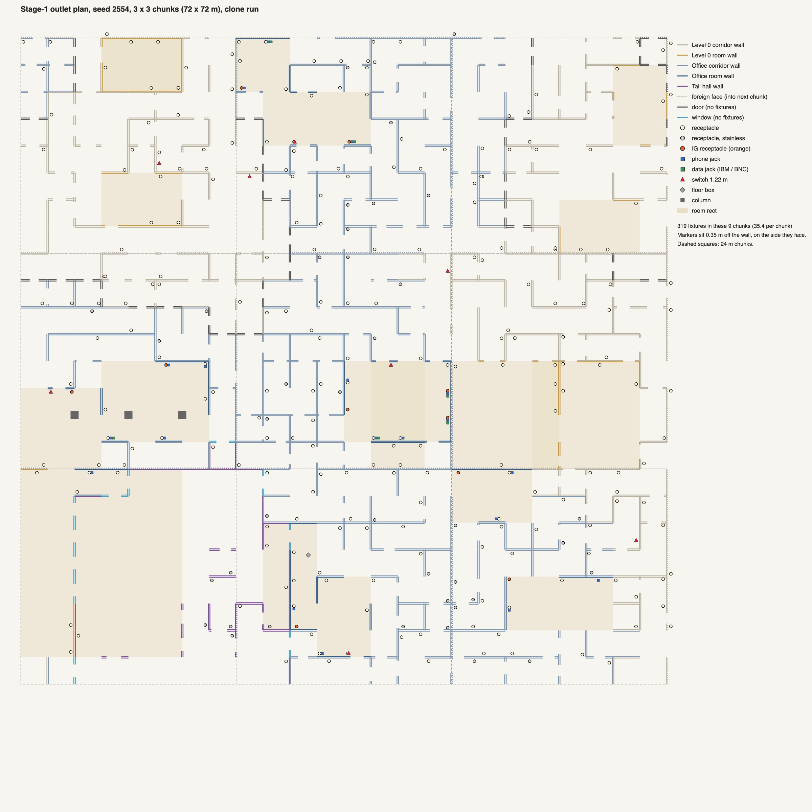

# 10 — Outlet spec: wall fixture kit, and placement as a sub-logic of rooms and walls

Status: **SPEC v1, 2026-10-03 (12:5x)**. Written from `01_period_research.md`, `02_code_paths.md` (rev 2) and the map chat's chosen hook.
- Nothing in the real project outside this folder was changed. Unity was not opened on Frontrooms3D.
- The contract patch (§4) and a reference planner (§3) were **run in the private clone** `scratchpad/proj_outlet` on 20 seeds × 25 chunks. **All checks pass** (§4.4).
- This file is the build contract for the Blender groups (§5), the code task (§5.4) and the map chat (§4).

**Binding inputs, in order of authority**
1. **Red (2026-10-03):** "Make some power outlet models, and fold the outlet placement logic into the whole level/room logic, as a sub-logic of the room and wall logic." Highest spec: a hero LOD0 that holds up at 0.3 m, plus LOD1 and LOD2.
2. **The map chat's chosen hook (binding, 2026-10-03).**
   - Two stages. Stage 1 runs once per chunk, at the end of `BuildInto`, after `AddZoneGrades` and before `Furnish`.
   - `BuildEdge` collects one WallFace per face it builds (both sides). The planner runs once over the list.
   - Exclude start-area walls, Door and Window edges, and arch reveals.
   - Hash with `EdgeId(a, b)` + face side. Stage 2 (per room, after Dress) is optional.
   - Level Designer pin/forbid comes later, as per-edge module data like the lamps.
   - Everything spawned lives under the chunk root; any allocated mesh goes to `chunk.meshes`.
3. `01_period_research.md` (period facts and ESTIMATE ranges, decided here) and `02_code_paths.md` (code facts, R3 renderer, LOD state).
4. `../interactables/10_spec.md` §1.8 and §8: the LOD convention (P-1) and the other pipeline asks (P-2, P-3, P-4).
5. `../office_and_film/22_era_lock.md` (now = 1990, newest design 1993, oldest ~1955).

**Citations.** Code is cited as `file:line` in the real project, read 12:2x today. `MapWorld` = `Assets/Scripts/FrontRoomsMap/FrontRoomsMapWorld.cs`, which changed at 12:21 (single-acting doors). Line numbers drift; the patch in `data/` anchors on text, not lines.

**Tags**
- **ESTIMATE**: a designer number with no source. Measure a real plate before final modelling (01 §11).
- **UNVERIFIED**: nobody has checked it in a run or a capture.
- **NEEDS APPROVAL**: a change to `kitlib.py`, `build_asset.py`, the importer, `FrontRoomsRenderSetup` or a shader. The visual chat decides.
- **CONTRACT**: a change in a map-owned file. Written as an exact proposal for the map chat.

**Machine load.** Load averages were 390–535 on 16 cores during every run here. Every millisecond in this file is **measured under load, re-measure**. Counts (faces, fixtures, triangles, renderers) are exact.

---

## 0. Decisions in one table

| # | Question | Decision | § |
|---|---|---|---|
| D1 | Kit family | **P1:** `Kit_OutletDuplex`, `Kit_OutletDuplex_Steel`, `Kit_OutletDuplex20` (+ `_IG`), `Kit_OutletDuplex_Cracked`, `Kit_OutletDuplex_Jumbo`, `Kit_OutletScrew`, `Kit_OutletBlank`, `Kit_OutletToggle1`, `Kit_OutletToggle2`, `Kit_JackPhone`. **P2:** `Kit_OutletBare`, `Kit_JackData`, `Kit_JackBNC`, `Kit_JackPhone4Prong`, `Kit_FloorBoxTombstone`, `Kit_FloorBoxTombstone2`, `Kit_OutletHandyBox`, `Kit_ConduitEMT`, `Kit_ConduitStrap`, `Kit_CubiclePanel_Powered`. **P3:** scorched, emergency red, Decora rocker, clock outlet, wall-phone plate, raceway, flush floor box, plug props | 1.3 |
| D2 | Origin and front | Wall kits: **the point on the wall face at the plate centre**. The plate back is Blender y = 0; everything visible is at y < 0 (front −Y, Unity +Z). Placement needs only the face point and the normal. Floor boxes: floor contact centre | 1.1 |
| D3 | Colliders, shadows, objects | **Render-only:** `kit.no_collider()`, shadows off. **No GameObject per outlet:** a per-chunk instanced renderer (R3) draws them. 0 colliders, 0 renderers added | 3.4 |
| D4 | LOD | The interactables convention (`<NAME>_LOD0/1/2`, `LOD_DISTANCES`; P-1, NEEDS APPROVAL). Plates switch at **1.5 / 4 / 12 m** (lodBias 1, FOV 76°). LOD1 and LOD2 are **hand-built** (P-1b). Until P-1 lands: LOD0 only, and R3 culls at 12 m by itself | 1.1, 3.4, 6 |
| D5 | Wear | **Instance parameters** (no new mesh): colour, mismatched device, aged, papered/painted over, crooked, not flush, missing screw, ground-up, screw slot angle, horizontal. **Mesh variants:** Cracked, Jumbo, Bare, Blank (P3: Scorched) | 1.4 |
| D6 | Screws | A separate tiny kit (`Kit_OutletScrew`), drawn at the plate's screw anchors with **a random slot angle per plate**, only at LOD0. "Missing screw" = no screw instance | 1.2, 1.4 |
| D7 | Materials | Existing slots `Prop_PlasticBlack`, `Prop_Brass`, `Prop_Aluminium`, `Prop_Chrome`, `Prop_CeramicGlaze` (white), `Prop_Ceramic` (brown), `Prop_PlasticPutty` (grey). **Five new tint-only slots** (NEEDS APPROVAL, P-4b): `Prop_ThermosetIvory`, `Prop_ThermosetAged`, `Prop_ThermosetAlmond`, `Prop_NylonIvory`, `Prop_PlasticOrange` | 1.5 |
| D8 | Stages | **Stage 1 only in v1.** Stage 2 is specified (§2.9) but off. Render check R-4 decides. Reason: no furniture can enter a plate's volume (furniture stands ≥ 0.03 m off the face; a plate stands ≤ 0.0105 m out even when tilted) | 2.9 |
| D9 | Density (metres of solid wall per receptacle) | Level 0 corridor **10.5**, Level 0 room **4.0**, Office corridor **9.0**, Office room **3.3**, Tall **7.5**. Measured in the clone: 11.2 / 4.3 / 9.5 / 3.6 / 7.4 | 2.3 |
| D10 | Heights (centre) | Level 0 **0.31** (1 wall line in 5 at 0.41); Office **0.41** (1 in 4 at 0.46); Tall 0.31 or 0.46; switches **1.22**; title stream **0.38** (baseboard top 0.26). Level 0 off-height 4 %: 0.46, or 1.07 mounted sideways | 2.5 |
| D11 | Never | On Door or Window faces, in the start area, within 0.30 m of a face end, within 0.20 m of an arch edge, within 0.61 m of a plate on the other face of the same wall | 2.4–2.7 |
| D12 | Determinism | `MapHash(seed, EdgeId, side)` per face plus a wall-line hash per 24 m; **no revision**. Faces into the next chunk ("foreign", 9.9 %) use seed-pure inputs only. Tested: rebuild identical; after a revisit shift the 266 border-face fixtures compared were all unchanged | 2.13 |
| D13 | Office detail | **IG orange** on 1/3 of Office-room receptacles; **phone jack** beside 1/2; **data** (IBM or BNC, one network per zone) beside 1/3 of those; switches beside 1/2 of room arches | 2.11 |
| D14 | Floor boxes | Stage 1: bay centres of the 6 m grid in rooms no kit furnishes (measured 0.12 per chunk). Office pods: one floor feed per pod end, placed by the Office kit (visual-owned) | 2.10 |
| D15 | Title stream | Same planner (`PlanLocal`) per RoomRule. Replaces the 45 placeholder plates (each had a BoxCollider) and fixes the unreachable Exit branch | 3.5 |
| D16 | Level Designer | Proposal only: one `ModuleOutlet` per perimeter and inner face, like the lamps, plus a room density multiplier (CONTRACT, phase 2) | 4.3 |
| D17 | Build | Three Blender groups in parallel: **O1** receptacles, **O2** switches/blanks/jacks, **O3** floor and surface boxes. One code task **C1** | 5 |

---

## 1. The kit

### 1.1 Rules for every outlet asset

**Frame.**
- Metres, Z up, front −Y (Unity +Z). Origin as D2.
- The wall clock (`assets/wall_clock.py`) is the precedent for a wall origin: back plane at y = 0, centre at x = z = 0.
- Nothing lies behind y = 0, except the Bare kit's box (≤ 0.035 m deep, hidden by the wall).
- Proud limits (y, mm): plates ≤ 7.5 (jumbo plus screw), toggles ≤ 20, data connectors ≤ 25. Furniture stands ≥ 30 mm off the face (`02` §2.2).

**Sidecar.**
- `kit.no_collider()`.
- Tags: `outlet` + one family tag (`outlet_receptacle`, `outlet_switch`, `outlet_jack`, `outlet_floor`, `outlet_surface`) + `wall_flush` (floor boxes: none).
- **Do not** tag `wall_unit` or `wall_decor`: the Level Designer would snap them 0.03 m off the face.
- Anchors (Unity space, written by `kit.anchor`):
  - `screw_0` … `screw_3`: screw seat points;
  - `face_top`, `face_bottom`: receptacle face centres, for P3 plug props;
  - `plate_top`: plate top centre;
  - floor boxes: `cord_in`.
- `kit.meta["lodDistances"] = LOD_DISTANCES` and `kit.meta["outlet"] = {"plateW":…, "plateH":…, "proud":…}` for the renderer.

**Detail (hero LOD0 at 0.3 m).** At 0.3 m the plate is about 260 px tall on a 1080p screen (FOV 76°).
- Curved outlines (openings, device faces, screw heads, ground holes) get **≥ 64 segments**; plate corners get **12 per corner**.
- Light-catching edges are rounded with **3 segments**: opening edges 0.5 mm, device-face edges 0.6 mm.
- Slot mouths get a 0.15 mm chamfer (1 segment).
- The plate edge is the §1.2 profile, not a bevel.
- Weighted normals: follow the interactables G1 probe (P-2). Use support loops if custom normals do not survive `finish()`.
- Paint an `fr_wear` colour attribute on every part (white; 0.85 on the plate rim around the device faces, where hands go). It costs nothing until P-3.

**LOD (the interactables convention).**
- Every module declares `LOD1 = None`, `LOD1_RATIO`, `LOD2_RATIO`, `LOD_DISTANCES` and `BUDGET`.
- LOD1 and LOD2 are **built by hand**, as part sets.
  - Mark each part with `obj["fr_lods"] = "0"`, `"1"`, `"2"` or a mix such as `"012"`.
  - Build the LOD1 and LOD2 parts **only when `hasattr(kitlib.Kit, "make_lods")`**. Today `finish()` joins every part into one mesh, so LOD parts built now would end up inside LOD0.
- Until P-1/P-1b land, each FBX holds LOD0 only. R3 then draws LOD0 out to 12 m (§3.6 has the cost).

| Level | Plate content | Device / jack content |
|---|---|---|
| LOD0 (0–1.5 m) | §1.2 profile; 12-segment corners; hollow back rim; countersunk screw holes | Faces with real slots 7 mm deep; brass contacts; 64-segment outlines; screws as separate instances |
| LOD1 (1.5–4 m) | 2-step edge profile; 4-segment corners; no back; plain screw hole | 24-segment faces; slots as 0.5 mm-deep black insets; no contacts; no screws |
| LOD2 (4–12 m) | **Bevelled quad:** an 8-vertex rounded outline at full height with one bevel ring to the wall | The faces as two flat dark 6-gons, 0.3 mm proud (the "two dots" of DSC00161) |

At 4 m the plate is 20 px tall; at 12 m, 7 px.

### 1.2 Shared numbers (identical in every group; each helper asserts them)

Blender frame, millimetres. x = across the plate (right as seen from the front), z = up, y = out of the wall (negative).

**Plates**

| Item | Value | Source |
|---|---|---|
| Standard 1-gang | **69.8 × 114.3**, corner radius 2.0 | 01 §3.1 (Leviton, Arrow Hart) [read]; radius ESTIMATE |
| Jumbo 1-gang | **88.9 × 133.4**, depth 6.5 | 01 §3.1 |
| 2-gang | **115.9 × 114.3**; gang centres at x = ±23.0 (1.81 in pitch) | 01 §3.1 |
| Thermoset profile (inset from the outline → height above the wall) | (0, 0), (0.15, 1.20), (0.45, 2.60), (0.95, 3.80), (1.70, 4.70), (2.70, 5.25), (4.00, 5.50); the field crowns to **5.60** at the centre | depth 5.6 [read]; profile ESTIMATE (01 §3.1 "soft dome, 3–5 mm edge") |
| Thermoset back | hollow: a rim 1.6 wide on the wall; cavity face 3.5 above the wall (seen only when the plate is tilted) | ESTIMATE |
| Stainless profile | sheet 0.76; flat field at **4.70**; formed edge = a quarter-round return, radius 1.5, and a straight leg to the wall; corner radius 1.0 | 01 §3.1 [read]; edge ESTIMATE |
| Duplex openings | 2 × round with flats: Ø **33.3**, flats at z = ±14.3 of each centre (height 28.6); centres at **z = ±19.45** (1-17/32 in apart) | 01 §3.2 [read] |
| Toggle opening | **10.3 × 23.8**, corner radius 1.0 | 01 §3.2 |
| Phone jack opening | 14.0 × 12.0, corner radius 1.0 | ESTIMATE |
| Screw holes | Duplex: 1 at the centre. Toggle: 2 at z = ±30.15. Blank and phone: 2 at z = ±41.65. Countersink Ø 7.4 at the field, 82°. The screw seat (where the head rim meets the countersink, Ø 6.6) is level with the field, so the crown stands 1.0 proud | 01 §3.3 [read]; countersink ESTIMATE |

**Devices**

| Item | Value | Source |
|---|---|---|
| 5-15R face (each of two) | round with flats Ø **32.5**, flats ±13.9 (0.4 clearance in the opening); stands **1.0 proud of the field** | 01 §2; proud ESTIMATE (≤ 1.5) |
| Device behind the gap | a back plane 1.5 behind the field, device colour | ESTIMATE |
| Slots (face frame, ground down) | **neutral** 2.0 × 8.5 at x = −6.35, z = +3.0; **hot** 2.0 × 7.0 at x = +6.35, z = +3.0; **ground** U-shape Ø 5.0 (round bottom, flat top) centred at z = −8.9 | blade pitch 12.7, ground 11.9 below the blade line [read]; slot sizes ESTIMATE |
| Slot depth | 7.0, walls `Prop_PlasticBlack`; a brass contact pair (0.4 thick leaves) at 3.0 deep in each blade slot | ESTIMATE |
| 5-20R | the neutral slot gets a horizontal arm 6.4 × 2.0 at its centre, pointing to −x (away from hot) | 01 §2.1 [read]; arm size ESTIMATE, check a photo |
| Toggle | Switch face 0.5 behind the field. Bat handle: base 7.5 × 5.0, tip 6.0 × 4.0 with a 2.0 radius, 17 long from a pivot 2.0 behind the field, **32° up** (= ON). Roll 180° gives OFF | ESTIMATE |
| 6P modular jack | insert face 0.3 behind the field; cavity **9.9 × 6.8**, 12 deep; latch notch 3.2 × 2.0 at the bottom; 4 brass contact wires Ø 0.45 at 1.0 pitch, angled 20° at the cavity top | plug width 9.85 [read]; rest ESTIMATE |
| Screw (`Kit_OutletScrew`) | #6-32 oval head: Ø **6.6**, crown **1.0** above the seat, slot **0.8 wide × 0.6 deep** across the head; 64 segments; origin = seat centre, front +Z | 01 §3.3 |

**Asserts every helper runs:** plate outline and depth (±0.05 mm); opening centres and sizes; total proud ≤ the limit; face-to-opening clearance 0.4 (±0.05); ground hole below the blade line.

### 1.3 Master list

Columns:
- **Size** = W × H × proud, in mm (Unity X × Y × Z).
- **Tris** = LOD0 / LOD1 / LOD2. Triangle counts must land within ±15 %.
- **LOD dist** = switch distances in metres at lodBias 1. They are doubled on Standalone Ultra (lodBias 2): 3 / 8 / 24, still under the 48 m ring rule (`02` §3).
- Slots: **TI** `Prop_ThermosetIvory`, **NI** `Prop_NylonIvory`, **PB** `Prop_PlasticBlack`, **BR** `Prop_Brass`, **AL** `Prop_Aluminium`, **CH** `Prop_Chrome`, **OR** `Prop_PlasticOrange`.

| Asset | Module | Grp | Pri | Size | Slots | Tris | LOD dist | Variants and notes |
|---|---|---|---|---|---|---|---|---|
| `Kit_OutletDuplex` | `outlet_duplex.py` | O1 | P1 | 69.8 × 114.3 × 6.6 | TI, NI, PB, BR | 2,600 / 1,000 / 40 | 1.5 / 4 / 12 | 5-15R, ground down. VARIANTS `Kit_OutletDuplex_Brown` (TI, NI → `Prop_Ceramic`) |
| `Kit_OutletDuplex_Steel` | `outlet_duplex_steel.py` | O1 | P1 | 69.8 × 114.3 × 5.7 | AL, NI, PB, BR | 2,300 / 950 / 40 | 1.5 / 4 / 12 | 0.030 in stainless; the same device sits 0.9 lower (thinner plate) |
| `Kit_OutletDuplex20` | `outlet_duplex20.py` | O1 | P1 | as Duplex | TI, NI, PB, BR | 2,800 / 1,050 / 40 | 1.5 / 4 / 12 | 5-20R T-slot. VARIANTS `Kit_OutletDuplex20_IG` (NI → OR) |
| `Kit_OutletDuplex_Cracked` | `outlet_duplex_cracked.py` | O1 | P1 | as Duplex | TI, NI, PB, BR | 3,100 / 1,100 / 40 | 1.5 / 4 / 12 | A radial split 0.25 wide from the screw hole to the edge, one side stepped 0.2; a chipped corner 5 × 4 with 3–4 conchoidal facets |
| `Kit_OutletDuplex_Jumbo` | `outlet_duplex_jumbo.py` | O1 | P1 | 88.9 × 133.4 × 7.5 | TI, NI, PB, BR | 2,700 / 1,000 / 40 | 1.5 / 4 / 12 | Oversize plate over a bad cut-out |
| `Kit_OutletScrew` | `outlet_screw.py` | O1 | P1 | Ø 6.6 × 1.0 | TI | 260 / – / – | drawn with plate LOD0 only | R3 re-colours it to the plate's finish |
| `Kit_OutletBlank` | `outlet_blank.py` | O2 | P1 | 69.8 × 114.3 × 5.6 | TI | 1,300 / 450 / 30 | 1.5 / 4 / 12 | 2 screw anchors (box mount) |
| `Kit_OutletToggle1` | `outlet_toggle1.py` | O2 | P1 | 69.8 × 114.3 × 20 | TI, NI, PB | 2,100 / 800 / 40 | 1.5 / 4 / 12 | 2 screw anchors 60.3 apart |
| `Kit_OutletToggle2` | `outlet_toggle2.py` | O2 | P1 | 115.9 × 114.3 × 20 | TI, NI, PB | 3,500 / 1,300 / 50 | 1.5 / 4 / 12 | 4 screw anchors |
| `Kit_JackPhone` | `outlet_jack_phone.py` | O2 | P1 | 69.8 × 114.3 × 5.6 | TI, NI, PB, BR | 2,200 / 800 / 40 | 1.5 / 4 / 12 | One 6P jack (RJ11) |
| `Kit_OutletBare` | `outlet_bare.py` | O1 | P2 | 106.7 × 76 × 8 (+35 behind) | NI, AL, PB, BR | 3,600 / 1,300 / 60 | 1.5 / 4 / 12 | Missing plate: device on its strap (106.7 × 33.8) with plaster ears and side terminal screws (brass; silver = AL); the box front edge 1 mm proud; a 3–5 mm ragged dark gap (PB) round it. The read at 0.3 m is UNVERIFIED (no hole can be cut in the map wall) |
| `Kit_JackData` | `outlet_jack_data.py` | O2 | P2 | 69.8 × 114.3 × 25 | TI, PB, NI, BR | 2,800 / 1,000 / 60 | 1.5 / 4 / 12 | IBM Data Connector, 32 × 32 hermaphroditic, black and beige (1984) |
| `Kit_JackBNC` | `outlet_jack_bnc.py` | O2 | P2 | 69.8 × 114.3 × 18 | TI, CH, PB, BR | 2,400 / 900 / 50 | 1.5 / 4 / 12 | BNC bulkhead, Ø 9.5 bayonet with 2 pins (1985) |
| `Kit_JackPhone4Prong` | `outlet_jack_phone4.py` | O2 | P2 | 52 × 52 × 18 | `Prop_Ceramic`, PB, BR | 1,800 / 700 / 40 | 1.5 / 4 / 12 | Square 404A-type surface block, brown; second-hand relic |
| `Kit_FloorBoxTombstone` | `outlet_floorbox.py` | O3 | P2 | 111 × 67 × 76 | AL, NI, PB, BR | 3,200 / 1,200 / 80 | 2 / 6 / 15 | SFH-40 type; one duplex on the +Z face; a 2 mm flange on the carpet; origin = floor contact |
| `Kit_FloorBoxTombstone2` | `outlet_floorbox2.py` | O3 | P2 | 127 × 76 × 86 | AL, NI, PB, BR | 4,600 / 1,700 / 100 | 2 / 6 / 15 | SFH-50 type, back to back |
| `Kit_OutletHandyBox` | `outlet_handy_box.py` | O3 | P2 | 54 × 102 × 48 | AL, NI, PB, BR | 3,400 / 1,300 / 80 | 2 / 6 / 20 | Surface box with a galvanized raised cover and duplex; EMT connector on top; origin = wall point at the box centre |
| `Kit_ConduitEMT` | `outlet_conduit.py` | O3 | P2 | Ø 17.9 × 1,000 | AL | 600 / 220 / 24 | 3 / 8 / 24 | Plain 1/2 in EMT tile, origin at the bottom on the wall axis; R3 stacks it to the ceiling and scales the last tile in Y |
| `Kit_ConduitStrap` | `outlet_conduit_strap.py` | O3 | P2 | 30 × 22 × 22 | AL | 300 / 100 / – | 2 / 6 / – | One-hole strap, every 1.5 m |
| `Kit_CubiclePanel_Powered` | `outlet_panel_powered.py` | O3 | P2 | as `Kit_CubiclePanel` (1,524 × 1,520 × 64) | FabricCubicle, SteelPutty, PB, NI (+ BR in the slots) | panel + 900 / panel LOD1 / – | the panel's own `LOD1 = 0.45` (≥ 1 m, allowed today) | Calls `cubicle_panel.build_panel(kit, width, height)` (new file; never edits `cubicle_panel.py`), then sets one duplex **sideways** into the dark base rail on each face, centred at 0.07 m (01 §6.2: one duplex per side, 0.05–0.07 m). The receptacle parts are `lod1_drop`. A collider is kept (it is furniture). Slot budget: the device shares `Prop_NylonIvory`; contacts may drop to PB to stay ≤ 4 slots |
| P3 | — | — | P3 | — | — | — | — | `Kit_OutletDuplex_Scorched` (melted slot corner + soot; needs P-3 vertex colour), `Kit_OutletEmergency` (red device, Run rooms; period colour UNVERIFIED), `Kit_OutletToggleRocker` (Decora), `Kit_OutletClock` (with `Kit_WallClock`), `Kit_JackWallPhone`, `Kit_OutletRaceway` (Wiremold 700 tile), `Kit_FloorBoxFlush`, `Kit_PlugCubeTap`, `Kit_PlugAdapter`, `Kit_PlugCordCut` |

**Era lock (every module).** Nothing of the following may appear:
- tamper-resistant shutters or "TR" marks;
- USB faces;
- screwless snap plates;
- LED GFCIs;
- "CAT" or TIA-568 text;
- dates after 1990;
- any maker's name or logo (no UL mark).

Devices are all-orange for IG, never an ivory device with only a triangle (01 §10).

### 1.4 Wear: what is a parameter and what is a mesh

Rates are 01 §8 (Level 0 / Office). They are independent rolls per plate, so they can stack. At most one mesh variant per plate.

| State | Rate L0 / Office | How | Notes |
|---|---|---|---|
| Plate colour | per wall line | **material** (palette, §1.5) | One electrician per line: one colour, one height, one offset |
| Aged / grime | 30 / 15 % of ivory plates | material `Prop_ThermosetAged` | World-space macro wear varies every instance for free (`02` §4.3) |
| Papered or painted over | 3 / 8 % | the plate drawn with **the face's wall material** (world-projected, so the print runs across the plate) | Wallpapered plates were a real decorator habit; on Level 0 paper it makes a nearly invisible plate |
| Mismatched device | 5 / 5 % | device material white ↔ ivory | |
| Crooked | 10 / 8 % | instance roll ±2–6° | |
| Not flush | 8 / 5 % | instance tilt 0.5–1.5° about the bottom edge (top 1–3 mm off the wall) | Shows the hollow back |
| Missing screw | 6 / 4 % | no screw instance; tilt ≥ 0.4° | |
| Ground up | 15 % | roll 180° | A second electrician; a ground-down duplex reads as a surprised face, so keep most ground-down |
| Sideways | with off-height 1.07 m | roll 90° | Counter height with no counter |
| Screw slot angle | every plate | screw instance roll, uniform 0–180° | What people notice at 0.3 m |
| Cracked | 5 / 3 % (thermoset only) | mesh `_Cracked` | |
| Jumbo | 5 / 3 % | mesh `_Jumbo` | |
| Blank | 3 / 4 % | mesh `Kit_OutletBlank` | |
| Missing plate | 3 / 1 % | mesh `Kit_OutletBare` (P2) | |
| Scorched | 2 / 2 % | mesh (P3) | Falls back to the plain duplex until it exists |
| Plug left in, tape or Dymo label | 2–6 % | P3 props | No dates printed |

Missing kits fall back at draw time, so the plan never changes when a kit lands:
- `_Jumbo`, `_Cracked`, `_Scorched`, `Bare` → `Kit_OutletDuplex`;
- `HandyBox` → `_Steel`;
- `Toggle2` → `Toggle1`;
- data jacks and floor boxes → nothing.

### 1.5 Materials and the palette

The FBX slot is only the default. R3 picks the material per fixture from this palette, so colour needs no extra FBX.

| Finish | Material | Status | Fallback until approved |
|---|---|---|---|
| Ivory (default plate) | `Prop_ThermosetIvory`: tint **#E6DDC2**, smoothness 0.75 | **new, P-4b** | `Prop_PlasticBeige` |
| Aged ivory | `Prop_ThermosetAged`: #CDBF98, 0.60 | **new, P-4b** | `Prop_PlasticPutty` |
| Almond | `Prop_ThermosetAlmond`: #E3D7BE, 0.70 | **new, P-4b** | `Prop_LaminateBeige` |
| White | `Prop_CeramicGlaze` (existing; .86/.85/.80, 0.85) | existing | — |
| Brown | `Prop_Ceramic` (existing; .353/.227/.141, 0.80) | existing | — |
| Grey | `Prop_PlasticPutty` (existing, warm grey) | existing | — |
| Stainless / galvanized | `Prop_Aluminium` (existing, metallic) | existing | — (`_Steel` mesh only) |
| Device ivory (nylon) | `Prop_NylonIvory`: #E2D9BF, 0.55 | **new, P-4b** | `Prop_PlasticPutty` |
| IG orange | `Prop_PlasticOrange`: **#D8642A**, 0.55 | **new, P-4b** | none: IG devices draw ivory until approved |
| Wall match | `FrontRoomsSurfaces.Room(rule, Slot.Wall)` (map: Lobby for Level 0, Office for Office) | existing | — |
| Cavities, contacts, steel | `Prop_PlasticBlack`, `Prop_Brass`, `Prop_Aluminium`, `Prop_Chrome` | existing | — |

- Modules register the new slots with `kitlib.register_slot(...)`, using the hex values above as preview colours. **Never edit `SLOTS`.**
- Each Unity side is one tint-only `SurfaceDef` line in `FrontRoomsRenderSetup`, like `Prop_PlasticRed`, plus the instancing flag (P-6).
- **Calibration (look-dev L-1).** Under Level 0 light the plate must read about 11 % darker and warmer than the paper beside it, as in DSC00161 (01 §1.1). Tune the tint there, not here.

### 1.6 Which zone uses which

The brief suggested brown or grey for Office. The period research says otherwise (01 §3.4):
- brown is old stock (to the 1970s), so it appears as 10 % of Level 0 lines;
- grey belongs to equipment rooms, so it appears in Tall halls.

Office therefore uses ivory and almond, with stainless in public halls and orange IG devices at desks.

| Place (planner class) | Kits | Plate finish (per wall line) | Device | Height | Spacing |
|---|---|---|---|---|---|
| **Level 0 corridor** (≈ 2/3 of all solid wall) | Duplex + wear variants; one lone switch (`Toggle1`, 1.22 m) in 25 % of chunks | ivory 70, almond 10, white 10, brown 10 % | matches the plate | 0.31; 1 line in 5 at 0.41; 4 % off-height | 10.5 m |
| **Level 0 room** | Duplex; phone jack beside 4 %; `Toggle1` beside 15 % of the room's arches | as above | matches | 0.31; 1 line in 4 at 0.41; 4 % off-height; jitter 0 (the photo's regular bays) | 4.0 m |
| **Office corridor** | Duplex 80 %, Duplex20 20 % | ivory 55, almond 35, white 10 %; stainless 25 % (50 % on zone-border faces) | matches | 0.41; 1 line in 4 at 0.46 | 9.0 m |
| **Office room** | Duplex 55 %, Duplex20 45 %; IG on 1/3; phone beside 1/2; data beside 1/3 of phones; `Toggle1`/`Toggle2` beside 1/2 of arches; pods: floor feed + one `Kit_CubiclePanel_Powered` spine panel per pod (Office kit) | as Office corridor | ivory; **orange** for IG | 0.41 / 0.46 | 3.3 m |
| **Tall hall** (5.4 m) | Duplex; `_Steel` 30 % (→ HandyBox + EMT once P2 lands); columns 1 in 3 | ivory 40, grey 30, almond 30 % | matches | 0.31; 40 % of lines at 0.46 | 7.5 m |
| **Columns** | Duplex (`_Steel` in Tall halls) on one face | Office almond, Level 0 ivory, Tall stainless or grey | matches | Office 0.41, Level 0 0.31, Tall 0.46 | Office and Tall 1 column in 3; Level 0 1 in 8 |
| **Floor** | FloorBoxTombstone 80 %, …2 20 % | aluminium | ivory | floor | §2.10 |
| **Title: Lobby** | `_Steel` | stainless | ivory | 0.38 | 6 m; phone 25 % |
| **Title: Shift** | Level 0 rules with wear | Level 0 | | 0.38 | 4 m |
| **Title: Office** | Office-room rules, plus the Office kit | Office | | 0.41 / 0.46 | 3.3 m |
| **Title: Run** | white Duplex, no wear (P3: one red emergency receptacle) | white | white | 0.46 | 6 m |
| **Title: Exit** | `_Steel`, clean | stainless | ivory | 0.38 | 12 m |

---

## 2. Placement: a sub-logic of the room and wall logic

### 2.1 The shape of the logic

One pure function plans all fixtures of a chunk. It runs once, after the map has built the chunk's walls and before furniture.

Each fixture is decided by four nested layers:

| Layer | Decides | Keyed by |
|---|---|---|
| **Room** (`WallFace.room`) | which rules (room or corridor); at least one receptacle per long room side; caps; later the module's pins, forbids and density | room index, module data |
| **Wall line** (one electrician's run) | which end the plates count from; the offset (0.30, 0.45 or 0.60 m); the height; the plate colour | world cell line + orientation + side, per 24 m segment |
| **Face** (one 3 m side of one edge) | whether it gets a receptacle (by its solid length); jitter; wear; companions; an arch switch | `EdgeId` + side |
| **Fixture** | kit, position, normal, roll, tilt, screw angle, finishes | (output) |

At chunk level the planner also adds column fixtures, floor boxes and at most one lone switch.

All three founding-photo rules hold (01 §1.5):
- the plate sits on top of the wall finish;
- a run keeps one height and one side offset;
- no baseboard is needed.

### 2.2 Inputs per wall face

The map fills one `WallFace` per face it builds (§3.2, §4.1).

| Field | Meaning | Filled from |
|---|---|---|
| `start`, `direction`, `length` | the face plane at floor level: start at the edge's low end, offset `WallHalf` along the normal; +X or +Z; 3.0 | `start`, `along` in `BuildEdge` |
| `normal` | into the served cell | side 0: −across; side 1: +across |
| `kind`, `openFrom/To`, `openBottom/Top` | the opening span along the face; sill and head | the values `BuildEdge` builds with (arches: `ArchOpening`) |
| `edgeId`, `side` | world edge id (same from both sides); 0 = into a (west/south), 1 = into b | `EdgeId(a, b)` |
| `cell`, `foreign` | served world cell; true when it is in the next chunk (east/north border) | |
| `room` | topmost `MapChunk.rooms` rect holding the cell, else −1; always −1 for foreign | `data.rooms` |
| `zone`, `theme`, `height`, `ceiling`, `zoneBorder` | the served cell's zone, and whether the cell behind is another zone | `Cache.ZoneOf` |
| `baseTop` | the top of a base trim on this face | 0 on the map today; 0.26 in the title stream; a future N1 base trim sets it |

The planner also reads:
- `data.pillar` and `pillarStyle` (columns);
- `data.rooms`, `data.east/north` (floor boxes);
- module props, markers and the key spot (keep-outs);
- the start-area rect.

### 2.3 Classes and how many

- **Probability per face** = `min(1, solid / spacing)`.
  - `solid` = 3.0 m for a Wall face, or 3.0 − the arch width for an Arch face.
  - Door and Window faces: 0.
- **At most one receptacle per face.** Companions and switches are extra.
- The class comes from the face: Tall height, then Office or Level 0 theme, then room (`room ≥ 0` and not foreign) or corridor.

Measured with the reference planner (20 seeds × 25 chunks = 500 chunks, 62,914 faces):

| Class | Solid wall (m) | Receptacles | m per receptacle (target) |
|---|---|---|---|
| Level 0 corridor | 94,992 | 8,478 | **11.2** (10.5) |
| Level 0 room | 12,629 | 2,958 | **4.3** (4.0) |
| Office corridor | 26,150 | 2,760 | **9.5** (9.0) |
| Office room | 3,262 | 909 | **3.6** (3.3) |
| Tall | 5,665 | 763 | **7.4** (7.5) |

- Measured values sit slightly above the targets: some faces have no valid point, and back-to-back drops remove 2.2 %.
- Totals: **34.3 fixtures per chunk** (max 62).
  - Receptacles (incl. blank and bare plates): 15,868.
  - Phone jacks: 562; data jacks: 146.
  - Switches: 495.
  - Column fixtures: 33.
  - Floor boxes: 60.

### 2.4 Where along the face

1. **Valid span.**
   - Keep `[0.30, L − 0.30]`. 0.30 m from a face end clears inner corners: 0.08 m wall half + 0.035 m plate half + 0.15 m clearance + rounding. It also clears the 0.08 m wall-end extensions and the next face's plate. So the planner never needs corner flags, and foreign faces need no neighbour data.
   - On an Arch face, also keep 0.20 m off each arch edge. That leaves up to two pieces.
2. **Anchor.** The wall-line hash picks the end the electrician counted from, and an offset of 0.30, 0.45 or 0.60 m from it (01 §7.3: 0.3–0.6 m from a corner).
3. **Jitter.** ±1 step of 0.15 m per face in corridors, Office and Tall. None in Level 0 rooms.
4. **Snap.** Take the nearest 0.15 m grid point inside the valid span within 0.60 m. If there is none, the face gets no receptacle.
   - Face starts lie on the 3 m grid, so **every plate centre lies on a world 0.15 m grid** along its wall.
   - On a straight run the plates repeat at about 3.0 m (± jitter), the rhythm of the photo's bays.
5. **Same face.** Fixtures at similar heights stay ≥ 0.30 m apart, centre to centre.

### 2.5 Heights (plate centre above the floor)

| Where | Height | Rule |
|---|---|---|
| Level 0 | **0.31** | Pre-ADA 12 in; DSC00161 measures 0.33. One wall line in 5 runs at 0.41 (a newer fit-out; DSC00159 measures 0.35–0.43) |
| Level 0 off-height (uncanny) | 4 % of receptacles: **0.46** (60 %) or **1.07 sideways** (40 %) | Both in period range: 18 in, and counter height (UH mounts them horizontally above splash backs). The counter is gone |
| Office | **0.41**; one line in 4 at 0.46 | Newer 16–18 in fit-out |
| Tall | 0.31; 40 % of lines at 0.46 | |
| Switches | **1.22** | 48 in (ADAAG 4.2.5) |
| Title stream | **0.38** (Office 0.41) | Baseboard top 0.26 |
| Any face | centre ≥ `baseTop` + 0.03 + half the plate height (0.057; jumbo 0.067) | So a plate never meets a base trim (a future N1 trim sets `baseTop`) |

The ADA 15 in minimum does not bind a 1990 building (01 §7.1), so 0.31 is legal.

### 2.6 Openings, swings, arches and switches

**Door and Window faces get nothing in v1** (binding). The period rules agree:
- A window sill at 0.35 m sits below a 0.31 m plate's top (0.367 m), so no plate fits under a window.
- A door leaf (1.0 m, 95°, hinged 1.0 m from the cell corner) sweeps only the hinge side of its own edge. No other face lies in a swing.
- The door keep-clear strips (1.2 m deep) are floor; plates on the walls beside them are normal.

**Arch faces.**
- Plates stay 0.20 m from the arch edge. The arch has no trim, and its reveal is bare wall.
- Reveals are not faces, so they never get a fixture.

**Switches.**
- On room arch faces (Office 50 %, Level 0 rooms 15 %): a `Toggle1` (Office: `Toggle2` 30 %) **0.20 m beside the arch edge at 1.22 m**. The side comes from the hash; if it does not fit, the planner tries the other side.
- Room arch edges are passable, so their whole 3 m strip is keep-clear and furniture never stands in front of a switch.
- **Lone switch** (ETB's 1.1 m plate, 01 §1.4): in 25 % of chunks, one `Toggle1` at 1.22 m on a Level 0 corridor Wall face, 1.5 ± 0.45 m along.
- Large Level 0 floors had panel switching (01 §4), so most rooms have none.

**Switches beside doors** (strike side, 0.05–0.30 m from the trim) need fixtures on Door faces. That is proposal C-3 (§4.3), not v1.

### 2.7 Both faces of one wall

- Two fixtures on the two faces of one edge stay **≥ 0.61 m apart along the wall**, at any height (UL 24 in rule, 01 §7.4).
- **Side 0 yields.** It moves to the nearest 0.15 m grid point within 0.90 m that keeps every rule. If there is none, it is dropped.
- Side 1 never moves. It may be a foreign face, so this keeps its plan seed-pure.
- Measured: 1,210 moved (7.0 % of fixtures), 379 dropped (2.2 %), 0 violations.

### 2.8 Columns

- Columns come from the chunk data (`pillar`, `pillarStyle`; `MapChunk` corners, 6 m grid, strictly inside rooms).
- Probability per column: Office and Tall 1/3, Level 0 0.12.
- The hash picks one of the four faces. The plate is centred on that face, at column centre + normal × w/2 (w = 0.6 or 0.9).
- The 0.10 m cove sits well below a 0.31 m plate (bottom 0.25).
- Columns touching the start area are skipped, as `BuildInto` skips them.
- Measured: 33 in 500 chunks (columns are rare).

### 2.9 Furniture

**Stage 1 knows module data** before any furniture exists, as keep-outs:
- module props (footprint × their height range, up to 2.1 m);
- the key spot (1.2 × 1.2 m, 0–2.1 m);
- Relay entries (1.6 × 1.6 m, 0–2.1 m).

A fixture whose volume (plate rect + 0.02 m each side, 0.012 m out from the face) meets a keep-out is dropped. Measured: 7 of 17,164.

**Dress furniture never meets a plate:**
- wall units stand 0.03 m off the face, wall rows 0.045 m;
- pods stand ≥ 1.05 m off the walls; piles keep a 0.6 m ring;
- a plate stands ≤ 0.0075 m out, or ≤ 0.0105 m when tilted.

Plates **partly or fully behind** furniture are allowed, as in real offices. Hidden ones cost only instanced draws inside 12 m.

**"Outlet near each workstation" without stage 2.**
- Office rooms run at 3.3 m spacing with one receptacle per 3 m face (measured 3.6 m).
- So a desk against a wall is almost always within about 1.8 m of a plate.
- Pods get their power from floor feeds (§2.10).

**Stage 2 (optional, OFF in v1).**
- Signature: `FrontRoomsWallFixtures.Refine(Transform chunkRoot, int room, Rect floor, IReadOnlyList<Rect> keepClear, IReadOnlyList<Rect> footprints)`.
- Called per room after Dress (CONTRACT C-4 if enabled). The Office kit registers its own placements on the chunk's set (visual-owned), so `footprints` covers everything.
- It would:
  1. drop plates hidden by furniture within 0.10 m of the face;
  2. give every wall row a receptacle within 2.0 m of its end panel;
  3. turn desk-wall receptacles into IG + phone pairs.
- **Decision rule (render check R-4, §7):** enable it only if the captures show a fixture cut by furniture (a bug, since geometry forbids it), a plate visible through a gap under 0.05 m between two pieces, or a powered station with no visible power source within 2 m. If none of these shows, stage 2 stays off. Today no capture exists, because no kit is built yet, so the decision is pending R-4.

### 2.10 Floor boxes

- **Stage 1** places them at the **bay centres of the 6 m grid** (odd world cell corners), where the 2 × 2 cells round the corner are mutually open, share one height and theme, and are not in a room the dress step may furnish.
  - "May furnish" = the map's `Furnish` test: `RoomIntact`, `Uniform`, module fill not None.
  - Probability: Office 0.30, Tall 0.10, Level 0 0.04.
  - Offset ±0.6 m on the 0.6 m fine grid; yaw a multiple of 90°.
- They read as "the desks have gone". Measured: **60 in 500 chunks** (0.12 per chunk), all P2 kits (nothing is drawn until O3 lands).
- **Office pods** (visual-owned, Office kit, not stage 2): `BuildRun` adds one `Kit_FloorBoxTombstone` at each pod end on the spine line, 0.15 m outside the end panel, front toward the panel.
  - It registers on the chunk's set (`parent.GetComponentInParent<FrontRoomsWallFixtureSet>()?.AddExtra(...)`), or spawns without colliders when there is no set (look-dev hall).
  - Render-only and 67 mm tall: under the Relay's 0.4 m probe and the E ray.

### 2.11 Office companions and IG

| Item | Rule |
|---|---|
| IG (isolated ground) | 1/3 of Office-room receptacles become `Duplex20` with an **all-orange** device (measured 274 = 30 % of 909) |
| Phone | `Kit_JackPhone` **0.30 m beside** 1/2 of Office-room receptacles (562), same height, toward the face centre; the other side if blocked |
| Data | 1/3 of phone plates get a data plate 0.30 m further on (146). **One network per zone**: the zone hash picks IBM Data Connector or BNC, so a zone reads as one installation |
| No RJ45 | 10BASE-T is only weeks old in 1990 (01 §5.2) |

### 2.12 Caps

| Scope | Cap | Why |
|---|---|---|
| Level 0 room | 10 fixtures | Sparse, as in the photos |
| Office room | 24 fixtures (with companions and switches) | Desk density |
| Chunk | **160 own fixtures**; foreign faces are planned first and are exempt | A cap that cut foreign faces would make them depend on this chunk's revision. Measured max **62**, so the cap never bit |

### 2.13 Determinism, streaming and lifetime

**Hashes.**
- Face: `MapHash.Hash(seed, (int)edgeId, (int)(edgeId >> 32), 409 + 16·field + side)`.
- Line: `MapHash.Hash(seed, line·2 + orientation, segment, 425 + side)`. `line` is the world cell-line index; `segment` is the 24 m chunk span along it (`>> 3`).
- Salts 409–600 are free: MapHash uses 11–73; MapWorld uses 89, 97, 211, 223, 307.
- **No revision** anywhere.

**Rebuild** is identical (tested on 60 rebuilds).

**Revisit shift.**
- A face whose wall, opening, room and twin did not change keeps its fixtures (no hash uses the revision). Changed faces re-plan out of sight, like the rest of the interior. All 80 shifted chunks changed inside.
- **Foreign faces never change:** 266 fixtures compared, 0 diffs.

**Foreign faces** (side 1 of the chunk's east and north border edges; 9.9 % of faces).
- They use only seed-pure inputs: room −1 (corridor class), zone, openings, the wall line, and no keep-outs or caps. The other side (side 0, this chunk) always yields.
- **Consequence of collecting in `BuildEdge`:** a room on a chunk's west or south border gets its border-wall plates from the neighbour, at corridor density, and the room-side guarantee does not cover that side. That is about 10 % of faces. Accepted: the photo rule is sparse anyway.
- **No floating plates:** every planned plate sits on a wall this chunk built. The ring-edge case of `02` §3 is gone.

**Lifetime.**
- The set is a component on the chunk root, so `Unregister` and `RebuildChunk` free it.
- R3 allocates **no Mesh** (it draws the kit FBX meshes), so `FreeMeshes` has nothing new to free. The `ownedMeshes` argument stays for a combined-mesh fallback.
- **Edit mode:** the set is `[ExecuteAlways]`. The registry went 25 → 25 after a rebuild → 0 after destroy, on every seed.

**Failure.** `Install` runs inside `Build`'s try, so a throw undoes the chunk like any other build error.

### 2.14 Module overrides (Level Designer; proposal, CONTRACT phase 2)

These follow the lamp precedent (`RoomModuleData.lamps`, stamped into `MapChunk.lamp`). §4.3 has the fields. The planner reads them for own faces before its rules:
- **None** forbids;
- a **kind** pins that fixture, at `along` and `y` when they are not 0;
- **Auto** leaves the rules;
- the room's `outletDensity` (0–3) multiplies `p`.

The Level Designer preview builds the real map (`02` §3), so outlets show there with no designer change.

---

## 3. API (visual-owned code)

### 3.1 Files

| File | Content |
|---|---|
| `Assets/Scripts/Office/FrontRoomsWallFixtures.cs` (new) | Structs, rules, `Plan` (pure), `PlanLocal`, `Install`, `InstallLocal`, `Refine` (stage 2, off) |
| `Assets/Scripts/Office/FrontRoomsWallFixtureSet.cs` (new) | `[ExecuteAlways]` component on the chunk root (or a stream variant root): faces, fixtures, keep-outs, cached local matrices per (kit, LOD); static `Registry`; `AddExtra` for Office-kit floor feeds; positions for the sound chat, like `RelayEntries` |
| `Assets/Scripts/Office/FrontRoomsWallFixtureRenderer.cs` (new) | The R3 submitter (§3.4) |
| `Assets/Scripts/FrontRoomsRoomStream.cs` | Placeholder plates → `InstallLocal`; Exit branch fix (§3.5) |
| `Assets/Scripts/Office/FrontRoomsOfficeKit.cs` | Pod floor feeds (§2.10) |
| `Assets/Editor/Rendering/FrontRoomsRenderSetup.cs` | 5 `SurfaceDef` lines + instancing on the outlet palette (P-4b, P-6, NEEDS APPROVAL) |

**Start from:** `data/10_planner_reference.cs.txt`, the clone-tested stage-1 planner and set, about 560 lines.

### 3.2 Data structs (as tested)

```csharp
public static class FrontRoomsWallFixtures
{
    public const int RulesVersion = 1;

    /// One wall face the map actually built (both sides of every built edge). Chunk-local metres, Y up.
    public struct WallFace
    {
        public Vector3 start;      // on the face plane (cell line + normal * WallHalf), floor level, at the edge's low end
        public Vector3 direction;  // +X or +Z
        public float length;       // 3.0 on the map
        public Vector3 normal;     // into the cell this face serves
        public EdgeKind kind;      // Wall, Arch, Door, Window (Open is never listed)
        public float openFrom, openTo;    // opening span along direction (0, 0 for a Wall)
        public float openBottom, openTop; // sill and head of the opening
        public long edgeId;        // FrontRoomsMapWorld.EdgeId(a, b): world, the same from both sides
        public byte side;          // 0: faces into a (west/south cell), 1: into b (east/north cell)
        public GridCoord cell;     // the world cell this face serves
        public bool foreign;       // that cell is in the next chunk: planned from seed-pure inputs only
        public int room;           // MapChunk.rooms index (topmost rect), -1 = corridor or foreign
        public GridCoord zone;
        public ZoneTheme theme;
        public ZoneHeight height;
        public float ceiling;
        public bool zoneBorder;    // the cell behind is another zone
        public float baseTop;      // base-trim top (map 0, title stream 0.26)
    }

    public enum FixtureKit : byte { None, Duplex, DuplexSteel, Duplex20, DuplexCracked, DuplexJumbo, DuplexScorched, Bare, Blank,
        Toggle1, Toggle2, JackPhone, JackData, JackBNC, JackPhone4, HandyBox, FloorBox, FloorBox2 }
    public enum Finish : byte { Ivory, IvoryAged, Almond, White, Brown, Grey, Stainless, Orange, WallMatch }
    [Flags] public enum FixtureFlags : byte { None = 0, NoScrew = 1, GroundUp = 2, Horizontal = 4, OffHeight = 8, Companion = 16, Moved = 32, Forced = 64 }
    public enum FixtureClass : byte { Level0Corridor, Level0Room, OfficeCorridor, OfficeRoom, Tall, Column, Floor,
        StreamLobby, StreamShift, StreamOffice, StreamRun, StreamExit }

    public struct Fixture
    {
        public FixtureKit kit;
        public Vector3 position;   // chunk-local kit origin (plate back centre on the face plane; floor contact for floor boxes)
        public Vector3 normal;     // the kit front (Unity +Z) points along this
        public float roll, tilt;   // degrees: roll about the normal; tilt about the plate's bottom edge
        public float screwRoll;    // degrees, every screw on the plate
        public Finish plate, device;
        public FixtureFlags flags;
        public short face;         // index into the face list, -1 for column and floor fixtures
        public FixtureClass cls;
        public float along;        // metres from the face start
    }

    public struct KeepOut { public Rect xz; public float y0, y1; }   // chunk-local volumes
}
```

### 3.3 Functions

```csharp
// Pure and deterministic: no Unity objects, no UnityEngine.Random, no state kept between calls.
public static void Plan(int seed, IReadOnlyList<WallFace> faces, MapChunk data, RectInt startArea,
    IReadOnlyList<ZoneTheme> cellTheme, IReadOnlyList<bool> roomDressed, IReadOnlyList<KeepOut> keepOut, List<Fixture> into);

// The title stream: one class for every face, no chunk data.
public static void PlanLocal(int seed, IReadOnlyList<WallFace> faces, FixtureClass cls, List<Fixture> into);

// The map's one call (CONTRACT §4.1). Reads the kit library and the map's cache; adds the set to chunkRoot.
public static FrontRoomsWallFixtureSet Install(Transform chunkRoot, List<WallFace> faces, int seed, MapChunk data,
    RectInt startArea, List<Mesh> ownedMeshes);

// RoomStream (visual-owned): faces in the variant's local space.
public static FrontRoomsWallFixtureSet InstallLocal(Transform root, List<WallFace> faces, int seed, FixtureClass cls, Material wallMatch);

// Stage 2, OFF in v1 (§2.9).
public static void Refine(Transform chunkRoot, int room, Rect floor, IReadOnlyList<Rect> keepClear, IReadOnlyList<Rect> footprints);
```

**`Install` does the impure part, then calls `Plan`:**
1. `cellTheme`: the served theme of the chunk's 64 cells, from `chunkRoot.GetComponentInParent<FrontRoomsMapWorld>().Cache.ZoneOf`.
2. `roomDressed`: the map's `Furnish` test (`RoomIntact && Generator.Uniform && fill != None`).
3. `keepOut`: from module props (`FrontRoomsMapWorld.KitFootprint` + `RoomModuleData.Bounds`), Relay-entry markers and the key spot.
4. `Plan` into the set's list; then the set builds its local matrices.

**Plan order** (matters for purity):
1. foreign faces (no keep-outs, no cap);
2. own faces;
3. room-side guarantee (a room side with ≥ 4.5 m of solid wall and no receptacle gets one on its longest valid face; 130 forced in 500 chunks);
4. the lone switch;
5. back-to-back resolution;
6. columns;
7. floor boxes.

**Performance work for C1.** The reference allocates: lambdas in `Snap`, a `Dictionary` per call, keep-outs through `Resources`. It measured **0.9–6.5 ms per chunk** (12.9 ms on the first seed, cold), under load 430–535.
- **Target: ≤ 0.5 ms per chunk**, with no lambdas, reused buffers in the set, and kit footprints cached.
- A chunk build costs about 18 ms (`02` §8.4).
- Re-measure with load < 32.

### 3.4 The renderer (R3): instanced, culled, shadowless, colliderless

**Registration and hook.**
- Each enabled `FrontRoomsWallFixtureSet` is in `Registry` (OnEnable/OnDisable). Hidden title-stream variants drop out by themselves.
- One static submitter hooks `RenderPipelineManager.beginCameraRendering`: `[RuntimeInitializeOnLoadMethod]` in players, `[InitializeOnLoad]` in the editor.

**Per camera:**
1. Skip preview and reflection cameras, and cameras whose `cullingMask` excludes layer 0.
2. `lodScale = tan(fov/2) / tan(38°) / QualitySettings.lodBias`, so the switches behave like a LODGroup.
3. For each set whose chunk bounds (24 × ceiling × 24 m) lie within `dcull / lodScale` (clamped to 40 m, under the 48 m ring rule), for each fixture:
   - `d = |camera − fixture| × lodScale`;
   - **LOD0** if d < d01 (plus its screws, unless NoScrew), **LOD1** if d < d12, **LOD2** if d < dcull, else nothing;
   - frustum: a 0.1 m sphere against the 6 planes.
4. Buckets keyed by (mesh, submesh, material) fill preallocated `Matrix4x4[511]` arrays. Then `Graphics.RenderMeshInstanced(in RenderParams, mesh, submesh, matrices, count)`.

**RenderParams:**
- `material` = the palette material;
- `camera` = this camera; `layer` = 0 (Default); `renderingLayerMask` default;
- `shadowCastingMode = Off`, `receiveShadows = true`;
- `lightProbeUsage = Off` (ambient SH, as on the shell);
- `reflectionProbeUsage = Off` (the zone cubemap from `FrontRoomsLook.SetZoneReflection`);
- `motionVectorMode = Camera`;
- `worldBounds` = the bucket's bounds.

`RenderMeshInstanced` draws the material's own passes (DepthNormals for SSAO, Forward), like a renderer (`02` §4.5).

**Matrices.** For each kit LOD mesh, the instance matrix is `chunkRoot.localToWorld × T(position) × R(LookRotation(normal, up)) × R_z(roll) × tilt` (tilt about the local X axis through (0, −H/2, 0)).
- They are cached in local space at Install, and rebuilt only if the root moves.
- Screws: `plate matrix × T(screw_k anchor) × R_z(screwRoll)`.
- EMT tiles stack from the handy box top to the face's `ceiling`.

**Material fallback.**
- If a palette material is not instancing-enabled (before P-6, and always for the wall-match material), the bucket is drawn with `Graphics.RenderMesh` per instance (the SRP Batcher path).
- Papered-over plates are 3–8 %, so this costs a few draws.

**Meshes.** `FrontRoomsKitLibrary.Model(name)` children named `<NAME>_LOD0/1/2`; a single mesh serves every level. Missing kits use the §1.4 fallback chain.

**What it never does:**
- no GameObjects, colliders or `MaterialPropertyBlock`s;
- no shadows;
- no entry in the glass RT pass's 256-renderer list (`FrontRoomsMetalGlassRT.cs` 33–34, `02` §4.5).

So the E ray (`Physics.Raycast`), the Relay's sight ray, nav and `IsArchitecture` cannot meet an outlet.

**Edit mode and captures.** `beginCameraRendering` fires for the Scene view, the Game view, the Level Designer preview and `Camera.Render` captures. **UNVERIFIED: test T-R2.** Fallback: when `!Application.isPlaying` and the test fails, the set spawns GameObjects (`Spawn(..., colliders: false)`, shadows off) for capture only.

**WebGL** (WebGL-only, `#if UNITY_WEBGL && !UNITY_EDITOR`; never lower desktop): `dcull` 8 m, no screws, wall-match drawn as Ivory. The WebGL track may tighten this.

### 3.5 Title stream (RoomStream, visual-owned, no contract)

In `BuildProfileProps` (`FrontRoomsRoomStream.cs` 1406–1498):
1. **Delete** the placeholder loop (1418–1427): 3 boxes × Lobby/Shift/Exit × 5 slots = **45 BoxColliders** that can catch the E ray.
2. For every variant, build the faces:
   - the two side walls (inner faces at x = ±5.62, four 3 m faces each, normals ±X);
   - the far end wall's two spans (x ±1.2 … ±5.62, normal −Z).
   - Set `baseTop = 0.26`, `edgeId` = face index.
3. Call `InstallLocal(props.transform, faces, 7919 * room.sequence + 104729, cls, FrontRoomsSurfaces.Room(rule, Slot.Wall))`. The seed is the same one Office's Dress uses, so a recycled slot keeps its plates. `cls` comes from the RoomRule (§1.6).
4. **Exit branch:** move `Exit` out of the first `if` (1418), so the "exit threshold marker" (1493–1496) is built again. This is visual-owned and harmless.
5. **Run finish:** `StreamRun` plates and devices are white. The reference planner still rolls Level 0 colours for this class; C1 adds the per-class finish override (Lobby and Exit are already stainless through `pSteel = 1`).

Clone smoke test (20 slot sequences per rule, `PlanLocal`; side walls only, because the test listed the end wall as one Door face, so it got nothing):

| Rule | Fixtures per room | Lowest centre |
|---|---|---|
| Lobby | 4.8 | 0.38 |
| Shift | 5.9 | 0.38 |
| Office | 11.9 | 0.41 |
| Run | 3.8 | 0.46 |
| Exit | 2.35 | 0.38 |

None lands below the baseboard clearance, and none lands on the door.

### 3.6 Budgets

| Item | Value |
|---|---|
| Fixtures per chunk | **34.3** mean, 62 max (measured) |
| Alive (25 chunks) | ≈ 860 instances, **0 renderers, 0 colliders** |
| Within 12 m (before frustum) | ≈ 27 (34.3 × 0.785 of a chunk's area) |
| Triangles before P-1 (LOD0 to 12 m) | ≈ 27 × 2,600 ≈ **70 k** (desktop only) |
| Triangles after P-1 | average ≈ **5 k**; worst case (Office room wall within 4 m) ≈ 17 k |
| Instanced draws per pass | ≈ 20–40 buckets (kit × LOD × submesh × finish); × 2 passes (ESTIMATE; count in C1) |
| Install CPU | target ≤ 0.5 ms per chunk (reference measured 0.9–6.5 ms under load, re-measure) |
| Face collection (map side) | **0.06–1.85 ms per chunk** under load (re-measure). Optional: pass the zones `BuildInto` already has (`zone`, `eastZone`, `northZone`) to save 4 `ZoneOf` calls per edge |
| Submit CPU | target ≤ 0.15 ms per camera on desktop (ESTIMATE; measure in C1) |

---

## 4. Contract for the map chat

### 4.1 The request (exact; tested in the clone)

The patch script is `data/10_contract_patch.py.txt`; the resulting diff is `data/10_contract.diff.txt` (84 lines). It anchors on text, not line numbers. The lines marked `// PROBE` (two stopwatches and the `OutletProbe` class) are test instrumentation, **not** part of the request.

```csharp
// (1) Field, next to `scratch` (MapWorld ~321).
readonly List<FrontRoomsWallFixtures.WallFace> wallFaces = new List<FrontRoomsWallFixtures.WallFace>();

// (2) BuildInto, before the cell loop (after `var collision = new MeshBuilder();`).
wallFaces.Clear();

// (3) Both BuildEdge calls in BuildInto gain two trailing arguments:   ..., data, wallFaces);

// (4) BuildEdge gains two optional parameters and collects at its two exits.
void BuildEdge(..., bool mayExtendStart = true, bool mayExtendEnd = true,
    MapChunk faceData = null, List<FrontRoomsWallFixtures.WallFace> faces = null)
//   Wall:    Piece(0f, length, 0f, height, true, true);
//            AddWallFaces(faces, faceData, kind, a, b, start, along, 0f, 0f, 0f, 0f);
//            return;
//   others:  after the sill piece, before `if (kind == EdgeKind.Arch) return;`
//            AddWallFaces(faces, faceData, kind, a, b, start, along, c - width * .5f, c + width * .5f, sill, openingTop);

// (5) The helper (next to BuildEdge).
void AddWallFaces(List<FrontRoomsWallFixtures.WallFace> faces, MapChunk data, EdgeKind kind, GridCoord a, GridCoord b,
    Vector3 start, Vector3 along, float openFrom, float openTo, float openBottom, float openTop)
{
    if (faces == null || data == null || InStartArea(a) || InStartArea(b)) return;   // start-area walls excluded
    var across = new Vector3(along.z, 0f, along.x);
    var edge = EdgeId(a, b);
    var o = data.Origin;
    for (var side = 0; side < 2; side++)
    {
        var cell = side == 0 ? a : b;
        var zone = Cache.ZoneOf(cell);
        var normal = side == 0 ? -across : across;
        int li = cell.x - o.x, lj = cell.y - o.y;
        var own = li >= 0 && li < MapGrid.ChunkCells && lj >= 0 && lj < MapGrid.ChunkCells;
        var room = -1;
        if (own) for (var r = data.rooms.Length - 1; r >= 0; r--) if (data.rooms[r].Contains(li, lj)) { room = r; break; }
        faces.Add(new FrontRoomsWallFixtures.WallFace
        {
            start = start + normal * ModuleUnits.WallHalf, direction = along, length = MapGrid.CellSize, normal = normal,
            kind = kind, openFrom = openFrom, openTo = openTo, openBottom = openBottom, openTop = openTop,
            edgeId = edge, side = (byte)side, cell = cell, foreign = !own, room = room,
            zone = zone.id, theme = zone.theme, height = zone.height, ceiling = MapGrid.CeilingHeight(zone.height),
            zoneBorder = Cache.ZoneOf(side == 0 ? b : a).id != zone.id, baseTop = 0f,
        });
    }
}

// (6) BuildInto: one call, after AddZoneGrades and before Furnish (binding).
AddZoneGrades(chunk, data);
FrontRoomsWallFixtures.Install(chunk.root.transform, wallFaces, Cache.Generator.Seed, data, hasStartArea ? startArea : default, chunk.meshes);
Furnish(chunk, data);

// (7) Optional, for tests: public static long WallEdgeId(GridCoord a, GridCoord b) => EdgeId(a, b);
```

**Notes for the map chat.**
- A direct call is normal: the map already calls `FrontRoomsKitLibrary.Spawn`, `FrontRoomsPostStack` and `FrontRoomsSurfaces` directly. If you prefer the soft binding of `ResolveDressers`, `Install`'s parameter types are fixed above.
- **Door and Window faces are listed** (with their `kind`) but get nothing; the planner enforces the exclusion and the probe checks it. Listing them keeps C-3 (door switches) a planner-only change later. If you prefer, skip them in `AddWallFaces`: v1's results do not change.
- **Nothing else changes.** `Unregister`, `Drop`, `RebuildChunk`, `FreeMeshes`, colliders, nav and `IsArchitecture` stay as they are. `Prewarm` already loads every kit.

### 4.2 What the map gets back

Nothing it must read. Optionally, `FrontRoomsWallFixtureSet` on the chunk root exposes the fixture positions (world) for debug views or the sound chat.

### 4.3 Phase 2 proposals (do not build now)

| # | Proposal | Shape |
|---|---|---|
| **C-2** | **Level Designer outlets**, like lamps | `public enum ModuleOutlet : byte { Auto, None, Duplex, DuplexIG, Phone, Switch, Blank }` and `[Serializable] public struct ModuleOutletPin { public ModuleOutlet kind; public float along, y; }` (0 = the planner's choice). `RoomModuleData` gains `ModuleOutletPin[] outletSouth, outletNorth, outletWest, outletEast` (the inside face of each perimeter cell edge, same indexing as `south/north/west/east`), `ModuleOutletPin[] outletInnerEast, outletInnerNorth` (2 per inner edge: [2k] the west/south face, [2k+1] the east/north face), and `float outletDensity = 1f`. `Resize`, `Normalize` and `RotatedOnce` treat them like `lamps`. The stamp copies them to `MapChunk.outletFace` (`ModuleOutletPin[CellsPerChunk * 4]`, index cell·4 + E/N/W/S). The planner reads `data.outletFace` and `data.ModuleOf(room).outletDensity` for own faces only. Designer UI: a per-edge dropdown in the plan view, next to the lamp tool; the preview needs no change |
| **C-3** | Switches beside doors | Allow switch-only fixtures on Door faces: strike side (opposite the hinge, from `FixedSwing`), centre 0.20 m from the jamb trim (0.27 m from the opening edge), 1.22 m; on 1/3 of doors. Planner-only: the §4.1 face list already includes Door faces |
| **C-4** | Stage 2 call (only if R-4 says so) | In `Dress`, after the Office or pile call: `FrontRoomsWallFixtures.Refine(chunk.root.transform, r, floor, clear, obstacles);` |
| **C-5** | Lamp temperament per cell (optional) | Expose the rolled fixture mode so scorched outlets can prefer failing lamps (01 §9.6). Read-only |

### 4.4 Clone test (done 2026-10-03, 12:38–12:44)

**Setup.**
- `proj_outlet`'s Scripts and Editor folders were re-synced from the real project at 12:23, which includes the 12:21 MapWorld.
- The patch script was applied, the reference planner installed, and `FrontRoomsOutletContractProbe.Run` run (`data/10_contract_probe.cs.txt`).
- Batch mode, `-nographics`, map built with `BuildForCapture` at root (4992, 0, 4992), seeds 20261001 (default), 2554, 20388, 7, 424242, 1–5, 11–15, 101, 202, 303, 404, 505.
- Results: `data/10_contract_probe_20seeds.json`. Load averages were 467 / 430 / 350 at the start and 535 / 508 / 420 at the end.

| Check (20 seeds × 25 chunks) | Result |
|---|---|
| Faces from `BuildEdge` vs an independent walk over `Cache.Edge` (both sides of every east/north edge of the chunk's cells, round the start area left out) | **62,914 faces; 0 missing, 0 extra, 0 kind mismatches**; the served cell matches the side on every face |
| Foreign faces | 6,221 (9.9 %) |
| Arch spans vs `CrossingPoint` | 19,626 arches, **0 mismatches**, worst 0.49 mm |
| Every fixture on solid shell (raycast from 0.30 m in front, or from above for floor boxes) | **17,164 / 17,164**, worst 0.4 mm |
| Rules: Door/Window faces, start area, end margins, arch clearance, same-face gap, back-to-back | **0 violations** each |
| Rebuild (60 chunks) | **identical** faces and plans; registry 25 → 25 → 0 after destroy |
| Revisit shift (80 chunks: `Cache.Shift` + `RebuildChunk`) | **0 diffs on 266 foreign-face fixtures**; every interior re-planned |
| Colliders under sets | **0** |
| Face collection, per chunk | 0.06–1.85 ms (**under load, re-measure**) |
| Install (reference planner, unoptimised), per chunk | 0.9–12.9 ms (**under load, re-measure**; target ≤ 0.5) |



The figure is a plan of 9 of the 25 chunks of seed 2554, drawn from the clone's own plan (`data/10_plan_svg.py.txt`; 319 fixtures, 35.4 per chunk). Walls on the window's west and south edges are missing because the chunks outside the window build them. What it shows:
- corridors carry a plate about every 10 m of wall;
- Office rooms (dark blue walls) carry IG, phone and data clusters;
- switches (red) sit beside room arches, with the odd lone switch in a corridor;
- doors and windows carry nothing; columns rarely carry one.

**Not tested yet** (C1 and the map chat):
- the R3 render path and its edit-mode hook;
- the Relay nav, interaction and Level Designer suites with the patch;
- the autopilot frame budget.

### 4.5 Tests the map chat runs after applying the patch

| Test | Command (`-batchmode -projectPath <clone> -executeMethod …`) | Pass |
|---|---|---|
| Contract probe, **100 seeds** | `FrontRoomsOutletContractProbe.Run` with `OUTLET_PROBE_SEEDS` = 100 seeds | exit 0; every row of §4.4 at 0 |
| Relay navigation | `FrontRoomsRelayNavTest.RunBatch` | **60/60**, unchanged from before the patch |
| Map interaction | `FrontRoomsMapInteractionTests.RunBatch` | **44/44**, unchanged |
| Level Designer | `FrontRoomsLevelDesignerTests.RunBatch` | **85/85**, unchanged |
| Map verification, fixture ticks | `FrontRoomsMapVerification.RunBatch`, `FrontRoomsFixtureTickTests.RunBatch` | unchanged |
| Autopilot | `FrontRoomsMainScenePlaytest.RunBatch` (seeds 2554, 20388; with graphics) | ≥ 55 fps, p99 ≤ 33 ms; record load average; renderers and colliders unchanged from before the patch |

---

## 5. Build groups (parallel) and the code task

### 5.0 Rules for every Blender group

**Files.**
- **New files only**, in `Tools/Blender/frontrooms_kit/assets/`, named `outlet_*.py`. One `NAME` per module.
- Each group has **its own helper** (no `NAME`, no `build`). The groups do not import each other.
- §1.2's numbers are the shared contract. Every helper asserts them, so plates from O1 and O2 are identical to 0.05 mm.
- **Never edit `kitlib.py` or `build_asset.py`.** Never open Unity on the real project.

**Build into the private clone only:**
`/Applications/Blender.app/Contents/MacOS/Blender -b --factory-startup --python "<project>/Tools/Blender/frontrooms_kit/build_asset.py" -- <modules…> --out-root <scratchpad>/proj_outlet --preview-dir <scratchpad>/outlet_previews`

**Modelling.**
- §1.1–§1.2 everywhere.
- `kit.no_collider()`; tags per §1.1; anchors per §1.1; `register_slot` for new slots.
- `LOD1 = None`, `LOD1_RATIO`, `LOD2_RATIO`, `LOD_DISTANCES`, `BUDGET`.
- LOD1/LOD2 parts only when `make_lods` exists.
- `fr_wear` attribute on every part.
- Add the dominant slot's parts first (interactables §7.3 item 2).
- Every module docstring gives the real reference, origin, front, budget and era fit, as `assets/crt_monitor.py` and `assets/wall_clock.py` do.

**Checking.**
- Asserts: plate outline and depth, openings, proud limit, triangles within ±15 % of §1.3.
- Previews: the standard Cycles stills, plus close-ups saved in the scratchpad:
  - front at **0.30 m**, FOV 62°;
  - 45° raking light at 0.30 m;
  - 1.5 m;
  - 4 m;
  - one group sheet.
- Report every ESTIMATE that became a number.

### 5.1 O1 — receptacles (wall plates with duplex devices)

| | |
|---|---|
| **Helper** | `outlet_common.py`: thermoset and stainless plate builders (any size, gang count and opening list), the 5-15R/5-20R face, the countersunk screw hole, hand-built LOD1/LOD2 builders, asserts |
| **Modules (P1)** | `outlet_duplex.py`, `outlet_duplex_steel.py`, `outlet_duplex20.py`, `outlet_duplex_cracked.py`, `outlet_duplex_jumbo.py`, `outlet_screw.py` |
| **Modules (P2)** | `outlet_bare.py` |
| **Assets** | `Kit_OutletDuplex` (+ `_Brown`), `Kit_OutletDuplex_Steel`, `Kit_OutletDuplex20` (+ `_IG`), `Kit_OutletDuplex_Cracked`, `Kit_OutletDuplex_Jumbo`, `Kit_OutletScrew`; P2 `Kit_OutletBare` |
| **Spec** | §1.1–§1.5; 01 §2–§3 |
| **Self-check** | (a) Plate and device asserts. (b) A ground-down face reads as two slot "eyes" and an open "mouth" in the 0.30 m front render (01 §2.3). (c) The screw seat anchor lies on the countersink, level with the field; a test render places `Kit_OutletScrew` there at 0°, 45° and 90°. (d) The cracked plate's split runs from the screw hole to the edge with no gap through to the wall. (e) The Steel plate's edge reads as one crisp bright line at 45° light |

### 5.2 O2 — switches, blanks and jacks

| | |
|---|---|
| **Helper** | `outlet_plate_common.py`: its own thermoset plate builder from §1.2 (identical numbers), toggle and jack inserts |
| **Modules (P1)** | `outlet_blank.py`, `outlet_toggle1.py`, `outlet_toggle2.py`, `outlet_jack_phone.py` |
| **Modules (P2)** | `outlet_jack_data.py`, `outlet_jack_bnc.py`, `outlet_jack_phone4.py` |
| **Assets** | `Kit_OutletBlank`, `Kit_OutletToggle1`, `Kit_OutletToggle2`, `Kit_JackPhone`; P2 `Kit_JackData`, `Kit_JackBNC`, `Kit_JackPhone4Prong` |
| **Spec** | §1.1–§1.5; 01 §4–§5 |
| **Self-check** | (a) Plate outline identical to O1's numbers (assert). (b) The toggle bat clears the opening at 32° and at −32° (roll 180°) with ≥ 0.5 mm. (c) The 6P cavity takes a 9.85 mm plug block with 0.02 clearance. (d) The IBM connector is 32 × 32 and stands ≤ 25 mm proud. (e) No text, logos or "CAT" marks anywhere |

### 5.3 O3 — floor and surface boxes (P2)

| | |
|---|---|
| **Helper** | `outlet_box_common.py`: its own 5-15R face from §1.2 (identical numbers), cast-aluminium housing helpers, EMT tube |
| **Modules (P2)** | `outlet_floorbox.py`, `outlet_floorbox2.py`, `outlet_handy_box.py`, `outlet_conduit.py`, `outlet_conduit_strap.py`, `outlet_panel_powered.py` |
| **Assets** | `Kit_FloorBoxTombstone`, `Kit_FloorBoxTombstone2`, `Kit_OutletHandyBox`, `Kit_ConduitEMT`, `Kit_ConduitStrap`, `Kit_CubiclePanel_Powered` |
| **Spec** | §1.3; 01 §6 |
| **Self-check** | (a) Tombstone envelopes 111 × 67 × 76 and 127 × 76 × 86 (±1 mm). (b) Origin at the floor contact; the flange is 2 mm. (c) The handy box's EMT connector meets a `Kit_ConduitEMT` tile placed at its anchor `conduit_base` with no gap. (d) The conduit tile scaled to 0.4 in Y still reads as a tube (no strap on the tile). (e) `Kit_CubiclePanel_Powered` keeps `Kit_CubiclePanel`'s bounds and collider exactly; the sideways duplex sits inside the base rail with ≤ 2 mm proud |

### 5.4 C1 — the code task (visual-owned files; the map part stays a contract)

1. Write `FrontRoomsWallFixtures.cs` and `FrontRoomsWallFixtureSet.cs` from `data/10_planner_reference.cs.txt`.
   - Meet the ≤ 0.5 ms Install target (§3.3).
   - Add `InstallLocal`, `AddExtra`, a `Refine` stub (off), and matrix caching.
2. Write `FrontRoomsWallFixtureRenderer.cs` (R3, §3.4): LOD, frustum, buckets, fallbacks, WebGL gate.
3. RoomStream: §3.5 (placeholders out, Exit branch, `InstallLocal`). Office kit: pod floor feeds (§2.10) and one `Kit_CubiclePanel_Powered` spine panel per pod when that kit exists.
4. In `proj_outlet` only:
   - keep the clone patch;
   - run the probe on **100 seeds**;
   - run the §4.5 suites;
   - run **T-R2**: an edit-mode `Camera.Render` capture with the capture harness (`05_in_engine_evidence.md`; root 4992) shows outlets with no GameObjects;
   - run **R-4** (§7).
5. Write the RenderSetup lines for P-4b/P-6 as a **proposal** for the visual chat (do not apply them in the real project).
6. Report: counts, draws per pass, triangles, submit ms and Install ms, each with the load average next to it.

---

## 6. Pipeline changes that NEED APPROVAL (visual chat)

| # | Change | Why for outlets |
|---|---|---|
| **P-1** | The interactables LOD change (`make_lods`, `<NAME>_LOD0/1/2`, `lodDistances` → screen heights): interactables §8 | The same convention; R3 reads the same mesh names |
| **P-1b** (new, ~10 lines on top of P-1) | Per-part `fr_lods` membership (a part goes only into the levels it lists; LOD0 drops parts without "0"), and `LOD_HANDBUILT = True` (no decimation) | Hand-built LODs beat decimation on a 0.11 m hard-surface part (`02` §4.4) |
| **P-2** | Weighted normals (interactables) | The plate's dome profile |
| **P-3** | Vertex-colour wear (interactables W2) | Scorched soot fan (P3), hand grime on switch plates |
| **P-4b** | Five tint-only surfaces: `Prop_ThermosetIvory`, `Prop_ThermosetAged`, `Prop_ThermosetAlmond`, `Prop_NylonIvory`, `Prop_PlasticOrange` (§1.5). No `kitlib.py` edit: modules call `register_slot` | Gloss thermoset and the IG orange have no existing slot |
| **P-6** | `enableInstancing` on the outlet palette materials (a `SurfaceDef` flag in `FrontRoomsRenderSetup`). 0 of 86 surface materials enable it today (`02` §4.3) | Instanced draws need it. Without it, players may also strip the shader's instancing variants |

The R3 path needs **no importer change**: it reads meshes and sidecar anchors and never uses a LODGroup.

---

## 7. Look-dev and acceptance checks

| # | Check | Pass |
|---|---|---|
| L-1 | Colour: a Level 0 wall with one ivory plate, from the DSC00161 camera height and distance (lookdev tools) | The plate is about 11 % darker and warmer than the paper; never brighter |
| L-2 | Hero at 0.30 m: Duplex, Steel, Toggle1, JackPhone, Cracked, with and without tilt | No faceting on openings or screw; the slots read deep and black; the screw slot reads; the tilt gap shows the hollow back |
| L-3 | LOD pops: dolly from 0.3 m to 12 m in Level 0 light | No visible pop at 1.5 m or 4 m at 1080p |
| L-4 | Papered-over plate | The print runs across the plate with no seam in its pattern |
| **R-4** | **Stage-2 decision:** 16 captures (8 dressed Office rooms, 8 Level 0 pile rooms; seeds 2554, 20388; root 4992) at eye height (1.62 m) facing walls behind furniture, plus 4 close-ups at 0.3 m | Stage 2 stays off unless §2.9's three conditions show |
| T-R2 | Edit-mode capture (`Camera.Render`) and the Level Designer preview draw outlets | Visible, with no GameObject added |

---

## 8. Open items and UNVERIFIED

1. **Measure a real ivory thermoset duplex plate.** It replaces every ESTIMATE in §1.2: profile, corner radius, how far the device stands proud, slot sizes (01 §11).
2. **The 5-20R arm direction and size**, from a period photo or catalogue (`media_candidates.md`).
3. **R3 edit-mode submission** (T-R2) and its cost per camera.
4. **Install time** without load. The reference is unoptimised (§3.3).
5. **Stage 2** waits on R-4.
6. **Border rooms** get corridor-density plates on walls built by the neighbour (§2.13). Revisit if Red wants module rooms to control all four walls; that would need the cell-based collection of `02` §8 (option B).
7. **Bare plate read at 0.3 m** without a real hole in the wall (P2).
8. **Emergency-receptacle colour in 1990** (Run rooms, P3; 01 §11 item 4).

## 9. Sources

- Period facts: `01_period_research.md` and its ledger `SOURCES.md` (S01–S39). This spec opened no new web pages and downloaded nothing.
- Code facts: `02_code_paths.md` rev 2 and the real project read today (MapWorld 12:21, RoomStream 2026-10-02 23:35, `FrontRoomsKitLibrary`, `FrontRoomsRenderSetup`, `kitlib.py`, `build_asset.py`).
- Clone evidence (this spec, all in `data/`): `10_contract_patch.py.txt`, `10_contract.diff.txt`, `10_planner_reference.cs.txt`, `10_contract_probe.cs.txt`, `10_contract_probe_20seeds.json`, `10_plan_svg.py.txt`.
  - The figure `images/10_plan_seed2554.jpg` comes from a third probe run (seed 2554, `OUTLET_PROBE_DUMP`, 12:45–12:50, load 553 → 502).
  - After the 20-seed run, one string in the reference file changed: the jumbo kit name became `Kit_OutletDuplex_Jumbo`. The plan does not depend on it.
- LOD convention: `../interactables/10_spec.md` §1.8, §8, §9.
