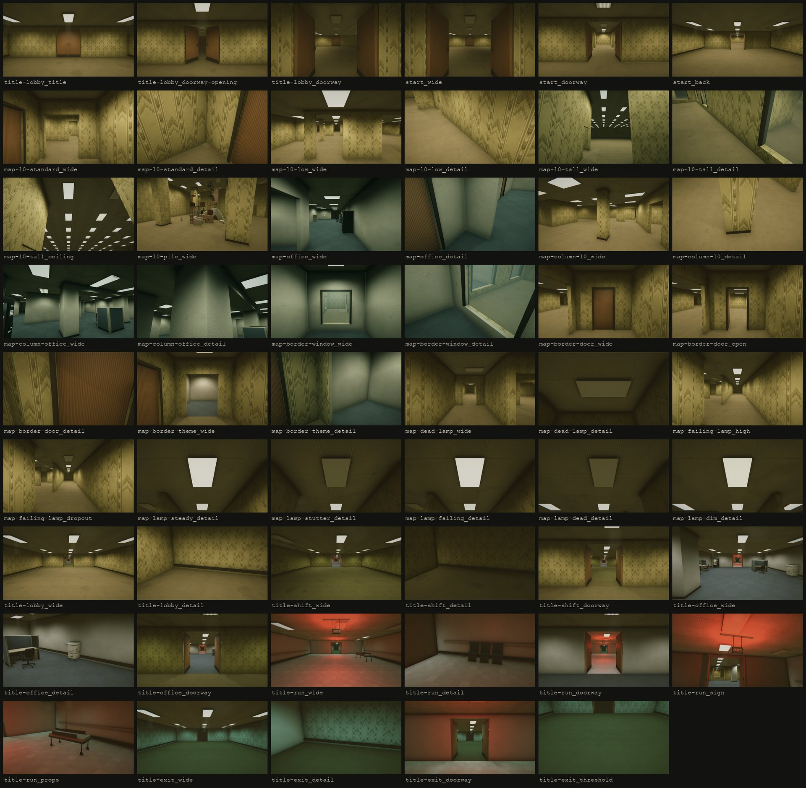

# 04 — Current-state captures: every room type as it renders today

Status: DONE (2026-10-03, about 11:30). 53 frames and 3 contact sheets.
Made in a private clone. Red's project was not opened. Nothing in it changed except
this folder (`images/`, `harness/`, this file).



- Map rooms and the start rooms: [`images/room_contact_sheet_map.jpg`](images/room_contact_sheet_map.jpg)
- Title stream, live and the five profiles: [`images/room_contact_sheet_title.jpg`](images/room_contact_sheet_title.jpg)

---

## 0. Short answer: what the frames show

1. **In play, the only stream room a player ever sees is Lobby.**
   `FrontRoomsRoomStream.Initialize` sets `lobbyOnlyTitle = true`. Shift, Office, Run and Exit
   rooms switch on only after `BeginPlayableSequence()`. Only the editor test
   `Assets/Editor/FrontRoomsStreamVerification.cs:80` calls it. The stream Relay's Run alarm
   (`FrontRoomsHunterBrain`, `FrontRoomsHunter.cs:123`) is also only built by that test.
   So **no player has seen a Run! room yet.** The Shift, Office, Run and Exit frames here come
   from the same builder (`BuildEditorPreview`), rendered in Play Mode with the game's camera.
2. **The Run room is not dark.** It has 12 troffers: 7 are dead and 5 burn at 40%. Its two
   red exit signs (point lights, 3.6, range 9.5 m) light the whole room.
   - Mean frame value 0.283 (sRGB luma, 0–1). Lobby is 0.320 and Shift is 0.230.
   - Its darkest 5% of pixels sit at 0.173. That is the **highest black level of all
     17 `_wide` frames**. The Run room reads as a red-lit room, not as a dark one.
3. **There is no true exit or ending door.** The game's phases are Title, Playing, Paused
   and Caught (`FrontRooms3DGame.cs:31`). No room, door or trigger ends a run. The "Exit" profile
   is a Level 0 room with cold-cyan paper, a green-grey carpet and a 2.8 m floor strip.
4. **Blacks are lifted everywhere.** In 46 of 53 frames, no pixel is darker than 0.08.
   The 7 exceptions are all Office-zone frames, where black cabinets and column shadows
   reach 5–7%. A dead lamp lowers its corridor from 0.334 to 0.257 (−23%), not to black.
5. **A failing lamp changes the frame by only 7%** (0.348 at its high, 0.325 in a dropout).
   Its lens visibly goes out, but 2–4 neighbour lamps keep the corridor lit.
6. **All map lamps have the same warm-white colour** (1, .96, .88) in both themes. The Office
   reads green-grey because of its materials and its local grade volume
   (`FrontRoomsPost_Office`), not because of its lamps.
7. The Level 0 map, the start rooms and the title Lobby share one paper, one carpet and one
   ceiling print. So the handoff from title to map is seamless (`start_doorway`).

---

## 1. How the frames were made

- **Where:** private clone
  `/private/tmp/claude-501/…/scratchpad/proj_rooms` (code identical to the real project's
  `Assets/Scripts` at 10:33). Unity 6000.3.10f1, batch mode, Metal, Apple M3 Max, quality
  "High", URP asset `FrontRooms_URP` (4x MSAA, HDR, render scale 1).
- **Harness:** [`harness/FrontRoomsRoomVisualsCapture.cs.txt`](harness/FrontRoomsRoomVisualsCapture.cs.txt)
  (a copy of the clone's `Assets/Editor/Audit/FrontRoomsRoomVisualsCapture.cs`). It follows the
  interaction audit harness (`../interaction_audit/05_in_engine_evidence.md`): enter Play on
  `Assets/Scenes/FrontRooms3D.unity`, drive the game through its own fields and methods.
- **Camera:** the game's own `First-person camera`, with its URP camera data (post on,
  dithering on). Rendered twice per frame into a 1920x1080 sRGB target with 4x MSAA.
  The HUD is a Screen Space Overlay canvas, so it is not in the frames.
- **Lens:** the game uses 76° vertical FOV. Captures use **72° vertical** for wide and
  doorway frames, and **50° vertical** for detail frames. The FOV is restored after each frame.
- **Eye:** 1.62 m (`ModuleUnits.PlayerEye`). Three frames in the start room read 1.65 m: the
  player stands on the stream room's carpet.
- **Time:** `Time.captureDeltaTime = 1/60` from the first frame. Game time moves exactly
  1/60 s per frame.
- **Seed:** `Random.InitState(4242)` right before `RequestTitleStart` gives **run seed
  516574485**. Map root (−576, 0, −576) (a multiple of 192 m). Start door cell (277, 198).
  The run starts in stream room 1, at game time 3.93 s.
- **Relay:** held dormant (`releaseDelaySeconds = 1e6`). It is in no frame.
- **Map frames:** the harness moves the player (`playerRoot`) and sets the game's `yaw` and
  `pitch`, then waits until `map.Settled`. Map lamps light and cast shadows by distance from
  the player, so the player always stands where the camera is.
- **Title-profile frames:** `FrontRoomsRoomStream.BuildEditorPreview` is called in Play Mode
  on a new object at world **(4992, 0, 4992)** (26 × 192 m, so every print lands as in the
  edit-mode preview at the origin). Room *i* spans local z 12i…12i+12. Doors are open.
  Lamp states come from `ActivateRoomLightImmediately`: steady 100%, unstable held at 40%,
  dead off, rolled from sequence numbers 0–4. Only the camera moves there. The player and
  the map stay put, so no map chunk is built near the preview. Far plane 80 m for these.
- **Where each camera stood:** [`harness/room_capture_frames.txt`](harness/room_capture_frames.txt)
  (world and map-local or preview-local position, forward vector, yaw, pitch, FOV, far plane,
  and the notes below). The same rows as a table: [`harness/room_capture_recipes.tsv`](harness/room_capture_recipes.tsv).
  Run log: [`harness/room_capture_log.txt`](harness/room_capture_log.txt).
  Pitch is positive when the camera looks up.

### How each map spot is chosen (the rule, so a re-shoot finds the same kind of spot)

| Frame family | Rule |
|---|---|
| Room wide (`map-l0-*`, `map-office`) | First cell of the wanted zone (theme + height) in rings round the start door cell + (0, 3), up to 70 cells. Walk there, settle. Then among built cells within 12: free floor, a straight open view of at least 2 cells, the next 2 cells in the same zone. Score = view length (max 6) + 0.4 × open sides of the next 2 cells + lamp score of the 3 cells (steady 1, stutter 0.9, dim 0.3, failing 0.2, dead −1.5); Office +6 if the kit dressing is within 5 m. Camera 1.1 m back from the cell centre, looking 3 cells ahead at 1.45 m (Tall: 3.0 m). |
| Wall detail | From the wide frame's feet, 16 rays at 1.0 m. Nearest hit on the shell mesh (not a door leaf, not a pane) with 2 m of plain wall beside it. Camera 1.25 m off the wall and 1.0 m back along it, looking 0.9 m along it at 0.45 m. |
| Tall ceiling | From the wide cell centre, looking 2.5 m past the next cell at 5.2 m. |
| Pile | Nearest built `furniture pile (…)`. If none, walk to Level 0 zones (Tall first, up to 10). Camera on the most open of 16 bearings, 1.6–2.5 m beyond the pile's bounds, looking at its centre at 0.8 m. |
| Column | Columns (`MapChunk.pillar`) in built chunks of the theme; Office ones with a bulkhead first, then the nearest. Camera 3.2 or 2.6 m out on the bearing (of 8) with a clear line to the column and the most open space behind it. Detail: 1.25 m off the face, turned 28°, looking at the cove (0.35 m) or, in the Office, at the bulkhead (2.1 m). |
| Zone border | First edge of the kind within 70 cells: Window (camera on the non-Tall side), Door (camera on the Standard side), or a theme seam (Open or Arch between Level 0 and Office at equal height; camera on the Level 0 side). Camera 1.5–2.6 m back from the crossing point. |
| Dead lamp | Built lamps of mode 3. Score = Level 0 +3, not Tall +4, darker neighbours (dead 1, dim 0.6, failing 0.4, lit −0.5) × 1.5, view length × 0.4. Camera one cell before the lamp, looking 2 cells past it at 1.55 m, so its lens is at the top of the frame. |
| Failing lamp | Same placement, mode 2, fewer lit neighbours preferred. The lamp's own clock is moved to a moment its formula reaches: level ≥ 0.66 ("high"), then < 0.04 ("dropout"). |
| Lamp strip | One lamp of each mode (Level 0 Standard first, then nearest), camera 1.7 m to the side, looking at the lens. Stutter: one of its own stutters is started and the frame is taken on an off flash. Failing: clock moved to a level of 0.42–0.48. |

---

## 2. Re-shoot after changes

Copy the harness into a **clone, never the real project**:

```
cp harness/FrontRoomsRoomVisualsCapture.cs.txt <clone>/Assets/Editor/Audit/FrontRoomsRoomVisualsCapture.cs
/Applications/Unity/Hub/Editor/6000.3.10f1/Unity.app/Contents/MacOS/Unity -batchmode \
  -projectPath <clone> -executeMethod FrontRoomsRoomVisualsCapture.RunBatch -logFile <log>
```

It writes `<clone>/Verification/room_visuals/NN_<type>_<view>.png`, `frames.txt`,
`recipes.tsv` and `log.txt`, then quits. It needs graphics (no `-nographics`).
It takes about 25 s of game time, about 2 minutes with compile.
Then convert and build the sheets (Pillow):

```
python harness/export_room_captures.py <clone>/Verification/room_visuals images
```

If the map generator changes, the same seed can give other cells. The rules above then
find the same *kind* of spot. Compare by rule, not by cell number.

---

## 3. The set

Names are `images/room_<type>_<view>.jpg` (JPG q85, 1920x1080).
"ML" = map-local position of the eye (map root at world −576, 0, −576).
"PL" = preview-local eye position (root at world 4992, 0, 4992).

### A. Title stream, live (Lobby replicas, before Space)

What is behind it (`FrontRoomsRoomStream.cs`):
- Room 11.5 × 12 m, ceiling 2.9 m, walls 0.26 m. Rooms run along world x = 256.5. The
  camera crawls at 1.15 m/s. A door opens when the camera is within 4 m of it, over 0.9 s.
- 12 troffers per room: 3 columns × 4 rows, each one 0.6 × 1.2 m grid cell, a
  `Painted_Metal` pan and a `Troffer_Lens` lens. Spot 162°, inner 96°, range 10 m.
  The 4 centre-column lamps cast soft shadows (strength 0.92). A thin volumetric frustum
  hangs under each lens (density 0.012, 1 m long).
- Double door: 2.4 m opening, two leaves 1.12 × 2.62 × 0.08 m in `Door_Veneer`, bar handles
  and kick plates in brushed steel on both faces. Baseboard 0.08 × 0.16 m in `Cove_Base`.
- Lamps strike one by one after the door opens: 0.4–2.2 s delay, 0–5 flickers, 0.45–1.6 s rise.

| Frame | What | Camera |
|---|---|---|
| [`room_title-lobby_title.jpg`](images/room_title-lobby_title.jpg) | t = 1.0 s. Room 0, its far door shut 4.8 m ahead. | world (256.5, 1.62, 1.17), yaw 0, pitch 0 |
| [`room_title-lobby_doorway-opening.jpg`](images/room_title-lobby_doorway-opening.jpg) | t = 2.18 s. First door half open (progress 0.52). Room 1 still dark. | world (256.5, 1.62, 2.53) |
| [`room_title-lobby_doorway.jpg`](images/room_title-lobby_doorway.jpg) | t = 3.93 s. Door open 1.3 s; room 1's ballasts striking. | world (256.5, 1.62, 4.55) |

### B. Start rooms and the handoff (after Space)

The stream ends at its first shut door (room 1's far door, world z 18). The map is attached
behind it. The stream rooms become the map's start area: a 5-cell strip.
The door opens once the player is within 4 m of it.

| Frame | What | Camera |
|---|---|---|
| [`room_start_wide.jpg`](images/room_start_wide.jpg) | Right after Space. The player stands where the title camera was. Start door 13.4 m ahead, shut. | ML (832.5, 1.65, 580.6), yaw 0 |
| [`room_start_doorway.jpg`](images/room_start_doorway.jpg) | 3.4 m before the start door, 1.5 s after it swung open. The map's first cell (277, 198) is Level 0 Standard: same paper, carpet and ceiling. | ML (832.5, 1.62, 590.6), yaw 0, pitch −2.5 |
| [`room_start_back.jpg`](images/room_start_back.jpg) | Same spot, looking back down the stream rooms. | yaw 180, pitch −1.1 |

### C. The map (seed 516574485)

What is behind it (`FrontRoomsMapWorld.cs`, `FrontRoomsMap.cs`, `FrontRoomsModuleUnits.cs`,
`Assets/Levels/FrontRoomsLevel0.asset`):
- Cells 3 m, chunks 24 m, build radius 2 chunks (far plane 46 m). Walls 0.16 m on cell lines.
- Heights: Low 2.4 m, Standard 2.9 m, Tall 5.4 m (zone shares 35 / 55 / 10%). Office share 30%.
- **Level 0:** `L0_Wallpaper` (`Wallpaper_Chevron_A`, tile 0.75 × 1.125 m), `L0_Carpet`
  (`Carpet_LoopPile_A`, 1 m), `L0_Ceiling` (`Ceiling_Fissured_A`, 1.2 m). Lens
  "Map / Level 0 lens": URP Lit, emission (1, .96, .84) × 2.6. Lamp 5.0.
- **Office:** `Office_Wall` (`Office_Drywall_A`, 1.2 m), `Office_Carpet`
  (`Office_CarpetTile_A`, 1.2 m), `Office_Ceiling` (`Office_Ceiling2x2_A`, 1.2 m). Lens
  `Troffer_Lens` (emission 2.2, 2.1, 1.8). Lamp 5.5. A local grade volume per Office area.
  Rooms are dressed by `FrontRoomsOfficeKit`.
- **Lamps (both themes):** one troffer per cell (lens 0.6 × 1.2 m, 0.3 m off centre). Spot
  162° / 96°, colour (1, .96, .88), range 10 m (Tall: 12 m, intensity × 1.6 = 8.0).
  Lit only within 16 m of the player, faded over 3 m. About one lamp in three may cast soft
  shadows, and only within 9 m.
- **Lamp temperaments** (tier-1 odds 62 / 20 / 10 / 5 / 3%):
  steady 0.98 ± 0.02; stutter 0.97 with 0.15–0.85 s bursts (95% / 5%) every 5–20 s;
  failing 0.25–0.70 slow wave with dropouts to 5%; dead 0 with rare 0.06–0.18 s blinks
  every 8–28 s; dim 0.42 ± 0.03. A dark lens keeps 4% of its glow.
- **Openings:** arches 1.1–1.8 m wide, top 2.2 m. Doors (1.0 × 2.1 m, leaf 0.05 m,
  `Door_Veneer`, `Cove_Base` frame 0.07 m) only on Low↔Standard borders. Windows (1.4 m wide,
  sill 0.35, top 2.0, glass URP Lit transparent (.75, .85, .88) α 0.28) only on borders
  with a Tall zone. At a theme border of equal height, the wall is split into two halves, each
  faced in its own room's material.
- **Columns:** on the 6 m grid. 0.6 m (Level 0) or 0.9 m (Office, Tall), faced in the wall
  material, on a 0.10 m `Cove_Base` cove. Office columns carry 0.35 m bulkheads.
- **Furniture piles:** Level 0 rooms of 4+ cells, chance 35% (Tall rooms 60%).
- **Air:** fog exp² 0.014, colour (.16, .15, .11). Trilight ambient. Reflection
  intensity 0.3 and no reflection probes (see the interaction audit, §A).

| Frame | What | Spot (map cells) | Camera |
|---|---|---|---|
| [`room_map-l0-standard_wide.jpg`](images/room_map-l0-standard_wide.jpg) | Level 0, 2.9 m | cell (280, 199), looking −X, 5-cell view; own lamp steady | ML (842.6, 1.62, 598.5), yaw 270, pitch −1.0 |
| [`room_map-l0-standard_detail.jpg`](images/room_map-l0-standard_detail.jpg) | Paper, carpet, junction. An open door leaf at the right edge. | same | yaw 33, pitch −27, 50° |
| [`room_map-l0-low_wide.jpg`](images/room_map-l0-low_wide.jpg) | Level 0, 2.4 m, with columns | cell (272, 202), looking +Z, 6-cell view | ML (817.5, 1.62, 606.4), yaw 0, pitch −1.0 |
| [`room_map-l0-low_detail.jpg`](images/room_map-l0-low_detail.jpg) | Paper and carpet under the low ceiling | same | yaw 213, pitch −27, 50° |
| [`room_map-l0-tall_wide.jpg`](images/room_map-l0-tall_wide.jpg) | Level 0, 5.4 m hall | cell (282, 207), looking +Z, 8-cell view | ML (847.5, 1.62, 621.4), yaw 0, pitch +7.8 |
| [`room_map-l0-tall_detail.jpg`](images/room_map-l0-tall_detail.jpg) | Wall foot; the border window at the right | same | yaw 123, pitch −27, 50° |
| [`room_map-l0-tall_ceiling.jpg`](images/room_map-l0-tall_ceiling.jpg) | The 5.4 m ceiling and its troffer field | same cell | pitch +33, 50° |
| [`room_map-l0-pile_wide.jpg`](images/room_map-l0-pile_wide.jpg) | Furniture pile "CentreSculpture", 5.3 × 4.2 × 4.0 m | centre cell (276, 164), Level 0 Tall | ML (833.4, 1.62, 488.9), yaw 338, pitch −7.3 |
| [`room_map-office_wide.jpg`](images/room_map-office_wide.jpg) | Office, 2.9 m, kit dressing | cell (273, 208), looking +X, 6-cell view | ML (819.4, 1.62, 625.5), yaw 90, pitch −1.0 |
| [`room_map-office_detail.jpg`](images/room_map-office_detail.jpg) | Drywall and carpet tiles; Level 0 paper and a door leaf at the left | same | yaw 327, pitch −27, 50° |
| [`room_map-column-l0_wide.jpg`](images/room_map-column-l0_wide.jpg) | 0.6 m Level 0 column | corner (258, 220), Standard | ML (776.9, 1.65, 661.2), yaw 248, pitch −3.0 |
| [`room_map-column-l0_detail.jpg`](images/room_map-column-l0_detail.jpg) | Column foot and cove | same | yaw 276, pitch −39, 50° |
| [`room_map-column-office_wide.jpg`](images/room_map-column-office_wide.jpg) | 0.9 m Office column with an east bulkhead | corner (250, 210), Standard | ML (748.8, 1.62, 627.0), yaw 23, pitch +5.0 |
| [`room_map-column-office_detail.jpg`](images/room_map-column-office_detail.jpg) | Column head and bulkhead | same | yaw 51, pitch +16, 50° |
| [`room_map-border-window_wide.jpg`](images/room_map-border-window_wide.jpg) | Window from an Office room into a Level 0 Tall hall | edge (281, 206) → (281, 207) | ML (844.5, 1.62, 618.4), yaw 0, pitch −2.8 |
| [`room_map-border-window_detail.jpg`](images/room_map-border-window_detail.jpg) | Frame, sill and pane at an angle | same | yaw 308, pitch −30, 50° |
| [`room_map-border-door_wide.jpg`](images/room_map-border-door_wide.jpg) | Door from Level 0 Standard to Level 0 Low, shut | edge (277, 202) → (276, 202) | ML (833.6, 1.62, 607.5), yaw 270, pitch −3.3 |
| [`room_map-border-door_open.jpg`](images/room_map-border-door_open.jpg) | Same door 1 s after `map.Use` | same | same |
| [`room_map-border-door_detail.jpg`](images/room_map-border-door_detail.jpg) | Latch jamb, leaf and frame (no handle exists) | same | yaw 258, pitch −17, 50° |
| [`room_map-border-theme_wide.jpg`](images/room_map-border-theme_wide.jpg) | Arch from Level 0 into an Office room, same height | edge (278, 203) → (278, 204) | ML (835.4, 1.62, 609.4), yaw 0, pitch −3.3 |
| [`room_map-border-theme_detail.jpg`](images/room_map-border-theme_detail.jpg) | Where chevron paper meets drywall | same | yaw 308, pitch −13, 50° |
| [`room_map-dead-lamp_wide.jpg`](images/room_map-dead-lamp_wide.jpg) | One cell before a dead lamp (lens at top). In its 3 × 3 cells: steady 2, failing 2, dead 2. | lamp cell (260, 184), Level 0 Standard, looking −X | ML (785.0, 1.62, 553.5), yaw 270, pitch −0.4 |
| [`room_map-dead-lamp_detail.jpg`](images/room_map-dead-lamp_detail.jpg) | The dead lens from 1.5 m | same | pitch +40, 50° |
| [`room_map-failing-lamp_high.jpg`](images/room_map-failing-lamp_high.jpg) | Failing lamp at level 0.664 (light 3.32) | lamp cell (279, 186), Level 0 Standard, looking +Z | ML (838.5, 1.62, 555.9), yaw 0, pitch −0.4 |
| [`room_map-failing-lamp_dropout.jpg`](images/room_map-failing-lamp_dropout.jpg) | Same lamp 0.05 s of lamp clock later, level 0.034 (light 0.17) | same | same |
| [`room_map-lamp-steady_detail.jpg`](images/room_map-lamp-steady_detail.jpg) | Steady lens, level 0.997 | cell (279, 184) | pitch +36.5, 50° |
| [`room_map-lamp-stutter_detail.jpg`](images/room_map-lamp-stutter_detail.jpg) | Stutter lens on an off flash, level 0.05 | cell (279, 185) | same |
| [`room_map-lamp-failing_detail.jpg`](images/room_map-lamp-failing_detail.jpg) | Failing lens, level 0.47 | cell (279, 186) | same |
| [`room_map-lamp-dead_detail.jpg`](images/room_map-lamp-dead_detail.jpg) | Dead lens, light off | cell (278, 185) | same |
| [`room_map-lamp-dim_detail.jpg`](images/room_map-lamp-dim_detail.jpg) | Dim lens, level 0.43 | cell (278, 186) | same |

### D. The five title-stream profiles (generator preview, Play Mode)

Same room shell, door and troffers as in A. Light output = intensity × 0.901
(`diffuseCoefficient` 0.82 gives a 0.901 scale).

| Profile | Wall | Floor | Ceiling | Tube colour | Intensity / range | Dead / unstable odds | Lamps in this preview (lit / 40% / dead) | Props |
|---|---|---|---|---|---|---|---|---|
| Lobby | `L0_Wallpaper` | `L0_Carpet` | `L0_Ceiling` | (1, .96, .88) | 5.2 / 10 m | 2% / 10% | 11 / 1 / 0 | 3 outlet plates (0.07 × 0.115 m boxes at 0.32 m) |
| Shift | `L0_Wallpaper_Shift` (same print, tint .90/.88/.80, dirt 0.45) | `L0_Carpet_Shift` | `L0_Ceiling_Shift` | (.86, .93, .78) | 4.2 / 10 m | 10% / 32% | 6 / 4 / 2 | 3 outlet plates |
| Office | `Office_Wall` | `Office_Carpet` | `Office_Ceiling` | (.93, .96, 1) | 6.0 / 10 m | 3% / 6% | 12 / 0 / 0 | Office kit dressing; a 2.8 m centre lane kept clear |
| Run | `Run_Wall` (`Run_HospitalWall_A`) | `Run_Floor` (`Run_VCT_A`) | `Run_Ceiling` (2'×2' tiles, tint 1.04) | (.88, .92, .94) | 0.6 / 6.5 m | 70% / 45% | 0 / 5 / 7 | 2 handrails at 0.92 m, 3 teal waiting chairs, a gurney, an IV pole, 2 hanging EXIT signs with red point lights (1, .10, .06), 3.6, 9.5 m, soft shadows. All primitive boxes and one cylinder. |
| Exit | `Exit_Wallpaper` (`Wallpaper_Chevron_Cold_A`) | `Exit_Carpet` (loop pile tinted .66/.72/.74) | `L0_Ceiling` | (.62, .92, .90) | 4.4 / 10 m | 0% / 5% | 12 / 0 / 0 | 3 outlet plates and a 2.8 × 0.12 m floor strip in the wall material |

Camera recipe, the same for every profile (PL; room *i* starts at z = 12i):
wide = eye (0, 1.62, 12i + 0.9) looking at (0, 0.85, 12i + 12), pitch −4.0, 72°.
Detail = eye (−1.2, 1.62, 12i + 3.6) looking at (−5.6, 0.45, 12i + 2.3), 50°
(Office: eye (1.2, 1.62, 12i + 3.0) looking at (5.0, 0.6, 12i + 6.0), because a dressing
column blocks the left side). Doorway = eye (0, 1.62, 12i − 3.2) in the previous room,
looking through the open double door at (0, 1.25, 12i + 6), pitch −2.3, 72°.

| Frame | What |
|---|---|
| [`room_title-lobby_wide.jpg`](images/room_title-lobby_wide.jpg) / [`_detail`](images/room_title-lobby_detail.jpg) | Lobby as built by the generator. The detail shows one outlet plate at 0.32 m. Lobby's doorway view is the live title frame in A. |
| [`room_title-shift_wide.jpg`](images/room_title-shift_wide.jpg) / [`_detail`](images/room_title-shift_detail.jpg) / [`_doorway`](images/room_title-shift_doorway.jpg) | Shift: dirtier paper, greener tubes, 2 dead and 4 failing lamps. The darkest profile (mean 0.230). |
| [`room_title-office_wide.jpg`](images/room_title-office_wide.jpg) / [`_detail`](images/room_title-office_detail.jpg) / [`_doorway`](images/room_title-office_doorway.jpg) | Office: drywall, blue-grey carpet tiles, cubicles, a vending machine, a copier. |
| [`room_title-run_wide.jpg`](images/room_title-run_wide.jpg) / [`_detail`](images/room_title-run_detail.jpg) / [`_doorway`](images/room_title-run_doorway.jpg) | Run: red-lit white corridor. The doorway frame is the arrival from the Office. |
| [`room_title-run_sign.jpg`](images/room_title-run_sign.jpg) | The hanging EXIT sign. Eye (0.7, 1.62, 42.0) looking at (0, 2.36, 39.4), 50°. |
| [`room_title-run_props.jpg`](images/room_title-run_props.jpg) | Gurney and IV pole. Eye (0.9, 1.62, 40.4) looking at (3.4, 0.55, 43.3), 50°. |
| [`room_title-exit_wide.jpg`](images/room_title-exit_wide.jpg) / [`_detail`](images/room_title-exit_detail.jpg) / [`_doorway`](images/room_title-exit_doorway.jpg) | Exit: cold-cyan paper, green-grey carpet. Its far door opens onto nothing in the preview (no room 5), so it reads as a dark slot. |
| [`room_title-exit_threshold.jpg`](images/room_title-exit_threshold.jpg) | The floor "threshold marker". Eye (0, 1.62, 50.8) looking at (0, 0.05, 53.9), 50°. It is hard to see: it is wall paper on the floor. |

---

## 4. Brightness, measured on the JPGs

sRGB luma (0.2126 R + 0.7152 G + 0.0722 B), 0–1. "p5" = value of the darkest 5% of pixels.

| Wide frame | Mean | p5 | p95 | Mean RGB |
|---|---|---|---|---|
| title-lobby_wide | 0.320 | 0.155 | 0.488 | .36 / .32 / .18 |
| title-shift_wide | 0.230 | 0.138 | 0.336 | .25 / .23 / .12 |
| title-office_wide | 0.286 | 0.142 | 0.476 | .29 / .29 / .23 |
| **title-run_wide** | **0.283** | **0.173** | 0.410 | **.41 / .26 / .17** |
| title-exit_wide | 0.238 | 0.147 | 0.366 | .22 / .25 / .16 |
| start_wide | 0.225 | 0.128 | 0.396 | .26 / .22 / .11 |
| map-l0-standard_wide | 0.334 | 0.118 | 0.589 | .39 / .33 / .17 |
| map-l0-low_wide | 0.348 | 0.140 | 0.663 | .39 / .35 / .20 |
| map-l0-tall_wide | 0.350 | 0.146 | 0.580 | .37 / .36 / .21 |
| map-office_wide | 0.276 | 0.072 | 0.481 | .25 / .29 / .22 |
| map-dead-lamp_wide | 0.257 | 0.122 | 0.424 | .29 / .26 / .13 |
| map-failing-lamp_high | 0.348 | 0.140 | 0.546 | .40 / .35 / .18 |
| map-failing-lamp_dropout | 0.325 | 0.138 | 0.543 | .37 / .33 / .17 |

All 53 frames: [`harness/room_capture_frames.txt`](harness/room_capture_frames.txt) has the camera data.

---

## 5. Not captured, and limits

- **The true exit / ending door does not exist** in code (§0.3). Nothing to capture.
- **Shift, Office, Run and Exit stream rooms in play:** not reachable (§0.1). The preview
  holds unstable lamps at a steady 40%. In a live stream they would strike, flicker and sway
  with their own timing (`TickLamp`). That motion is not in these stills.
- **Office zones at Low or Tall height** were not captured; only Office Standard.
- **A stutter pair** (on / off) was not shot. The strip shows a stutter lamp on an off flash.
- **The glass** is still the milky material from the interaction audit. A pane is in the two
  `map-border-window` frames.
- The **Relay** is in no frame. The **HUD** is not drawn.
- Two wall-detail frames (`map-l0-standard_detail`, `map-office_detail`) show an open door
  leaf at the edge. The rule takes the nearest plain wall, and a doorway stood next to it.
- The Exit preview room's far door opens onto the camera's clear colour (no next room).
- These frames are the desktop reference (Editor, Metal). They say nothing about WebGL.
